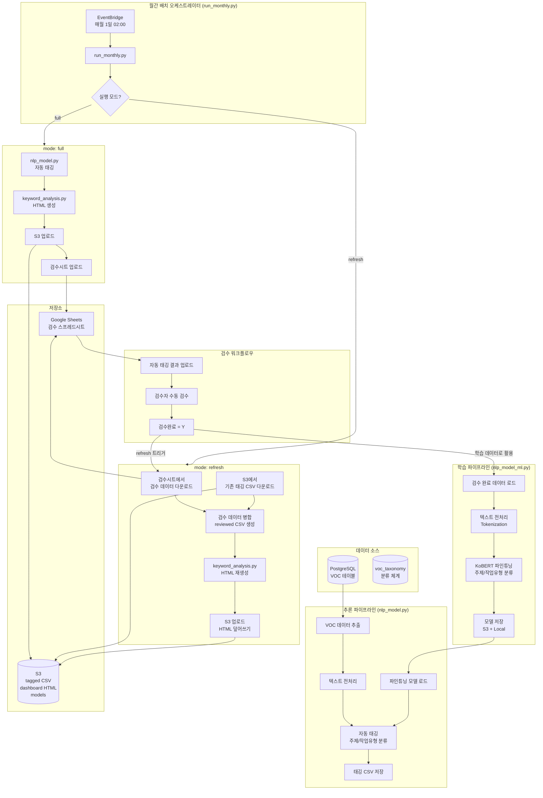
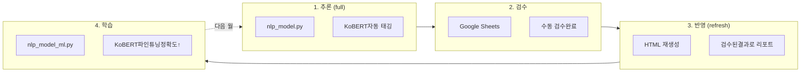

## 목적
- 빌딩 관리 서비스에서 수집되는 고객 VOC(Voice of Customer) 데이터를 AI 기반으로 자동 분류(VOC주제, 작업유형)

  | VOC 원문 | 주제 대분류 | 주제 중분류 | 작업유형 대분류 | 작업유형 중분류 |
  |----------|-------------|-------------|-----------------|-----------------|
  | 화장실이 너무 더러워요 | 환경 | 청결/미화 | 작업 | 청소/정리 |
  | 에어컨이 안 켜져요 | 시설 | 냉난방/공조 | 작업 | 유지보수 |
  | 주차장 조명이 너무 어두워요 | 시설 | 전기/조명 | 작업 | 교체 |

- 각 빌딩에서 월간 VOC 현황 보고서를 HTML로 다운로드할 수 있게 한다 (통계 및 워드 클라우드 포함 대시보드)

## 개요 
- 매월 1일 cron 배치로 전월 VOC 데이터 분석 → 자동 태깅 → HTML 리포트 생성 → S3 업로드
- 자동 태깅 결과를 Google Sheets에 업로드하여, 비개발자인 도메인 전문가(빌딩 관리자)가 직접 검수할 수 있도록 한다
  - 드롭다운 메뉴로 분류 체계(taxonomy) 선택 → 오분류 항목만 수정
  - 코드 수정 없이 브라우저에서 바로 검수 가능
- 검수 완료 후 refresh 모드로 HTML 재생성하여 검수 결과 즉각 반영
- 축적된 검수 데이터로 매월 KoBERT 모델 재학습 → 자동 태깅 정확도 지속 개선 (Human-in-the-loop)

## 전체 아키텍처



**핵심 흐름:**
1. **파인튜닝**: 검수 완료 데이터 → `nlp_model_ml.py` → KoBERT 파인튜닝 및 저장
2. **추론 (full 모드)**: VOC 원천 데이터 → `nlp_model.py` → 자동 태깅 → HTML 생성 → S3/검수시트 업로드
3. **검수 반영 (refresh 모드)**: 검수시트 + S3 기존 CSV → 병합 → HTML 재생성 → S3 덮어쓰기
4. **검수**: Google Sheets에서 검수 → 검수 데이터 축적 → 다음 파인튜닝에 반영

## 프로젝트 구조

```
voc-nlp/
├── batch/
│   ├── run_monthly.py       # 배치 오케스트레이터 (메인)
│   ├── nlp_model_ml.py      # KoBERT 파인튜닝 (Training)
│   ├── nlp_model.py         # 파인튜닝 모델로 태깅 (Inference)
│   ├── nlp_model_core.py    # 전처리/분류 핵심 함수
│   ├── keyword_analysis.py  # 키워드 분석 + 시각화
│   ├── report_html.py       # HTML 리포트 렌더링
│   ├── s3_uploader.py       # S3 업로드 모듈
│   ├── gspread_manager.py   # Google Sheets 연동
│   ├── common_db.py         # DB 연결 공통 모듈
│   └── cron_monthly.sh      # cron 실행 스크립트
├── models/                   # 학습된 모델 저장
│   ├── kobert_subject/      # 주제 분류 모델
│   └── kobert_work/         # 작업유형 분류 모델
├── output/
│   ├── tagging/             # 태깅 결과 CSV
│   ├── html/                # 대시보드 HTML
│   └── reviewed/            # 검수 반영 CSV
└── requirements.txt
```

## 실행 모드

run_monthly.py는 3가지 모드를 지원한다.

| 모드 | 설명 | 처리 순서 |
|------|------|----------|
| `full` | 전체 처리 (기본) | 태깅 → HTML → S3 → 검수시트 |
| `refresh` | 검수 반영 | 검수시트 다운로드 → 기존CSV 병합 → HTML 재생성 → S3 |
| `tagging-only` | 태깅만 | 태깅 → 검수시트 (HTML 생성 안함) |

**사용 예시:**

```bash
# [모델 파인튜닝] 검수 데이터로 KoBERT 파인튜닝
python nlp_model_ml.py --train --months 202512

# [1단계] 자동태깅 + HTML + 검수시트 업로드
python run_monthly.py --mode full --all-buildings --auto-month

# [2단계] 검수 완료 후 HTML 재생성
python run_monthly.py --mode refresh --all-buildings --auto-month

# 개발 환경에서 특정 빌딩 테스트
python run_monthly.py --env dev --mode full --building-id 95 --year 2025 --month 12
```

## KoBERT 파이프라인 상세

### 1. nlp_model_ml.py (KoBERT 파인튜닝)

검수 완료된 데이터를 기반으로 KoBERT 모델을 파인튜닝한다.

```python
# nlp_model_ml.py
"""
VOC 분류 KoBERT 파인튜닝 모듈

검수 완료된 데이터를 학습 데이터로 사용하여
KoBERT 기반 분류 모델을 파인튜닝한다.

사용법:
  python nlp_model_ml.py --train --months 202512
"""
import os
import torch
import pandas as pd
from torch.utils.data import Dataset, DataLoader
from transformers import BertForSequenceClassification, AdamW, get_scheduler
from kobert_tokenizer import KoBERTTokenizer

from common_db import load_dotenv
from gspread_manager import get_gspread_manager
from s3_uploader import get_s3_uploader


class VOCDataset(Dataset):
    """VOC 분류용 데이터셋"""
    
    def __init__(self, texts, labels, tokenizer, max_length=128):
        self.texts = texts
        self.labels = labels
        self.tokenizer = tokenizer
        self.max_length = max_length
    
    def __len__(self):
        return len(self.texts)
    
    def __getitem__(self, idx):
        text = self.texts[idx]
        label = self.labels[idx]
        
        encoding = self.tokenizer(
            text,
            truncation=True,
            padding='max_length',
            max_length=self.max_length,
            return_tensors='pt'
        )
        
        return {
            'input_ids': encoding['input_ids'].flatten(),
            'attention_mask': encoding['attention_mask'].flatten(),
            'labels': torch.tensor(label, dtype=torch.long)
        }


class VOCClassifierTrainer:
    """VOC 분류 KoBERT 파인튜닝 클래스"""
    
    def __init__(self, model_dir: str = None):
        self.model_dir = model_dir or os.getenv("MODEL_DIR", "/home/ssm-user/jupyter/models")
        self.device = torch.device('cuda' if torch.cuda.is_available() else 'cpu')
        self.tokenizer = KoBERTTokenizer.from_pretrained('skt/kobert-base-v1')
    
    def load_training_data(self, yyyymm_list: list) -> pd.DataFrame:
        """검수 완료 데이터 로드"""
        gspread_mgr = get_gspread_manager()
        all_data = []
        for yyyymm in yyyymm_list:
            df, error = gspread_mgr.download_reviewed_data(yyyymm)
            if df is not None:
                # 검수완료된 데이터만 필터링
                df_reviewed = df[df["검수완료"].str.upper() == "Y"]
                all_data.append(df_reviewed)
        
        if not all_data:
            return pd.DataFrame()
        return pd.concat(all_data, ignore_index=True)
    
    def preprocess(self, df: pd.DataFrame) -> pd.DataFrame:
        """텍스트 전처리"""
        df = df.copy()
        df["all_text"] = (
            df["title"].fillna("") + " " +
            df["request_contents"].fillna("") + " " +
            df["reply"].fillna("")
        ).str.strip()
        return df
    
    def build_label_encoder(self, labels: list) -> dict:
        """라벨 인코더 생성"""
        unique_labels = sorted(set(labels))
        label2id = {label: idx for idx, label in enumerate(unique_labels)}
        id2label = {idx: label for label, idx in label2id.items()}
        return label2id, id2label
    
    def train_model(self, texts, labels, model_name, num_epochs=3, batch_size=16):
        """KoBERT 파인튜닝"""
        label2id, id2label = self.build_label_encoder(labels)
        num_labels = len(label2id)
        
        # 라벨 인코딩
        encoded_labels = [label2id[label] for label in labels]
        
        # 데이터셋 분리 (8:2)
        split_idx = int(len(texts) * 0.8)
        train_texts, val_texts = texts[:split_idx], texts[split_idx:]
        train_labels, val_labels = encoded_labels[:split_idx], encoded_labels[split_idx:]
        
        # 데이터로더
        train_dataset = VOCDataset(train_texts, train_labels, self.tokenizer)
        val_dataset = VOCDataset(val_texts, val_labels, self.tokenizer)
        train_loader = DataLoader(train_dataset, batch_size=batch_size, shuffle=True)
        val_loader = DataLoader(val_dataset, batch_size=batch_size)
        
        # 모델 초기화
        model = BertForSequenceClassification.from_pretrained(
            'skt/kobert-base-v1',
            num_labels=num_labels
        )
        model.to(self.device)
        
        # 옵티마이저 & 스케줄러
        optimizer = AdamW(model.parameters(), lr=2e-5)
        num_training_steps = num_epochs * len(train_loader)
        scheduler = get_scheduler(
            "linear",
            optimizer=optimizer,
            num_warmup_steps=0,
            num_training_steps=num_training_steps
        )
        
        # 학습
        model.train()
        for epoch in range(num_epochs):
            total_loss = 0
            for batch in train_loader:
                batch = {k: v.to(self.device) for k, v in batch.items()}
                outputs = model(**batch)
                loss = outputs.loss
                
                loss.backward()
                optimizer.step()
                scheduler.step()
                optimizer.zero_grad()
                
                total_loss += loss.item()
            
            avg_loss = total_loss / len(train_loader)
            print(f"[Epoch {epoch+1}/{num_epochs}] Loss: {avg_loss:.4f}")
        
        # 검증
        model.eval()
        correct = 0
        total = 0
        with torch.no_grad():
            for batch in val_loader:
                batch = {k: v.to(self.device) for k, v in batch.items()}
                outputs = model(**batch)
                predictions = torch.argmax(outputs.logits, dim=-1)
                correct += (predictions == batch['labels']).sum().item()
                total += len(batch['labels'])
        
        accuracy = correct / total
        print(f"[{model_name}] Validation Accuracy: {accuracy:.4f}")
        
        # 모델 저장
        save_path = os.path.join(self.model_dir, model_name)
        os.makedirs(save_path, exist_ok=True)
        model.save_pretrained(save_path)
        self.tokenizer.save_pretrained(save_path)
        
        # 라벨 매핑 저장
        import json
        with open(os.path.join(save_path, "label_mapping.json"), "w", encoding="utf-8") as f:
            json.dump({"label2id": label2id, "id2label": id2label}, f, ensure_ascii=False, indent=2)
        
        return {"accuracy": accuracy, "num_labels": num_labels, "save_path": save_path}
    
    def train(self, df: pd.DataFrame, version: str) -> dict:
        """주제/작업유형 분류 모델 각각 학습"""
        df = self.preprocess(df)
        
        # 검수된 라벨 사용
        df["label_subject"] = (
            df["검수_주제 대분류"].fillna(df["주제 대분류"]) + "_" +
            df["검수_주제 중분류"].fillna(df["주제 중분류"])
        )
        df["label_work"] = (
            df["검수_작업유형 대분류"].fillna(df["작업유형 대분류"]) + "_" +
            df["검수_작업유형 중분류"].fillna(df["작업유형 중분류"])
        )
        
        texts = df["all_text"].tolist()
        
        # 주제 분류 모델 학습
        print("\n[INFO] 주제 분류 모델 학습...")
        subject_result = self.train_model(
            texts=texts,
            labels=df["label_subject"].tolist(),
            model_name=f"kobert_subject_{version}"
        )
        
        # 작업유형 분류 모델 학습
        print("\n[INFO] 작업유형 분류 모델 학습...")
        work_result = self.train_model(
            texts=texts,
            labels=df["label_work"].tolist(),
            model_name=f"kobert_work_{version}"
        )
        
        return {
            "subject": subject_result,
            "work": work_result,
            "train_samples": len(df),
            "version": version
        }


def main():
    import argparse
    from datetime import datetime
    
    parser = argparse.ArgumentParser()
    parser.add_argument("--train", action="store_true")
    parser.add_argument("--months", type=str, help="학습 대상 월 (콤마 구분)")
    args = parser.parse_args()
    
    if args.train:
        trainer = VOCClassifierTrainer()
        version = datetime.now().strftime("%Y%m%d")
        
        yyyymm_list = args.months.split(",") if args.months else [datetime.now().strftime("%Y%m")]
        print(f"[INFO] 학습 대상 월: {yyyymm_list}")
        
        df = trainer.load_training_data(yyyymm_list)
        print(f"[INFO] 검수 완료 데이터: {len(df)}건")
        
        if df.empty:
            print("[WARN] 학습 데이터가 없다.")
            return
        
        result = trainer.train(df, version)
        print(f"\n[INFO] 파인튜닝 완료")
        print(f"  - 주제 분류 정확도: {result['subject']['accuracy']:.4f}")
        print(f"  - 작업유형 분류 정확도: {result['work']['accuracy']:.4f}")


if __name__ == "__main__":
    main()
```

### 2. nlp_model.py (추론 - 파인튜닝 모델로 태깅)

파인튜닝된 KoBERT 모델을 로드하여 신규 VOC 데이터에 자동 태깅을 수행한다.

```python
# nlp_model.py
"""
VOC 자동 태깅 모듈 (Inference)

파인튜닝된 KoBERT 모델을 로드하여 VOC 데이터에 주제/작업유형을 자동 태깅한다.
"""
import os
import json
import glob
import torch
import pandas as pd
from transformers import BertForSequenceClassification
from kobert_tokenizer import KoBERTTokenizer

from common_db import load_dotenv, db_connect
from nlp_model_core import whitelist_text


class VOCClassifier:
    """파인튜닝된 KoBERT를 사용한 VOC 분류기"""
    
    def __init__(self, model_dir: str = None):
        self.model_dir = model_dir or os.getenv("MODEL_DIR", "/home/ssm-user/jupyter/models")
        self.device = torch.device('cuda' if torch.cuda.is_available() else 'cpu')
        
        self.subject_model = None
        self.work_model = None
        self.subject_id2label = None
        self.work_id2label = None
        self.tokenizer = None
        
        self._load_models()
    
    def _get_latest_model_path(self, prefix: str) -> str:
        """최신 모델 경로 찾기"""
        pattern = os.path.join(self.model_dir, f"{prefix}_*")
        paths = sorted(glob.glob(pattern), reverse=True)
        return paths[0] if paths else None
    
    def _load_models(self):
        """모델 로드"""
        # 주제 분류 모델
        subject_path = self._get_latest_model_path("kobert_subject")
        if subject_path:
            self.subject_model = BertForSequenceClassification.from_pretrained(subject_path)
            self.subject_model.to(self.device)
            self.subject_model.eval()
            
            with open(os.path.join(subject_path, "label_mapping.json"), "r") as f:
                mapping = json.load(f)
                self.subject_id2label = {int(k): v for k, v in mapping["id2label"].items()}
            
            self.tokenizer = KoBERTTokenizer.from_pretrained(subject_path)
            print(f"[INFO] 주제 분류 모델 로드: {subject_path}")
        
        # 작업유형 분류 모델
        work_path = self._get_latest_model_path("kobert_work")
        if work_path:
            self.work_model = BertForSequenceClassification.from_pretrained(work_path)
            self.work_model.to(self.device)
            self.work_model.eval()
            
            with open(os.path.join(work_path, "label_mapping.json"), "r") as f:
                mapping = json.load(f)
                self.work_id2label = {int(k): v for k, v in mapping["id2label"].items()}
            
            print(f"[INFO] 작업유형 분류 모델 로드: {work_path}")
    
    def is_available(self) -> bool:
        """모델 사용 가능 여부"""
        return self.subject_model is not None and self.work_model is not None
    
    def predict(self, text: str) -> dict:
        """단일 텍스트 분류"""
        encoding = self.tokenizer(
            text,
            truncation=True,
            padding='max_length',
            max_length=128,
            return_tensors='pt'
        )
        encoding = {k: v.to(self.device) for k, v in encoding.items()}
        
        with torch.no_grad():
            # 주제 분류
            subject_outputs = self.subject_model(**encoding)
            subject_pred = torch.argmax(subject_outputs.logits, dim=-1).item()
            subject_label = self.subject_id2label[subject_pred]
            
            # 작업유형 분류
            work_outputs = self.work_model(**encoding)
            work_pred = torch.argmax(work_outputs.logits, dim=-1).item()
            work_label = self.work_id2label[work_pred]
        
        # 대분류_중분류 형태 파싱
        subject_parts = subject_label.split("_", 1)
        work_parts = work_label.split("_", 1)
        
        return {
            "주제_대분류": subject_parts[0],
            "주제_중분류": subject_parts[1] if len(subject_parts) > 1 else "",
            "작업유형_대분류": work_parts[0],
            "작업유형_중분류": work_parts[1] if len(work_parts) > 1 else ""
        }
    
    def predict_batch(self, texts: list) -> list:
        """배치 예측"""
        results = []
        for text in texts:
            result = self.predict(text)
            results.append(result)
        return results


def run_tagging_with_kobert(result_df: pd.DataFrame, classifier: VOCClassifier) -> pd.DataFrame:
    """KoBERT 기반 태깅"""
    result_df = result_df.copy()
    
    # 텍스트 전처리
    result_df["title_clean"] = result_df["title"].map(whitelist_text).fillna("")
    result_df["all_text"] = (
        result_df["title_clean"] + " " +
        result_df["request_contents"].map(whitelist_text).fillna("") + " " +
        result_df["reply"].map(whitelist_text).fillna("")
    ).str.strip()
    
    # KoBERT로 예측
    if classifier.is_available():
        print(f"[INFO] KoBERT 모델로 {len(result_df)}건 태깅 시작...")
        
        predictions = classifier.predict_batch(result_df["all_text"].tolist())
        
        result_df["주제 대분류"] = [p["주제_대분류"] for p in predictions]
        result_df["주제 중분류"] = [p["주제_중분류"] for p in predictions]
        result_df["작업유형 대분류"] = [p["작업유형_대분류"] for p in predictions]
        result_df["작업유형 중분류"] = [p["작업유형_중분류"] for p in predictions]
        
        print(f"[INFO] KoBERT 태깅 완료")
    else:
        # Fallback: 키워드 기반 분류
        print("[WARN] KoBERT 모델 없음. 키워드 기반 분류로 대체")
        result_df = run_retagging_df(result_df, ...)
    
    return result_df
```

## 배치 처리 상세

### run_monthly.py (오케스트레이터)

실행 모드에 따라 적절한 처리 함수를 호출한다.

```python
# run_monthly.py
"""
월간 VOC 분석 배치 오케스트레이터

3가지 실행 모드:
  - full: 태깅 → HTML → S3 → 검수시트 (기본)
  - refresh: 검수시트 → HTML 재생성 → S3 (검수 반영)
  - tagging-only: 태깅 → 검수시트만 (HTML 안 만듦)
"""

def process_building_full(building_id, ...):
    """full 모드: 태깅 → HTML → S3 → 검수시트"""
    
    # 1) 태깅
    logger.info(f"  [1/4] 태깅")
    tagging_result = run_tagging(building_id, ...)
    
    # 2) HTML 생성
    logger.info(f"  [2/4] HTML 생성")
    analysis_result = run_analysis(building_id, ...)
    
    # 3) S3 업로드
    logger.info(f"  [3/4] S3 업로드")
    s3_result = s3_uploader.upload_building_outputs(...)
    
    # 4) 검수 시트 업로드
    logger.info(f"  [4/4] 검수 시트 업로드")
    gsheet_result = gspread_mgr.upload_tagged_csv(...)
    gspread_mgr.set_dropdown_validation(yyyymm)
    
    return result


def process_building_refresh(building_id, ...):
    """refresh 모드: 검수시트 → HTML 재생성 → S3"""
    
    # 1) 검수 시트에서 데이터 다운로드
    logger.info(f"  [1/3] 검수 데이터 다운로드")
    df_review, error = gspread_mgr.download_all_data(yyyymm, building_id)
    
    # 2) S3에서 기존 태깅 CSV 다운로드
    s3_key = s3_uploader.find_latest_tagged_csv(building_id, yyyymm)
    s3_uploader.download_file(s3_key, local_csv_path)
    
    # 3) 검수 데이터 병합 → reviewed CSV 생성
    reviewed_result = create_reviewed_csv(...)
    
    # 4) HTML 재생성 (검수 데이터 기반)
    logger.info(f"  [2/3] HTML 생성 (검수 데이터 기반)")
    analysis_result = run_analysis(
        building_id, ...,
        csv_path=reviewed_csv_path,  # 검수 반영된 CSV 사용
    )
    
    # 5) S3 업로드 (HTML 덮어쓰기)
    logger.info(f"  [3/3] S3 업로드 (HTML 갱신)")
    s3_result = s3_uploader.upload_file(html_local, html_s3_key)
    
    return result
```

## S3 경로 구조

```
s3://hdcl-csp-prod/stat/voc/
├── {yyyymm}/{building_id}/
│   ├── tagged_{building_id}_{yyyymm}_{run_id}.csv
│   └── dashboard_{building_id}_{yyyymm}_{run_id}.html
└── models/
    ├── kobert_subject_{version}/
    │   ├── config.json
    │   ├── pytorch_model.bin
    │   └── label_mapping.json
    └── kobert_work_{version}/
```

## Human-in-the-loop 워크플로우



**월간 운영 사이클:**
1. **매월 1일**: `full` 모드 자동 실행 → KoBERT 자동 태깅 + HTML 생성 + 검수시트 업로드
2. **매월 1~10일**: 검수자가 Google Sheets에서 드롭다운으로 태깅 검수/수정
3. **매월 10일 이후**: `refresh` 모드 실행 → 검수 반영된 HTML 재생성
4. **매월 20일**: 축적된 검수 데이터로 KoBERT 재학습

## cron 스케줄 설정

**월간 배치 - full 모드 (매월 1일 02:00 KST):**

```bash
0 2 1 * * /home/ssm-user/jupyter/batch/cron_monthly.sh >> /home/ssm-user/jupyter/logs/cron_monthly.log 2>&1
```

**월간 배치 - refresh 모드 (매월 15일 02:00 KST):**

```bash
0 2 15 * * /home/ssm-user/jupyter/batch/cron_refresh.sh >> /home/ssm-user/jupyter/logs/cron_refresh.log 2>&1
```

**월간 KoBERT 파인튜닝 (매월 20일 04:00 KST):**

```bash
0 4 20 * * /home/ssm-user/jupyter/batch/cron_train.sh >> /home/ssm-user/jupyter/logs/cron_train.log 2>&1
```

## 환경 설정

**.env 파일:**

```
# DB
DB_HOST=your-db-host
DB_PORT=5432
DB_NAME=your-db-name
DB_USER=your-user
DB_PASSWORD=your-password

# S3
S3_BUCKET=hdcl-csp-prod
S3_PREFIX=stat/voc

# 경로
BASE_DIR=/home/ssm-user/jupyter
OUT_DIR=/home/ssm-user/jupyter/output
LOG_DIR=/home/ssm-user/jupyter/logs
MODEL_DIR=/home/ssm-user/jupyter/models
```

## 모델 성능 모니터링

학습 시 성능 지표를 기록하고, 정확도 추이를 모니터링한다.

```python
# 학습 결과 예시
{
    "version": "20260116",
    "train_samples": 1523,
    "subject": {
        "accuracy": 0.8742,
        "num_labels": 24
    },
    "work": {
        "accuracy": 0.8156,
        "num_labels": 18
    }
}
```

검수 데이터가 축적될수록 KoBERT 파인튜닝 품질이 향상되며, 자동 태깅 정확도가 개선되어 검수 부담이 줄어드는 선순환 구조를 목표로 한다.
