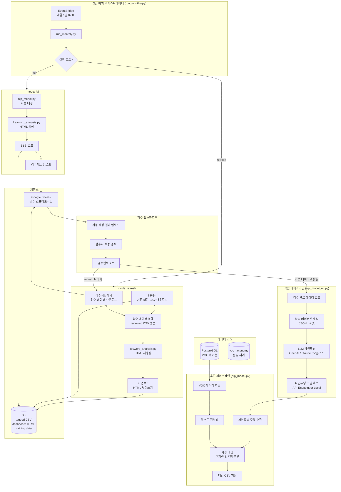

## 목적
- 빌딩 관리 서비스에서 수집되는 고객 VOC(Voice of Customer) 데이터를 LLM 기반으로 자동 분류(VOC주제, 작업유형)

| VOC 원문 | 주제 대분류 | 주제 중분류 | 작업유형 대분류 | 작업유형 중분류 |
|----------|-------------|-------------|-----------------|-----------------|
| 화장실이 너무 더러워요 | 환경 | 청결/미화 | 작업 | 청소/정리 |
| 에어컨이 안 켜져요 | 시설 | 냉난방/공조 | 작업 | 유지보수 |
| 주차장 조명이 너무 어두워요 | 시설 | 전기/조명 | 작업 | 교체 |

- 각 빌딩에서 월간 VOC 현황 보고서를 HTML로 다운로드할 수 있게 한다 (통계 및 워드 클라우드 포함 대시보드)

## 개요 
- 매월 1일 cron 배치로 전월 VOC 데이터 분석 → 자동 태깅 → HTML 리포트 생성 → S3 업로드
- 자동 태깅 결과를 Google Sheets에 업로드하여, 비개발자인 도메인 전문가가 직접 검수할 수 있도록 한다
  - 드롭다운 메뉴로 분류 체계(taxonomy) 선택 → 오분류 항목만 수정
  - 코드 수정 없이 브라우저에서 바로 검수 가능
- 검수 완료 후 refresh 모드로 HTML 재생성하여 검수 결과 즉각 반영
- 축적된 검수 데이터로 매월 LLM 파인튜닝 → 자동 태깅 정확도 지속 개선 (Human-in-the-loop)

## 전체 아키텍처



**핵심 흐름:**
1. **파인튜닝**: 검수 완료 데이터 → `nlp_model_ml.py` → LLM 파인튜닝 및 배포
2. **추론 (full 모드)**: VOC 원천 데이터 → `nlp_model.py` → 자동 태깅 → HTML 생성 → S3/검수시트 업로드
3. **검수 반영 (refresh 모드)**: 검수시트 + S3 기존 CSV → 병합 → HTML 재생성 → S3 덮어쓰기
4. **검수**: Google Sheets에서 검수 → 검수 데이터 축적 → 다음 파인튜닝에 반영

## 프로젝트 구조

```
voc-nlp/
├── batch/
│   ├── run_monthly.py       # 배치 오케스트레이터 (메인)
│   ├── nlp_model_ml.py      # LLM 파인튜닝 (Training)
│   ├── nlp_model.py         # 파인튜닝 모델로 태깅 (Inference)
│   ├── nlp_model_core.py    # 전처리/분류 핵심 함수
│   ├── keyword_analysis.py  # 키워드 분석 + 시각화
│   ├── report_html.py       # HTML 리포트 렌더링
│   ├── s3_uploader.py       # S3 업로드 모듈
│   ├── gspread_manager.py   # Google Sheets 연동
│   ├── common_db.py         # DB 연결 공통 모듈
│   └── cron_monthly.sh      # cron 실행 스크립트
├── training_data/            # 파인튜닝 학습 데이터
│   ├── train_{yyyymm}.jsonl
│   └── valid_{yyyymm}.jsonl
├── output/
│   ├── tagging/             # 태깅 결과 CSV
│   ├── html/                # 대시보드 HTML
│   └── reviewed/            # 검수 반영 CSV
└── requirements.txt
```

## 실행 모드

run_monthly.py는 3가지 모드를 지원한다.

| 모드 | 설명 | 처리 순서 |
|------|------|----------|
| `full` | 전체 처리 (기본) | 태깅 → HTML → S3 → 검수시트 |
| `refresh` | 검수 반영 | 검수시트 다운로드 → 기존CSV 병합 → HTML 재생성 → S3 |
| `tagging-only` | 태깅만 | 태깅 → 검수시트 (HTML 생성 안함) |

**사용 예시:**

```bash
# [모델 파인튜닝] 검수 데이터로 LLM 파인튜닝
python nlp_model_ml.py --train --months 202512

# [1단계] 자동태깅 + HTML + 검수시트 업로드
python run_monthly.py --mode full --all-buildings --auto-month

# [2단계] 검수 완료 후 HTML 재생성
python run_monthly.py --mode refresh --all-buildings --auto-month

# 개발 환경에서 특정 빌딩 테스트
python run_monthly.py --env dev --mode full --building-id 95 --year 2025 --month 12
```

## LLM 파이프라인 상세

### 1. nlp_model_ml.py (LLM 파인튜닝)

검수 완료된 데이터를 기반으로 LLM을 파인튜닝한다.

```python
# nlp_model_ml.py
"""
VOC 분류 LLM 파인튜닝 모듈

검수 완료된 데이터를 학습 데이터로 사용하여 LLM을 파인튜닝한다.

지원 모델:
  - OpenAI GPT (gpt-3.5-turbo, gpt-4)
  - Anthropic Claude
  - 오픈소스 (LLaMA, Mistral 등)

사용법:
  python nlp_model_ml.py --train --months 202512
"""
import os
import json
import pandas as pd
from openai import OpenAI
from gspread_manager import get_gspread_manager
from s3_uploader import get_s3_uploader


class VOCFineTuner:
    """VOC 분류 LLM 파인튜닝 클래스"""
    
    def __init__(self, provider: str = "openai"):
        self.provider = provider
        self.client = self._init_client()
        self.training_data_dir = os.getenv("TRAINING_DATA_DIR", "/home/ssm-user/jupyter/training_data")
    
    def _init_client(self):
        """LLM 클라이언트 초기화"""
        if self.provider == "openai":
            return OpenAI(api_key=os.getenv("OPENAI_API_KEY"))
        elif self.provider == "anthropic":
            from anthropic import Anthropic
            return Anthropic(api_key=os.getenv("ANTHROPIC_API_KEY"))
        # 오픈소스 모델의 경우 로컬 또는 vLLM 서버 연결
        return None
    
    def load_training_data(self, yyyymm_list: list) -> pd.DataFrame:
        """검수 완료 데이터 로드"""
        gspread_mgr = get_gspread_manager()
        all_data = []
        for yyyymm in yyyymm_list:
            df, error = gspread_mgr.download_reviewed_data(yyyymm)
            if df is not None:
                # 검수완료된 데이터만 필터링
                df_reviewed = df[df["검수완료"].str.upper() == "Y"]
                all_data.append(df_reviewed)
        
        if not all_data:
            return pd.DataFrame()
        return pd.concat(all_data, ignore_index=True)
    
    def create_training_jsonl(self, df: pd.DataFrame, version: str) -> str:
        """파인튜닝용 JSONL 데이터셋 생성"""
        os.makedirs(self.training_data_dir, exist_ok=True)
        
        training_examples = []
        for _, row in df.iterrows():
            # 입력 텍스트 구성
            text = f"제목: {row['title']}\n내용: {row['request_contents']}\n답변: {row['reply']}"
            
            # 검수된 라벨 사용 (없으면 자동태깅 결과)
            subject_major = row.get("검수_주제 대분류") or row.get("주제 대분류", "")
            subject_minor = row.get("검수_주제 중분류") or row.get("주제 중분류", "")
            work_major = row.get("검수_작업유형 대분류") or row.get("작업유형 대분류", "")
            work_minor = row.get("검수_작업유형 중분류") or row.get("작업유형 중분류", "")
            
            # OpenAI 파인튜닝 포맷
            example = {
                "messages": [
                    {
                        "role": "system",
                        "content": "VOC 텍스트를 분석하여 주제와 작업유형을 분류한다. JSON 형식으로 응답한다."
                    },
                    {
                        "role": "user",
                        "content": text
                    },
                    {
                        "role": "assistant",
                        "content": json.dumps({
                            "주제_대분류": subject_major,
                            "주제_중분류": subject_minor,
                            "작업유형_대분류": work_major,
                            "작업유형_중분류": work_minor
                        }, ensure_ascii=False)
                    }
                ]
            }
            training_examples.append(example)
        
        # Train/Valid 분리 (8:2)
        split_idx = int(len(training_examples) * 0.8)
        train_data = training_examples[:split_idx]
        valid_data = training_examples[split_idx:]
        
        train_path = f"{self.training_data_dir}/train_{version}.jsonl"
        valid_path = f"{self.training_data_dir}/valid_{version}.jsonl"
        
        with open(train_path, "w", encoding="utf-8") as f:
            for ex in train_data:
                f.write(json.dumps(ex, ensure_ascii=False) + "\n")
        
        with open(valid_path, "w", encoding="utf-8") as f:
            for ex in valid_data:
                f.write(json.dumps(ex, ensure_ascii=False) + "\n")
        
        print(f"[INFO] 학습 데이터: {len(train_data)}건, 검증 데이터: {len(valid_data)}건")
        return train_path, valid_path
    
    def run_finetuning(self, train_path: str, valid_path: str, version: str) -> dict:
        """LLM 파인튜닝 실행"""
        if self.provider == "openai":
            return self._finetune_openai(train_path, valid_path, version)
        elif self.provider == "anthropic":
            return self._finetune_anthropic(train_path, valid_path, version)
        else:
            return self._finetune_opensource(train_path, valid_path, version)
    
    def _finetune_openai(self, train_path: str, valid_path: str, version: str) -> dict:
        """OpenAI 파인튜닝"""
        # 1) 파일 업로드
        with open(train_path, "rb") as f:
            train_file = self.client.files.create(file=f, purpose="fine-tune")
        with open(valid_path, "rb") as f:
            valid_file = self.client.files.create(file=f, purpose="fine-tune")
        
        # 2) 파인튜닝 작업 생성
        job = self.client.fine_tuning.jobs.create(
            training_file=train_file.id,
            validation_file=valid_file.id,
            model="gpt-4o-mini-2024-07-18",
            suffix=f"voc-classifier-{version}",
            hyperparameters={
                "n_epochs": 3,
                "batch_size": 4,
                "learning_rate_multiplier": 1.0
            }
        )
        
        print(f"[INFO] 파인튜닝 작업 생성: {job.id}")
        
        # 3) 완료 대기 (실제로는 비동기 처리 권장)
        import time
        while True:
            job_status = self.client.fine_tuning.jobs.retrieve(job.id)
            if job_status.status == "succeeded":
                break
            elif job_status.status == "failed":
                raise Exception(f"파인튜닝 실패: {job_status.error}")
            print(f"[INFO] 파인튜닝 진행 중... 상태: {job_status.status}")
            time.sleep(60)
        
        return {
            "success": True,
            "model_id": job_status.fine_tuned_model,
            "job_id": job.id,
            "version": version
        }
    
    def _finetune_opensource(self, train_path: str, valid_path: str, version: str) -> dict:
        """오픈소스 LLM 파인튜닝 (LoRA/QLoRA)"""
        from transformers import AutoModelForCausalLM, AutoTokenizer, TrainingArguments
        from peft import LoraConfig, get_peft_model
        from trl import SFTTrainer
        
        base_model = os.getenv("BASE_MODEL", "mistralai/Mistral-7B-v0.1")
        output_dir = f"{self.training_data_dir}/models/voc-classifier-{version}"
        
        # LoRA 설정
        lora_config = LoraConfig(
            r=16,
            lora_alpha=32,
            target_modules=["q_proj", "v_proj"],
            lora_dropout=0.05,
            bias="none",
            task_type="CAUSAL_LM"
        )
        
        model = AutoModelForCausalLM.from_pretrained(base_model, load_in_4bit=True)
        model = get_peft_model(model, lora_config)
        
        training_args = TrainingArguments(
            output_dir=output_dir,
            num_train_epochs=3,
            per_device_train_batch_size=4,
            gradient_accumulation_steps=4,
            learning_rate=2e-4,
            save_strategy="epoch",
        )
        
        trainer = SFTTrainer(
            model=model,
            args=training_args,
            train_dataset=train_path,
            eval_dataset=valid_path,
        )
        trainer.train()
        trainer.save_model(output_dir)
        
        return {
            "success": True,
            "model_path": output_dir,
            "version": version
        }
    
    def save_model_config(self, result: dict, version: str):
        """모델 설정 저장 (다음 추론에서 사용)"""
        config = {
            "version": version,
            "provider": self.provider,
            "model_id": result.get("model_id"),
            "model_path": result.get("model_path"),
            "created_at": datetime.now().isoformat()
        }
        
        config_path = f"{self.training_data_dir}/model_config_{version}.json"
        with open(config_path, "w", encoding="utf-8") as f:
            json.dump(config, f, ensure_ascii=False, indent=2)
        
        # S3에도 업로드
        s3_uploader = get_s3_uploader()
        if s3_uploader and s3_uploader.is_available():
            s3_uploader.upload_file(config_path, f"models/model_config_{version}.json")


def main():
    import argparse
    from datetime import datetime
    
    parser = argparse.ArgumentParser()
    parser.add_argument("--train", action="store_true")
    parser.add_argument("--months", type=str, help="학습 대상 월 (콤마 구분)")
    parser.add_argument("--provider", type=str, default="openai", choices=["openai", "anthropic", "opensource"])
    args = parser.parse_args()
    
    if args.train:
        tuner = VOCFineTuner(provider=args.provider)
        version = datetime.now().strftime("%Y%m%d")
        
        yyyymm_list = args.months.split(",") if args.months else [datetime.now().strftime("%Y%m")]
        print(f"[INFO] 학습 대상 월: {yyyymm_list}")
        
        df = tuner.load_training_data(yyyymm_list)
        print(f"[INFO] 검수 완료 데이터: {len(df)}건")
        
        if df.empty:
            print("[WARN] 학습 데이터가 없다.")
            return
        
        train_path, valid_path = tuner.create_training_jsonl(df, version)
        
        print(f"[INFO] {args.provider} 파인튜닝 시작...")
        result = tuner.run_finetuning(train_path, valid_path, version)
        
        tuner.save_model_config(result, version)
        print(f"[INFO] 파인튜닝 완료: {result}")


if __name__ == "__main__":
    main()
```

### 2. nlp_model.py (추론 - 파인튜닝 모델로 태깅)

파인튜닝된 LLM을 호출하여 신규 VOC 데이터에 자동 태깅을 수행한다.

```python
# nlp_model.py
"""
VOC 자동 태깅 모듈 (Inference)

파인튜닝된 LLM을 호출하여 VOC 데이터에 주제/작업유형을 자동 태깅한다.
"""
import os
import json
import pandas as pd
from openai import OpenAI
from common_db import load_dotenv, db_connect
from nlp_model_core import whitelist_text


class VOCClassifier:
    """파인튜닝된 LLM을 사용한 VOC 분류기"""
    
    def __init__(self, provider: str = None):
        self.config = self._load_latest_config()
        self.provider = provider or self.config.get("provider", "openai")
        self.model_id = self.config.get("model_id")
        self.model_path = self.config.get("model_path")
        self.client = self._init_client()
    
    def _load_latest_config(self) -> dict:
        """최신 모델 설정 로드"""
        import glob
        config_dir = os.getenv("TRAINING_DATA_DIR", "/home/ssm-user/jupyter/training_data")
        configs = sorted(glob.glob(f"{config_dir}/model_config_*.json"), reverse=True)
        
        if not configs:
            return {}
        
        with open(configs[0], "r", encoding="utf-8") as f:
            return json.load(f)
    
    def _init_client(self):
        """LLM 클라이언트 초기화"""
        if self.provider == "openai":
            return OpenAI(api_key=os.getenv("OPENAI_API_KEY"))
        elif self.provider == "anthropic":
            from anthropic import Anthropic
            return Anthropic(api_key=os.getenv("ANTHROPIC_API_KEY"))
        return None
    
    def is_available(self) -> bool:
        """파인튜닝 모델 사용 가능 여부"""
        return self.model_id is not None or self.model_path is not None
    
    def predict(self, text: str) -> dict:
        """단일 텍스트 분류"""
        if self.provider == "openai":
            return self._predict_openai(text)
        elif self.provider == "anthropic":
            return self._predict_anthropic(text)
        else:
            return self._predict_opensource(text)
    
    def _predict_openai(self, text: str) -> dict:
        """OpenAI 파인튜닝 모델로 예측"""
        response = self.client.chat.completions.create(
            model=self.model_id,  # 파인튜닝된 모델 ID
            messages=[
                {
                    "role": "system",
                    "content": "VOC 텍스트를 분석하여 주제와 작업유형을 분류한다. JSON 형식으로 응답한다."
                },
                {
                    "role": "user",
                    "content": text
                }
            ],
            temperature=0,
            max_tokens=200
        )
        
        try:
            result = json.loads(response.choices[0].message.content)
            return result
        except json.JSONDecodeError:
            return {
                "주제_대분류": "기타",
                "주제_중분류": "기타",
                "작업유형_대분류": "기타",
                "작업유형_중분류": "기타"
            }
    
    def predict_batch(self, texts: list) -> list:
        """배치 예측"""
        results = []
        for text in texts:
            result = self.predict(text)
            results.append(result)
        return results


def run_tagging_with_llm(result_df: pd.DataFrame, classifier: VOCClassifier) -> pd.DataFrame:
    """LLM 기반 태깅"""
    result_df = result_df.copy()
    
    # 텍스트 전처리
    result_df["title_clean"] = result_df["title"].map(whitelist_text).fillna("")
    result_df["all_text"] = (
        "제목: " + result_df["title_clean"] + "\n" +
        "내용: " + result_df["request_contents"].map(whitelist_text).fillna("") + "\n" +
        "답변: " + result_df["reply"].map(whitelist_text).fillna("")
    )
    
    # LLM으로 예측
    if classifier.is_available():
        print(f"[INFO] 파인튜닝 모델({classifier.model_id})로 {len(result_df)}건 태깅 시작...")
        
        predictions = classifier.predict_batch(result_df["all_text"].tolist())
        
        result_df["주제 대분류"] = [p.get("주제_대분류", "기타") for p in predictions]
        result_df["주제 중분류"] = [p.get("주제_중분류", "기타") for p in predictions]
        result_df["작업유형 대분류"] = [p.get("작업유형_대분류", "기타") for p in predictions]
        result_df["작업유형 중분류"] = [p.get("작업유형_중분류", "기타") for p in predictions]
        
        print(f"[INFO] LLM 태깅 완료")
    else:
        # Fallback: 키워드 기반 분류
        print("[WARN] 파인튜닝 모델 없음. 키워드 기반 분류로 대체")
        result_df = run_retagging_df(result_df, ...)
    
    return result_df


def main():
    env_path = os.getenv("ENV_PATH", "/home/ssm-user/jupyter/.env")
    load_dotenv(env_path)
    
    building_id = int(os.getenv("BUILDING_ID", "95"))
    start_date = os.getenv("START_DATE", "2025-12-01")
    end_date = os.getenv("END_DATE", "2026-01-01")
    
    voc_df = fetch_result1_df(building_id, start_date, end_date)
    print(f"[INFO] VOC 데이터: {len(voc_df)}건")
    
    classifier = VOCClassifier()
    
    tagged_df = run_tagging_with_llm(voc_df, classifier)
    
    tagged_df.to_csv(out_csv_path, index=False, encoding="utf-8-sig")
    print(f"[INFO] 저장 완료: {out_csv_path}")


if __name__ == "__main__":
    main()
```

## 배치 처리 상세

### run_monthly.py (오케스트레이터)

실행 모드에 따라 적절한 처리 함수를 호출한다.

```python
# run_monthly.py
"""
월간 VOC 분석 배치 오케스트레이터

3가지 실행 모드:
  - full: 태깅 → HTML → S3 → 검수시트 (기본)
  - refresh: 검수시트 → HTML 재생성 → S3 (검수 반영)
  - tagging-only: 태깅 → 검수시트만 (HTML 안 만듦)
"""

def process_building_full(building_id, ...):
    """full 모드: 태깅 → HTML → S3 → 검수시트"""
    
    # 1) 태깅
    logger.info(f"  [1/4] 태깅")
    tagging_result = run_tagging(building_id, ...)
    
    # 2) HTML 생성
    logger.info(f"  [2/4] HTML 생성")
    analysis_result = run_analysis(building_id, ...)
    
    # 3) S3 업로드
    logger.info(f"  [3/4] S3 업로드")
    s3_result = s3_uploader.upload_building_outputs(...)
    
    # 4) 검수 시트 업로드
    logger.info(f"  [4/4] 검수 시트 업로드")
    gsheet_result = gspread_mgr.upload_tagged_csv(...)
    gspread_mgr.set_dropdown_validation(yyyymm)
    
    return result


def process_building_refresh(building_id, ...):
    """refresh 모드: 검수시트 → HTML 재생성 → S3"""
    
    # 1) 검수 시트에서 데이터 다운로드
    logger.info(f"  [1/3] 검수 데이터 다운로드")
    df_review, error = gspread_mgr.download_all_data(yyyymm, building_id)
    
    # 2) S3에서 기존 태깅 CSV 다운로드
    s3_key = s3_uploader.find_latest_tagged_csv(building_id, yyyymm)
    s3_uploader.download_file(s3_key, local_csv_path)
    
    # 3) 검수 데이터 병합 → reviewed CSV 생성
    reviewed_result = create_reviewed_csv(...)
    
    # 4) HTML 재생성 (검수 데이터 기반)
    logger.info(f"  [2/3] HTML 생성 (검수 데이터 기반)")
    analysis_result = run_analysis(
        building_id, ...,
        csv_path=reviewed_csv_path,  # 검수 반영된 CSV 사용
    )
    
    # 5) S3 업로드 (HTML 덮어쓰기)
    logger.info(f"  [3/3] S3 업로드 (HTML 갱신)")
    s3_result = s3_uploader.upload_file(html_local, html_s3_key)
    
    return result


def create_reviewed_csv(gspread_mgr, building_id, yyyymm, tagging_dir):
    """검수 시트 데이터와 기존 태깅 CSV 병합"""
    
    # 1) 기존 자동 태깅 CSV 로드
    df_tagged = pd.read_csv(tagging_csv_path)
    
    # 2) 검수 시트에서 데이터 다운로드
    df_review, error = gspread_mgr.download_all_data(yyyymm, building_id)
    
    # 3) voc_id 기준으로 검수 태깅 컬럼 병합
    review_columns = ["voc_id", "주제 대분류", "주제 중분류", "작업유형 대분류", "작업유형 중분류"]
    df_review_subset = df_review[review_columns]
    
    # 기존 태깅 컬럼 제거 후 검수 데이터로 대체
    df_tagged_base = df_tagged.drop(columns=["주제 대분류", "주제 중분류", ...])
    df_merged = df_tagged_base.merge(df_review_subset, on="voc_id", how="left")
    
    # 4) reviewed CSV 저장
    df_merged.to_csv(csv_path, index=False, encoding="utf-8-sig")
    
    return {"success": True, "csv_path": csv_path}
```

## S3 경로 구조

```
s3://hdcl-csp-prod/stat/voc/
├── {yyyymm}/{building_id}/
│   ├── tagged_{building_id}_{yyyymm}_{run_id}.csv
│   └── dashboard_{building_id}_{yyyymm}_{run_id}.html
├── models/
│   └── model_config_{version}.json
└── training_data/
    ├── train_{version}.jsonl
    └── valid_{version}.jsonl
```

## Human-in-the-loop 워크플로우

```
┌─────────────────────────────────────────────────────────────────────────────┐
│                      Human-in-the-loop LLM 파이프라인                         │
└─────────────────────────────────────────────────────────────────────────────┘

    ┌──────────┐      ┌──────────┐      ┌──────────┐      ┌──────────┐
    │ 1. 추론   │ ──▶ │ 2. 검수   │ ──▶ │ 3. 반영   │ ──▶ │ 4. 학습   │
    │ (full)   │      │          │      │ (refresh)│      │          │
    │          │      │          │      │          │      │          │
    │ nlp_     │      │ Google   │      │ HTML     │      │ nlp_     │
    │ model.py │      │ Sheets   │      │ 재생성   │      │ model_   │
    │          │      │          │      │          │      │ ml.py    │
    └──────────┘      └──────────┘      └──────────┘      └──────────┘
         │                 │                 │                 │
         ▼                 ▼                 ▼                 ▼
    ┌──────────┐      ┌──────────┐      ┌──────────┐      ┌──────────┐
    │ LLM으로  │      │ 수동     │      │ 검수된   │      │ LLM      │
    │ 자동     │      │ 검수     │      │ 결과로   │      │ 파인튜닝 │
    │ 태깅     │      │ 완료     │      │ 리포트   │      │ (정확도↑)│
    └──────────┘      └──────────┘      └──────────┘      └──────────┘
```

**월간 운영 사이클:**
1. **매월 1일**: `full` 모드 자동 실행 → LLM 자동 태깅 + HTML 생성 + 검수시트 업로드
2. **매월 1~10일**: 검수자가 Google Sheets에서 드롭다운으로 태깅 검수/수정
3. **매월 10일 이후**: `refresh` 모드 실행 → 검수 반영된 HTML 재생성
4. **매월 20일**: 축적된 검수 데이터로 LLM 파인튜닝 재실행

## cron 스케줄 설정

**월간 배치 - full 모드 (매월 1일 02:00 KST):**

```bash
# crontab -e
0 2 1 * * /home/ssm-user/jupyter/batch/cron_monthly.sh >> /home/ssm-user/jupyter/logs/cron_monthly.log 2>&1
```

**월간 배치 - refresh 모드 (매월 15일 02:00 KST):**

```bash
0 2 15 * * /home/ssm-user/jupyter/batch/cron_refresh.sh >> /home/ssm-user/jupyter/logs/cron_refresh.log 2>&1
```

**월간 LLM 파인튜닝 (매월 20일 04:00 KST):**

```bash
0 4 20 * * /home/ssm-user/jupyter/batch/cron_train.sh >> /home/ssm-user/jupyter/logs/cron_train.log 2>&1
```

**cron_monthly.sh:**

```bash
#!/bin/bash
BASE_DIR="/home/ssm-user/jupyter"
BATCH_DIR="${BASE_DIR}/batch"
PYTHON_BIN="/home/ssm-user/pyenv/bin/python3.11"

echo "========================================"
echo "cron_monthly.sh 시작: $(date '+%Y-%m-%d %H:%M:%S')"
echo "========================================"

cd "${BATCH_DIR}"
${PYTHON_BIN} run_monthly.py --mode full --all-buildings --auto-month --run-id-prefix cron

echo "========================================"
echo "cron_monthly.sh 종료: $(date '+%Y-%m-%d %H:%M:%S')"
echo "========================================"
```

**cron_train.sh:**

```bash
#!/bin/bash
BASE_DIR="/home/ssm-user/jupyter"
BATCH_DIR="${BASE_DIR}/batch"
PYTHON_BIN="/home/ssm-user/pyenv/bin/python3.11"

echo "========================================"
echo "LLM 파인튜닝 시작: $(date '+%Y-%m-%d %H:%M:%S')"
echo "========================================"

cd "${BATCH_DIR}"

# 전월 검수 데이터로 파인튜닝
LAST_MONTH=$(date -d "last month" +%Y%m)
${PYTHON_BIN} nlp_model_ml.py --train --months ${LAST_MONTH} --provider openai

echo "========================================"
echo "LLM 파인튜닝 종료: $(date '+%Y-%m-%d %H:%M:%S')"
echo "========================================"
```

## 검수 시트 컬럼 구조

| 컬럼명 | 설명 | 수정 가능 |
|--------|------|----------|
| voc_id | VOC 고유 ID | X |
| building_id | 빌딩 ID | X |
| building_name | 빌딩명 | X |
| voc_date | VOC 접수일 | X |
| title_clean | 전처리된 제목 | X |
| request_contents | 요청 내용 | X |
| reply | 답변 내용 | X |
| 주제 대분류 | LLM 자동 태깅 결과 | X |
| 주제 중분류 | LLM 자동 태깅 결과 | X |
| 작업유형 대분류 | LLM 자동 태깅 결과 | X |
| 작업유형 중분류 | LLM 자동 태깅 결과 | X |
| 검수_주제 대분류 | 검수자 수정용 | O (드롭다운) |
| 검수_주제 중분류 | 검수자 수정용 | O (드롭다운) |
| 검수_작업유형 대분류 | 검수자 수정용 | O (드롭다운) |
| 검수_작업유형 중분류 | 검수자 수정용 | O (드롭다운) |
| 검수완료 | Y/N | O |
| 검수자 | 검수자 이름 | O |
| 검수일시 | 검수 완료 시각 | O |

## 환경 설정

**.env 파일:**

```
# DB
DB_HOST=your-db-host
DB_PORT=5432
DB_NAME=your-db-name
DB_USER=your-user
DB_PASSWORD=your-password

# S3
S3_BUCKET=hdcl-csp-prod
S3_PREFIX=stat/voc

# LLM API
OPENAI_API_KEY=sk-xxxx
ANTHROPIC_API_KEY=sk-ant-xxxx

# 경로
BASE_DIR=/home/ssm-user/jupyter
OUT_DIR=/home/ssm-user/jupyter/output
LOG_DIR=/home/ssm-user/jupyter/logs
TRAINING_DATA_DIR=/home/ssm-user/jupyter/training_data
```

## 모델 성능 모니터링

파인튜닝 후 성능 지표를 기록하고, 정확도 추이를 모니터링한다.

```python
# 파인튜닝 결과 예시
{
    "version": "20260116",
    "provider": "openai",
    "model_id": "ft:gpt-4o-mini-2024-07-18:org::voc-classifier-20260116",
    "train_samples": 1523,
    "valid_samples": 381,
    "training_cost_usd": 12.50,
    "created_at": "2026-01-16T04:32:15+09:00"
}
```

검수 데이터가 축적될수록 파인튜닝 품질이 향상되며, LLM의 도메인 특화 성능이 개선되어 검수 부담이 줄어드는 선순환 구조를 목표로 한다.
