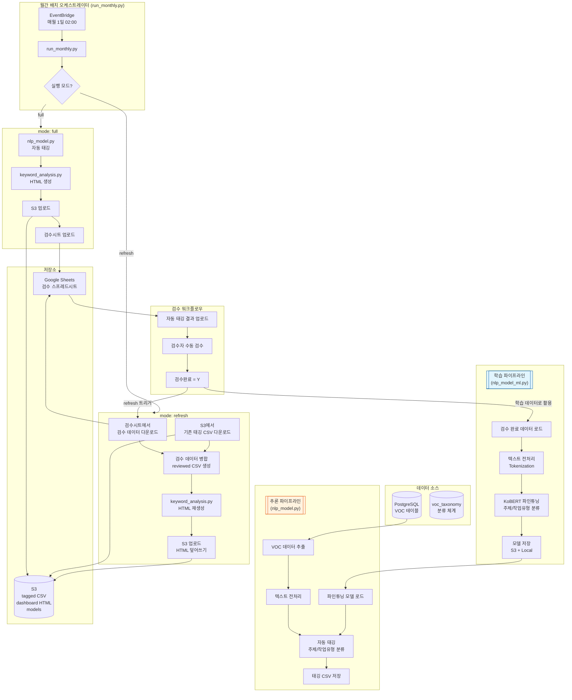
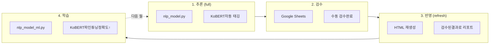

## 목적
- 빌딩 관리 서비스에서 수집되는 고객 VOC(Voice of Customer) 데이터를 AI 기반으로 자동 분류(VOC주제, 작업유형)

  | VOC 원문 | 주제 대분류 | 주제 중분류 | 작업유형 대분류 | 작업유형 중분류 |
  |----------|-------------|-------------|-----------------|-----------------|
  | 화장실이 너무 더러워요 | 환경 | 청결/미화 | 작업 | 청소/정리 |
  | 에어컨이 안 켜져요 | 시설 | 냉난방/공조 | 작업 | 유지보수 |
  | 주차장 조명이 너무 어두워요 | 시설 | 전기/조명 | 작업 | 교체 |

- 각 빌딩에서 월간 VOC 현황 보고서를 HTML로 다운로드할 수 있게 한다 (통계 및 워드 클라우드 포함 대시보드)

## 개요 
- 매월 1일 cron 배치로 전월 VOC 데이터 분석 → 자동 태깅 → HTML 리포트 생성 → S3 업로드
- 자동 태깅 결과를 Google Sheets에 업로드하여, 비개발자인 도메인 전문가(빌딩 관리자)가 직접 검수할 수 있도록 한다
  - 드롭다운 메뉴로 분류 체계(taxonomy) 선택 → 오분류 항목만 수정
  - 코드 수정 없이 브라우저에서 바로 검수 가능
- 검수 완료 후 refresh 모드로 HTML 재생성하여 검수 결과 즉각 반영
- 축적된 검수 데이터로 매월 KoBERT 모델 재학습 → 자동 태깅 정확도 지속 개선 (Human-in-the-loop)

## 전체 아키텍처



**핵심 흐름:**
1. **파인튜닝**: 검수 완료 데이터 → `nlp_model_ml.py` → KoBERT 파인튜닝 및 저장
2. **추론 (full 모드)**: VOC 원천 데이터 → `nlp_model.py` → 자동 태깅 → HTML 생성 → S3/검수시트 업로드
3. **검수 반영 (refresh 모드)**: 검수시트 + S3 기존 CSV → 병합 → HTML 재생성 → S3 덮어쓰기
4. **검수**: Google Sheets에서 검수 → 검수 데이터 축적 → 다음 파인튜닝에 반영

## 프로젝트 구조

```
voc-nlp/
├── batch/
│   ├── run_monthly.py       # 배치 오케스트레이터 (메인)
│   ├── nlp_model_ml.py      # KoBERT 파인튜닝 (Training)
│   ├── nlp_model.py         # 파인튜닝 모델로 태깅 (Inference)
│   ├── nlp_model_core.py    # 전처리/분류 핵심 함수
│   ├── keyword_analysis.py  # 키워드 분석 + 시각화
│   ├── report_html.py       # HTML 리포트 렌더링
│   ├── s3_uploader.py       # S3 업로드 모듈
│   ├── gspread_manager.py   # Google Sheets 연동
│   ├── common_db.py         # DB 연결 공통 모듈
│   └── cron_monthly.sh      # cron 실행 스크립트
├── models/                   # 학습된 모델 저장
│   ├── kobert_subject/      # 주제 분류 모델
│   └── kobert_work/         # 작업유형 분류 모델
├── output/
│   ├── tagging/             # 태깅 결과 CSV
│   ├── html/                # 대시보드 HTML
│   └── reviewed/            # 검수 반영 CSV
└── requirements.txt
```

## 실행 모드

run_monthly.py는 3가지 모드를 지원한다.

| 모드 | 설명 | 처리 순서 |
|------|------|----------|
| `full` | 전체 처리 (기본) | 태깅 → HTML → S3 → 검수시트 |
| `refresh` | 검수 반영 | 검수시트 다운로드 → 기존CSV 병합 → HTML 재생성 → S3 |
| `tagging-only` | 태깅만 | 태깅 → 검수시트 (HTML 생성 안함) |

**사용 예시:**

```bash
# [모델 파인튜닝] 검수 데이터로 KoBERT 파인튜닝
python nlp_model_ml.py --train --months 202512

# [1단계] 자동태깅 + HTML + 검수시트 업로드
python run_monthly.py --mode full --all-buildings --auto-month

# [2단계] 검수 완료 후 HTML 재생성
python run_monthly.py --mode refresh --all-buildings --auto-month

# 개발 환경에서 특정 빌딩 테스트
python run_monthly.py --env dev --mode full --building-id 95 --year 2025 --month 12
```


## S3 경로 구조

```
s3://hdcl-csp-prod/stat/voc/
├── {yyyymm}/{building_id}/
│   ├── tagged_{building_id}_{yyyymm}_{run_id}.csv
│   └── dashboard_{building_id}_{yyyymm}_{run_id}.html
└── models/
    ├── kobert_subject_{version}/
    │   ├── config.json
    │   ├── pytorch_model.bin
    │   └── label_mapping.json
    └── kobert_work_{version}/
```

## Human-in-the-loop 워크플로우



**월간 운영 사이클:**
1. **매월 1일**: `full` 모드 자동 실행 → KoBERT 자동 태깅 + HTML 생성 + 검수시트 업로드
2. **매월 1~10일**: 검수자가 Google Sheets에서 드롭다운으로 태깅 검수/수정
3. **매월 10일 이후**: `refresh` 모드 실행 → 검수 반영된 HTML 재생성
4. **매월 20일**: 축적된 검수 데이터로 KoBERT 재학습

## cron 스케줄 설정

**월간 배치 - full 모드 (매월 1일 02:00 KST):**

```bash
0 2 1 * * /home/ssm-user/jupyter/batch/cron_monthly.sh >> /home/ssm-user/jupyter/logs/cron_monthly.log 2>&1
```

**월간 배치 - refresh 모드 (매월 15일 02:00 KST):**

```bash
0 2 15 * * /home/ssm-user/jupyter/batch/cron_refresh.sh >> /home/ssm-user/jupyter/logs/cron_refresh.log 2>&1
```

**월간 KoBERT 파인튜닝 (매월 20일 04:00 KST):**

```bash
0 4 20 * * /home/ssm-user/jupyter/batch/cron_train.sh >> /home/ssm-user/jupyter/logs/cron_train.log 2>&1
```

## 환경 설정

**.env 파일:**

```
# DB
DB_HOST=your-db-host
DB_PORT=5432
DB_NAME=your-db-name
DB_USER=your-user
DB_PASSWORD=your-password

# S3
S3_BUCKET=hdcl-csp-prod
S3_PREFIX=stat/voc

# 경로
BASE_DIR=/home/ssm-user/jupyter
OUT_DIR=/home/ssm-user/jupyter/output
LOG_DIR=/home/ssm-user/jupyter/logs
MODEL_DIR=/home/ssm-user/jupyter/models
```

## 모델 성능 모니터링

학습 시 성능 지표를 기록하고, 정확도 추이를 모니터링한다.

```python
# 학습 결과 예시
{
    "version": "20260116",
    "train_samples": 1523,
    "subject": {
        "accuracy": 0.8742,
        "num_labels": 24
    },
    "work": {
        "accuracy": 0.8156,
        "num_labels": 18
    }
}
```

검수 데이터가 축적될수록 KoBERT 파인튜닝 품질이 향상되며, 자동 태깅 정확도가 개선되어 검수 부담이 줄어드는 선순환 구조를 목표로 한다.
