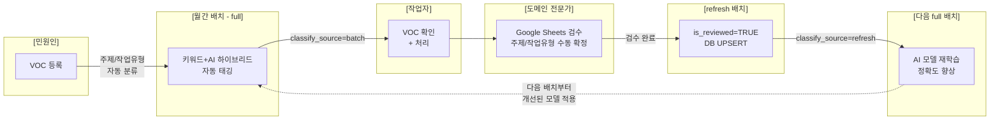
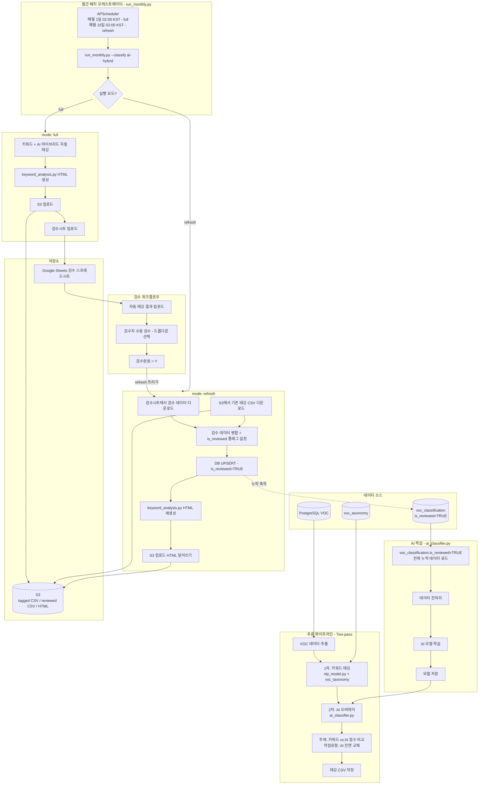
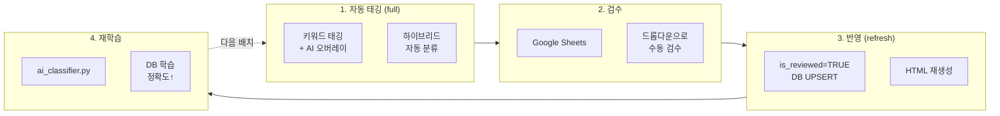

## 목적
- 빌딩 관리 서비스에서 수집되는 고객 VOC(Voice of Customer) 데이터를 AI 기반으로 자동 분류(VOC주제, 작업유형)

  | VOC 원문 | 주제 대분류 | 주제 중분류 | 작업유형 대분류 | 작업유형 중분류 |
  |----------|-------------|-------------|-----------------|-----------------|
  | 화장실이 너무 더러워요 | 환경 | 청결/미화 | 작업 | 청소/정리 |
  | 에어컨이 안 켜져요 | 시설 | 냉난방/공조 | 작업 | 유지보수 |
  | 주차장 조명이 너무 어두워요 | 시설 | 전기/조명 | 작업 | 교체 |

- 각 빌딩에서 월간 VOC 현황 보고서를 HTML로 다운로드할 수 있게 한다 (통계 및 워드클라우드 포함 대시보드)

## 개요
- 매월 1일 APScheduler 배치로 전월 VOC 데이터 분석 → 자동 태깅 → HTML 리포트 생성 → S3 업로드
- 자동 태깅은 **Two-pass 하이브리드 방식**:
  1. **1차 키워드 태깅**: DB의 분류 체계(voc_taxonomy) 키워드 매칭으로 분류
  2. **2차 AI 오버레이**: AI 모델이 키워드 결과를 보정
     - 주제: 키워드 점수 vs AI 확률 비교 → 높은 쪽 사용
     - 작업유형: AI로 전면 교체
- 자동 태깅 결과를 Google Sheets에 업로드하여, 비개발자인 도메인 전문가(빌딩 관리자)가 직접 검수할 수 있도록 한다
  - 드롭다운 메뉴로 분류 체계(taxonomy) 선택 → 오분류 항목만 수정
  - 코드 수정 없이 브라우저에서 바로 검수 가능
- 검수 완료 후 refresh 모드로 HTML 재생성하여 검수 결과 즉각 반영
- 축적된 검수 데이터로 매 배치 시 AI 모델 재학습 → 자동 태깅 정확도 지속 개선 (Human-in-the-loop)

## VOC 처리 Flow



| 단계 | 주체 | 내용 | classify_source |
|------|------|------|----------------|
| VOC 등록 | 민원인 | 민원 접수 | — |
| 자동 태깅 | 월간 배치 (full) | 키워드+AI 하이브리드 분류 | `batch` |
| VOC 처리 | 작업자 | 분류 결과 참고하여 처리 | — |
| 검수 | 도메인 전문가 (Google Sheets) | 주제/작업유형 수동 확정 | — |
| 검수 반영 | refresh 배치 | is_reviewed=TRUE DB UPSERT | `refresh` |
| 재학습 | 다음 full 배치 | 검수 누적 데이터로 모델 개선 | — |

## 전체 아키텍처



**핵심 흐름:**
1. **AI 학습**: DB `voc_classification.is_reviewed=TRUE`인 분류값 학습 → `ai_classifier.py` → AI 모델 학습 (배치 시작 시 1회, 메모리 상주)
2. **추론 (full 모드)**: VOC 원천 데이터 → 1차 키워드 태깅 → 2차 AI 오버레이 → HTML 생성 → S3/검수시트 업로드
3. **검수 반영 (refresh 모드)**: 검수시트 + S3 기존 CSV → 병합 + `is_reviewed=TRUE` UPSERT → HTML 재생성 → S3 덮어쓰기 (매월 15일 자동 실행)
4. **검수**: Google Sheets에서 검수 → `refresh` 배치가 `voc_classification.is_reviewed=TRUE`로 DB에 누적 → 다음 full 배치의 AI 학습 소스로 재사용

## 프로젝트 구조

```
voc-nlp/
├── .env.dev, .env.stg, .env.prd   # 환경별 설정
├── Dockerfile                      # Docker 빌드
├── entrypoint.sh                   # batch/scheduler 모드 선택
├── requirements.txt
├── batch/
│   ├── run_monthly.py              # 배치 오케스트레이터 (메인)
│   ├── ai_classifier.py            # AI 분류기 (하이브리드 오버레이)
│   ├── nlp_model.py                # 키워드 태깅 모듈
│   ├── nlp_model_core.py           # 전처리/분류 핵심 함수
│   ├── keyword_analysis.py         # 키워드 분석 + HTML 리포트 생성
│   ├── s3_uploader.py              # S3 업로드 모듈
│   ├── gspread_manager.py          # Google Sheets 연동
│   ├── common_db.py                # DB 연결 공통 모듈
│   └── scheduler.py                # APScheduler 기반 월간 스케줄러
└── output/
    ├── tagging/                    # 태깅 결과 CSV
    ├── html/                       # 대시보드 HTML
    ├── reviewed/                   # 검수 반영 CSV
    └── models/                     # 학습된 모델 파일
```

## Docker Entrypoint 모드

하나의 Docker 이미지로 2가지 컨테이너를 실행한다.

| 모드 | 실행 대상 | 수명 | 용도 |
|------|----------|------|------|
| `batch` | `run_monthly.py` | 1회 실행 후 종료 | 수동/임시 배치 실행 |
| `scheduler` | `scheduler.py` (APScheduler) | 상주 (데몬) | 매월 1일/15일 02:00 KST 자동 배치 |

```bash
# entrypoint.sh
case "$1" in
    batch)     exec python batch/run_monthly.py "$@" ;;
    scheduler) exec python -m batch.scheduler "$@" ;;
esac
```

운영에서는 **scheduler** 컨테이너가 상시 실행되고, 수동 재태깅이 필요할 때 `docker exec`으로 scheduler 컨테이너 안에서 batch를 실행한다.

## 배치 실행 모드

run_monthly.py는 3가지 모드를 지원한다.

| 모드 | 설명 | 처리 순서 |
|------|------|----------|
| `full` | 전체 처리 (기본) | 태깅 → HTML → S3 → 검수시트 |
| `refresh` | 검수 반영 | 검수시트 다운로드 → 기존CSV 병합 → HTML 재생성 → S3 |
| `tagging-only` | 태깅만 | 태깅 → 검수시트 (HTML 생성 안함) |

**Docker 기반 실행:**

```bash
# 전체 빌딩 full 배치 (AI 하이브리드)
docker run --rm -e ENV=prd \
  -v /path/to/output:/app/output \
  -v /path/to/logs:/app/logs \
  -v /path/to/.credentials:/app/.credentials \
  -v ~/.aws:/root/.aws:ro \
  voc-nlp-prd:latest batch \
  --mode full --all-buildings --auto-month --classify ai-hybrid

# 검수 완료 후 HTML 재생성
docker run --rm -e ENV=prd \
  -v /path/to/output:/app/output \
  -v /path/to/logs:/app/logs \
  -v /path/to/.credentials:/app/.credentials \
  -v ~/.aws:/root/.aws:ro \
  voc-nlp-prd:latest batch \
  --mode refresh --all-buildings --auto-month
```

## 하이브리드 분류 파이프라인 상세

### 분류 전략

| 분류 항목 | 전략 | 이유 |
|-----------|------|------|
| **주제** (대분류+중분류) | 키워드 vs AI 점수 비교 → 높은 쪽 사용 | 키워드 93.9% ≈ AI 94.5%로 비슷 → 점수 비교로 각각의 장점 활용 |
| **작업유형** (대분류+중분류) | AI로 전면 교체 | AI 94.3%가 키워드 89.7% 대비 +4.6%p 우세 |

### 1. nlp_model.py (1차: 키워드 태깅)

빌딩 관리 도메인에는 엘리베이터, SMPS, 공조기 등 특수 장비명과 시설 용어가 많아, 일반 AI 모델만으로는 놓치기 쉬운 분류 신호가 존재한다. 키워드 태깅을 병행하여 이러한 도메인 특화 단어에 대한 분류 정확도를 보완한다.

DB의 분류 체계(voc_taxonomy)에 등록된 키워드를 기반으로 VOC 텍스트를 분류한다. 텍스트 전처리 후 voc_taxonomy 키워드를 순회하며 위치 가중치·히트 수·priority를 곱한 점수를 계산하고, 최고 점수 분류를 선택한다.

**키워드 점수 공식:**

```
score = sent_w × (hits + length_bonus_scale × length_bonus) × priority
```

- `sent_w`: 문장 내 위치 가중치 (앞쪽일수록 높음)
- `hits`: 키워드 매칭 횟수
- `priority`: voc_taxonomy의 priority 값 (기타 분류를 낮게 설정하여 기타 선택 확률 감소)

### 2. ai_classifier.py (2차: AI 오버레이)

DB에서 `is_reviewed=TRUE` 데이터를 로드하여 결합 라벨(`"대분류>중분류"`)로 AI 모델을 학습한다. 키워드 태깅 CSV에 오버레이 적용 시 키워드 점수와 AI 확률을 비교하여 최종 분류를 결정한다.

**alpha란:** 키워드 점수를 [0, 1]로 정규화할 때 쓰는 스케일 파라미터로, 값이 작을수록 키워드 신뢰도가 높게 정규화된다 (`kw_conf = score / (score + alpha)`).

배치는 전체 VOC를 한 번에 처리하므로, 해당 배치 내 비제로 키워드 점수들의 중앙값을 alpha로 동적 계산한다. 배치 내 점수 분포를 기준으로 정규화하므로, 점수가 낮은 케이스에서도 키워드와 AI가 균형 있게 경쟁한다.

**alpha 동적 계산 예시:**

```
# 배치 내 비제로 점수들의 중앙값 = 600이라 가정
# 키워드 score = 100
kw_conf = 100 / (100 + 600) = 0.14  →  AI와 키워드 균형 있게 경쟁
```

### 3. run_monthly.py (오케스트레이터)

배치 시작 시 AI 모델을 1회 학습한 후, 각 빌딩에 대해 키워드 태깅 → AI 오버레이를 순차 적용한다. DB에 `is_reviewed=TRUE`가 1건이라도 있으면 DB에서 학습하고, 0건이면 Google Sheets를 fallback으로 사용한다.

## S3 경로 구조

```
s3://<your-bucket>/stat/voc/
└── {yyyymm}/{building_id}/
    ├── tagged_{building_id}_{yyyymm}_{run_id}.csv       # full 모드
    ├── reviewed_{building_id}_{yyyymm}_{run_id}.csv     # refresh 모드
    └── dashboard_{building_id}_{yyyymm}_{run_id}.html   # HTML 리포트
```

**run_id 형식**: `{prefix}_{yyyymmdd}_{hhmmss}`
- prefix: 실행 모드(`full`, `refresh`, `tagging-only`) 또는 `scheduler`

## Human-in-the-loop 워크플로우



**초기 설정 (1회):**

기존 검수 데이터(Sheets에 쌓여있던 과거 전체)를 DB에 적재하기 위해, 서비스 최초 도입 시 과거 전월 데이터를 일괄 refresh한다.

이후 `voc_classification.is_reviewed=TRUE` 레코드가 DB에 적재되어 다음 full 배치부터 DB 학습이 적용된다.

**월간 운영 사이클 (정상 운영):**
1. **매월 1일 02:00** (자동): `full` 모드 실행 → DB `is_reviewed=TRUE` 전체 누적 데이터로 AI 학습 (0건이면 Sheets fallback) → 하이브리드 자동 태깅 + HTML 생성 + 검수시트 업로드
2. **매월 1~14일**: 검수자가 Google Sheets에서 드롭다운으로 태깅 검수/수정 (검수완료 = Y)
3. **매월 15일 02:00** (자동): `refresh` 모드 실행 → 검수 데이터를 `is_reviewed=TRUE`로 DB UPSERT → HTML 재생성 → 다음 달 1일 full 배치 학습에 반영

**is_reviewed 누적 구조:**
```
refresh 실행 시마다 검수완료=Y 데이터가 DB에 is_reviewed=TRUE로 쌓임
  → fetch_reviewed_training_data() 는 날짜 필터 없이 전체 누적 조회
  → 매달 학습 데이터가 늘어날수록 모델 정확도 향상
```

## 분류 정확도

검수 완료 4,726건 기반, 5-fold 교차 검증 결과:

| 분류 항목 | 키워드 | AI (결합 모델) | 비고 |
|-----------|--------|---------------|------|
| 주제 대분류 | 93.9% | **94.5%** | AI 우세 (+0.6%p) |
| 주제 중분류 | 88.1% | **88.4%** | AI 우세 (+0.3%p) |
| 작업유형 대분류 | 89.7% | **94.3%** | AI 우세 (+4.6%p) |
| 작업유형 중분류 | 84.9% | **89.5%** | AI 우세 (+4.5%p) |

**하이브리드 전략의 성과:**
- 작업유형: AI 전면 교체로 +4.5~4.6%p 정확도 향상
- 주제: 키워드(93.9%)와 AI(94.5%)가 비슷 → 점수 비교로 각각의 장점 활용, 키워드 매칭 실패(기타) 케이스를 AI가 보완

## 스케줄링 (APScheduler + Docker)

cron 대신 Docker 컨테이너 내부에서 APScheduler로 월간 배치를 스케줄링한다.

```python
# scheduler.py
from apscheduler.schedulers.blocking import BlockingScheduler
from apscheduler.triggers.cron import CronTrigger

scheduler = BlockingScheduler(timezone="Asia/Seoul")
scheduler.add_job(run_batch,   CronTrigger(day=1,  hour=2, minute=0), id="monthly_batch")
scheduler.add_job(run_refresh, CronTrigger(day=15, hour=2, minute=0), id="monthly_refresh")
scheduler.start()
```

- `run_batch`: 매월 1일 02:00 KST — full 배치 (태깅 + AI 학습 + HTML + 검수시트)
- `run_refresh`: 매월 15일 02:00 KST — refresh 배치 (검수 반영 + is_reviewed UPSERT)

**Docker 실행:**

```bash
# 스케줄러 컨테이너 (상시 실행, 매월 1일/15일 자동 배치)
docker run -d --name nlp-scheduler -e ENV=prd \
  -v /path/to/output:/app/output \
  -v /path/to/logs:/app/logs \
  -v /path/to/.credentials:/app/.credentials \
  -v ~/.aws:/root/.aws:ro \
  voc-nlp-prd:latest scheduler
```

## 환경 설정

**.env 환경변수:**

```
# DB
DB_HOST=your-db-host
DB_PORT=5432
DB_NAME=your-db-name
DB_USER=your-user
DB_PASSWORD=your-password

# S3 (환경별 prefix 분리)
S3_BUCKET=your-bucket
S3_PREFIX=stat/voc          # 운영: stat/voc, 개발: stat/voc-dev, 스테이징: stat/voc-stg

# 경로
OUT_DIR=/app/output
LOG_DIR=/app/logs
```

검수 데이터가 축적될수록 AI 모델 재학습 품질이 향상되며, 자동 태깅 정확도가 개선되어 검수 부담이 줄어드는 선순환 구조를 목표로 한다.
