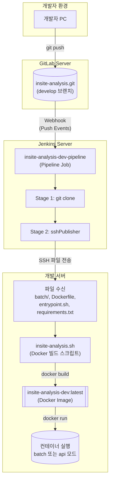
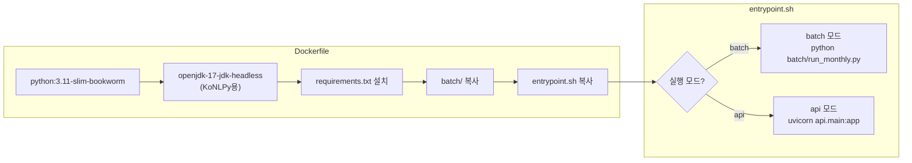

# 목적

GitLab 저장소의 develop 브랜치에 Push가 발생하면, Jenkins가 자동으로 소스 파일을 사내 개발 서버로 전송하고 Docker 이미지를 빌드하는 CI/CD 파이프라인을 구축한다.

본 문서는 **sshPublisher 플러그인**을 사용한 파일 전송 방식과 **batch/api 듀얼 모드** Docker 이미지 구성을 다루며, 월간 배치 작업을 위한 Cron 설정까지 포함한다.

본 문서의 모든 IP/경로/인증정보는 블로그 공개를 위해 플레이스홀더로 마스킹했다.

---

# 민감정보 마스킹 규칙

| 원본 유형 | 마스킹 |
|----------|--------|
| GitLab 서버 IP | `<GITLAB_SERVER_IP>` |
| Jenkins 서버 IP | `<JENKINS_SERVER_IP>` |
| 개발 서버 IP | `<DEV_SERVER_IP>` |
| 프로젝트 경로 | `<PROJECT_PATH>` |
| Jenkins Credentials ID | `<JENKINS_CREDENTIAL_ID>` |
| SSH Config Name | `<SSH_CONFIG_NAME>` |
| Dooray Webhook URL | `<DOORAY_WEBHOOK_URL>` |

---

# 환경 정보 요약

## 서버 구성

| 역할 | IP | OS | 주요 소프트웨어 |
|------|-----|-----|----------------|
| GitLab | `<GITLAB_SERVER_IP>` | - | GitLab CE |
| Jenkins | `<JENKINS_SERVER_IP>` | - | Jenkins, sshPublisher 플러그인 |
| 개발 서버 | `<DEV_SERVER_IP>` | Ubuntu 20.04.5 | Docker 26.1.3 |

## 프로젝트 구조

```
<PROJECT_PATH>/
├── .env.dev                 # 환경변수 파일
├── Dockerfile               # Docker 이미지 빌드 정의
├── entrypoint.sh            # 컨테이너 실행 모드 선택 (batch/api)
├── requirements.txt         # Python 패키지 목록
├── insite-analysis.sh       # Docker 빌드 스크립트
├── cron_monthly.sh          # 월간 배치 실행 스크립트
├── batch/                   # 배치 처리 코드
│   └── run_monthly.py       # 배치 메인 스크립트
├── output/                  # 출력 파일 (볼륨 마운트)
├── logs/                    # 로그 파일 (볼륨 마운트)
├── fonts/                   # 폰트 파일 (볼륨 마운트)
└── .credentials/            # 인증 파일 (볼륨 마운트)
```

---

# 아키텍처

## 전체 배포 흐름



## Docker 이미지 구조



---

# 사전 준비

## 1. Jenkins 플러그인 설치

**Publish Over SSH** 플러그인이 필요하다.

Jenkins 관리 → Plugins → Available plugins → "Publish Over SSH" 검색 및 설치

## 2. Jenkins SSH 서버 설정

Jenkins 관리 → System → Publish over SSH 섹션에서 개발 서버 정보를 등록한다.

| 항목 | 값 |
|------|-----|
| Name | `<SSH_CONFIG_NAME>` |
| Hostname | `<DEV_SERVER_IP>` |
| Username | (서버 접속 계정) |
| Remote Directory | `/` |

## 3. 개발 서버 Docker 설치

```bash
# Ubuntu 20.04 기준
sudo apt-get update
sudo apt-get install -y docker.io
sudo systemctl enable docker
sudo systemctl start docker

# 버전 확인
docker --version
# Docker version 26.1.3
```

---

# 구성 절차

## 1. 사내 서버 디렉토리 생성

```bash
# 개발 서버에서 실행
mkdir -p <PROJECT_PATH>
mkdir -p <PROJECT_PATH>/output
mkdir -p <PROJECT_PATH>/logs
mkdir -p <PROJECT_PATH>/fonts
mkdir -p <PROJECT_PATH>/.credentials
```

## 2. Dockerfile 작성

프로젝트 루트에 `Dockerfile`을 생성한다.

```dockerfile
FROM python:3.11-slim-bookworm

# KoNLPy용 Java 설치
RUN apt-get update && apt-get install -y \
    openjdk-17-jdk-headless \
    && rm -rf /var/lib/apt/lists/*

ENV JAVA_HOME=/usr/lib/jvm/java-17-openjdk-amd64

WORKDIR /app

# 패키지 설치
COPY requirements.txt .
RUN pip install --no-cache-dir -r requirements.txt

# 소스 복사
COPY batch/ ./batch/
# COPY api/ ./api/  # 향후 API 추가 시

# 엔트리포인트 (CRLF → LF 변환)
COPY entrypoint.sh .
RUN sed -i 's/\r$//' entrypoint.sh && chmod +x entrypoint.sh

EXPOSE 8000

ENTRYPOINT ["./entrypoint.sh"]
```

### 주요 포인트

| 항목 | 설명 |
|------|------|
| Base Image | `python:3.11-slim-bookworm` - 경량 Python 이미지 |
| Java 설치 | KoNLPy(한국어 NLP 라이브러리)가 JDK를 필요로 함 |
| CRLF → LF | Windows에서 작성 시 줄바꿈 문자 이슈 방지 |
| ENTRYPOINT | 컨테이너 실행 시 모드 선택 가능 (batch/api) |

## 3. entrypoint.sh 작성

컨테이너 실행 모드를 선택하는 스크립트이다.

```bash
#!/bin/bash
set -e

case "$1" in
    batch)
        shift
        exec python batch/run_monthly.py "$@"
        ;;
    api)
        shift
        exec uvicorn api.main:app --host 0.0.0.0 --port 8000 "$@"
        ;;
    *)
        echo "Usage: docker run <image> [batch|api] [args...]"
        echo "  batch: 월간 VOC 분석 배치 실행"
        echo "  api:   API 서버 실행 (포트 8000)"
        exit 1
        ;;
esac
```

### 실행 예시

```bash
# 배치 실행 (실행 후 종료)
docker run --rm --env-file .env.dev insite-analysis-dev:latest batch --all-buildings

# API 서버 실행 (백그라운드)
docker run -d --env-file .env.dev -p 8000:8000 insite-analysis-dev:latest api
```

## 4. Docker 빌드 스크립트 작성

개발 서버에 `insite-analysis.sh`를 생성한다.

```bash
#!/bin/bash
cd <PROJECT_PATH>

# 기존 컨테이너 정지 및 삭제
docker stop insite-analysis-dev || true
docker rm insite-analysis-dev || true

# 이미지 빌드
docker build -t insite-analysis-dev:latest .

echo "Deploy completed: $(date)"
```

권한 부여:
```bash
chmod +x <PROJECT_PATH>/insite-analysis.sh
```

## 5. Jenkins 파이프라인 생성

Jenkins → 새 Item → Pipeline 선택 → `insite-analysis-dev-pipeline` 생성

Pipeline 스크립트:

```groovy
pipeline {
    agent any
    stages {
        stage('git clone') {
            steps {
                git branch: 'develop',
                    credentialsId: '<JENKINS_CREDENTIAL_ID>',
                    url: 'http://<GITLAB_SERVER_IP>/csp/insite-analysis.git'
            }
        }
        stage('server deploy') {
            steps {
                sshPublisher(
                    publishers: [
                        sshPublisherDesc(
                            configName: '<SSH_CONFIG_NAME>',
                            transfers: [
                                sshTransfer(
                                    sourceFiles: 'batch/**,Dockerfile,entrypoint.sh,requirements.txt,.env.dev',
                                    remoteDirectory: '<PROJECT_PATH>',
                                    execCommand: '<PROJECT_PATH>/insite-analysis.sh',
                                    execTimeout: 600000
                                )
                            ],
                            verbose: true
                        )
                    ]
                )
            }
        }
    }
}
```

### 파이프라인 설명

| Stage | 동작 |
|-------|------|
| git clone | GitLab에서 develop 브랜치 체크아웃 |
| server deploy | sshPublisher로 파일 전송 후 빌드 스크립트 실행 |

### sshTransfer 옵션

| 옵션 | 값 | 설명 |
|------|-----|------|
| sourceFiles | `batch/**,Dockerfile,...` | 전송할 파일 패턴 |
| remoteDirectory | `<PROJECT_PATH>` | 원격 서버 대상 경로 |
| execCommand | `insite-analysis.sh` | 전송 후 실행할 명령 |
| execTimeout | 600000 | 타임아웃 (10분) |

## 6. GitLab Webhook 설정

GitLab → 프로젝트 → Settings → Webhooks

| 항목 | 값 |
|------|-----|
| URL | `http://<JENKINS_SERVER_IP>:18080/project/insite-analysis-dev-pipeline` |
| Trigger | Push Events |
| Branch filter | `develop` |

### 추가 Webhook (선택)

MR 승인 워크플로우용:

| Trigger | URL | 용도 |
|---------|-----|------|
| Merge Request Events | `http://<DEV_SERVER_IP>:3456/webhook/mr` | MR 승인 업무 생성 |
| Merge Request Events | `<DOORAY_WEBHOOK_URL>` | 채널 알림 |

## 7. 월간 배치 Cron 설정

### cron_monthly.sh 작성

```bash
#!/bin/bash
BASE_DIR="<PROJECT_PATH>"

docker run --rm --env-file ${BASE_DIR}/.env.dev \
  -v ${BASE_DIR}/output:/app/output \
  -v ${BASE_DIR}/logs:/app/logs \
  -v ${BASE_DIR}/.credentials:/app/.credentials \
  -v ${BASE_DIR}/fonts:/app/fonts \
  -v ~/.aws:/root/.aws:ro \
  insite-analysis-dev:latest batch --all-buildings --auto-month --run-id-prefix cron
```

### crontab 등록

```bash
crontab -e
```

추가할 내용 (매월 1일 02:00 KST 실행):
```
0 2 1 * * <PROJECT_PATH>/cron_monthly.sh >> <PROJECT_PATH>/logs/cron_monthly.log 2>&1
```

---

# 동작 검증

## 1. 수동 빌드 테스트

Jenkins → insite-analysis-dev-pipeline → Build Now

Console Output에서 확인:

```
Started by user admin
...
[SSH] Executing command: <PROJECT_PATH>/insite-analysis.sh
...
Deploy completed: Mon Jan 26 10:00:00 KST 2026
Finished: SUCCESS
```

## 2. Webhook 테스트

```bash
# 개발자 PC에서
git add .
git commit -m "test: webhook trigger test"
git push origin develop
```

Jenkins에서 자동 빌드가 시작되는지 확인한다.

## 3. Docker 이미지 확인

```bash
# 개발 서버에서
docker images | grep insite-analysis
# insite-analysis-dev   latest   abc123def456   2 minutes ago   1.2GB
```

## 4. 배치 실행 테스트

```bash
# 개발 서버에서
docker run --rm --env-file <PROJECT_PATH>/.env.dev \
  -v <PROJECT_PATH>/output:/app/output \
  insite-analysis-dev:latest batch --help
```

---

# 트러블슈팅

## sshPublisher 연결 실패

**증상**: `Failed to connect to server`

**해결**:
1. Jenkins → System → Publish over SSH에서 "Test Configuration" 클릭
2. SSH 키 또는 비밀번호 설정 확인
3. 개발 서버 방화벽 22번 포트 오픈 확인

## Docker 빌드 실패

**증상**: `pip install` 단계에서 실패

**해결**:
1. requirements.txt 패키지 버전 호환성 확인
2. 개발 서버 인터넷 연결 확인
3. pip 캐시 문제 시: `docker build --no-cache` 옵션 사용

## entrypoint.sh 실행 오류

**증상**: `exec format error` 또는 `bad interpreter`

**해결**:
- Windows에서 작성 시 CRLF 줄바꿈 문제 발생
- Dockerfile에서 `sed -i 's/\r$//'` 처리가 되어 있는지 확인

---

# 결론

GitLab + Jenkins + Docker 기반 CI/CD 파이프라인을 구축하면 develop 브랜치에 Push만으로 자동 배포가 가능하다.

핵심 포인트:
1. **sshPublisher**: Jenkins에서 원격 서버로 파일 전송 및 스크립트 실행
2. **듀얼 모드 Docker**: entrypoint.sh로 batch/api 모드 선택
3. **Cron 연동**: 월간 배치 작업 자동화

향후 stage/prod 환경은 ECR + SSM 기반으로 별도 파이프라인을 구성할 예정이다.
