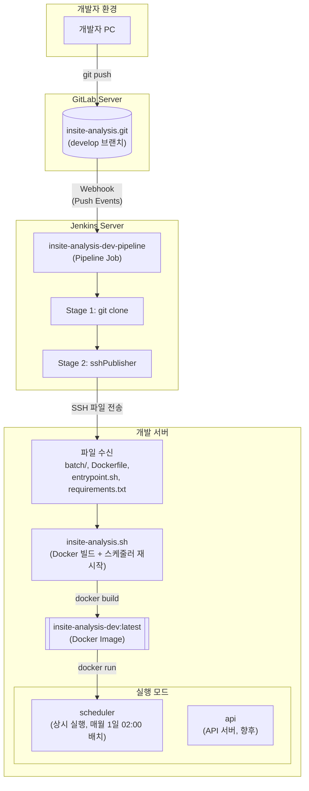
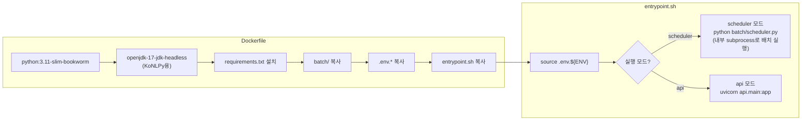

# 목적

GitLab 저장소의 develop 브랜치에 Push가 발생하면, Jenkins가 자동으로 소스 파일을 사내 개발 서버로 전송하고 Docker 이미지를 빌드하는 CI/CD 파이프라인을 구축한다.

본 문서는 **sshPublisher 플러그인**을 사용한 파일 전송 방식과 **batch/scheduler/api 세 가지 모드** Docker 이미지 구성을 다루며, APScheduler 기반 스케줄러 컨테이너를 통한 월간 배치 자동화까지 포함한다.

본 문서의 모든 IP/경로/인증정보는 블로그 공개를 위해 플레이스홀더로 마스킹했다.

---

# 민감정보 마스킹 규칙

| 원본 유형 | 마스킹 |
|----------|--------|
| GitLab 서버 IP | `<GITLAB_SERVER_IP>` |
| Jenkins 서버 IP | `<JENKINS_SERVER_IP>` |
| 개발 서버 IP | `<DEV_SERVER_IP>` |
| 프로젝트 경로 | `<PROJECT_PATH>` |
| Jenkins Credentials ID | `<JENKINS_CREDENTIAL_ID>` |
| SSH Config Name | `<SSH_CONFIG_NAME>` |
| Dooray Webhook URL | `<DOORAY_WEBHOOK_URL>` |

---

# 환경 정보 요약

## 서버 구성

| 역할 | IP | OS | 주요 소프트웨어 |
|------|-----|-----|----------------|
| GitLab | `<GITLAB_SERVER_IP>` | - | GitLab CE |
| Jenkins | `<JENKINS_SERVER_IP>` | - | Jenkins, sshPublisher 플러그인 |
| 개발 서버 | `<DEV_SERVER_IP>` | Ubuntu 20.04.5 | Docker 26.1.3 |

## 프로젝트 구조

```
<PROJECT_PATH>/
├── .dockerignore            # Docker 빌드 제외 파일 목록
├── .env.dev                 # 환경변수 파일
├── Dockerfile               # Docker 이미지 빌드 정의
├── entrypoint.sh            # 컨테이너 실행 모드 선택 (batch/scheduler/api)
├── requirements.txt         # Python 패키지 목록
├── insite-analysis.sh       # Docker 빌드 + 스케줄러 재시작 스크립트
├── batch/                   # 배치 처리 코드
│   ├── run_monthly.py       # 배치 메인 스크립트
│   └── scheduler.py         # APScheduler 기반 월간 스케줄러
├── output/                  # 출력 파일 (볼륨 마운트)
├── logs/                    # 로그 파일 (볼륨 마운트)
├── fonts/                   # 폰트 파일 (볼륨 마운트)
└── .credentials/            # 인증 파일 (볼륨 마운트)
```

---

# 아키텍처

## 전체 배포 흐름



## Docker 이미지 구조



---

# 사전 준비

## 1. Jenkins 플러그인 설치

**Publish Over SSH** 플러그인이 필요하다.

Jenkins 관리 → Plugins → Available plugins → "Publish Over SSH" 검색 및 설치

## 2. Jenkins SSH 서버 설정

Jenkins 관리 → System → Publish over SSH 섹션에서 개발 서버 정보를 등록한다.

| 항목 | 값 |
|------|-----|
| Name | `<SSH_CONFIG_NAME>` |
| Hostname | `<DEV_SERVER_IP>` |
| Username | (서버 접속 계정) |
| Remote Directory | `/` |

## 3. requirements.txt에 APScheduler 추가

스케줄러 모드를 사용하려면 APScheduler 패키지가 필요하다.

```
# requirements.txt에 추가
APScheduler
```

## 4. 개발 서버 Docker 설치

```bash
# Ubuntu 20.04 기준
sudo apt-get update
sudo apt-get install -y docker.io
sudo systemctl enable docker
sudo systemctl start docker

# 버전 확인
docker --version
# Docker version 26.1.3
```

---

# 구성 절차

## 1. 사내 서버 디렉토리 생성

```bash
# 개발 서버에서 실행
mkdir -p <PROJECT_PATH>
mkdir -p <PROJECT_PATH>/output
mkdir -p <PROJECT_PATH>/logs
mkdir -p <PROJECT_PATH>/fonts
mkdir -p <PROJECT_PATH>/.credentials
```

## 2. Dockerfile 작성

프로젝트 루트에 `Dockerfile`을 생성한다.

```dockerfile
FROM python:3.11-slim-bookworm

# KoNLPy용 Java 및 한글 폰트 설치
RUN apt-get update && apt-get install -y \
    openjdk-17-jdk-headless \
    fonts-nanum \
    fontconfig \
    && fc-cache -fv \
    && rm -rf /var/lib/apt/lists/*

ENV JAVA_HOME=/usr/lib/jvm/java-17-openjdk-amd64

WORKDIR /app

# 패키지 설치
COPY requirements.txt .
RUN pip install --no-cache-dir -r requirements.txt

# 소스 복사
COPY batch/ ./batch/
# COPY api/ ./api/  # 향후 API 추가 시

# 환경설정 복사 (CRLF → LF 변환)
COPY .env.* ./
RUN sed -i 's/\r$//' .env.*

# 엔트리포인트 (CRLF → LF 변환)
COPY entrypoint.sh .
RUN sed -i 's/\r$//' entrypoint.sh && chmod +x entrypoint.sh

EXPOSE 8000

ENTRYPOINT ["./entrypoint.sh"]
```

### 주요 포인트

| 항목 | 설명 |
|------|------|
| Base Image | `python:3.11-slim-bookworm` - 경량 Python 이미지 |
| Java 설치 | KoNLPy(한국어 NLP 라이브러리)가 JDK를 필요로 함 |
| 한글 폰트 | `fonts-nanum` - HTML 리포트 생성 시 한글 렌더링용 |
| .env.* 복사 | 환경별 설정 파일을 이미지에 포함 |
| CRLF → LF | Windows에서 작성 시 줄바꿈 문자 이슈 방지 |
| ENTRYPOINT | 컨테이너 실행 시 모드 선택 가능 (batch/scheduler/api) |

## 3. .dockerignore 작성

Docker 빌드 시 제외할 파일을 정의한다. `.env.dev`, `.env.stg`, `.env.prd`는 이미지에 포함되어야 하므로 제외하지 않는다.

```
.git
.gitignore
.dockerignore
Dockerfile
*.md

# Python
__pycache__/
*.pyc
*.pyo
.venv/
venv/

# 환경설정 (.env.local만 제외, .env.dev/.stg/.prd는 포함)
.env
.env.local

# 로컬 출력물
output/
logs/

# IDE
.idea/
*.iml
.vscode/
```

### 포인트

| 파일 | Docker 이미지 포함 여부 |
|------|------------------------|
| `.env.dev`, `.env.stg`, `.env.prd` | O (환경별 설정) |
| `.env`, `.env.local` | X (로컬 전용) |
| `output/`, `logs/` | X (볼륨 마운트) |

## 4. entrypoint.sh 작성

컨테이너 실행 모드를 선택하고 환경변수를 로딩하는 스크립트이다.

```bash
#!/bin/bash
set -e

# ENV 환경변수 기반으로 .env 파일 로딩
if [ -n "${ENV:-}" ] && [ -f "/app/.env.${ENV}" ]; then
    echo "Loading environment: ${ENV}"
    set -a
    source "/app/.env.${ENV}"
    set +a
fi

case "$1" in
    batch)
        shift
        exec python batch/run_monthly.py "$@"
        ;;
    scheduler)
        shift
        exec python -m batch.scheduler "$@"
        ;;
    api)
        shift
        exec uvicorn api.main:app --host 0.0.0.0 --port 8000 "$@"
        ;;
    *)
        echo "Usage: docker run -e ENV=dev <image> [batch|scheduler|api] [args...]"
        echo "  batch:     월간 VOC 분석 배치 실행"
        echo "  scheduler: APScheduler 기반 월간 스케줄러 (계속 실행)"
        echo "  api:       API 서버 실행 (포트 8000)"
        exit 1
        ;;
esac
```

### 환경변수 로딩 방식

| 항목 | 설명 |
|------|------|
| ENV 변수 | `docker run -e ENV=dev`로 환경 지정 |
| .env 파일 | Docker 이미지 내 `/app/.env.${ENV}` 파일을 source |
| set -a | source한 변수를 export하여 Python에서 `os.getenv()`로 접근 가능 |

### 실행 예시

```bash
# 배치 실행 (실행 후 종료)
docker run --rm -e ENV=dev insite-analysis-dev:latest batch --all-buildings

# 스케줄러 실행 (계속 실행, 매월 1일 02:00 KST 자동 배치)
docker run -d --name insite-scheduler -e ENV=dev insite-analysis-dev:latest scheduler

# API 서버 실행 (백그라운드)
docker run -d -e ENV=dev -p 8000:8000 insite-analysis-dev:latest api
```

## 5. scheduler.py 작성

APScheduler 기반 월간 스케줄러이다. 컨테이너가 계속 실행되면서 매월 1일 02:00 KST에 배치를 자동 실행한다.

```python
#!/usr/bin/env python3
"""
VOC 분석 스케줄러
매월 1일 02:00 KST에 전체 빌딩 배치 실행
"""
import subprocess
import logging
from datetime import datetime
from apscheduler.schedulers.blocking import BlockingScheduler
from apscheduler.triggers.cron import CronTrigger

logging.basicConfig(
    level=logging.INFO,
    format='%(asctime)s - %(levelname)s - %(message)s'
)
logger = logging.getLogger(__name__)


def run_batch():
    """전체 빌딩 배치 실행"""
    logger.info("=" * 50)
    logger.info("Starting monthly batch job...")

    run_id = f"scheduler_{datetime.now().strftime('%Y%m%d_%H%M%S')}"

    cmd = [
        "python", "-m", "batch.run_monthly",
        "--all-buildings",
        "--auto-month",
        "--run-id-prefix", run_id
    ]

    logger.info(f"Command: {' '.join(cmd)}")

    try:
        result = subprocess.run(cmd, capture_output=True, text=True)
        logger.info(f"Batch completed. Return code: {result.returncode}")
        if result.stdout:
            logger.info(f"Output (last 2000 chars):\n{result.stdout[-2000:]}")
        if result.returncode != 0 and result.stderr:
            logger.error(f"Error:\n{result.stderr[-2000:]}")
    except Exception as e:
        logger.error(f"Batch failed with exception: {e}")

    logger.info("=" * 50)


def main():
    scheduler = BlockingScheduler(timezone="Asia/Seoul")

    # 매월 1일 02:00 KST
    scheduler.add_job(
        run_batch,
        CronTrigger(day=1, hour=2, minute=0),
        id="monthly_batch",
        name="Monthly VOC Analysis Batch"
    )

    logger.info("=" * 50)
    logger.info("VOC Analysis Scheduler Started")
    logger.info("Schedule: Every 1st day of month at 02:00 KST")
    logger.info("=" * 50)

    try:
        scheduler.start()
    except (KeyboardInterrupt, SystemExit):
        logger.info("Scheduler stopped.")


if __name__ == "__main__":
    main()
```

### APScheduler vs Cron 비교

| 항목 | Cron (전통 방식) | APScheduler (채택) |
|------|-------------|-------------------|
| 설정 위치 | 호스트 crontab | Python 코드 내 |
| 컨테이너 | 매번 새로 생성 | 스케줄러 컨테이너 상시 실행 |
| 로그 관리 | cron 로그 파일 | Docker 로그 (`docker logs`) |
| 재배포 시 | crontab 수동 등록 필요 | 스크립트가 자동 재시작 |
| 타임존 | 서버 시스템 시간 | 코드에서 명시적 지정 (KST) |

## 6. Docker 빌드 스크립트 작성

개발 서버에 `insite-analysis.sh`를 생성한다. 배포 시 스케줄러 컨테이너를 자동으로 재시작한다.

```bash
#!/bin/bash
cd <PROJECT_PATH>

# 기존 스케줄러 컨테이너 정지 및 삭제
docker stop insite-scheduler 2>/dev/null || true
docker rm insite-scheduler 2>/dev/null || true

# 이미지 빌드 (캐시 문제 시 --no-cache 옵션 사용)
docker build -t insite-analysis-dev:latest .

# 스케줄러 컨테이너 시작
docker run -d --name insite-scheduler -e ENV=dev \
  -v <PROJECT_PATH>/output:/app/output \
  -v <PROJECT_PATH>/logs:/app/logs \
  -v <PROJECT_PATH>/.credentials:/app/.credentials \
  -v <PROJECT_PATH>/fonts:/app/fonts \
  -v ~/.aws:/root/.aws:ro \
  insite-analysis-dev:latest scheduler

echo "Deploy completed: $(date)"
```

권한 부여:
```bash
chmod +x <PROJECT_PATH>/insite-analysis.sh
```

### 스크립트 동작

1. 기존 `insite-scheduler` 컨테이너 정지 및 삭제
2. Docker 이미지 새로 빌드
3. 스케줄러 컨테이너 백그라운드 실행 (`-d`)
4. 스케줄러가 매월 1일 02:00 KST에 배치 자동 실행

## 7. Jenkins 파이프라인 생성

Jenkins → 새 Item → Pipeline 선택 → `insite-analysis-dev-pipeline` 생성

Pipeline 스크립트:

```groovy
pipeline {
    agent any
    stages {
        stage('git clone') {
            steps {
                git branch: 'develop',
                    credentialsId: '<JENKINS_CREDENTIAL_ID>',
                    url: 'http://<GITLAB_SERVER_IP>/csp/insite-analysis.git'
            }
        }
        stage('server deploy') {
            steps {
                sshPublisher(
                    publishers: [
                        sshPublisherDesc(
                            configName: '<SSH_CONFIG_NAME>',
                            transfers: [
                                sshTransfer(
                                    sourceFiles: 'batch/**,Dockerfile,entrypoint.sh,requirements.txt,.env.dev',
                                    remoteDirectory: '<PROJECT_PATH>',
                                    execCommand: '<PROJECT_PATH>/insite-analysis.sh',
                                    execTimeout: 600000
                                )
                            ],
                            verbose: true
                        )
                    ]
                )
            }
        }
    }
}
```

### 파이프라인 설명

| Stage | 동작 |
|-------|------|
| git clone | GitLab에서 develop 브랜치 체크아웃 |
| server deploy | sshPublisher로 파일 전송 후 빌드 스크립트 실행 |

### sshTransfer 옵션

| 옵션 | 값 | 설명 |
|------|-----|------|
| sourceFiles | `batch/**,Dockerfile,...` | 전송할 파일 패턴 |
| remoteDirectory | `<PROJECT_PATH>` | 원격 서버 대상 경로 |
| execCommand | `insite-analysis.sh` | 전송 후 실행할 명령 |
| execTimeout | 600000 | 타임아웃 (10분) |

## 8. GitLab Webhook 설정

GitLab → 프로젝트 → Settings → Webhooks

| 항목 | 값 |
|------|-----|
| URL | `http://<JENKINS_SERVER_IP>:18080/project/insite-analysis-dev-pipeline` |
| Trigger | Push Events |
| Branch filter | `develop` |

### 추가 Webhook (선택)

MR 승인 워크플로우용:

| Trigger | URL | 용도 |
|---------|-----|------|
| Merge Request Events | `http://<DEV_SERVER_IP>:3456/webhook/mr` | MR 승인 업무 생성 |
| Merge Request Events | `<DOORAY_WEBHOOK_URL>` | 채널 알림 |

---

# 동작 검증

## 1. 수동 빌드 테스트

Jenkins → insite-analysis-dev-pipeline → Build Now

Console Output에서 확인:

```
Started by user admin
...
[SSH] Executing command: <PROJECT_PATH>/insite-analysis.sh
...
Deploy completed: Mon Jan 26 10:00:00 KST 2026
Finished: SUCCESS
```

## 2. Webhook 테스트

```bash
# 개발자 PC에서
git add .
git commit -m "test: webhook trigger test"
git push origin develop
```

Jenkins에서 자동 빌드가 시작되는지 확인한다.

## 3. Docker 이미지 확인

```bash
# 개발 서버에서
docker images | grep insite-analysis
# insite-analysis-dev   latest   abc123def456   2 minutes ago   1.2GB
```

## 4. 스케줄러 컨테이너 확인

```bash
# 개발 서버에서
docker ps | grep insite-scheduler
# 컨테이너가 실행 중인지 확인

docker logs insite-scheduler
# Scheduler started. Waiting for scheduled jobs...
# Next run: 1st day of each month at 02:00 KST
```

## 5. 배치 실행 테스트

```bash
# 개발 서버에서 (수동 배치 실행)
docker run --rm -e ENV=dev \
  -v <PROJECT_PATH>/output:/app/output \
  -v <PROJECT_PATH>/logs:/app/logs \
  -v <PROJECT_PATH>/.credentials:/app/.credentials \
  -v <PROJECT_PATH>/fonts:/app/fonts \
  -v ~/.aws:/root/.aws:ro \
  insite-analysis-dev:latest batch --help
```

---

# 트러블슈팅

## sshPublisher 연결 실패

**증상**: `Failed to connect to server`

**해결**:
1. Jenkins → System → Publish over SSH에서 "Test Configuration" 클릭
2. SSH 키 또는 비밀번호 설정 확인
3. 개발 서버 방화벽 22번 포트 오픈 확인

## Docker 빌드 실패

**증상**: `pip install` 단계에서 실패

**해결**:
1. requirements.txt 패키지 버전 호환성 확인
2. 개발 서버 인터넷 연결 확인
3. pip 캐시 문제 시: `docker build --no-cache` 옵션 사용

## entrypoint.sh 실행 오류

**증상**: `exec format error` 또는 `bad interpreter`

**해결**:
- Windows에서 작성 시 CRLF 줄바꿈 문제 발생
- Dockerfile에서 `sed -i 's/\r$//'` 처리가 되어 있는지 확인

## 환경변수 로딩 안 됨

**증상**: Python에서 `os.getenv()`가 None 반환

**해결**:
1. Docker 실행 시 `-e ENV=dev` 옵션 확인
2. `.env.dev` 파일이 Docker 이미지에 포함되었는지 확인: `docker run --rm --entrypoint cat <image> /app/.env.dev`
3. entrypoint.sh에서 `set -a` / `set +a`로 export 처리 확인

## 스케줄러 컨테이너가 종료됨

**증상**: `docker ps`에서 insite-scheduler가 보이지 않음

**해결**:
1. `docker logs insite-scheduler` 또는 `docker logs $(docker ps -a -q --filter name=insite-scheduler)`로 로그 확인
2. APScheduler 또는 Python 코드 오류 확인
3. 수동 재시작: `docker start insite-scheduler` 또는 빌드 스크립트 재실행

---

# 결론

GitLab + Jenkins + Docker 기반 CI/CD 파이프라인을 구축하면 develop 브랜치에 Push만으로 자동 배포가 가능하다.

핵심 포인트:
1. **sshPublisher**: Jenkins에서 원격 서버로 파일 전송 및 스크립트 실행
2. **세 가지 실행 모드**: entrypoint.sh로 batch/scheduler/api 모드 선택
3. **APScheduler 스케줄러**: 컨테이너 기반 월간 배치 자동화 (Cron 불필요)
4. **환경변수 로딩**: Docker 이미지에 .env.* 포함, `-e ENV=dev`로 환경 지정

향후 stage/prod 환경은 ECR + SSM 기반으로 별도 파이프라인을 구성할 예정이다.
