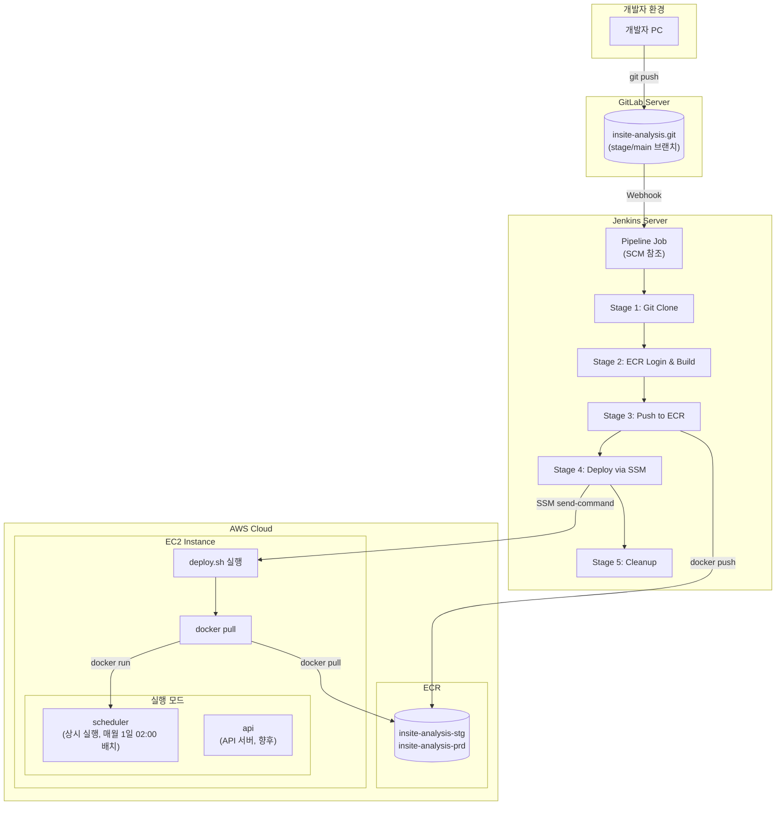

# 목적

GitLab 저장소의 stage/main 브랜치에 Push가 발생하면, Jenkins가 자동으로 Docker 이미지를 빌드하여 ECR에 푸시하고, SSM을 통해 EC2에 배포하는 CI/CD 파이프라인을 구축한다.

본 문서는 **ECR(Elastic Container Registry)**을 사용한 Docker 이미지 관리와 **SSM(Systems Manager)**을 통한 EC2 배포 방식을 다루며, 스테이징/운영 환경 분리 구성을 포함한다.

개발서버 CI/CD 구축은 [이전 포스트](/devops/ci/cd/docker/cicd-python/)를 참고한다.

본 문서의 모든 IP/경로/인증정보는 블로그 공개를 위해 플레이스홀더로 마스킹했다.

---

# 민감정보 마스킹 규칙

| 원본 유형 | 마스킹 |
|----------|--------|
| GitLab 서버 IP | `<GITLAB_SERVER_IP>` |
| Jenkins 서버 IP | `<JENKINS_SERVER_IP>` |
| AWS 계정 ID | `<AWS_ACCOUNT_ID>` |
| ECR 레지스트리 | `<ECR_REGISTRY>` |
| EC2 인스턴스 ID (스테이징) | `<EC2_INSTANCE_ID_STG>` |
| EC2 인스턴스 ID (운영) | `<EC2_INSTANCE_ID_PRD>` |
| Jenkins Credentials ID | `<JENKINS_CREDENTIAL_ID>` |
| AWS Credentials ID | `<AWS_CREDENTIAL_ID>` |

---

# 환경 정보 요약

## 서버 구성

| 역할 | 환경 | 브랜치 | OS | Docker |
|------|------|--------|-----|--------|
| GitLab | - | - | - | - |
| Jenkins | - | - | Windows | Docker Desktop |
| EC2 (스테이징) | stage | stage | Amazon Linux 2023 | 20.10.25 |
| EC2 (운영) | prod | main | Amazon Linux 2023 | 20.10.25 |

## ECR 레포지토리

| 환경 | 레포지토리 |
|------|-----------|
| 스테이징 | `<ECR_REGISTRY>/insite-analysis-stg` |
| 운영 | `<ECR_REGISTRY>/insite-analysis-prd` |

## 배포 경로

| 환경 | EC2 경로 |
|------|----------|
| 스테이징/운영 | `/home/ssm-user/jupyter/insite-analysis` |

---

# 아키텍처

## 전체 배포 흐름



## 개발서버 vs 스테이징/운영 비교

| 항목 | 개발서버 | 스테이징/운영 |
|------|---------|--------------|
| 이미지 저장소 | 로컬 (서버 빌드) | ECR |
| 파일 전송 | sshPublisher | - (ECR pull) |
| 배포 방식 | SSH | SSM |
| Jenkins 파이프라인 | 직접 스크립트 | SCM 참조 (groovy 파일) |

---

# 사전 준비

## 1. ECR 레포지토리 생성

AWS Console → ECR → Create repository

| 환경 | 레포지토리 이름 |
|------|----------------|
| 스테이징 | `insite-analysis-stg` |
| 운영 | `insite-analysis-prd` |

설정:
- Visibility: Private
- Image tag mutability: Mutable
- Scan on push: Disabled (선택)

## 2. EC2 Docker 설치

```bash
# Amazon Linux 2023 기준
sudo yum update -y
sudo yum install -y docker
sudo systemctl enable docker
sudo systemctl start docker

# 버전 확인
docker --version
# Docker version 20.10.25
```

## 3. EC2 IAM 역할 설정

EC2 인스턴스에 다음 권한이 필요하다:
- `AmazonEC2RoleforSSM` (SSM 접근)
- `AmazonEC2ContainerRegistryReadOnly` (ECR pull)

## 4. Jenkins AWS Credentials 설정

Jenkins 관리 → Credentials → System → Global credentials

| 항목 | 값 |
|------|-----|
| Kind | AWS Credentials |
| ID | `<AWS_CREDENTIAL_ID>` |
| Access Key ID | (IAM 사용자 Access Key) |
| Secret Access Key | (IAM 사용자 Secret Key) |

필요한 IAM 권한:
- `ecr:GetAuthorizationToken`
- `ecr:BatchCheckLayerAvailability`
- `ecr:GetDownloadUrlForLayer`
- `ecr:BatchGetImage`
- `ecr:PutImage`
- `ecr:InitiateLayerUpload`
- `ecr:UploadLayerPart`
- `ecr:CompleteLayerUpload`
- `ssm:SendCommand`
- `ssm:GetCommandInvocation`

## 5. Jenkins Pipeline 저장소 설정

파이프라인 스크립트를 별도 Git 저장소에서 관리한다.

```
pipeline.git/
└── insite-analysis/
    ├── stg/
    │   └── insite-analysis-stg.groovy
    └── prd/
        └── insite-analysis-prd.groovy
```

---

# 구성 절차

## 1. EC2 디렉토리 생성

```bash
# EC2에서 실행
mkdir -p /home/ssm-user/jupyter/insite-analysis
mkdir -p /home/ssm-user/jupyter/insite-analysis/output
mkdir -p /home/ssm-user/jupyter/insite-analysis/logs
mkdir -p /home/ssm-user/jupyter/insite-analysis/.credentials
```

## 2. deploy.sh 작성

EC2에 배포 스크립트를 생성한다. Jenkins가 SSM을 통해 이 스크립트를 실행한다.

### 스테이징용 deploy.sh

```bash
#!/bin/bash
set -e

DEPLOY_PATH="/home/ssm-user/jupyter/insite-analysis"
ECR_REGISTRY="<ECR_REGISTRY>"
IMAGE_NAME="insite-analysis-stg"

cd ${DEPLOY_PATH}

# ECR 로그인
aws ecr get-login-password --region ap-northeast-2 | sudo docker login --username AWS --password-stdin ${ECR_REGISTRY}

# 이미지 pull
sudo docker pull ${ECR_REGISTRY}/${IMAGE_NAME}:latest
sudo docker tag ${ECR_REGISTRY}/${IMAGE_NAME}:latest ${IMAGE_NAME}:latest

# 기존 스케줄러 컨테이너 정지 및 삭제
sudo docker stop insite-scheduler 2>/dev/null || true
sudo docker rm insite-scheduler 2>/dev/null || true

# 스케줄러 컨테이너 시작
sudo docker run -d --name insite-scheduler -e ENV=stg \
  -v ${DEPLOY_PATH}/output:/app/output \
  -v ${DEPLOY_PATH}/logs:/app/logs \
  -v ${DEPLOY_PATH}/.credentials:/app/.credentials \
  -v ~/.aws:/root/.aws:ro \
  ${IMAGE_NAME}:latest scheduler

# dangling 이미지 정리
sudo docker images | grep "<none>" | awk '{print $3}' | xargs -r sudo docker rmi -f || true

echo "Deploy completed: $(date)"
```

### 운영용 deploy.sh

스테이징과 동일하되 `IMAGE_NAME`과 `ENV`만 변경:

```bash
IMAGE_NAME="insite-analysis-prd"
# ...
sudo docker run -d --name insite-scheduler -e ENV=prd \
```

권한 부여:
```bash
chmod +x /home/ssm-user/jupyter/insite-analysis/deploy.sh
```

## 3. .credentials 배치

Google Sheets API 등 인증 파일을 배치한다.

```bash
# .credentials 폴더에 인증 파일 복사
ls /home/ssm-user/jupyter/insite-analysis/.credentials/
# credentials.json (Google Sheets API)
```

## 4. Jenkins 파이프라인 groovy 작성

Jenkins에서 **Pipeline script from SCM** 방식을 사용하면 파이프라인 스크립트를 Git 저장소에서 관리할 수 있다.

- **SCM(Source Code Management)**: Git 같은 버전 관리 시스템
- **장점**: 파이프라인 변경 이력 추적, 코드 리뷰 가능, 여러 프로젝트에서 재사용

groovy 파일을 별도의 pipeline.git 저장소에 저장하고, Jenkins가 빌드 시 이 파일을 참조한다.

### 스테이징 파이프라인 (insite-analysis-stg.groovy)

```groovy
pipeline {
    agent any

    environment {
        AWS_DEFAULT_REGION = 'ap-northeast-2'
        AWS_ACCOUNT_ID = '<AWS_ACCOUNT_ID>'
        ECR_REGISTRY = "${AWS_ACCOUNT_ID}.dkr.ecr.${AWS_DEFAULT_REGION}.amazonaws.com"
        IMAGE_REPO_NAME = 'insite-analysis-stg'
        IMAGE_TAG = 'latest'

        // Git
        APP_GIT_URL = 'http://<GITLAB_SERVER_IP>/csp/insite-analysis.git'
        APP_GIT_BRANCH = 'stage'

        // EC2 배포 대상
        EC2_INSTANCE_ID = '<EC2_INSTANCE_ID_STG>'
        DEPLOY_PATH = '/home/ssm-user/jupyter/insite-analysis'
    }

    stages {
        stage('Git Clone') {
            steps {
                deleteDir()
                checkout([
                    $class: 'GitSCM',
                    branches: [[name: "${APP_GIT_BRANCH}"]],
                    extensions: [[$class: 'CleanBeforeCheckout']],
                    userRemoteConfigs: [[
                        url: APP_GIT_URL,
                        credentialsId: '<JENKINS_CREDENTIAL_ID>'
                    ]]
                ])
            }
        }

        stage('ECR Login & Build Docker Image') {
            steps {
                withCredentials([[$class: 'AmazonWebServicesCredentialsBinding', credentialsId: '<AWS_CREDENTIAL_ID>']]) {
                    bat "aws ecr get-login-password --region ${AWS_DEFAULT_REGION} | docker login --username AWS --password-stdin ${ECR_REGISTRY}"
                    bat "docker build --no-cache -t ${IMAGE_REPO_NAME}:${IMAGE_TAG} ."
                }
            }
        }

        stage('Push to ECR') {
            steps {
                withCredentials([[$class: 'AmazonWebServicesCredentialsBinding', credentialsId: '<AWS_CREDENTIAL_ID>']]) {
                    bat "docker tag ${IMAGE_REPO_NAME}:${IMAGE_TAG} ${ECR_REGISTRY}/${IMAGE_REPO_NAME}:${IMAGE_TAG}"
                    bat "docker push ${ECR_REGISTRY}/${IMAGE_REPO_NAME}:${IMAGE_TAG}"
                }
            }
        }

        stage('Deploy to EC2 via SSM') {
            steps {
                withCredentials([[$class: 'AmazonWebServicesCredentialsBinding', credentialsId: '<AWS_CREDENTIAL_ID>']]) {
                    script {
                        def commandId = bat(
                            script: "aws ssm send-command --instance-ids ${EC2_INSTANCE_ID} --document-name AWS-RunShellScript --parameters commands=[\"bash ${DEPLOY_PATH}/deploy.sh\"] --query Command.CommandId --output text",
                            returnStdout: true
                        ).trim().readLines().last()

                        echo "SSM Command ID: ${commandId}"

                        // Wait for command completion
                        bat "aws ssm wait command-executed --command-id ${commandId} --instance-id ${EC2_INSTANCE_ID} || true"
                    }
                }
            }
        }

        stage('Cleanup Local Images') {
            steps {
                bat "docker rmi ${ECR_REGISTRY}/${IMAGE_REPO_NAME}:${IMAGE_TAG} || true"
                bat "docker rmi ${IMAGE_REPO_NAME}:${IMAGE_TAG} || true"
            }
        }
    }

    post {
        success {
            echo 'Deployment completed successfully'
        }
        failure {
            echo 'Deployment failed'
        }
    }
}
```

### 운영 파이프라인 (insite-analysis-prd.groovy)

스테이징과 동일하되 다음 값만 변경:

```groovy
IMAGE_REPO_NAME = 'insite-analysis-prd'
APP_GIT_BRANCH = 'main'
EC2_INSTANCE_ID = '<EC2_INSTANCE_ID_PRD>'
```

### 파이프라인 Stage 설명

| Stage | 동작 |
|-------|------|
| Git Clone | GitLab에서 stage/main 브랜치 체크아웃 |
| ECR Login & Build | ECR 로그인 후 Docker 이미지 빌드 |
| Push to ECR | 이미지에 태그 추가 후 ECR에 푸시 |
| Deploy to EC2 via SSM | SSM을 통해 EC2의 deploy.sh 실행 |
| Cleanup Local Images | Jenkins 서버의 로컬 이미지 정리 |

## 5. Jenkins 파이프라인 생성

Jenkins → 새 Item → Pipeline 선택

### 스테이징 파이프라인 설정

| 항목 | 값 |
|------|-----|
| 이름 | `insite-analysis-stg-pipeline` |
| Build Triggers | Build when a change is pushed to GitLab |
| - Push Events | ☑ |
| - Opened Merge Request Events | ☑ |
| - Accepted Merge Request Events | ☑ |
| Pipeline Definition | Pipeline script from SCM |
| SCM | Git |
| Repository URL | `http://<GITLAB_SERVER_IP>/csp/pipeline.git` |
| Credentials | `<JENKINS_CREDENTIAL_ID>` |
| Branch | `*/main` |
| Script Path | `insite-analysis/stg/insite-analysis-stg.groovy` |

> **Note**: Branch `*/main`은 pipeline.git 저장소의 브랜치이다. 애플리케이션 소스(insite-analysis.git)의 브랜치는 groovy 파일 내 `APP_GIT_BRANCH`에서 지정한다.

### 운영 파이프라인 설정

스테이징과 동일하되:

| 항목 | 값 |
|------|-----|
| 이름 | `insite-analysis-prd-pipeline` |
| Script Path | `insite-analysis/prd/insite-analysis-prd.groovy` |

## 6. GitLab Webhook 설정

GitLab → 프로젝트 → Settings → Webhooks

### 스테이징 Webhook

| 항목 | 값 |
|------|-----|
| URL | `http://<JENKINS_SERVER_IP>:18080/project/insite-analysis-stg-pipeline` |
| Trigger | Push Events, Merge Request Events |
| Branch filter | `stage` |

### 운영 Webhook

| 항목 | 값 |
|------|-----|
| URL | `http://<JENKINS_SERVER_IP>:18080/project/insite-analysis-prd-pipeline` |
| Trigger | Push Events, Merge Request Events |
| Branch filter | `main` |

---

# 동작 검증

## 1. 수동 빌드 테스트

Jenkins → insite-analysis-stg-pipeline → Build Now

Console Output에서 확인:

```
[Pipeline] stage (Git Clone)
...
[Pipeline] stage (ECR Login & Build Docker Image)
...
[Pipeline] stage (Push to ECR)
...
[Pipeline] stage (Deploy to EC2 via SSM)
SSM Command ID: abc123-def456-...
...
Deployment completed successfully
```

## 2. ECR 이미지 확인

```bash
# AWS CLI로 확인
aws ecr describe-images --repository-name insite-analysis-stg --region ap-northeast-2
```

또는 AWS Console → ECR → insite-analysis-stg에서 이미지 확인

## 3. EC2 컨테이너 확인

```bash
# EC2에서 실행
sudo docker ps | grep insite-scheduler
# 컨테이너가 실행 중인지 확인

sudo docker logs insite-scheduler
# ==================================================
# VOC Analysis Scheduler Started
# Schedule: Every 1st day of month at 02:00 KST
# ==================================================
```

## 4. 배치 수동 실행 테스트

```bash
# 스테이징
sudo docker run --rm -e ENV=stg \
  -v /home/ssm-user/jupyter/insite-analysis/output:/app/output \
  -v /home/ssm-user/jupyter/insite-analysis/logs:/app/logs \
  -v /home/ssm-user/jupyter/insite-analysis/.credentials:/app/.credentials \
  -v ~/.aws:/root/.aws:ro \
  insite-analysis-stg:latest batch --help
```

---

# 트러블슈팅

## ECR 로그인 실패

**증상**: `no basic auth credentials`

**해결**:
1. AWS Credentials가 Jenkins에 올바르게 설정되었는지 확인
2. IAM 사용자에 ECR 권한이 있는지 확인
3. 토큰 만료 시 재로그인 필요 (12시간 유효)

## SSM 명령 실패

**증상**: `InvalidInstanceId` 또는 타임아웃

**해결**:
1. EC2 인스턴스에 SSM Agent가 설치/실행 중인지 확인: `sudo systemctl status amazon-ssm-agent`
2. EC2 IAM 역할에 `AmazonEC2RoleforSSM` 정책이 있는지 확인
3. EC2가 SSM 엔드포인트에 접근 가능한지 확인 (VPC 엔드포인트 또는 인터넷 게이트웨이)

## Docker pull 권한 오류

**증상**: `denied: Your authorization token has expired`

**해결**:
- deploy.sh에서 ECR 로그인이 먼저 실행되는지 확인
- EC2 IAM 역할에 `AmazonEC2ContainerRegistryReadOnly` 권한 확인

## 배치 타임아웃

**증상**: HTML 생성 단계에서 타임아웃

**해결**:
- EC2 인스턴스 타입 업그레이드 (t3.micro → t3.medium)
- EBS 볼륨 용량 확장 (8GB → 20GB)

## 폰트 렌더링 오류

**증상**: HTML 리포트에서 한글이 깨짐

**해결**:
- Dockerfile에 `fonts-nanum` 설치 확인
- `fc-cache -fv` 실행 확인

## Jenkins bat vs sh

**증상**: `sh` 명령어가 인식되지 않음

**해결**:
- Jenkins가 Windows에서 실행되는 경우 `sh` 대신 `bat` 사용
- Linux Jenkins의 경우 `bat` 대신 `sh` 사용

---

# 결론

GitLab + Jenkins + ECR + EC2 기반 CI/CD 파이프라인을 구축하면 stage/main 브랜치에 Push만으로 자동 배포가 가능하다.

핵심 포인트:
1. **ECR**: Docker 이미지를 AWS에서 중앙 관리
2. **SSM**: SSH 없이 EC2에 명령 실행 (보안 강화)
3. **Pipeline script from SCM**: groovy 파일을 Git으로 버전 관리
4. **환경 분리**: 스테이징/운영 파이프라인 분리, ENV 변수로 설정 구분

배포 순서:
```
develop → stage → main
(개발서버)  (스테이징)  (운영)
```

MR(Merge Request)을 통해 단계별로 머지하여 배포한다.
