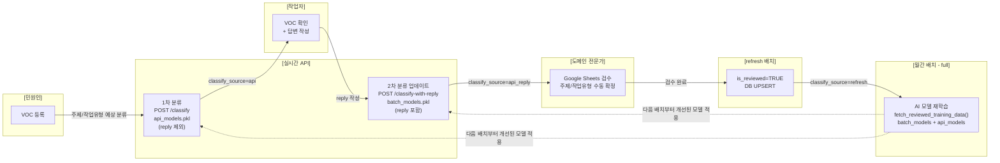

<style>
.mermaid svg { width: 100% !important; max-width: 100% !important; height: auto !important; }
</style>

> 전편: [[데이터파이프라인] VOC 분류 시스템 - AI 기반 고객 피드백 자동 분류](https://dasoldasol.github.io/datapipeline/nlp/ai/voc-nlp-pipeline/)

## 배경

월간 배치 파이프라인이 안정화된 이후, VOC 등록 시점에 실시간으로 분류 결과를 제공해야 하는 요구가 생겼다.

**문제:** 배치는 매월 1회만 실행되므로, VOC가 등록된 직후에는 주제/작업유형 분류 결과가 없다. 작업자가 VOC를 배정받아 처리할 때 분류 정보가 없으면, 어떤 팀/담당자에게 전달해야 하는지 판단이 느려진다.

**해결:** VOC가 등록되는 시점에 FastAPI 서버가 즉시 주제/작업유형을 분류하여 `voc_classification` 테이블에 저장한다. 이후 배치/검수 결과로 점진적으로 교체된다.

## VOC 처리 Flow



| 단계 | 주체 | 사용 모델 | classify_source |
|------|------|----------|----------------|
| VOC 등록 | 민원인 → API | api_models.pkl (reply 제외) | `api` |
| 답변 작성 | 작업자 → API | batch_models.pkl (reply 포함) | `api_reply` |
| 검수 | 도메인 전문가 (Google Sheets) | — | — |
| 검수 반영 | refresh 배치 | — | `refresh` (is_reviewed=TRUE) |
| 재학습 | 월간 배치 (full) | 검수 누적 데이터 | `batch` |

## API 엔드포인트

FastAPI 서버(`api/main.py`)가 4개의 엔드포인트를 제공한다.

| Method | Path | 설명 |
|--------|------|------|
| `POST` | `/classify` | VOC 등록 시 1차 분류 + DB UPSERT (api 모델, reply 제외) |
| `POST` | `/classify-with-reply` | reply 작성 시 2차 분류 + DB UPSERT (배치 모델, reply 포함) |
| `GET` | `/health` | 모델 로드 상태 확인 |
| `POST` | `/reload` | 모델 재로드 (배치 완료 후 자동 호출) |

**Request / Response:**

```
POST /classify
Request  : { "voc_id": int, "title": str, "request_contents": str }
Response : { "voc_id": int, "subject_major": str, "subject_minor": str,
             "work_major": str, "work_minor": str, "saved_to_db": bool }

POST /classify-with-reply
Request  : { "voc_id": int, "title": str, "request_contents": str, "reply": str }
Response : { "voc_id": int, "subject_major": str, "subject_minor": str,
             "work_major": str, "work_minor": str, "saved_to_db": bool }

GET /health
Response : { "status": "ok" | "no_model",
             "model_loaded": bool,           -- api_models
             "batch_model_loaded": bool,     -- batch_models
             "keyword_tagger_loaded": bool,
             "models_dir": str }
```

## 모델 분리 전략

VOC 등록 시점에는 아직 reply(작업자 답변)가 없다. reply는 분류 정확도에 결정적인 단서를 제공하므로, 모델을 용도별로 분리한다.

| 모델 파일 | 학습 입력 | 정확도 | 사용 엔드포인트 |
|-----------|----------|--------|----------------|
| `batch_models.pkl` | title + request_contents + reply | 89~94% | `/classify-with-reply`, 배치 AI 오버레이 |
| `api_models.pkl` | title + request_contents (reply 제외) | ~85% | `/classify` |

두 모델은 full 배치 실행 시 동시에 학습된다. `/classify`는 api_models를, `/classify-with-reply`는 batch_models를 사용하여 추론한다.

## classify_source 우선순위

`voc_classification` 테이블의 `classify_source` 컬럼으로 분류 출처를 구분하고, 품질이 낮은 분류가 높은 분류를 덮어쓰지 못하도록 보호한다.

| 값 | 출처 | UPSERT 조건 |
|----|------|------------|
| `batch` | full / tagging-only 배치 | 항상 UPSERT |
| `refresh` | refresh 배치 (검수 반영) | 항상 UPSERT |
| `api_reply` | `POST /classify-with-reply` | `api`, `api_reply`인 경우만 업데이트 (batch/refresh 보호) |
| `api` | `POST /classify` | `api`인 경우만 업데이트 (api_reply/batch/refresh 보호) |

즉, 배치/검수 결과가 있는 VOC는 API 재호출로 덮어씌워지지 않는다. reply가 작성된 후 `api_reply`가 `api`를 덮어쓰고, 이후 `/classify` 재호출이 와도 `api_reply`는 보호된다.

UPSERT 시 `classify_source`별로 허용된 기존 source 목록을 WHERE 조건으로 제한하여, 품질이 낮은 분류가 높은 분류를 덮어쓰지 못하도록 DB 수준에서 보호한다.

## 하이브리드 분류 로직

API `/classify`는 배치와 같은 키워드+AI 하이브리드 방식을 사용하지만, alpha 값이 다르다.

**주제 분류 (키워드 vs AI 비교):**

| 조건 | 결과 |
|------|------|
| 키워드 score == 0 (매칭 없음) | AI 결과 사용 |
| kw_conf > ai_proba | 키워드 결과 사용 |
| ai_proba >= kw_conf | AI 결과 사용 |

**작업유형 분류:** AI로 전면 교체 (배치 실험 결과 AI 94.3% vs 키워드 89.7%, +4.6%p)

**alpha란:** 키워드 점수를 [0, 1]로 정규화할 때 쓰는 스케일 파라미터로, 값이 작을수록 키워드 신뢰도가 높게 정규화된다 (`kw_conf = score / (score + alpha)`).

**alpha 고정 이유:**

배치는 전체 VOC를 한 번에 처리하므로, 해당 배치 내 비제로 키워드 점수들의 중앙값을 alpha로 동적 계산할 수 있다. API는 요청이 1건씩 들어오므로 중앙값을 계산할 대상 자체가 없다. 따라서 미리 결정된 고정값을 사용하며, `KEYWORD_ALPHA=50`은 reply 없는 상황에서 키워드를 우선하겠다는 정책을 반영한 값이다.

```
# 점수 정규화: kw_conf = score / (score + alpha)

# 키워드 score = 100 예시
배치  alpha=600 (동적, 비제로 중앙값) → kw_conf = 100 / (100 + 600) = 0.14
API   alpha=50  (고정, 1건씩 처리)   → kw_conf = 100 / (100 +  50) = 0.67
```

| alpha | 계산 방식 | 적용 |
|-------|----------|------|
| 비제로 점수 중앙값 (~500~780) | 동적 (배치 내 전체 분포 기준) | 배치 |
| 50 (고정) | 고정 (1건씩 처리, 중앙값 계산 불가) | API |

startup 시 로컬 모델(batch + api 모두)을 로드하고, voc_taxonomy와 텍스트 사전을 메모리에 캐싱한다.

## DB 스키마

```sql
CREATE TABLE voc_classification (
    id               SERIAL PRIMARY KEY,
    voc_id           INTEGER NOT NULL UNIQUE,
    subject_major    VARCHAR(100),
    subject_minor    VARCHAR(100),
    work_major       VARCHAR(100),
    work_minor       VARCHAR(100),
    classify_source  VARCHAR(20) DEFAULT 'api',
    is_reviewed      BOOLEAN DEFAULT FALSE,   -- refresh 배치가 TRUE로 설정
    created_at       TIMESTAMP DEFAULT NOW(),
    updated_at       TIMESTAMP
);
CREATE INDEX idx_voc_classification_voc_id ON voc_classification(voc_id);
```

`is_reviewed=TRUE`로 설정된 레코드는 이후 배치 UPSERT로도 FALSE로 되돌아가지 않는다 (`OR` 로직 적용).

## 모델 자동 갱신 흐름

API 서버 startup 시 로컬 모델을 로드하고, 없으면 S3에서 다운로드한다. 배치 완료 후 `/reload`가 자동 호출되어 새 모델로 즉시 교체된다.

```
full 배치 완료
  → train_from_db()           : DB is_reviewed=TRUE 데이터로 batch_models 학습
  → train_api_model_from_db() : reply 제외로 api_models 학습
  → /reload 호출              : API 서버가 새 모델 로드 (batch + api 모두)
  → VOC 등록 시    → /classify             → api_models.pkl 추론 (classify_source=api)
  → reply 작성 시  → /classify-with-reply  → batch_models.pkl 추론 (classify_source=api_reply)
```

**모델 파일 구조:**

```
{OUT_DIR}/models/
├── batch_models.pkl     # {subject_combined: Pipeline, work_combined: Pipeline}
├── batch_encoders.pkl   # {subject_combined: LabelEncoder, work_combined: LabelEncoder}
├── api_models.pkl
└── api_encoders.pkl
```

모델 파일이 없으면 S3에서 자동 다운로드한다. S3 모델 백업 경로: `{S3_PREFIX}/models/{파일명}`

## FastAPI 구현

각 엔드포인트는 `AIClassifier`의 분류 메서드를 호출하고, 결과를 `voc_classification` 테이블에 UPSERT한다.

- `/classify`: reply 없이 api_models로 추론 → `classify_source=api`로 저장
- `/classify-with-reply`: reply 포함하여 batch_models로 추론 → `classify_source=api_reply`로 저장
- `/health`: api_models / batch_models / keyword_tagger 로드 상태 반환
- `/reload`: 로컬 모델 파일 재로드 (없으면 S3 다운로드)

## Docker 배포

단일 Docker 이미지로 scheduler 컨테이너와 API 컨테이너를 분리 실행한다.

```bash
# entrypoint.sh
case "$1" in
    batch)     exec python batch/run_monthly.py "$@" ;;
    scheduler) exec python -m batch.scheduler "$@" ;;
    api)       exec uvicorn api.main:app --host 0.0.0.0 --port 8000 "$@" ;;
esac
```

```bash
# API 컨테이너 실행
docker run -d --name nlp-api -e ENV=prd -p 8000:8000 \
  -v /path/to/output:/app/output \
  -v ~/.aws:/root/.aws:ro \
  voc-nlp-prd:latest api
```

**.env 설정:**

```
# API 서버 URL (배치 완료 후 자동 reload 호출)
API_URL=http://localhost:8000

# 모델 디렉토리
OUT_DIR=/app/output
MODELS_DIR=/app/output/models

# 키워드 하이브리드 alpha (API 고정)
KEYWORD_ALPHA=50
```

## 운영 검증

개발서버에서 E2E 테스트를 수행하여 classify_source 전환과 보호 정책을 검증했다.

```bash
# Step 1: VOC 등록 → 1차 분류 (reply 없음)
curl -X POST http://localhost:8000/classify \
  -H "Content-Type: application/json" \
  -d '{"voc_id": 9999, "title": "엘리베이터 고장", "request_contents": "엘리베이터에서 이상한 소음이 들려요."}'
# → subject_major: 시설,  subject_minor: 승강기
#    work_major: 작업,    work_minor: 상태점검
#    classify_source: api

# Step 2: 답변 작성 → 2차 분류 업데이트 (reply 포함)
curl -X POST http://localhost:8000/classify-with-reply \
  -H "Content-Type: application/json" \
  -d '{"voc_id": 9999, "title": "엘리베이터 고장",
       "request_contents": "엘리베이터에서 이상한 소음이 들려요.",
       "reply": "서스펜션 교체로 처리하였습니다."}'
# → subject_major: 시설,  subject_minor: 승강기
#    work_major: 작업,    work_minor: 교체          ← reply 덕분에 더 정확한 작업유형으로 갱신
#    classify_source: api_reply

# Step 3: /classify 재호출 → api_reply 보호 확인
# saved_to_db: false (api_reply 보호, 덮어쓰기 안 됨)
```

검증 항목:
- `/classify` 호출 시 classify_source=api로 저장
- `/classify-with-reply` 호출 시 work_minor가 `상태점검` → `교체`로 갱신되고 classify_source=api_reply로 교체
- `/classify` 재호출 시 api_reply 보호 (saved_to_db=false)
- `/health`에서 batch_model_loaded=true, keyword_tagger_loaded=true 확인
