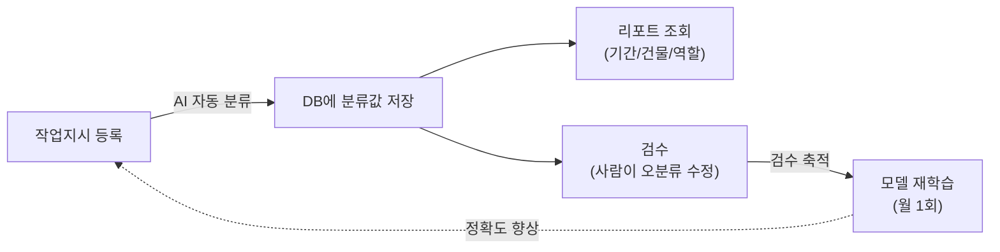
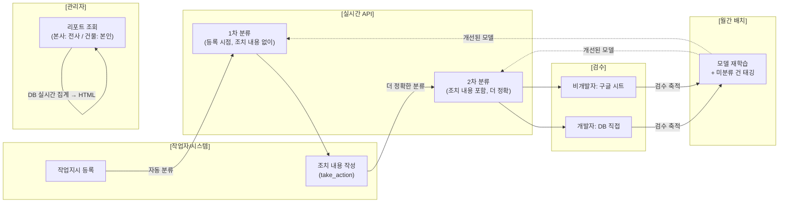
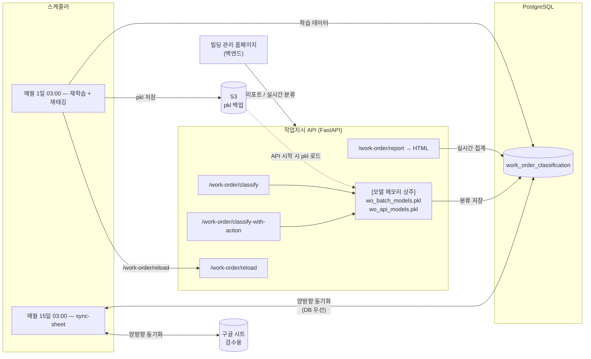
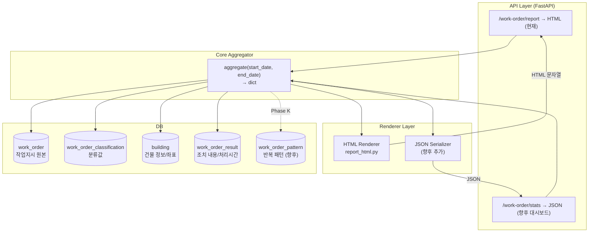
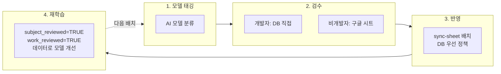

<style>
.mermaid svg { width: 100% !important; max-width: 100% !important; height: auto !important; }
</style>

## 목적

빌딩 시설 관리에서는 "9층 복도등 교체", "지하 소방펌프 점검" 같은 **작업지시(Work Order)**가 매일 수백 건씩 쌓인다. 이 데이터를 AI로 분석하여:

1. **어떤 업무가 반복되는지** 자동으로 감지한다 (예: "김OO님이 매주 월요일 소방점검 반복 수행 중")
2. **어떤 건물에 특정 업무가 집중되는지** 파악한다 (예: "이 건물은 냉난방 업무가 평균의 2.7배")
3. **반복이 예측되면 작업자에게 선제적으로 알림**을 보내, 업무 준비를 돕는다

이를 위해 먼저 작업지시를 **주제/작업유형으로 자동 분류**하고, 분류된 데이터 위에 **KPI 리포트와 반복 패턴 감지**를 구축한다.

## 배경

**문제:** 수만 건의 작업지시가 쌓이지만, 주제(냉난방? 전기? 소방?)와 작업유형(교체? 점검? 청소?)이 분류되어 있지 않아 위 목적을 달성할 수 없었다.

**해결:** AI 파이프라인으로 작업지시를 자동 분류하고, API 기반 실시간 집계 리포트를 기간/건물/역할에 따라 동적으로 제공한다.

| 작업지시 원문 | 주제 대분류 | 주제 중분류 | 작업유형 대분류 | 작업유형 중분류 |
|-------------|-----------|-----------|---------------|---------------|
| 9층 복도등 교체 | 시설 | 전기/조명 | 작업 | 교체 |
| 지하1층 소방펌프 정기점검 | 시설 | 소방/방재 | 점검 | 정기점검 |
| 4층 사무실 에어컨 필터 청소 | 시설 | 냉난방/공조 | 작업 | 청소/정리 |

## 이 시스템이 하는 일

분류된 데이터 위에 3가지 기능을 제공한다.

**1. 실시간 자동 분류** — 작업지시가 등록되면 AI가 즉시 주제/작업유형을 분류하여 DB에 저장. 작업 완료 후 조치 내용(take_action)이 입력되면 더 정확한 2차 분류로 업데이트.

**2. KPI 리포트** — 본사관리자는 전사 전체, 건물관리자는 본인 건물의 시설 관리 현황을 기간별로 조회. 주제별 분포, 건물 유형별 특이 업무, 공수 분석, 반복 패턴 등을 시각화.

**3. 반복 패턴 감지** — 특정 작업자가 특정 시간에 반복하는 업무를 자동 탐지. 향후 해당 시점 전에 알림을 보내 선제적 업무 준비를 돕는다.

## 개요



작업지시가 등록되면 AI가 분류하고, 사람이 검수하고, 검수 데이터로 모델이 개선되는 **선순환 구조**다. 아래에서 각 단계를 상세히 설명한다.

## 작업지시 처리 Flow (상세)



| 단계 | 설명 |
|------|------|
| 작업지시 등록 | 백엔드가 API를 호출하면, AI가 제목+설명만으로 **1차 분류** |
| 조치 내용 작성 | 작업자가 처리 후 조치 내용을 입력하면, 조치 내용까지 포함한 **2차 분류**로 업데이트 |
| 리포트 조회 | 관리자가 기간/건물을 선택하면, DB를 실시간 집계하여 HTML 리포트 반환 |
| 검수 | 오분류 건을 사람이 수정 (개발자는 DB 직접, 비개발자는 구글 시트) |
| 월간 배치 | 축적된 검수 데이터로 모델 재학습 → 다음 분류부터 정확도 향상 |

### classify_source 우선순위

분류값에는 출처가 기록된다. 사람이 검수한 값이 모델 예측값보다 항상 우선하며, 하위 출처가 상위를 덮어쓰지 못하도록 보호한다.

```
[검수된 값] manual (개발자) > sheet (시트 검수)
[자동 분류] batch (월간 배치) > api_action (2차) > api (1차)
검수된 값은 자동 분류를 항상 이김
```

| classify_source | 의미 | 언제 기록되는가 |
|----------------|------|----------------|
| `manual` | 개발자가 DB에 직접 UPDATE | 검수 |
| `sheet` | 비개발자 구글 시트 검수가 sync-sheet 배치로 반영 | 검수 |
| `batch` | 월 1일 배치가 재태깅 | 자동 |
| `api_action` | take_action 입력 시 2차 분류 | 자동 |
| `api` | 작업지시 등록 시 1차 분류 | 자동 |

UPSERT 시 "현재 저장된 source보다 낮은 priority 값"이 들어오면 덮어쓰기 스킵. 예: DB에 `manual`인 행을 `api`가 덮어쓰려 하면 스킵.

## 주제 분류 로직 — 키워드+AI 하이브리드 (α=500)

AI 모델 단독 예측이 아니라 **키워드 매칭(voc_taxonomy)과 AI 확률을 결합한 하이브리드**로 주제를 결정한다. 배치와 실시간 API 모두 동일 규칙 적용.

### 하이브리드 규칙

| 조건 | 채택 |
|------|------|
| `kw_score == 0` (키워드 매칭 없음) | AI 라벨 |
| `ai_proba > kw_conf` (AI가 키워드 신뢰도 이김) | AI 라벨 |
| 그 외 | 키워드 라벨 |

- `kw_conf = kw_score / (kw_score + α)` — α=500 고정
- 작업유형은 AI only (하이브리드 적용 안 함)

### 왜 하이브리드인가 — 검증 결과

5-fold CV(주제 검수 4,122건, 주제 대분류>중분류 결합 기준):

| 방식 | accuracy | Δ |
|------|----------|---|
| AI only | 0.8132 | — |
| Keyword only | 0.5674 | -24.58p |
| **Hybrid α=500** | **0.8382** | **+2.50p** |

5개 fold 전부에서 hybrid > AI only. 키워드 단독은 taxonomy 커버리지 한계로 절반 수준이지만, AI와 결합 시 상호 보완된다. 실제 예:

- `"카드리더기 고장"` → AI 확률 0.42 (애매), 키워드 매칭 score 810 (강함) → 키워드 승, `정보통신/IT`로 정확히 분류
- `"LED 등 교체"` → AI 확률 0.84 (확신), 키워드 score 750 → AI 승, `전기/조명`

### subject_hybrid_by 필드

어느 신호가 최종 결정을 냈는지 row별로 기록:

| 값 | 의미 |
|----|------|
| `ai` | 키워드 신호가 있었으나 AI 확률이 더 높아 AI 라벨 채택 |
| `keyword` | 키워드 신호가 강해 키워드 라벨 채택 |
| `ai_default` | 키워드 매칭 없음(`kw_score=0`) → 기본으로 AI 채택 |

⚠️ **`classify_source`** 와 혼동 주의 — 두 필드는 완전히 다른 축이다.

| 필드 | 답하는 질문 | 값 |
|------|------------|----|
| `classify_source` | 누가 이 레코드를 저장했는가 (파이프라인 주체) | manual/sheet/batch/api_action/api |
| `subject_hybrid_by` | 하이브리드 분류가 어떤 신호로 결정했는가 | ai/keyword/ai_default |

## 전체 아키텍처



## Aggregator / Renderer 분리

리포트 생성 로직을 **집계(Aggregator)**와 **렌더링(Renderer)**으로 분리했다. Aggregator는 DB를 직접 조회하여 pure dict를 반환하고, Renderer는 이 dict를 HTML로 변환한다. 이 구조 덕분에 HTML을 걷어내고 프론트엔드 대시보드로 전환할 때 Aggregator를 그대로 재사용할 수 있다.



- **Aggregator**: 5개 DB 테이블을 직접 조회하여 pure dict 반환. 반복 패턴은 `work_order + work_order_classification`에서 GROUP BY로 동적 계산. 향후 Phase K에서 `work_order_pattern` 테이블을 신설하여 이전 결과 diff 기반 RMS 알림에 활용 예정.
- **HTML Renderer**: dict + role(admin/building) → HTML. 건물관리자 뷰에서는 Tab4만 표시 + 지도 건물명 숨김 + KPI 비교 박스 추가.
- **향후**: JSON Serializer만 추가하면 프론트엔드 대시보드에서 같은 Aggregator 재사용.

## API 엔드포인트

| Method | Path | 설명 |
|--------|------|------|
| `POST` | `/work-order/classify` | 작업지시 등록 시 1차 분류 (wo_api 모델) |
| `POST` | `/work-order/classify-with-action` | take_action 입력 시 2차 분류 (wo_batch 모델) |
| `GET` | `/work-order/report` | KPI 리포트 HTML (기간/역할 파라미터) |
| `POST` | `/work-order/reload` | 모델 재로드 (배치 완료 후 자동 호출) |
| `GET` | `/work-order/health` | 모델 로드 상태 확인 |

**Request / Response:**

```
POST /work-order/classify
Request  : { "work_order_id": int, "name": str, "description": str }
Response : { "work_order_id": int,
             "subject_major": str, "subject_minor": str,
             "subject_hybrid_by": "ai"|"keyword"|"ai_default",
             "work_major": str, "work_minor": str,
             "save_status": "saved"|"skipped"|"error" }

POST /work-order/classify-with-action
Request  : { "work_order_id": int, "name": str, "description": str, "take_action": str }
Response : 동일 구조 (wo_batch 모델 사용)

GET /work-order/report?start_date=2026-03-01&end_date=2026-04-01
Headers  : X-User-Role: admin|building, X-Building-Id: 119
Response : Content-Type: text/html

GET /work-order/health
Response : { "status": "ok",
             "batch_model_loaded": true,
             "api_model_loaded": true,
             "keyword_tagger_loaded": true }
```

**리포트 기간 파라미터:**

UI에서 월 선택과 기간 선택 2가지 picker를 제공하지만, API는 `start_date` + `end_date` 단일 시그니처만 받는다. 프론트엔드가 picker 종류에 따라 변환.

| UI Picker | 변환 |
|-----------|-----|
| 월 선택 (`YYYY-MM`) | `start_date` = `YYYY-MM-01`, `end_date` = 해당 월 말일 |
| 기간 선택 | 두 날짜 그대로 |

## 모델 분리 전략

작업지시 등록 시점에는 아직 take_action(조치 내용)이 없다. take_action은 분류 정확도에 결정적인 단서를 제공하므로, 모델을 용도별로 분리한다.

| 모델 파일 | 학습 입력 | 사용 시점 |
|-----------|----------|----------|
| `wo_batch_models.pkl` | name + description + take_action | `/classify-with-action`, 배치 재태깅 |
| `wo_api_models.pkl` | name + description | `/classify` (등록 시점, take_action 아직 없음) |

### 학습 데이터 분리

주제/작업유형이 별도로 검수되어 각각 다른 N건의 학습 데이터로 학습한다.

```sql
-- 주제 모델 학습
WHERE subject_reviewed = TRUE

-- 작업유형 모델 학습
WHERE work_reviewed = TRUE
```

이를 위해 `subject_reviewed`, `work_reviewed` boolean 컬럼을 별도로 두어 **필드별 검수 여부**를 정확히 추적한다. 주제만 검수된 건의 작업유형 NULL은 모델로 보충하되, `work_reviewed=FALSE`를 유지하여 향후 검수 대상에서 누락되지 않도록 한다.

## DB 스키마

```sql
CREATE TABLE work_order_classification (
  id                   SERIAL PRIMARY KEY,
  work_order_id        BIGINT NOT NULL UNIQUE,
  subject_major        VARCHAR(100),
  subject_minor        VARCHAR(100),
  work_major           VARCHAR(100),
  work_minor           VARCHAR(100),
  classify_source      VARCHAR(20) DEFAULT 'api',
  is_reviewed          BOOLEAN DEFAULT FALSE,
  subject_reviewed     BOOLEAN DEFAULT FALSE,
  work_reviewed        BOOLEAN DEFAULT FALSE,
  subject_taxonomy_id  BIGINT,
  work_taxonomy_id     BIGINT,
  CONSTRAINT fk_woc_work_order FOREIGN KEY (work_order_id)
    REFERENCES work_order(id) ON DELETE CASCADE
);
```

**부분 검수 처리:**

| 상태 | subject_reviewed | work_reviewed | 의미 |
|------|-----------------|---------------|------|
| 양쪽 검수 | TRUE | TRUE | 두 값 모두 사람이 확인 |
| 주제만 검수 | TRUE | FALSE | 주제는 검수값, 작업유형은 모델 보충 |
| 작업유형만 검수 | FALSE | TRUE | 작업유형은 검수값, 주제는 모델 보충 |
| 전체 모델 태깅 | FALSE | FALSE | 둘 다 모델 예측 |

## 역할 기반 리포트

본사관리자(admin)와 건물관리자(building)에게 같은 API, 같은 Aggregator를 쓰되, **Renderer에서 role별 분기**하여 다른 뷰를 제공한다.

| 항목 | admin (본사) | building (건물) |
|------|-------------|-----------------|
| 전사 집계 섹션 (Tab1~3) | 전체 | 전체 (비교용) |
| 전사 평균 대비 KPI 박스 | — | O (건물 상세 최상단) |
| 지도 마커 | 전 건물 (이름 + 드릴다운) | 전 건물 (이름 숨김, 유형만, 드릴다운 차단) |
| Tab4 건물 상세 | 어느 건물이든 | 본인 건물만 |
| 건물명 검색 | O | 숨김 |

### 운영 상태 분리 — 숫자는 전체, 이름은 운영 중만

운영 종료 건물의 데이터도 전체 통계에서는 귀한 자산이다. 다만 건물명이 직접 노출되는 곳에서는 "아직 관리 중"으로 오해할 수 있으므로 제외한다.

| 데이터 유형 | 운영 종료 건물 |
|-----------|-------------|
| 숫자/비율 (건수, 분포, 추이) | **포함** |
| 건물명 직접 노출 (지도, 드릴다운, 반복 패턴) | **제외** |

## 반복 패턴 동적 계산

반복 패턴 분석은 단순 리포트 표시에 그치지 않고, 향후 **사용자에게 반복 업무를 선제적으로 알림(RMS 연동)해주기 위한 모듈**이다. 예를 들어 "김OO님이 매주 월요일 소방점검을 반복 수행 중"이라면, 해당 시점 전에 미리 알림을 보내 업무 준비를 돕는다.

Aggregator가 **DB에서 GROUP BY로 실시간 계산**한다. 건물 x 주제 x 작업자 조합을 집계하고, 규칙성 점수(월별 건수 변동계수 기반)를 계산한다.

```sql
SELECT building_id, subject_minor, writer_id,
       COUNT(*) AS total_count,
       COUNT(DISTINCT to_char(write_date, 'YYYY-MM')) AS months_active,
       MODE() WITHIN GROUP (ORDER BY EXTRACT(HOUR FROM write_date)) AS peak_hour
FROM work_order wo
JOIN work_order_classification wc ON wo.id = wc.work_order_id
GROUP BY building_id, subject_minor, writer_id
HAVING COUNT(*) >= 50
```

기간 필터 적용 시 **해당 기간에 실제로 발생 중인 패턴만** 표시된다. 3월 리포트라면 "이전에 반복됐고 3월에도 여전히 발생 중인 패턴"만 보여준다. 월별 추이 차트는 기간과 별개로 **전년 동월부터 13개월**을 표시한다.

## 검수 워크플로우

검수는 **2가지 경로**로 이루어지며 DB가 항상 source of truth.

| 주체 | 경로 | classify_source |
|------|------|----------------|
| 개발자 | DB 직접 UPDATE | `manual` |
| 비개발자 | 구글 시트 → sync-sheet 배치 | `sheet` |

**sync-sheet 동작 (DB 우선 정책):**

| 시트 incoming | DB 기존 상태 | 동작 |
|-------------|------------|------|
| 검수완료=Y | `manual` (개발자 확정) | **스킵** |
| 검수완료=Y | 그 외 | **UPSERT** |
| 검수완료 공백 | 무엇이든 | **스킵** |

DB → 시트 방향으로도 동기화하여 개발자 검수값이 시트에 자동 반영된다.

## Human-in-the-loop



검수 데이터가 축적될수록 AI 모델 재학습 품질이 향상되며, 자동 태깅 정확도가 개선되어 검수 부담이 줄어드는 선순환 구조를 목표로 한다.

## 배치 스케줄링

| 시점 | 작업 |
|------|------|
| 매월 1일 03:00 | full 배치 (AI 재학습 + 재태깅 + API reload + 저신뢰도 샘플 시트 업로드) |
| 매월 15일 03:00 | sync-sheet (시트↔DB 양방향 동기화, DB 우선) |

```python
scheduler.add_job(run_wo_batch, CronTrigger(day=1, hour=3), id="wo_monthly")
scheduler.add_job(run_wo_sync,  CronTrigger(day=15, hour=3), id="wo_sync")
```

## Docker 배포

| 모드 | 실행 대상 | 수명 |
|------|----------|------|
| `scheduler` | 배치 스케줄러 | 상주 |
| `api` | FastAPI 서버 | 상주 |
| `batch` | 수동 배치 실행 | 1회 후 종료 |

## 프로젝트 구조

```
building-analysis/
├── common/
│   ├── classifier.py                   # AIClassifier, Kiwi 토크나이저
│   ├── db.py, s3.py, gspread.py, nlp.py
├── work_order/
│   ├── aggregator.py                   # DB 직접 조회 → 집계 dict
│   ├── report_html.py                  # dict → HTML (role별 분기)
│   ├── report.py                       # thin runner
│   ├── train.py                        # 모델 학습 (supervised)
│   ├── api.py                          # APIRouter
│   ├── batch.py                        # 월간 배치 (학습 + 재태깅 + reload)
│   └── pattern.py                      # 반복 패턴 분석
├── api/
│   └── main.py                         # API 서버
└── output/models/
    ├── wo_batch_models.pkl             # take_action 포함 학습
    └── wo_api_models.pkl               # take_action 제외 학습
```
