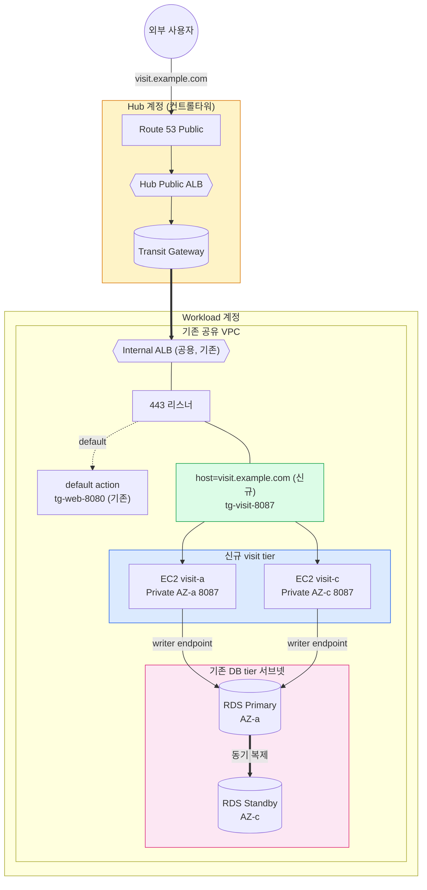
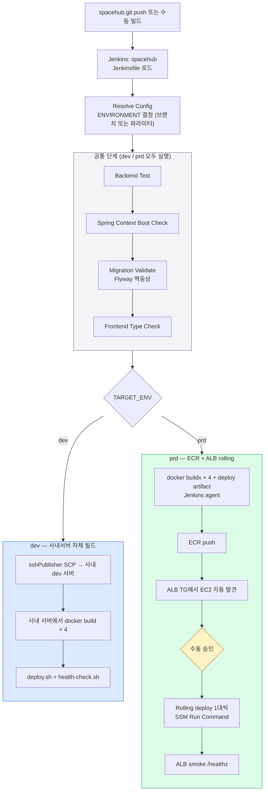

## 배경

건물관리시스템에 신규 서비스(방문자관리시스템)를 오픈해야 했다. 일 30명 규모의 작은 사내용 서비스고, 외부 도메인 한 개로 노출된다.

조건이 두 가지 있었다.

1. 회사는 이미 AWS Control Tower 기반 Hub-and-Spoke Landing Zone을 운영 중이라 신규 서비스도 그 컨벤션을 따라야 한다
2. 새 서비스 하나를 위해 신규 VPC/ALB/Hub Ingress를 처음부터 만드는 건 과하다 — 기존 인프라를 최대한 재사용하자

이 글은 그 결정과 실행 과정을 정리한 기록이다. 같은 패턴(소규모 신규 서비스를 기존 Landing Zone에 합류) 마주칠 분께 도움이 될까 싶어 정리해둔다.

---

## 큰 그림

먼저 최종 아키텍처부터 보면 이렇다.



설명할 것 없이 표준 Hub-and-Spoke 패턴이다. 핵심은 **이번에 추가한 게 어디서 끝나고 기존 인프라가 어디서부터냐**다:

| | 신규 (이번 작업)                     | 기존 (재사용) |
|---|--------------------------------|---|
| VPC | —                              | 공유 VPC |
| Hub Public ALB | —                              | 그대로 |
| Internal ALB | —                              | 그대로 (host-rule 한 줄만 추가) |
| 서브넷 | `pri-visit-a/c` 신규             | DB tier 서브넷 재사용 |
| Security Group | visitor-app-sg, visitor-rds-sg | — |
| Target Group | tg-visit-8087                  | — |
| EC2 | 2대 (visit-a, visit-c)          | — |
| RDS | hdcl-csp-rds-visit (신규)        | — |
| Route 53 / ACM | visit.example.com 서브도메인 추가     | 기존 ACM 인증서 재사용 |

**새로 만든 건 EC2/RDS/SG/Subnet/Target Group 뿐**이고, 나머지는 기존 자산에 룰 한 줄씩 더한 형태다. 이렇게 하면 비용·운영 부담·티켓 처리량을 모두 줄일 수 있다.

---

## 의사결정 1: 신규 VPC vs 공유 VPC 합류

처음 상상은 "신규 서비스니까 신규 VPC 만들고 거기에 깔끔하게 새로 쌓자"였다. 그런데 사내 Landing Zone은 **이미 한 개의 공유 Workload VPC에 web/was/api/batch/bim/bems 등 여러 tier가 같이 살고 있는 구조**였다. 신규 VPC를 만들면 다음을 다 새로 깔아야 한다.

- 신규 VPC + TGW 어태치 + 라우팅
- 신규 ALB (월 $16~ 고정요금) + 신규 Target Group + 신규 Listener
- 신규 ACM 인증서 (또는 기존 SAN 추가)
- Hub Public ALB의 신규 도메인 분기 룰

그리고 **다른 tier와의 inter-tier 통신**(예: visit → web으로 유저 인증 호출)이 필요한데, 별도 VPC면 그 자체가 또 TGW 경유 VPC peering 류의 작업이 된다.

반면 공유 VPC에 합류하면:

- VPC/TGW 라우팅은 이미 깔려있음 (서브넷만 신규로 추가하면 됨)
- 기존 Internal ALB의 443 리스너에 host-based rule 한 줄 추가 → 끝
- Inter-tier 통신은 같은 ALB의 다른 host-rule을 호출하면 자연스럽게 처리
- ACM 인증서가 이미 wildcard 또는 SAN multi라 신규 도메인 한 개 추가 정도

소규모 신규 서비스라면 공유 VPC 합류가 압도적으로 유리하다. 다만 같은 ALB·VPC를 공유한다는 건 **운명도 같이 한다**는 뜻이라, ALB·VPC·Hub 레벨 장애는 회사 전체 서비스가 동시 영향을 받는다는 점은 받아들여야 한다 (이건 어차피 단일 서비스 신규 VPC를 따로 만들어도 회사 표준 아키텍처는 같으니 큰 차이 없다).

---

## 의사결정 2: EC2 자체 PG + Lambda 펜싱 vs RDS Multi-AZ

처음 검토안은 "EC2 2대에 PostgreSQL을 깔고, streaming replication으로 standby 만들고, 페일오버는 Lambda로 promote"였다. 이렇게 하면:

- Lambda `pg-failover-handler`
- EventBridge `pg-failover-trigger`
- DynamoDB `pg-failover-lock` (split-brain 방지)
- SSM Run Command 스크립트 (promote / `/etc/hosts` 교체 / 앱 재시작)
- CloudWatch Custom 메트릭 (`Custom/PostgreSQL/IsAlive`, `ReplayLag`)
- EC2 cron 기반 `pg_isready` 푸시

자동화 평면이 통째로 따라온다. 코드 라인이 늘어나고, **테스트·리허설·온콜이 일관되게 돌아가도록 유지하는 비용이 누적**된다. RTO도 잘 만들어야 60~120초 수준.

다른 선택지는 RDS for PostgreSQL Multi-AZ다.

| | EC2 PG + Lambda 펜싱 | RDS Multi-AZ |
|---|---|---|
| 자동화 평면 | Lambda + EventBridge + DynamoDB + SSM + Custom 메트릭 | 없음 |
| 페일오버 RTO | 60~120초 (자체 구현) | 60~120초 (AWS 관리) |
| RPO | 비동기면 수 초 손실 가능 | 0 (동기 복제) |
| 자격증명 회전 | 자체 구현 | Secrets Manager 자동 회전 |
| 백업 | 자체 cron + S3 | PITR 7일 자동 |
| 슬로우 쿼리 분석 | 자체 설정 | Performance Insights 즉시 |
| 월 추가 비용 | EC2 + EBS만 | 약 $58 |

RDS 쪽이 비용은 좀 늘지만 **자동화 평면 60% 정도가 통째로 사라진다**. 운영 인력이 작은 팀에선 이 trade-off가 명확히 RDS 쪽이다. 결국 RDS Multi-AZ로 갔다.

이 결정 한 번으로 다음이 모두 사라졌다:

- ❌ Lambda `pg-failover-handler`
- ❌ EventBridge `pg-failover-trigger`
- ❌ DynamoDB `pg-failover-lock`
- ❌ SSM Run Command 스크립트
- ❌ CloudWatch Custom 메트릭 + EC2 cron 푸시

대신 RDS Event Subscription으로 failover 발생 알림만 받으면 된다. 끝.

> 하나 짚어둘 것: 앱 측은 페일오버 중 ~60초간 트랜잭션이 끊긴다. **DB connection pool에 TCP keepalive + 재시도 정책**, HikariCP라면 `validationQuery + maxLifetime 5min`, pgBouncer라면 `server_check_query`. 이건 어느 방식이든 똑같이 필요하다.

---

## 의사결정 3: 신규 ALB vs 기존 ALB host-rule

ALB는 시간당 고정요금이 있어서 ALB를 새로 띄우는 것 자체가 월 ~$16 정도의 fixed cost다. 그런데 기존 Internal ALB는 이미 12개 리스너 풀가동 중이라 LCU 여유가 충분했다.

기존 ALB의 443 리스너에:

```
default action          → tg-web-8080 (기존, 변경 없음)
host=visit.example.com → tg-visit-8087 (신규 rule, priority 10)
```

host-based rule을 한 줄 추가하면 기존 트래픽엔 일절 영향 없이 신규 도메인만 신규 TG로 분기된다. ACM 인증서에 SAN으로 신규 도메인이 포함되어 있는지만 확인하면 된다 (안 되어 있으면 갱신 또는 SNI 인증서 추가).

이렇게 하면 **인프라 면적이 ALB 한 개 분량 그대로 줄어든다**.

---

## 네트워크 구성

### 서브넷

운영 컨벤션이 "tier별 전용 서브넷"이었다 (`pri-web-a/c`, `pri-was-a/c`, `pri-db-a/c` 등). 그래서 visit도 동일하게:

- `pri-visit-a` (AZ-a, /24)
- `pri-visit-c` (AZ-c, /24)

신규로 두 개 요청. RDS는 별도 tier라 **기존 `pri-db-a/c` 서브넷을 재사용**하기로 했다 (컨트롤타워 정책 확인 필요한 항목으로 1차 티켓에 포함).

### 포트

기존 VPC 내 사용 포트: 8080~8086. 다음 빈 번호인 **8087**을 visit tier 컨테이너 포트로 잡았다. 컨벤션 일관성 확보.

### Security Group

```
visitor-app-sg
  Inbound:  <internal-alb-sg> → TCP 8087    (ALB가 컨테이너로 forward)
  Outbound: 전체 허용

visitor-rds-sg
  Inbound:  visitor-app-sg → TCP 5432       (앱이 RDS로)
  Outbound: 전체 허용
```

기존안의 `visitor-db-sg`(EC2 내장 PG self-replication용)는 RDS 전환과 함께 삭제됐다. RDS는 self-SG 룰이 필요 없다.

> ALB SG inbound가 화이트리스트 정책이라면, visit tier가 다른 tier를 호출하는 방향(예: visit → web)을 위해 `visitor-app-sg → <internal-alb-sg> TCP 443`도 추가 필요하다. 이건 1차 티켓에서 컨트롤타워 측에 정책 확인 항목으로 포함시켰다.

---

## 컨트롤타워 협업 — 티켓 분리

Hub-and-Spoke Landing Zone은 **VPC/서브넷/SG/TGW/ALB 변경 일체가 컨트롤타워 영역**이다. Workload 계정에서 직접 못 만진다. 그래서 작업이 **컨트롤타워 티켓 ↔ 내가 직접 작업** 흐름으로 진행된다.

티켓을 두 단계로 분리했다.

### 1차 티켓: 서브넷 + SG + RDS 배치 정책 확인

```
◎ 요청 1: 신규 Private Subnet 2종
  pri-visit-a / pri-visit-c (각 /24)

◎ 요청 2: Security Group 2종
  visitor-app-sg, visitor-rds-sg

◎ 요청 3: Internal ALB SG inbound 정책 확인
  visit → 다른 tier 호출 시 추가 SG 룰 필요 여부

◎ 요청 4: RDS DB Subnet Group 정책 확인
  기존 pri-db-a/c 재사용 가능 여부

◎ 요청 5: TGW 라우팅 도달성 확인
```

이게 떨어져야 EC2/RDS를 만들 수 있다.

### 1차 회신 후 내가 직접 작업

- RDS Multi-AZ 인스턴스 생성 (자격증명은 Secrets Manager 자동 생성)
- EC2 2대 launch (Amazon Linux 2023, t3.small, 부착 SG는 받은 visitor-app-sg)
- 앱 컨테이너 배포 (`:8087`)
- `curl http://localhost:8087/healthz` 200 확인 (RDS endpoint 연결 검증)

### 2차 티켓: ALB Listener Rule + Hub Ingress

```
◎ 요청 1: 기존 Internal ALB에 TG + listener rule 추가
  - tg-visit-8087 신규 생성 (HTTP/8087, instance type)
  - 등록 타겟: i-<visit-a>, i-<visit-c> (모두 8087)
  - Health check: GET /healthz, 200, 15s, 2/2
  - 443 리스너 host-based rule: priority 10, host=visit.example.com → tg-visit-8087

◎ 요청 2: ACM 인증서 SAN 확인 (신규 도메인 포함 여부)

◎ 요청 3: Hub Public ALB
  - *.example.com 경로가 기존 Internal ALB로 도달하는지 확인

◎ 요청 4: Route 53 Public
  - visit.example.com ALIAS → Hub Public ALB
```

이게 떨어지면 외부 인입 경로가 살아난다.

### 왜 두 단계로 분리했나

처음엔 "1차 티켓 한 번에 다 요청"으로 갈까 했는데, **EC2/RDS 헬스체크가 통과하지 않은 상태에서 ALB Target Group에 등록하면 unhealthy로 떠서 운영자 입장에선 노이즈**가 된다. 또 컨트롤타워 측에서 EC2가 없는 상태에서 listener rule을 만드는 건 그쪽 입장에서도 어색하다.

순서를 정리하면:

```
1차 티켓 (네트워크/SG/정책 확인)
  ↓
회신 (서브넷 ID, SG ID, 정책 답변)
  ↓
RDS Multi-AZ 생성 (~15분)
  ↓
EC2 2대 + 앱 컨테이너 배포 + 자체 검증
  ↓
2차 티켓 (TG/listener rule/Hub Ingress/Route 53)
  ↓
회신
  ↓
외부 도메인 검증 + RDS 페일오버 리허설
```

이렇게 하면 각 단계마다 검증이 명확해진다.

---

## 장애 시나리오와 RTO

| # | 시나리오 | 복구 주체 | RTO |
|---|---|---|---|
| 1 | 앱 컨테이너 crash | Docker `restart: always` + ALB | < 30초 |
| 2 | EC2 1대 다운 | ALB 격리 + 반대 EC2 단독 | < 30초 |
| 3 | EC2 하드웨어 장애 | EC2 Auto Recovery | 5~10분 |
| 4 | **RDS Primary 장애** | **RDS Multi-AZ 자동 페일오버** | **60~120초** |
| 5 | RDS Standby 장애 | AWS 자동 재구축 | (사용자 영향 없음) |
| 6 | AZ-a 전체 장애 | 반대 AZ EC2 단독 + Standby promote | 60~120초 |
| 7 | RDS 양쪽 동시 장애 | PITR 백업에서 복구 | 30분~수시간 |
| 8 | 기존 Internal ALB 장애 | **공유 인프라** — 회사 전체 동시 영향 | AWS SLA |
| 9 | Hub Public ALB / TGW 장애 | Hub 계정 / AWS 관리형 | AWS SLA |

요약:
- 앱 레이어: < 30초 (TG 헬스체크 + Docker restart)
- DB 레이어: 60~120초 (RDS 관리형 자동 페일오버)
- AZ 레벨: 60~120초

RDS reboot with failover로 리허설을 한 번 돌려보면 앱 connection pool이 끊겼다가 재연결되는 데까지 실측 시간이 나온다. 운영 들어가기 전에 한 번은 돌려보는 게 좋다.

---

## CI/CD — dev와 prd를 다르게 갈라야 했다

이 부분은 처음에 "dev/prd 같은 파이프라인을 환경변수로만 분기"로 가려다가 도중에 갈라야겠다고 판단해서 분리했다. 이유는 두 환경의 본질적 차이 때문이다.

| | dev | prd                         |
|---|---|-----------------------------|
| 서버 | 사내 IDC `<dev-host>` (Ubuntu 20.04) | AWS EC2 visit-a/c (AL2023)  |
| DB | 사내 PG `<dev-pg>:5432` | AWS RDS Multi-AZ            |
| 빌드 위치 | 사내 서버 자체 (docker build) | Jenkins agent → ECR push    |
| 이미지 저장 | 사내 서버 로컬 태그 | ECR `visitor/spacehub-prd`  |
| 배포 방식 | docker compose up (단일 서버) | ALB rolling (2대 순차)         |
| 진입 도메인 | 사내망 `http://<dev-host>:8087` | `https://visit.example.com` |

### 단일 Jenkinsfile + ENVIRONMENT 파라미터로 분기

Jenkinsfile은 spacehub.git에 단일 파일로 두고, `ENVIRONMENT` 파라미터(`auto`/`dev`/`prd`)와 브랜치 이름으로 어느 환경에 배포할지 결정한다. `auto`면 `develop` → dev, `main` → prd로 자동 매핑. 필요하면 수동 오버라이드.

추가 파라미터:

- `MODULES`: 배포 대상 모듈 (`all` / `auth,core` 식). dev에서 `all`이면 git diff로 변경된 모듈만 자동 감지
- `IMAGE_TAG_OVERRIDE`: 비우면 git SHA 자동. 롤백할 때 과거 태그 입력
- `SKIP_TESTS`: 긴급 배포용 (평소엔 금지)

전체 흐름은 이렇다.



### 공통 단계 — dev/prd 양쪽에서 동일하게 강제

환경과 무관하게 다음 검증이 모든 빌드에서 돈다.

- **Backend Test**: `gradlew test --parallel`
- **Spring Context Boot Check**: 각 모듈의 `*ApplicationContextTest`만 따로 실행. ambiguous mapping / missing bean 같은 부팅 시점 충돌은 일반 unit test에서는 안 잡히고 `@SpringBootTest contextLoads()`가 Testcontainers postgres 위에서 실제 부팅되어야 잡힘. 빠르고 결정적인 검증
- **Migration Validate**: 임시 postgres 컨테이너 위에서 Flyway 마이그레이션을 **두 번 연속 실행**해 멱등성 검증. V## 비멱등 / 충돌이 dev/prd 부팅 fail의 흔한 원인이라 사전 차단. visitor → core 순으로 운영 부팅 순서를 시뮬레이션
- **Frontend Type Check**: `tsc -b --noEmit`만 분리해서 돌림. Dockerfile 안의 `npm run build`에서 타입 에러 나면 Docker 빌드 로그에 묻혀 원인 파악이 늦으니까 더 이른 단계에서 빠르게 fail

이 단계들이 양 환경에서 동일하게 돌기 때문에 **dev에서 검증 못 한 코드가 prd로 못 가는 구조**가 자동으로 만들어진다.

### dev 분기 — 사내서버에서 직접 빌드

dev EC2는 사내망에 있고 인터넷 outbound가 자유롭다. ECR 갈 필요가 없다. Jenkins는 source 파일만 SCP로 보내고 **빌드는 사내 dev 서버에서 직접** 한다.

`sshPublisher` (Publish over SSH 플러그인)의 SSH config `dev_web_was`를 재사용해서:

1. source SCP → 사내 dev 서버 `/home/<user>/spacehub`
2. 워크트리를 빌드 대상 commit SHA로 `git reset --hard` (sshPublisher SCP가 추가/덮어쓰기만 하고 삭제는 안 해서 stale 파일이 빌드 깨뜨리는 사고 방지)
3. 사내 서버에서 `docker build × 4` (선택된 모듈만)
4. `scripts/deploy.sh` (SKIP_PULL=1, .env.dev) → docker compose up
5. `scripts/health-check.sh` (200초 retry)
6. 옛 SHA 이미지 cleanup

이미지는 사내 서버 로컬에만 존재. 단일 서버 배포라 rolling도 불필요. ECR credential도 안 쓴다.

### prd 분기 — ECR + SSM Run Command 기반 rolling

prd EC2는 AWS Private Subnet에 있고 **SSH 22가 보안 정책상 차단**되어 있다. 그래서 SSH 키 안 쓰고 **AWS Systems Manager Run Command**로 배포한다 (SSH PEM credential 불필요, EC2의 instance role에 `AmazonSSMManagedInstanceCore`만 있으면 됨, audit는 CloudTrail 자동 기록).

1. **docker buildx × 4 + deploy artifact image**: Jenkins agent에서 `--platform linux/amd64`로 4개 모듈 + 배포 산출물 이미지 빌드. deploy artifact는 `docker/` + `scripts/` + `init.sql`을 묶은 별도 이미지로, 매 배포 시 EC2의 compose/scripts를 git SHA와 동기화하는 데 쓴다 (stale 파일 사고 방지)
2. **ECR push**: 단일 repo + 모듈 prefix 태그 (`auth-abc12345` + `auth-main-latest`)
3. **ALB TG에서 EC2 자동 발견**: `aws elbv2 describe-target-health`로 TG에 등록된 EC2 ID 추출. **TG가 진실원본**이라 EC2 추가/교체 시 Jenkinsfile 수정 불필요
4. **수동 승인**: Dooray webhook으로 승인 대기 알림 발송, `input` timeout 60분
5. **Rolling deploy 1대씩**:
   - `deregister` → `drain` 40초 (DRAIN_SEC)
   - SSM Run Command → EC2에서 `ECR login` → deploy artifact pull → docker/scripts 동기화 → `psql`로 RDS DB+schema 멱등 보장 → `deploy.sh` (ECR pull + docker compose up) → `health-check.sh`
   - SSM 결과 polling (10초 × 최대 120회 = 20분, Spring 부팅 + RDS 연결 시간 확보)
   - `register` → `target-in-service` 대기
6. **ALB smoke**: `https://<service>/healthz` 200 확인

핵심 안전장치:

- **try-finally로 register 강제 복구**: 어떤 stage에서 throw되어도 deregister만 되고 register 누락된 상태로 끝나는 회귀를 영구 차단. 그게 발생하면 다음 빌드의 Discover stage가 "TG에 등록된 EC2 없음"으로 fail
- **Flyway race 방지**: 첫 EC2 마이그레이션 완료 후 두 번째 EC2 부팅 시 history 일치로 skip. 둘이 동시 마이그 시도하지 않음 (rolling이라 자연 직렬)
- **모듈 자동 감지 (dev만)**: `MODULES=all` + dev면 git diff로 변경된 모듈만 빌드. prd는 항상 4개 다 빌드 + deploy artifact까지 5개

### 왜 단일 Jenkinsfile + 환경 분기로 갔나

처음엔 dev/prd를 별도 Jenkinsfile로 분리할까 했지만, 결국 단일 파일 + ENVIRONMENT 파라미터로 통합했다.

- **공통 검증이 한 줄로 강제됨** — 위 4가지 테스트가 양 환경에서 동일하게 돌아, dev에서 통과 못 한 코드가 prd로 못 가는 구조가 자연히 만들어진다
- **환경별 stage가 `when` 조건으로 명시적으로 게이팅됨** — `when { expression { env.TARGET_ENV == 'prd' } }` 식이라 어느 stage가 어느 환경에서 도는지 한눈에 보임. 한 파일 안에서 dev/prd 차이가 비교 가능
- **모듈 자동 감지·태그 체계·롤백 토큰 같은 복잡한 분기 로직을 한 군데 집중** — 두 파일로 나뉘면 양쪽에 중복되거나 한쪽만 갱신되는 사고가 생긴다
- **코드 변경과 파이프라인 변경이 같은 PR에서 리뷰됨** — Jenkinsfile이 spacehub.git에 들어있어서 자연스럽게 따라옴

조건문 두 분기로 가면 한쪽 깨졌을 때 디버깅이 어려운 게 보통이지만, 이번엔 **공통 단계가 분명하게 격리**(테스트는 모두 prefix)되고 **환경별 stage가 깔끔하게 끊어져**(`when` 조건) 단일 파일이 더 직관적이었다.

---

## 비용 정리

소규모 서비스라 비용도 작다 (일 30명 가정).

| 구성 | 월 비용 |
|---|---|
| EC2 t3.small × 2 + EBS | 약 5만원 |
| RDS Multi-AZ db.t4g.small + gp3 20GB | 약 9만원 |
| ALB (LCU 마진분만, 시간당 고정요금은 기존과 공유) | ~2만원 |
| 데이터 전송 / CloudWatch / 백업 / Route 53 / SNS 등 | 약 2만원 |
| **AWS 합계** | **약 18만원** |
| 외부 SMS 발송 (NHN Cloud Toast) | 약 5만원 |
| **월 총 운영비** | **약 23만원** |

ALB 시간당 고정요금($16/월)을 신규 ALB로 띄웠으면 그대로 비용에 추가됐을 것. **공유 ALB 재사용으로 절감되는 부분이 작은 서비스에선 비례적으로 큰 비중**을 차지한다.

영상 자체 서빙(안전교육 콘텐츠)을 EC2에서 하면 EBS·전송비가 늘어 월 +8만원 이상. YouTube 임베드로 가면 영상 크기와 무관하게 비용 동일. 결국 YouTube 임베드로 갔다.

---

## 회고

이번에 정리하면서 새삼 느낀 것들.

**기존 인프라 재사용은 작은 서비스일수록 효과가 크다.** 신규 서비스마다 VPC/ALB/Hub Ingress를 새로 만들면 fixed cost가 누적된다. 일 30명 규모인데 ALB 시간당 고정요금만 월 ~$16. 운영 면적도 같이 늘어난다. 새 tier가 들어올 때마다 "이건 기존 자산에 합류시킬 수 있나?"를 먼저 물어보는 게 좋다.

**RDS Multi-AZ로 자동화 평면이 사라진다.** EC2 자체 PG + Lambda 펜싱 자동화는 글 한 편 분량의 코드(Lambda + EventBridge + DynamoDB lock + SSM RunCommand + Custom 메트릭 + cron)가 따라온다. RDS Multi-AZ로 가면 그게 통째로 필요 없다. RTO도 비슷하고 RPO는 오히려 좋아진다 (동기 복제 0). 월 ~$58 추가 비용이 운영 인력 N명의 시간보다 훨씬 싸다는 걸 의식적으로 비교해야 한다. **"기술적으로 자체 구현이 더 흥미롭다"는 끌림과 "운영 부담을 줄이는 게 더 옳다"는 판단을 분리해서 봐야 한다.**

**컨트롤타워 환경은 티켓 단계 분리가 핵심이다.** 한 번에 다 요청하면 의존성 없는 항목까지 같이 늦어지고, 검증 지점이 불명확해진다. "내가 작업할 수 있게 만들어주는 항목"과 "내가 작업한 결과를 받아서 외부에 노출시키는 항목"을 구분해서 두 번에 나눴더니 흐름이 명확해졌다. **티켓 본문에 "회신 받을 항목"을 명시**하는 것도 중요하다 — 그쪽도 무엇을 답해줘야 하는지 분명해진다.

**dev와 prd 파이프라인은 같으려고 억지 부리지 않는 게 낫다.** 환경변수 분기로 시작했다가 두 환경의 단계 자체가 너무 달라서 결국 분리. 한쪽 디버깅하다 다른 쪽이 깨지는 일을 피하려면 차라리 두 개로 나눠서 각자 직관적으로 읽히도록 두는 게 운영상 편하다. **공유 가능한 부분만 common으로 빼고, 그 외엔 자기완결로 두는 절충**이 적당했다.

**소규모 사내 서비스라도 HA는 깔아두자.** 일 30명이면 single-AZ로도 안 죽긴 한다. 그런데 Multi-AZ로 가는 추가 비용이 EC2는 약 2만원/월, RDS는 약 4만원/월 수준. 운영 부담은 거의 같다. 한 번이라도 AZ 장애가 발생하면 회수되고도 남는다. 처음 깔 때 default를 Multi-AZ로 두는 게 나중에 후회하지 않는 선택이다.

---

## 부록: 진행 순서 정리

```
1. 컨트롤타워 1차 티켓 제출 (서브넷 + SG + DB SG 정책 확인)
2. 회신 수령 (서브넷 ID, SG ID, 정책 답변)
3. RDS Multi-AZ 생성 (~15분)
   - DB Subnet Group: pri-db-a/c
   - SG: visitor-rds-sg
   - 자격증명: Secrets Manager 자동 생성
   - PITR 7일, 암호화 ON, 삭제 보호 ON, Performance Insights ON
4. 앱 EC2 2대 배포 (visit-a, visit-c)
   - 부착 SG: visitor-app-sg
   - 부착 IAM role: SSM + CloudWatch + Secrets Manager + ECR ReadOnly
   - EC2 Auto Recovery 알람
5. 앱 컨테이너 :8087 배포 + 자체 검증
   - RDS writer endpoint 연결 검증
   - curl http://localhost:8087/healthz 200
6. 컨트롤타워 2차 티켓 제출 (TG + listener rule + Hub Ingress + Route 53)
7. 회신 수령 (TG ARN, listener rule ARN, Hub ALB / Route 53 / ACM 처리 결과)
8. CloudWatch 알람 + RDS Event Subscription 배포
9. 외부 도메인 검증
   - curl https://visit.example.com/healthz 200
   - 기존 https://example.com 회귀 테스트
10. RDS reboot with failover 리허설
    - aws rds reboot-db-instance --force-failover
    - 60~120초 내 앱 재연결 확인
```

신규 tier 합류는 1차 티켓부터 외부 검증까지 보통 1~2주 정도 (컨트롤타워 처리 시간 포함). 한 번에 다 끝낸다고 욕심부리지 말고 단계별로 검증 통과시키는 게 결과적으로 빠르다.
