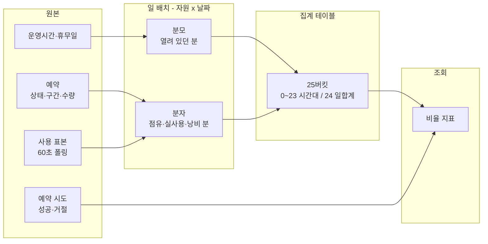
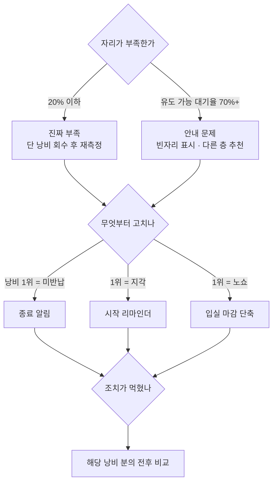
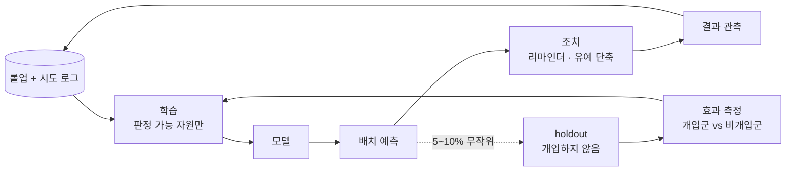

<style>
.mermaid svg { width: 100% !important; max-width: 100% !important; height: auto !important; }
</style>

## 예약 기록은 이미 답을 갖고 있다

건물관리에는 바뀌지 않는 제약이 있다.

> **예약제 시설은 못 늘린다. 그런데 민원은 온다.**

회의실·주차면·세탁기·게스트룸 — 전부 같은 조건이다. 층을 넓힐 수도, 배수·전기 설비를 새로 깔 수도 없다.
그러니 "자리가 모자라다"는 민원에 대한 답은 처음부터 정해져 있다 — **있는 걸로 어떻게든 돌려야 한다.**

문제는 그 "어떻게든"을 **아무도 숫자로 말하지 못한다**는 것이다.

- 정말 자리가 없어서 못 쓴 건가, **비어 있는데 몰라서** 못 쓴 건가
- 잡아만 두고 안 쓰는 시간이 얼마나 되나
- 뭘 바꾸면 민원이 줄어드나

세 질문 모두 **예약 시스템 안에 답이 이미 쌓여 있다.** 꺼내 쓰지 않고 있을 뿐이다.

예약 시스템은 배분을 *기록*하고 충돌을 막는 장치다. 그 기록 위에 집계 한 겹만 얹으면
지금까지 답할 수 없던 질문에 답할 수 있다.

| | 예약 시스템이 지금 답하는 것 | 집계를 얹으면 |
|---|---|---|
| 단위 | 건수 | **시간(분)** |
| 기준 | 예약 상태 | **열려 있던 시간 대비 얼마나** |
| 답 | "이번 달 예약 3천 건" | **"같은 기기로 하루 수십 회를 더 돌릴 수 있다"** |

**"예약 3천 건"은 그 자원이 잘 쓰였다는 뜻이 아니다.** 전부 잡아만 두고 안 썼을 수도 있다.
그리고 건수는 **못 잡고 돌아선 사람을 한 명도 세지 않는다** — 민원을 넣는 건 정작 그쪽인데.

건수를 세는 집계 위에 **시간을 세는 집계**가 따로 필요한 이유다.

### 민원이 올라왔을 때 무엇을 읽어내는가

세탁실 수십 대 규모에서 이 체계가 답하는 것은 네 가지다.

| 물음 | 이 지표가 답한다 |
|---|---|
| 자원이 모자란가 | **예약 점유율** — 하루 평균으로 정말 꽉 찼는지 |
| 그럼 왜 못 쓰나 | **회수 가능한 낭비** — 다 돌고 안 빼감 · 지각 · 노쇼로 쪼갠 시간 |
| 얼마나 되찾을 수 있나 | **회수 가능 회차** — 못 잡고 돌아서는 사람들이 쓸 수 있는 양 |
| 민원을 줄일 수 있나 | **유도 가능 대기율** — 못 잡은 그 시각 다른 세탁실이 비어 있었는지 |

흔한 결과는 이렇다. 점유율은 30% 안팎인데 저녁 특정 시간대만 꽉 차고, 못 잡은 건의 상당수는
**그 시각 다른 층이 비어 있다.** 즉 총량이 모자란 게 아니라 **쏠림과 안내**의 문제다.

마지막 줄이 이 체계의 결론이다. **기기를 사는 대신 "7층에 3대 비어 있어요"를 띄우면 되는 문제**였고,
그걸 증명하는 데 쓴 재료는 **대부분 이미 쌓이고 있던 기록**이다. 예약·센서 표본·운영시간 셋은
예약 기능과 센서 연동을 켠 순간부터 있었다. **새로 만든 건 하나 — 예약 시도 기록**이고,
그건 뒤에서 따로 이야기한다.

### 센서가 없어도 절반은 나온다

도입 문턱을 먼저 밝히면, 이 체계는 두 단계로 켜진다.

| 갖춘 것 | 볼 수 있는 것 |
|---|---|
| **예약 시스템만** | 점유율 · 회전율 · 희망 시간 확보율 · 대기 · **유도 가능 대기율** |
| **+ 사용 신호**(스마트플러그·재실 센서·LPR) | 실사용률 · 지각 · 미반납 · 무단 사용 · 노쇼 판정 |

**"민원이 나는 그 시간에 정말 자리가 없었나"** 는 **예약 기록만으로 답이 나온다.**
센서는 "잡아두고 안 쓴 시간"을 분해해 **무엇부터 고칠지**를 알려주는 단계다.

이 글은 그 지표를 어떻게 정의했는지에 대한 기록이다. 각 지표의 **분자와 분모에 정확히 무엇이 들어가는지**를 쓴다.

> 1차 적용 대상은 기숙사 세탁기다. 예약 기록과 사용 신호가 둘 다 있는 유일한 자원이었기 때문이다.
> 집계 레이어는 신호의 종류를 모르고 "돌았나(`running`)"만 보므로,
> 회의실에 재실 센서를, 주차에 LPR 을 붙이면 **같은 정의가 그대로 적용된다.**

## 데이터 플로우



한 자원의 하루를 **25칸**으로 적재한다. `[0..23]` 은 시간대, `[24]` 는 그날 합계다.

시간과 일을 **둘 다** 쌓는 이유는 명확하다. 하루로 합치면 "언제 붐비나"가 사라지고,
시간만 두면 일 단위 비교가 매번 24행 합산이 된다. 저장 비용보다 질의 단순함이 크다.

---

# 분모 — 그 자원이 열려 있던 시간

모든 이용률의 바닥이다. 여기가 틀리면 위의 모든 비율이 같이 틀린다.

## 기본 규칙

| 상황 | 분모 |
|---|---|
| 운영시간 설정이 **아예 없음** | **1,440분** (24시간 운영으로 간주) |
| 설정은 있는데 **그 요일 행이 없음** | **0분** (휴무) |
| 휴무일로 지정된 날 | **0분** (종일) |
| 운영시간 창이 **겹침** | **합이 아니라 합집합** |

두 번째 줄이 중요하다. "설정 없음"과 "그 요일 없음"은 **반대**로 해석해야 한다.
전자는 아직 안 정한 것이라 24시간으로 보고, 후자는 명시적으로 안 여는 날이라 0이다.
둘을 같게 다루면 주 5일 운영 자원의 점유율이 실제의 71%(5/7)로 찍힌다.

네 번째 줄은 실제로 사고를 냈다. 운영시간을 `09–18` 과 `12–14` 두 줄로 넣은 자원이 있었는데,
더하면 660분이고 실제 개방은 **540분**이다. 분모가 22% 부풀면 점유율이 그만큼 낮게 나오고,
**"자원이 놀고 있다"는 정반대 결론**이 나온다.

```python
# 창을 더하지 않고 분 단위 합집합을 낸다(겹침을 막는 제약이 스키마에 없다).
open_minute = bytearray(1440)
for st, et in windows_of(weekday):
    s, e = st.hour * 60 + st.minute, et.hour * 60 + et.minute
    if e <= s:
        continue                      # 자정 넘김은 스키마가 막는다
    for m in range(s, min(e, 1440)):
        open_minute[m] = 1
capacity_minutes = sum(open_minute)
```

## 예약 모드에 따라 단위가 갈린다

분모의 단위가 자원 종류마다 다르다. 이걸 하나로 묶으면 둘 다 틀린다.

| 모드 | 예시 | 분모 단위 |
|---|---|---|
| `TIME_SLOT` | 회의실·세탁기 | **분** |
| `OCCUPANCY` | 라운지(정원제) | **좌석-분** = 분 × 정원 |
| `OVERNIGHT` · `PERIOD` · `RENTAL` | 게스트룸·대여품 | **일** |

날짜 단위 자원에 시간 분모를 쓰면 "3박 예약"이 하루치 분모를 넘어 점유율 300%가 된다.
반대로 정원 20명 라운지에 좌석을 안 곱하면, 5명이 쓴 1시간이 "그 시간 100% 점유"로 잡힌다.

---

# 분자 — 무슨 일이 일어났는가

예약 한 건이 남기는 시간을 **여러 갈래**로 쪼갠다. 처방이 다르기 때문이다.

```mermaid
gantt
    dateFormat HH:mm
    axisFormat %H:%M
    title  예약 09:00~10:30 한 건이 남기는 분
    section 예약이 잡은 구간
    점유 booked 90분        :done, 09:00, 90m
    section 실제로 일어난 일
    지각 late 12분          :crit, 09:00, 12m
    실사용 used 58분        :active, 09:12, 58m
    미반납 idle 20분        :crit, 10:10, 20m
```



## 점유 분 (`booked`)

**예약이 자원을 붙잡고 있던 분.** 실제 사용 여부와 무관하다.

| | |
|---|---|
| 세는 상태 | `CONFIRMED` · `CHECKED_IN` · `IN_USE` · `COMPLETED` |
| 안 세는 상태 | `CANCELLED`(실제로 비었다) · `WAITLISTED`(대기는 자원을 안 붙잡는다) |
| 곱하는 값 | `quantity` — 정원제 자원은 좌석-분으로 센다 |
| 자르는 범위 | 그날 `00:00~24:00` 으로 클립 |

🚨 **대기를 점유로 세면 안 된다.** 옆 자원의 대기줄 때문에 "꽉 찼다"로 보여,
뒤에 나올 유도 가능 대기율이 과소평가된다.

🚨 **예약은 "그날 시작한" 것이 아니라 "그날에 걸치는" 것을 받는다.**
전날 22시에 시작해 오늘 새벽에 끝난 예약의 오늘 몫을 놓치지 않기 위해서다.

## 실사용 분 (`used`)

**센서가 "돌았다"고 말한 분.** 표본 1행 = 1분(60초 폴링)이다.

```python
if u["running"] is not True:          # 판독 실패(NULL)는 여기서 자연히 빠진다
    continue
# 🚨 예약 구간 밖 가동은 실사용에 안 넣는다. 구간 밖이면 어디에도 안 넣는다.
if t < r["start_at"] or (r["end_at"] and t >= r["end_at"]):
    continue
used += 1
```

**예약 구간으로 자르는 게 핵심이다.** 안 자르면 종료 후 초과 사용이 실사용에 섞여
지각·미반납 낭비를 서로 상쇄해 버린다. 결과적으로 "낭비가 없다"로 보인다.

## 무단 사용 분 (`walkup`)

**예약 없이 돌아간 분.** 표본에 예약 id 가 없는 경우다.

여기에 지표 설계상 **의도적인 비대칭**이 있다.

| 지표 | walkup 포함? |
|---|---|
| 실사용률 | **포함** — 자원은 실제로 돌았으니까 |
| 예약 점유율 | **제외** — 예약이 잡은 시간이 아니니까 |

**두 값의 차이가 곧 "예약 없이 쓰는 양"** 이고, 이게 커지면 예약제가 안 지켜지고 있다는 신호다.
한쪽으로 통일하면 이 사실 자체를 볼 수 없게 된다.

## 미상 분 (`unknown`)

**센서로 못 본 분.** 이 항목이 없으면 지표 전체가 거짓말을 한다.

두 경로로 쌓인다.

| 경로 | 뜻 |
|---|---|
| 판독 실패 행 (`read_error`) | 센서를 못 읽은 분 |
| 폴링이 끊긴 공백 | 행조차 없는 구간(앱 재기동·스케줄러 정지) |

> **센서를 못 읽은 그 분은 "안 돌았다"가 아니라 "모른다"다.**
> 이 구분이 없으면 수집 장애 구간이 지각·미반납으로 잘못 귀속되고, **센서 사망이 "안 씀"으로 읽힌다.**

폴링 공백은 **그날 표본 안에서만** 본다. 자정을 넘는 공백은 양쪽 어느 날에서도 세지 않는다 —
하루 단위로 계산하는데 다른 날 표본을 끌어오면 재실행 결과가 달라지기 때문이다.

## 낭비 3종 — 처방이 다르니 따로 센다

| 분자 | 구간 | 처방 |
|---|---|---|
| **지각** `late` | 예약 시작 → **첫** 가동 | 시작 리마인더 |
| **미반납** `idle` | **마지막** 가동 → 예약 종료 | **종료 알림** |
| **노쇼** `noshow` | 한 번도 안 돌린 예약의 **전 구간** | 입실 마감 단축 |

합쳐서 "낭비 830시간"이라고만 하면 뭘 해야 할지 알 수 없다. **같은 12분이라도 앞이면 리마인더,
뒤면 종료 알림**이다. 쪼개는 것 자체가 설계다.

**미반납은 사용 신호가 있어야만 보인다.** 예약 기록만으로는 "다 돌고 안 빼간 20분"과
"끝까지 쓴 20분"이 완전히 같아 보인다. 체감 병목은 대개 이쪽인데도 그렇다.

## 건수 계열

| 분자 | 뜻 |
|---|---|
| `completed_cnt` | 완료 건수 |
| `noshow_cnt` | 노쇼 건수 |
| `cancelled_cnt` | 취소 건수 |
| `waitlisted_cnt` | 대기 건수 |
| `overuse_cnt` | 예약이 끝났는데도 돌고 있던 건수 |

건수는 **예약 시작 시각 버킷에 통째로 귀속**한다. 분 단위처럼 나눠 담으면 자정을 걸친 예약이
이틀에 걸쳐 두 번 세진다.

---

# 비율 — 분자 ÷ 분모

위 재료로 만드는 지표 전체다.

## 이용 지표

| 지표 | 분자 | 분모 | 읽는 법 |
|---|---|---|---|
| **예약 점유율** | `booked` | `capacity` | 열린 시간 중 잡힌 비율 |
| **실사용률** | `used + walkup` | `capacity` | 열린 시간 중 실제로 돌아간 비율 |
| **유령 예약률** | `booked − used` | `booked` | 잡아만 두고 안 쓴 몫 |
| **무단 사용 비중** | `walkup` | `used + walkup` | 실사용 중 예약 없이 쓴 몫 |
| **회전율** | `completed_cnt` | `자원 수 × 일수` | 기기당 하루 몇 회 |
| **노쇼율** | `noshow_cnt` | `completed_cnt + noshow_cnt` | 종결 예약 중 안 온 비율 |

**예약 점유율과 실사용률의 차이**가 이 체계의 첫 번째 관찰값이다. 그 차이가 곧
"잡아두고 안 쓴 몫"이고, 아래 낭비 3종의 합과 맞아떨어져야 한다.

## 낭비 지표 — 시간을 회차로, 회차를 대수로

시간은 운영자에게 와닿지 않는다. **두 번 환산한다.**

| 지표 | 계산 |
|---|---|
| **회수 가능 회차** | `(late + idle + noshow) ÷ 한 회 길이 ÷ 일수` |
| **몇 사람 몫** | `회수 가능 회차 × 1회 평균 이용 인원` |

> 자원 N대가 하루 x회 돈다. 낭비를 걷어내면 하루 **y회를 더 돌릴 수 있다**
> — 지금 **못 잡고 돌아서는 사람들이 쓸 수 있는 양**이다.

이 한 문장이 화면 맨 위에 온다. **민원 건수와 같은 단위로 말하기 때문**이다.
"점유율 31%"로는 운영자가 무엇을 해야 할지 알 수 없다.

## 신뢰도 지표 — 숫자 옆에 반드시 붙는다

| 지표 | 분자 | 분모 |
|---|---|---|
| **센서 커버리지** | 센서 연동 버킷 수 | 전체 버킷 수 |
| **미상 비율** | `unknown` | `booked` |

미상 비율이 임계(0.5)를 넘으면 **실사용 계열을 값 자체로 내려보내지 않는다.**

```python
r["usable"] = bool(sensor_buckets) and (r["unknown_ratio"] < UNKNOWN_RATIO_LIMIT)
if not r["usable"]:
    # 화면이 실수로 0% 를 그리지 않게 값 자체를 비운다. 못 본 것은 0 이 아니다.
    r["actual_use_pct"] = None
    r["walkup_share_pct"] = None
    r["ghost_pct"] = None
```

> **판정 불가와 0% 는 정반대 주장이다.** 0% 는 "아무도 안 썼다"는 사실 진술이고,
> 판정 불가는 "모른다"이다. 이 구분이 없으면 센서가 죽은 자원이 "안 쓰는 자원"으로 보여
> 철거 대상이 된다.

집계 서버가 `null` 로 내려보내고, 화면은 그걸 `—` 로 그린다. 화면 쪽 규칙으로만 두면
언젠가 한 군데가 빠진다.

**노쇼에는 구조적 편향도 있다.** 노쇼 판정은 센서가 붙은 자원에서만 일어나므로,
센서 없는 자원의 미사용 예약은 그냥 "완료"로 남는다. 그래서 노쇼율은 "전체"가 아니라
**"판정 가능한 자원 기준"** 이라고 명시해야 한다.

---

# 반대편 — 못 잡은 사람

여기까지는 전부 **성공한 예약**에서 나온 지표다. 그런데 이용자의 핵심 니즈는
"원할 때 쓰고 싶다"이고, 그 반대편은 예약 테이블에 **아무 흔적도 없다.**

겹쳐서 거절되면 기록이 안 남기 때문이다. 그래서 **시도 로그**를 따로 쌓는다 — 성공·거절 전부.

| 지표 | 분자 | 분모 |
|---|---|---|
| **희망 시간 확보율** | 성공 시도 | 전체 시도 |
| **규칙 차단율** | 정책으로 거절된 시도 | 전체 시도 |
| **유도 가능 대기율** | 그 시각 **다른 자원이 비어 있던** 미충족 건수 | 미충족 건수 |

## 유도 가능 대기율이 이 체계의 결론이다

| 값 | 해석 | 조치 |
|---|---|---|
| **70% 이상** | **안내 문제** — 빈 자리는 있었는데 몰랐다 | 빈자리 표시 · 다른 층 추천 |
| 20% 이하 | **진짜 동시 포화** — 건물 전체가 그 시각에 찼다 | 시간 분산 유도 · 1인 상한 · 피크 슬롯 재설계 |

자원이 층마다 나뉘어 있으면 이용자는 거의 **자기 층만 쓴다.** 그래서
*3층 만석 + 대기 5건 / 같은 시각 7층은 9대 유휴* 가 실제로 생긴다. 설비 부족이 아니라 안내 부족이다.

### 같은 지표가 건물마다 다른 답을 낸다

이 지표의 진가는 **하나의 값이 아니라 대비**에서 나온다. 같은 자로 재면 건물이 네 유형으로 갈린다.

| 유형 | 구성 | 유도 가능 | 처방 |
|---|---|---|---|
| **엇갈려 참** | 2층 아침형 · 9층 저녁형 | **높다** | **안내.** 비용 0 |
| **동시 포화** | 두 층이 모두 저녁 | **낮다** | 시간 분산 · 1인 상한 |
| **단독동** | 세탁실 1곳뿐 | **0** | 비교 대상 자체가 없다 |
| **혼재** | 한쪽 포화 · 한쪽 저사용 | 중간 | 시간대별로 갈린다 |

> **점유율만 보면 앞의 두 유형이 비슷해 보인다. 그런데 처방은 정반대다.**

둘 다 "저녁에 자리가 없다" 는 민원이 올라온다. 차이는 **언제 찼느냐**다.
엇갈려 차는 건물은 못 잡은 순간에도 다른 층이 비어 있고,
함께 차는 건물은 보낼 데가 없다.

**건수 집계로는 이 구분이 절대 안 나온다.** "3층 예약 400건, 9층 120건" 을 아무리 들여다봐도
*못 잡은 그 순간에* 9층이 비었는지는 알 수 없다.

정의에 함정이 둘 있다.

- **범위를 좁힐 땐 모집단만 좁히고 비교 대상은 안 좁힌다.** 둘 다 좁히면 비교할 "다른 데"가
  사라져 결과가 항상 0% 가 된다
- **노쇼를 "비어 있었다"로 세지 않는다.** 안내하는 시점에는 그게 노쇼가 될지 아무도 모른다.
  사후에만 아는 사실로 "그때 보낼 수 있었다"고 판정하면 지표가 운영자를 속인다

그리고 이 지표는 **집계표로는 못 만든다.** 집계표는 "3층이 오늘 65% 찼다"까지만 안다.
대기가 걸린 **그 시각 그 순간**에 다른 자원이 어땠는지를 되짚어야 해서 원본을 시각 단위로 맞춰봐야 한다.

모집단은 둘을 합친다. **소급 가능 여부가 다르다.**

| 모집단 | 출처 | 과거분 |
|---|---|---|
| 대기를 건 사람 | 예약 상태 `WAITLISTED` — **원래 있던 데이터** | 계산된다 |
| 그냥 거절된 사람 | 시도 기록 `CONFLICT` — **새로 만든 데이터** | 켠 시점부터 |

대기열은 **신청해야** 서는 것이라 대부분은 그냥 거절된다. 실제 "못 쓴 사람"은 아래쪽이 훨씬 많다.
그래서 시도 기록이 없으면 이 지표가 **실제보다 작게** 나온다.

---

# 그래서 무엇을 보는가

지표를 다 모아도 "그래서 뭘 하라는 건가"에 답하지 못하면 대시보드는 장식이다.
이 체계는 **질문 세 개**에 답하도록 짜였고, 읽는 순서가 곧 판단 순서다.



## ① 민원의 원인이 무엇인가 — 유도 가능 대기율

가장 먼저 보는 값이고, **돈이 걸린 유일한 판단**이다.
70%를 넘으면 자원이 모자란 게 아니라 **어디가 비었는지 몰라서** 생긴 일이므로,
안내를 넣고 이 수치가 떨어지는지 본다.

## ② 무엇부터 고치나 — 낭비 1위 항목

낭비를 세 갈래로 쪼갠 이유가 여기서 회수된다. **1위 항목이 곧 처방**이다.
합쳐서 한 숫자로 뒀으면 "크다"까지만 알고 다음 행동이 안 나온다.

세 항목 모두 **알림과 정책으로 푼다.** 그래서 1위가 곧 이번 주에 할 일이 된다.

## ③ 조치가 먹혔나 — 반은 되고 반은 안 된다

종료 알림을 켰으면 **미반납 분**이 줄어야 한다. 주 단위로 쌓아 두었으니 그건 보인다.

화면은 낭비를 막대로, 실사용률을 선으로 겹쳐 그린다. **둘 다 열린 시간 대비 비율**이라 축이 하나다 —
축을 둘로 두면 눈금 배치만으로 "낭비가 줄고 실사용이 늘었다" 를 연출할 수 있기 때문이다.

조치가 먹히면 **막대가 꺾이는 주**가 생긴다. 전반 대비 후반 평균을 자동으로 비교해
"낭비가 줄면서 실사용이 올랐다" 인지 "뚜렷한 변화가 없다" 인지까지 문장으로 낸다.
여기까지는 된다.

**안 되는 건 "언제 켰는지" 다.** 설정 테이블이 현재 값만 보관해서, 화면이
"여기서 알림을 켰다" 를 자동으로 표시하지 못한다. 운영자가 날짜를 따로 기억해야 한다.

조치를 제안하는 화면을 만들어 놓고 **그 조치의 시점을 기록하지 않는 것**이
이 설계에서 가장 크게 남은 구멍이다. 정책 변경 이력 적재가 다음 작업이고,
그게 있어야 아래 AI 단계의 **개입 효과 측정**도 성립한다.

> 그리고 이 한계는 지표 설계의 문제가 아니라 **조치하는 쪽이 기록을 안 남기는** 문제다.
> 분석을 아무리 정교하게 만들어도, 무엇을 언제 바꿨는지 모르면 인과를 말할 수 없다.

## 누가 무엇을 보나

| 보는 사람 | 보는 것 | 얻는 것 |
|---|---|---|
| 의사결정자 | 회수 가능 회차 · 민원 대비 | 같은 자원으로 얻는 성과 |
| 운영 책임자 | 회전율 · 점유율 추세 | 정책이 먹히고 있나 |
| 현장 관리자 | 낭비 1위 + 처방 | 이번 주에 뭘 바꿀까 |
| 정책 담당 | 확보율 · 대기 · 무단 사용 | 이용자가 실제로 겪는 것 |
| 설비 담당 | 센서 커버리지 · 미상 비율 | 죽은 센서 색출 |

---

# 이 지표 위에서 AI 로 무엇을 하나

지금까지는 **일어난 일을 재는 것**이었다. 여기서 두 방향으로 확장한다 —
**일어날 일을 예측**하고, **무엇을 바꿀지 추천**한다.

중요한 건 순서다. **추천이 먼저고 예측이 나중이다.** 추천은 이미 만든 지표만으로 되지만,
예측은 데이터가 쌓여야 한다.



## A. 정책 추천 — 지금 할 수 있다

"AI 추천"이라고 부르지만 **본체는 규칙과 시뮬레이션**이다.

| 층 | 하는 일 | 필요한 데이터 |
|---|---|---|
| ① 규칙 엔진 | 낭비 유형 → 처방 후보 | **없음.** 낭비 분해가 곧 규칙 사양 |
| ② 시뮬레이션 | 효과 추정 | 과거 **실사용 길이 분포**만 |
| ③ LLM | ①②의 출력을 문장으로 | ①②의 출력 |

②가 재미있는 지점이다. 과거 실사용 길이 분포를 갖고 **슬롯을 다시 잘라본다**(60·90·120분 그리드).
재슬롯팅했을 때 회전율과 대기가 어떻게 변하는지 계산한다.

여기서 한 번 틀렸다. 초기 시뮬레이션이 "45분으로 줄이라"고 추천했는데,
**실제 사용의 대부분이 두 칸을 먹는** 상황이었다. 칸을 줄이면 한 사람이 두 칸을 잡게 되어
회전율이 오히려 떨어진다. 그래서 두 가지를 넣었다.

- **`bound_by`** — 지금 병목이 수요인가 칸 수인가. 수요면 칸을 바꿔도 회전은 안 는다
- **다중 칸 점유율 상한** — 한 사용이 두 칸을 먹는 비율이 임계를 넘는 후보는 탈락

## B. 노쇼 예측 — 데이터가 쌓여야 한다

| | |
|---|---|
| 질문 | "이 예약은 안 올 확률이 얼마인가" |
| 출력 | 예약별 확률 + **기여 피처 상위 3개** |
| 시점 | 시작 N시간 전 배치. 실시간 불필요 |
| 조치 | 확률 높은 예약에 리마인더 / 유예 단축 |

피처는 네 묶음이다.

| 묶음 | 피처 |
|---|---|
| 예약 시점 | 리드타임 · 요일 · 시작 시간대 · 슬롯 길이 · 변경 횟수 |
| 요청자 이력 | 과거 노쇼율 · 최근 30일 이용 횟수 · 평균 체크인 지연 |
| 자원 맥락 | 자원 유형 · 그 시간대 평균 점유율 · 동시간 대기 유무 |
| 운영 맥락 | 공휴일·방학 · 직전 24시간 해당 자원 노쇼 수 |

🚨 **라벨을 만들 때 지표 설계의 편향이 그대로 따라온다.** 센서 없는 자원의 "노쇼 아님"은
관측이 아니라 **무지**다. 라벨에 섞으면 모델이 "센서 없는 자원 = 노쇼 없음"을 학습한다.
그래서 학습 대상은 **센서 링크 + 센서 생존** 자원의 확정 도달 건으로 제한한다.

## C. 수요 예측 — 절단된 수요를 보정해야 한다

| | |
|---|---|
| 질문 | "다음 주 화요일 20시에 몇 대가 필요한가" |
| 출력 | 자원군 × 시간대 예상 수요 + 신뢰구간 |
| 용도 | 피크 슬롯 조정 · 비피크 유도 · 선제 안내 |

여기에 이 체계에서 가장 중요한 설계 포인트가 있다.

> **관측되는 예약 수는 공급 상한에 잘린 값이다.**

21시가 항상 만석이면 관측 수요는 자원 수에서 멈추고, 모델은 "21시 수요 = 자원 수"라고 학습한다.
실수요는 그보다 크다.

```
보정 수요 = 성사된 예약 + 대기 + 충돌로 거절된 시도
                              └ 앞서 만든 시도 로그가 전제
```

**시도 로그가 없으면 포화 시간대일수록 수요를 과소 추정하고, 그 결과 "민원이 날 만한 시간대가 없다"는
정반대 결론이 나온다.** 앞에서 시도 로그를 화면보다 먼저 넣은 이유가 이것이다.

## 지키기로 한 원칙

모델을 붙이기 전에 정해둔 것들이다.

| | |
|---|---|
| **베이스라인부터** | 규칙·통계로 먼저 답을 내고, ML 은 그걸 **이길 때만** 채택한다. 요일×시간대 중앙값보다 못한 수요 예측은 운영에 해롭다 |
| **판정 가능 자원만 학습** | 무지를 라벨로 쓰지 않는다 |
| **시드로 학습하지 않는다** | 검증용 시드는 결정적 규칙으로 만든 데이터라 모델이 **그 규칙을 되학습할 뿐**이다. 정확도만 높게 나와 더 위험하다 |
| **개입이 라벨을 바꾼다** | 리마인더를 보내면 노쇼가 줄어 다음 학습 분포가 달라진다. **무작위 비개입 holdout 5~10%** 를 남겨 효과 측정과 재학습의 기준선으로 쓴다 |
| **확률만 내놓지 않는다** | 화면에는 **기여 피처(근거)** 를 함께 낸다. 개인 식별 정보는 노출하지 않는다 |

## 채택 기준

| 모델 | 최소 데이터 | 이겨야 할 베이스라인 |
|---|---|---|
| 노쇼 예측 | 확정 도달 500건+ / 노쇼 50건+ (판정 가능 자원) | 요청자 과거 노쇼율 |
| 수요 예측 | 8주+ | seasonal naive(같은 요일·시간대 최근 4주 중앙값) |

---

## 예약 시스템이 답할 수 있게 되는 것

같은 데이터를 갖고도, 집계 한 겹이 있고 없고에 따라 답할 수 있는 질문이 달라진다.

| 질문 | 집계 없이 | 이 체계로 |
|---|---|---|
| 자원이 모자란가 | 체감·민원 | **점유율과 실사용률로 판정** |
| 늘려야 하나 | 알 수 없음 | **유도 가능 대기율** — 70%↑ 면 안내로 해결 |
| 무엇부터 고치나 | 알 수 없음 | **낭비 1위 항목이 곧 처방** |
| 얼마나 좋아지나 | 알 수 없음 | **회수 가능 회차 → 몇 사람이 더 쓸 수 있나** |
| 이용자는 만족하나 | 민원 수 | **확보율 · 대기 · 무단 사용** |
| 조치가 먹혔나 | 알 수 없음 | 해당 낭비 분의 전후 비교 *(정책 이력 필요)* |

그리고 이 답들은 **대부분 이미 쌓이고 있던 기록**에서 나왔다. 새로 만든 건 예약 시도 기록 하나다.
센서를 붙이면 "잡아두고 안 쓴 시간"이 분해되어 처방까지 나오고, 붙이지 않아도
가장 중요한 판단("민원이 난 그 시간에 정말 자리가 없었나")은 답이 나온다.

## 정리 — 이 설계가 지킨 원칙

- **건수 위에 시간을 얹는다.** "예약 100건"은 그 자원이 잘 쓰였다는 뜻이 아니다.
- **분모를 먼저 정의한다.** 미설정과 휴무는 반대로 해석하고, 겹치는 창은 더하지 않고 합집합을 낸다.
  분모가 틀리면 위의 모든 비율이 같이 틀린다.
- **낭비를 앞·뒤·부재로 쪼갠다.** 처방이 다르기 때문이다. 합쳐서 한 숫자로 두면
  "크다"까지만 알고 뭘 할지는 모른다.
- **회수 못 하는 값을 낭비에 넣지 않는다.** 조치가 없는 항목이 1위를 차지하면
  정작 손댈 수 있는 항목이 아래로 밀린다.
- **임계값은 정책이 아니라 관측에서 뽑는다.** 정책값에 지표를 묶으면 정책이 바뀔 때 지표가 거짓말한다.
- **walk-up 은 실사용에 넣고 점유에서 뺀다.** 두 값의 차이가 곧 예약제가 안 지켜지는 양이다.
- **못 본 것은 0 이 아니다.** 판정 불가는 값을 비워서 내려보낸다. 0 으로 그리면
  센서가 죽은 자원이 "안 쓰는 자원"이 된다.
- **결론은 사람 단위로 환산한다.** 민원은 사람이 넣지 비율이 넣지 않는다.
- **성공한 예약만으로는 반쪽이다.** 거절된 시도를 따로 쌓아야 "원할 때 썼나"에 답할 수 있고,
  그 위에서야 "정말 자리가 없었나, 몰라서 못 쓴 건가"가 갈린다.
- 집계 레이어는 **신호의 종류를 모른다.** `running` 만 본다. 그래서 회의실·주차로
  자원을 넓혀도 정의를 다시 쓰지 않는다.
- **지표는 판단으로 끝나야 한다.** 민원 원인이 무엇인가 / 무엇부터 고치나 / 조치가 먹혔나 —
  세 질문에 답하지 못하는 숫자는 대시보드 장식이다.
- **AI 는 이 지표 위에 얹는 것이지 대체하는 게 아니다.** 추천의 본체는 규칙과 시뮬레이션이고,
  예측 2종은 데이터가 쌓인 뒤다. 그리고 **지표 설계의 편향은 학습 라벨로 그대로 따라온다** —
  센서 없는 자원의 "노쇼 아님"은 관측이 아니라 무지다.
