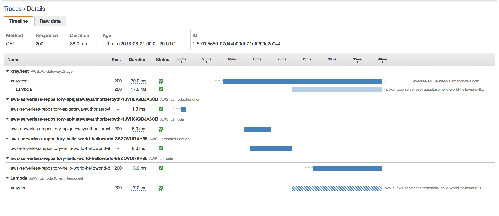

## SQS
### Features

- A Web Service that gives you access to a message queue that can be used to store messages while waiting for a computer to process them
- A Queue is a **temporary repository** for messages that are awaiting processing
- Using SQS, you can **decouple the components** of an application so they run independently.
- SQS is **Pull-basexd**
- Messages are 256KB in size
- Messages can be kept in the queue from 1min to 14 days; the default retention period is 4 days
- SQS guarantees that your messages will be processed **at least once**
- **SQS long polling**
  - A way to retrieve messages from SQS queues
  - While the regular **short polling** returns immediately, long polling doesn't return a response until a message arrives in the message queue, or the long poll times out.

### 2 Queue Types 
- Standard Queues(default) 
- FIFO Queues : exactly-once processing

### Visibility Time Out
- The amount of time that the message is invisible in the SQS queue after a reader picks up that message.
- Provided the job is processed before the visibility time out expires, the message will then be deleted from the queue
- If the job is not processed within that time, the message will become visible again and another reader will process. This could result in the same message being **delievered twice**
- Visibility timeout max is 12 hours

## SWF
### Features
- Simple Workflow Service 
- **Tasks** represent invocations of various processing steps in an application which can be performed by execurable code, web service calls, human actions, and scripts. 
- **SWF Actors** : Workflow Starters, Deciders, Activity Workers
### SWF vs. SQS
|Feature|SWF|SQS|
|:-------------:|:-------------:|:-------------:|
|retention period|1 year|14 days|
|API|Task-oriented API|Message-oriented API|
|duplicated|a task is assigned only once. NEVER duplicated|you need to handle duplicated messages|
|tracking|keeps track of all the tasks and events|you need to implement your own application-level tracking

## Step Functions
-  serverless orchestration for modern applications

## SNS
### Features 
- Simple Notification Service
- Makes it easy to set up, operate, and send notifications from the cloud. 
- **SQS Integration** : SNS can also deliver notifications by SMS or email to SQS queues / HTTP endpoint
- Instantaneous, **push-based** delivery (no polling)
- Simple APIs and easy integration with applications 
- Flexible message delivery over multiple transport protocols
- Inexpensive, pay-as-you-go model with no up-front costs 
- Web-based AWS Management Console offers the simplicity
- **SNS vs. SQS**
  - Both Messaging Service
  - SNS - Push
  - SQS - Polls(Pulls)
- **SNS vs. SES**
  - Amazon SES는 이메일을 통해 커뮤니케이션을 전송해야 하는 애플리케이션을 위한 서비스입니다. 그리고 사용자 지정 이메일 헤더 필드와 여러 MIME 유형을 지원합니다. Amazon SES는 사내 이메일 솔루션을 구축하거나 타사 이메일 서비스를 라이선싱, 설치 및 운영하는 데 따르는 복잡성과 비용을 없애줍니다.
  - 반면에 Amazon Simple Notification Service(Amazon SNS)는 메시징 지향 애플리케이션입니다. 여기에서는 타이밍이 중요한 "푸시" 알림을 요청하고 수신하는 구독자가 여러 명으로, HTTP, Amazon SQS, 이메일 등의 전송 프로토콜을 직접 선택할 수 있습니다. Amazon SNS 알림의 본문은 UTF-8 스트링 8,192자로 제한되고, 멀티미디어 콘텐츠는 지원하지 않습니다.

## Amazon MQ
### Features
- a managed message broker service for **Apache ActiveMQ** that makes it easy to set up and operate message brokers in the cloud. 
- Easy Connecting : industry-standard APIs and protocols for messaging (**JMS, NMS, AMQP, STOMP, MQTT, WebSocket**)
- **UseCase**
  - If you're using messaging with **existing applications** and want to move your messaging service to the cloud quickly and easily
  - It supports industry-standard APIs and protocols so you can switch from any standards-based message broker to Amazon MQ without rewriting the messaging code in your applications.
- **SQS/SNS UseCase**
  - If you are building **brand new applications** in the cloud
  - Amazon SQS and SNS are lightweight, fully managed message queue and topic services that scale almost infinitely and provide simple, easy-to-use APIs.
  
## Elastic Transcoder
- Media transcoder in the cloud.

## API Gateway 
- API Gateway Options
- API Gateway Configuration
- API Gateway Deployment
- API Gateway Caching : increase performance 
- **Same Origin Policy** : A web browser permits scripts contained in a first web page to access data in a second web page. This is done to prevent **Cross-Site Scripting(XSS)** attacks. 
- **CORS(Cross-Origin Resource Sharing)** : allows restricted resources to be requested from another domain
  - If you are using Javascript/AZAX that uses multiple domains with API Gateway, you have to enable CORS on API Gateway

## Kinesis
- Streaming Data : Purchases from online stores, Stock Prices, Game data, Social network data, Geospatial data(uber), IoT sensor data
### 3 Types of Kinesis
- **Kinesis Streams**
  - **Shards** : the total **capacity** of the stream is the sum of the capacities of its shards.

- **Kinesis Firehose**

- **Kinesis Analytics**

## IoT Core

- a managed cloud service that lets connected devices easily and securely interact with cloud applications and other devices.
- provides secure communication and data processing across different kinds of **connected devices and locations** so you can **easily build IoT applications**.

## Scenario
- You have a web application hosted in EC2 that consumes messages from an **SQS** queue and is integrated with SNS to send out an email to you once the process is complete. You received 5 orders but after a few hours, you saw 20 email notifications in your inbox.    
Which of the following could be the possible culprit for this issue?
  - **A) The web application is not deleting the messages in the SQS queue after it has processed them.**
  - Always remember that the messages in the SQS queue will continue to exist even after the EC2 instance has processed it, until you delete that message. You have to ensure that you delete the message after processing to prevent the message from being received and processed again once the visibility timeout expires.

- A multi-tiered application hosted in your on-premises data center is scheduled to be migrated to AWS. The application has a **message broker service** which uses **industry standard messaging APIs** and protocols that must be migrated as well, without rewriting the messaging code in your application.    
Which of the following is the most suitable service that you should use to move your messaging service to AWS?
  - **A) Amazon MQ**
  - Amazon MQ, Amazon SQS, and Amazon SNS are messaging services that are suitable for anyone from startups to enterprises. If you're using messaging with existing applications and want to move your messaging service to the cloud quickly and easily, it is recommended that you consider Amazon MQ. It supports industry-standard APIs and protocols so you can switch from any standards-based message broker to Amazon MQ without rewriting the messaging code in your application
  - Amazon SWF : is incorrect because this is a fully-managed state tracker and task coordinator service and not a messaging service

- A traffic monitoring and reporting application uses Kinesis to accept real-time data. In order to process and store the data, they used Amazon **Kinesis Data Firehose** to load the streaming data to various AWS resources.       
Which of the following services can you **load streaming data into**?
  - **A) Amazon Elasticsearch Service**
  - **Amazon Kinesis Data Firehose** : capture, transform, and load streaming data into **Amazon S3, Amazon Redshift, Amazon Elasticsearch Service, and Splunk**, enabling near real-time analytics with existing business intelligence tools and dashboards you’re already using today.
  - **S3 Select** : is incorrect because S3 Select is just a feature of Amazon S3 that makes it easy to retrieve specific data from the contents of an object using simple SQL expressions without having to retrieve the entire object.
  - **Redshift Spectrum** : is incorrect because Redshift Spectrum is also just a feature of Amazon Redshift that enables you to run queries against exabytes of unstructured data in Amazon S3 with no loading or ETL required.
  
- A cryptocurrency trading platform is using an API built in AWS Lambda and **API Gateway**. Due to the recent news and rumors about the upcoming price surge of Bitcoin, Ethereum and other cryptocurrencies, it is expected that the trading platform would have a significant **increase in site visitors** and new users in the coming days ahead.    
In this scenario, how can you **protect the backend systems** of the platform from traffic spikes?
  - **A) enabling throttling limits and result caching in API Gateway**
  - **throttling** : Amazon API Gateway provides throttling at multiple levels including global and by service call. Throttling limits can be set for standard rates and bursts. For example, API owners can set a rate limit of 1,000 requests per second for a specific method in their REST APIs, and also configure Amazon API Gateway to handle a burst of 2,000 requests per second for a few seconds. Amazon API Gateway tracks the number of requests per second. Any request over the limit will receive a 429 HTTP response. The client SDKs generated by Amazon API Gateway retry calls automatically when met with this response.
  - **caching** : The cache is provisioned for a specific stage of your APIs. This improves performance and reduces the traffic sent to your back end. Cache settings allow you to control the way the cache key is built and the time-to-live (TTL) of the data stored for each method. Amazon API Gateway also exposes management APIs that help you invalidate the cache for each stage.
   Use throttling limits in API Gateway**

- You have a data analytics application that updates a real-time, foreign exchange dashboard and another separate application that archives data to Amazon Redshift. Both applications are configured to consume data from the same stream concurrently and independently by using **Amazon Kinesis Data Streams.**      
However, you noticed that there are a lot of occurrences where a **shard iterator expires unexpectedly**. Upon checking, you found out that the DynamoDB table used by Kinesis does not have enough **capacity to store** the lease data.    
Which of the following is the most suitable solution to rectify this issue?
  - **A) Increase the write capacity assigned to the shard table.**
  - **Enabling In-Memory Acceleration with DynamoDB Accelerator (DAX)** : is incorrect because the DAX feature is primarily used for **read performance** improvement of your DynamoDB table from milliseconds response time to microseconds.

- A software company has resources hosted in AWS and on-premises servers. You have been requested to create a **decoupled architecture** for applications which make use of both resources.    
Which of the following options are valid? (Choose 2)
  - **A1) Use SWF to utilize both on-premise servers and EC2 instances for your decoupled application**
  - **A2) Use SQS to utilize both on-premise servers and EC2 instances for your decoupled application**
  - **Decoupled architecture** : computing architecture that enables computing components or layers to execute independently while still interfacing with each other.
  - **Amazon SQS** lets you move data between distributed application components and helps you decouple these components. **Amazon SWF** is a web service that makes it easy to coordinate work across distributed application components.

- You have built a web application that checks for new items in an S3 bucket once every hour. If new items exist, a message is added to an **SQS** queue. You have a fleet of EC2 instances which retrieve messages from the SQS queue, process the file, and finally, send you and the user an email confirmation that the item has been successfully processed. Your officemate uploaded one test file to the S3 bucket and after a couple of hours, you noticed that you and your officemate have 50 emails from your application with the same message.    
Which of the following is most likely the root cause why the application has sent you and the user multiple emails?
  - **A) Your application does not issue a delete command to the SQS queue after processiong the message, which is why this message went back to the queue and was processed multiple times.**

- You run a website which accepts high-quality photos and turns them into a downloadable video montage. The website offers a free account and a premium account that guarantees faster processing. All requests by both free and premium members go through a single **SQS** queue and then processed by a group of EC2 instances which generate the videos. You need to ensure that **the premium users** who paid for the service have **higher priority than your free members**.       
How do you re-design your architecture to address this requirement?
  - **A) Create an SQS queue for free members and another one for premium members. Configure your EC2 instances to consume message from the premium queue first and if it is empty, poll from the free member's SQS queue**

- You developed a web application and deployed it on a fleet of EC2 instances, which is **using Amazon SQS**. The requests are saved as messages in the SQS queue which is configured with the maximum message retention period.  However, **after thirteen days** of operation, the web application suddenly **crashed** and there are 10,000 unprocessed messages that are still waiting in the queue. Since you developed the application, you can easily resolve the issue but you need to send a communication to the users on the issue.     
What information will you provide and **what will happen to the unprocessed messages**?
  - **A) Tell the users that the application will be operational shortly and all received requests will be processed after the web application is restarted.**
  - The maximum message retention in SQS is 14 days 

- You are working as a Cloud Consultant for a government agency with a mandate of improving traffic planning, maintenance of roadways and preventing accidents. There is a need to manage traffic infrastructure in real time, alert traffic engineers and emergency response teams when problems are detected, and automatically change traffic signals to get emergency personnel to accident scenes faster by **using sensors and smart devices**.       
Which AWS service will allow the developers of the agency to **connect the said devices to your cloud-based applications**?
  - **A) AWS IoT Core**

- You are a Solutions Architect of a multi-national gaming company which develops video games for PS4, Xbox One and Nintendo Switch consoles, plus a number of mobile games for Android and iOS. Due to the wide range of their products and services, you proposed that they use API Gateway.       
What are **the key features of API Gateway** that you can tell your client? (Choose 2)
  - **A1) You can run your APIs without any servers.**
  - **A2) You pay only for the API calls you receive and the amount of data transfered out**
  
- You are working for a startup as its AWS Chief Architect. You are currently assigned on a project that develops an online registration platform for events, which uses Simple Workflow for complete control of your orchestration logic. A decider ingests the customer name, address, contact number, and email address while the activity workers update the customer with the status of their online application status via email. Recently, you were having problems with your online registration platform which was solved by checking the decision task of your workflow.       
In **SWF**, what is the purpose of a **decision task**?
  - **A) It tells the decider the state the workflow execution**
  - **Workflow** : It defines all the activities in the workflow. 
  - **Activity Task** : It tells the worker to perform a function.
  - **Lambda Task** : It executes a Lambda Function
  - **Decision Task** : It tells a decider that the state of the workflow execution has changed    
  so that the decider can determine the next activity that needs to be performed.(**current workflow history**)
  - **Workflow Starter** : Any application that can initiate workflow executions.
  - **Activity Worker** : A program that receives activity tasks, performs them, and provides results back.
  - **Decider** : It schedules activity tasks, provides input data to the activity workers, processes events.
 
- A leading media company has an application hosted in an EBS-backed EC2 instance which uses **Simple Workflow Service (SWF)** to handle its sequential background jobs. The application works well in production and your manager asked you to also implement the same solution to other areas of their business.        
In which other scenarios can you **use both Simple Workflow Service (SWF) and Amazon EC2** as a solution? (Choose 2)
  - **A1) Managing a multi-step and multi-decision checkout process of an e-commerce mobile app.**
  - **A2) Orchestrating the execution of distributed business processes.**
  - **For a distributed session management for your mobile application** : is incorrect as **Elasticache**

- You are working as a Solutions Architect for a leading airline company where you are building a decoupled application in AWS using EC2, Auto Scaling group, S3 and SQS. You designed the architecture in such a way that the EC2 instances will consume the message from the SQS queue and will automatically scale up or down based on the number of messages in the queue.   
In this scenario, which of the following statements is false about **SQS**?
  - **A) Standard queues preserve the order of messages**
  - **Only FIFO queues can preserve the order of messages and not standard queues.**

- A manufacturing company has EC2 instances running in AWS. The EC2 instances are configured with Auto Scaling. There are a lot of requests being lost because of too much load on the servers. The Auto Scaling is launching new EC2 instances to take the load accordingly yet, there are still some requests that are being lost.    
Which of the following is the MOST suitable solution that you should implement to **avoid losing recently submitted requests**?
  - **A) Use an SQS queue to decouple the application components**
  - **Keeping one extra Spot EC2 instance always ready in case a spike occurs or using larger instances for your application** : are incorrect because using a Spot or a larger EC2 instance would not prevent data from being lost in case of a larger spike. You can take advantage of the durability and elasticity of SQS to keep the messages available for consumption by your instances.
  - **Pre-warming your Elastic Load Balancer** : is incorrect because it would be difficult to predict how much traffic your load balancer will be receiving in a certain period of time, which corresponds to how long you will pre-warm the load balancer. It is still better to use SQS in this scenario rather than re-configuring your load balancer.

- You are working for a **Social Media Analytics** company as its head data analyst. You want to **collect gigabytes of data per second** from websites and social media feeds to gain insights from data generated by its offerings and continuously improve the user experience. To meet this design requirement, you have developed an application hosted on an Auto Scaling group of Spot EC2 instances which processes the data and stores the results to DynamoDB and Redshift.     
Which AWS service can you use to **collect and process large streams of data records in real time**? 
  - **A) Amazon Kinesis Data Streams**
  - IT infrastructure log data, application logs, social media, market data feeds, and web clickstream data. Because the response time for the data intake and processing is in real time, the processing is typically lightweight.
  - **S3** : is incorrect because this is mainly used for object storage of frequently and infrequently accessed files with high durability.
  - **Redshift** : is incorrect because this is mainly used for data warehousing making it simple and cost-effective to analyze your data across your data warehouse and data lake.

- You installed sensors to track the number of visitors that goes to the park. The data is sent everyday to an **Amazon Kinesis stream** with default settings for processing, in which a consumer is configured to process the data every other day. You noticed that your S3 bucket is **not receiving all of the data that is being sent to the Kinesis stream**. You checked the sensors if they are properly sending the data to Amazon Kinesis and verified that the data is indeed sent everyday.    
What could be the reason for this?
  - **A) By default, the data records are only accessible for 24 hours from the time they are added to a Kinesis stream**
  - **retention period** : A Kinesis data stream stores records from 24 hours by default to a maximum of 168 hours.

- You are working for a data analytics company as a Software Engineer, which has a client that is setting up an innovative checkout-free grocery store. You developed a monitoring application that uses smart sensors to collect the items that your customers are getting from the grocery’s refrigerators and shelves then automatically maps it to their accounts. To know more about the buying behavior of your customers, you want to analyze the items that are constantly being bought and store the results in S3 for durable storage.       
What **service can you use to easily capture, transform, and load streaming data into Amazon S3, Amazon Elasticsearch Service, and Splunk**? 
  - **A) Amazon Kinesis Data Firehose**
  - **Amazon Kinesis** : is incorrect because this is the streaming data platform of AWS and has four distinct services under it: Kinesis Data Firehose, Kinesis Data Streams, Kinesis Video Streams, and Amazon Kinesis Data Analytics. 
  - **Amazon Macie** : is incorrect because this is mainly utilized as a security service that uses machine learning to automatically discover, classify, and protect sensitive data in AWS.

- An application is using a RESTful API hosted in AWS which uses **Amazon API Gateway** and AWS Lambda. There is a requirement to **trace and analyze user requests as they travel through your Amazon API Gateway APIs** to the underlying services.     
Which of the following is the most suitable service to use to meet this requirement?
  - **A) AWS X-Ray**
  - X-Ray gives you an end-to-end view of an entire request, so you can analyze latencies in your APIs and their backend services. 
  - debug and analyze your microservices applications with request tracing so you can find the root cause of your issues and performance.
        
        
  - **VPC Flow Logs** : is incorrect because this is a feature that enables you to capture information about the IP traffic going to and from network interfaces in your entire VPC.
  - **CloudTrail** : is incorrect because this is primarily used for API logging of all of your AWS resources.

- A customer is transitioning their **ActiveMQ messaging broker service** onto the AWS cloud in which they require an alternative asynchronous service that **supports NMS and MQTT messaging protocol**. The customer does not have the time and resources needed to recreate their messaging service in the cloud. The service has to be highly available and should require almost no management overhead.    
Which of the following is the most suitable service to use to meet the above requirement?
  - **A) Amazon MQ**

- A financial company instructed you to automate the recurring tasks in your department such as patch management, infrastructure selection, and data synchronization to improve their current processes. You need to have a service which can **coordinate multiple AWS services into serverless workflows**.       
Which of the following is the most cost-effective service to use in this scenario?
  - **A) AWS Step Functions**
  - **Step Functions** makes it easy to coordinate applications and microservices using **visual workflows**.
  - **SWF** : is incorrect because this is a fully-managed state tracker and task coordinator service. It does not provide serverless orchestration to multiple AWS resources.

- A data analytics application requires a service that can collect, process, and **analyze clickstream data** from various websites in **real-time**. Which of the following is the most suitable service to use for the application?
  - **A) Kinesis**
  - **Redshift Spectrum** :  is incorrect because this is primarily used to directly query open data formats stored in Amazon S3. it enables you to analyze data across your data warehouse and data lake, together, with a single service. It does not provide the ability to process your data in real-time.
  - **AWS Glue** : is incorrect because this is a fully managed ETL service that makes it easy for customers to prepare and load their data for analytics. It does not provide the ability to process your data in real-time.
  - **Amazon EMR with Compute Optimized Instances** : is incorrect because this is a web service that uses an open-source Hadoop framework to quickly & cost-effectively process vast amounts of data. It does not provide the ability to process your data in real-time. Compute-optimized instances are ideal for compute-bound applications that benefit from high-performance processors but not for analyzing clickstream data from various websites in real-time.

- You are working as a Solutions Architect for a startup in which you are tasked to develop a custom messaging service that will also be used to train their AI for an automatic response feature which they plan to implement in the future. Based on their research and tests, the service can receive up to thousands of messages a day, and all of these data are to be sent to Amazon EMR for further processing. It is crucial that **none of the messages will be lost, no duplicates will be produced** and that they are processed in EMR in the same order as their arrival.    
Which of the following options should you implement to meet the startup's requirements?
  - **A) Create an Amazon Kinesis Data Stream to collect the messages.**
  - **A Kinesis data stream** is a set of **shards** that has a sequence of data records, and each data record has a sequence number that is assigned by Kinesis Data Streams.    
  **Kinesis** can also easily handle the high volume of messages being sent to the service.
  - **SQS** : is incorrect. A default queue in SQS is just a standard queue and not a FIFO (First-In-First-Out) queue. In addition, SQS does **not guarantee that no duplicates will be sent**.
  - **SNS** : is incorrect. SNS mig. ht not be capable of handling such a large volume of messages. It does not also guarantee that the data will be transmitted in the same order they were received.
  - **AWS Data Pipeline** : is incorrect because this is primarily used as a **cloud-based data workflow service** that helps you process and move data between different AWS services and **on-premises data sources**. It is not suitable for collecting data from distributed sources such as users, IoT devices, or clickstreams.

- A tech company is currently using **Amazon Simple Workflow (SWF)** service with a default configuration for their order processing system. The system works fine but you noticed that some of the **orders seem to be stuck for almost 4 weeks**.
What could be the possible reason for this?
  - **A) It is because SWF is waiting human input from an activity task.**
  - 기본적으로 각 워크 플로 실행은 Amazon SWF에서 최대 1 년 동안 실행될 수 있습니다. 즉, 워크 플로에 유휴 상태가되는 수동 작업이 필요한 일부 작업이있을 수 있습니다.
  - Amazon SWF는 워크플로 실행이 오랫동안 유휴 상태(idle)로 있어도 특별한 조치를 취하지 않습니다. 유휴 실행에 대해서는 귀하가 설정한 시간제한이 적용됩니다. 예를 들어, 하나의 실행을 수행할 수 있는 최대 시간을 1일로 설정하는 경우 유휴 실행이 1일 제한을 초과하면 시간 초과가 됩니다. 하나의 실행이 진행될 수 있는 시간에 대한 Amazon SWF의 제한(1년)도 유휴 실행에 적용됩니다.

- You have a web-based order processing system which is currently using a queue in **Amazon SQS**. The support team noticed that there are a lot of cases where **an order was processed twice**. This issue has caused a lot of trouble in your processing and made your customers very unhappy. Your IT Manager has asked you to ensure that this issue does not happen again.
What can you do to prevent this from happening again in the future?
   - **A) Replace Amazon SQS and instead, use Amazon Simple Workflow service**
   - Amazon SWF에는 작업 배정을 보장하는 유용한 기능이 있습니다. 이를 통해 작업 배정이 중복 없이 한 번만 이루어지도록 보장할 수 있습니다. 따라서 특정 활동 유형에 대해 여러 워커가 있는 경우라도(또는 한 디사이더에 여러 인스턴스가 있는 경우), Amazon SWF에서 하나의 특정 작업은 하나의 워커(또는 하나의 디사이더 인스턴스)에게만 전달될 것입니다. 또한 Amazon SWF에서는 한 워크플로우 실행에 대해 한 번에 최대 하나의 의사 결정 작업만 보관합니다. 즉, 여러 디사이더 인스턴스를 실행하는 경우에도 동일한 실행에 두 인스턴스가 동시에 작동하지는 않습니다. 이러한 기능을 통해 워크플로를 조정하면 작업의 중복, 손실, 충돌 등에 대해 걱정할 필요가 없습니다.
   - **Altering the retention period in Amazon SQS** :  is incorrect because the **retention period** simply specifies if the Amazon SQS should **delete the messages** that have been in a queue for a certain period of time.
   - **Altering the visibility timeout of SQS** : is incorrect. 제한 시간 초과는 Amazon SQS가 메시지를 소비하는 다른 구성 요소에서 메시지를 수신 및 처리하지 못하도록 하는 기간. 표준 대기열(Standard queues)에서 제한 시간 초과는 메시지가 두 번 수신되지 않도록 보장하지 않습니다. 
    - **SQS At-Least-Once Delivery** : Amazon SQS는 중복성과 고가용성을 위해 여러 대의 서버에 메시지 사본을 저장합니다. 드물게는 메시지 사본을 받거나 삭제할 때 메시지 사본을 저장하는 서버 중 하나를 사용할 수 없을 수도 있습니다.    
이 문제가 발생할 경우 사용 불가능한 해당 서버에서 메시지의 사본이 삭지되지 않으며, 메시지를 받을 때 해당 메시지 사본을 다시 가져올 수 있습니다. 따라서 애플리케이션이 idempotent가 되도록 설계해야 합니다(다시 말해 동일한 메시지를 두 번 이상 처리할 경우 부정적인 영향을 받지 않아야 함).
