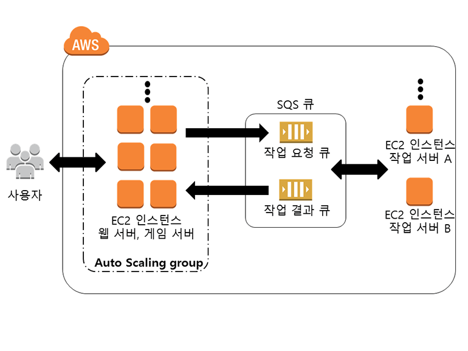
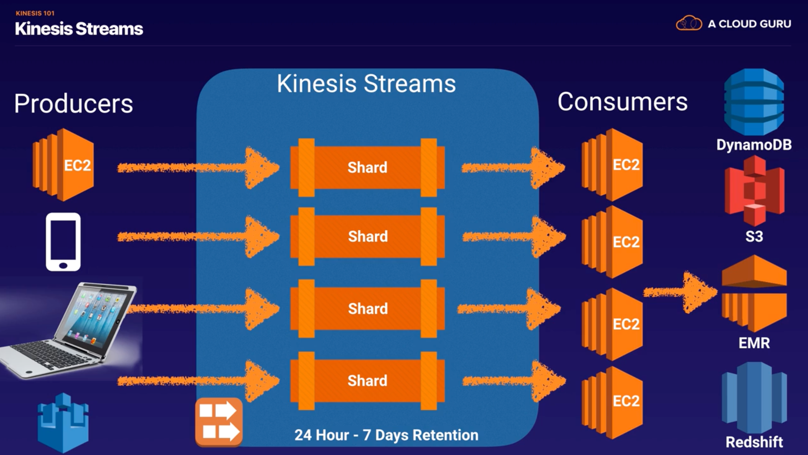
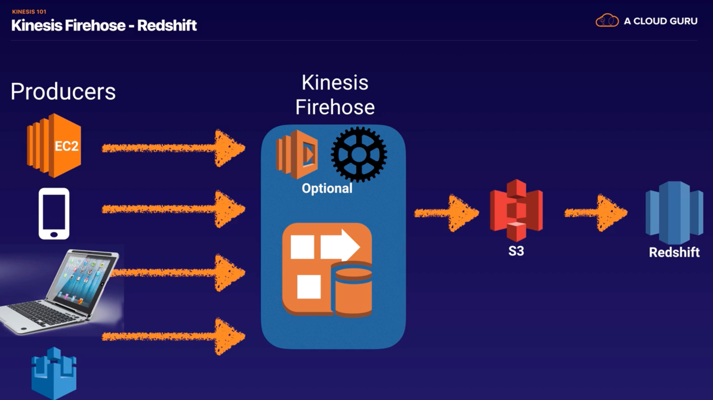
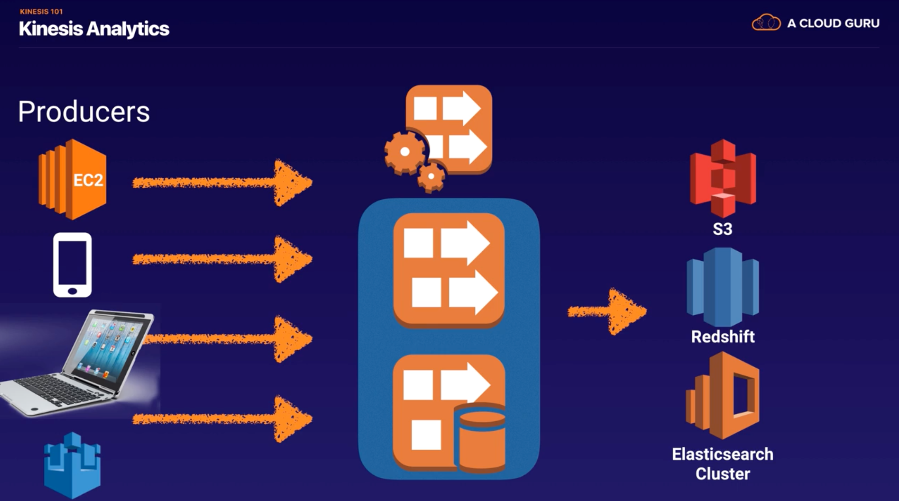
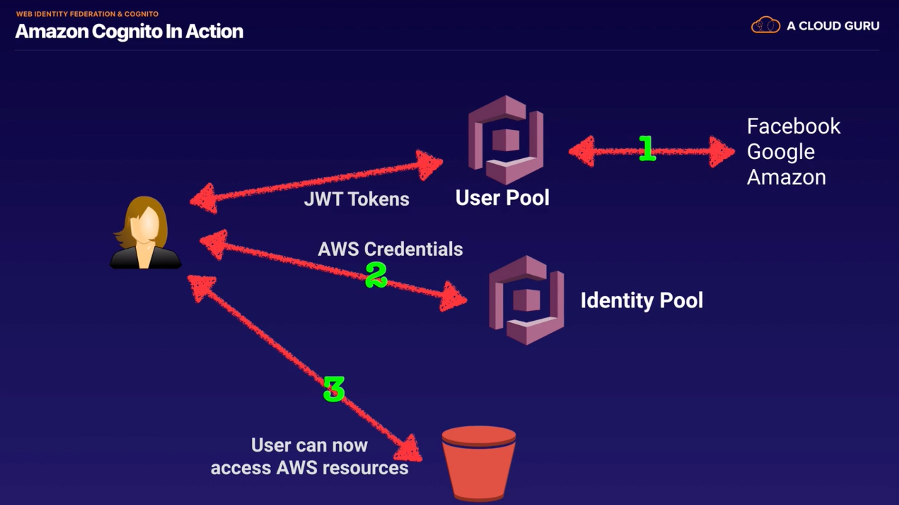

## SQS
### Features

- A Web Service that gives you access to a message queue that can be used to store messages while waiting for a computer to process them
- A Queue is a **temporary repository** for messages that are awaiting processing
- Using SQS, you can **decouple the components** of an application so they run independently.
- SQS is **Pull-basexd**
- Messages are 256KB in size
- Messages can be kept in the queue from 1min to 14 days; the default retention period is 4 days
- SQS guarantees that your messages will be processed **at least once**
- **SQS long polling**
  - A way to retrieve messages from SQS queues
  - While the regular **short polling** returns immediately, long polling doesn't return a response until a message arrives in the message queue, or the long poll times out.

### 2 Queue Types 
- Standard Queues(default) 
- FIFO Queues : exactly-once processing

### Visibility Time Out
- The amount of time that the message is invisible in the SQS queue after a reader picks up that message.
- Provided the job is processed before the visibility time out expires, the message will then be deleted from the queue
- If the job is not processed within that time, the message will become visible again and another reader will process. This could result in the same message being **delievered twice**
- Visibility timeout max is 12 hours

## SWF
### Features
- Simple Workflow Service 
- **Tasks** represent invocations of various processing steps in an application which can be performed by execurable code, web service calls, human actions, and scripts. 
- **SWF Actors** : Workflow Starters, Deciders, Activity Workers
### SWF vs. SQS
|Feature|SWF|SQS|
|:-------------:|:-------------:|:-------------:|
|retention period|1 year|14 days|
|API|Task-oriented API|Message-oriented API|
|duplicated|a task is assigned only once. NEVER duplicated|you need to handle duplicated messages|
|tracking|keeps track of all the tasks and events|you need to implement your own application-level tracking

## SNS
### Features 
- Simple Notification Service
- Makes it easy to set up, operate, and send notifications from the cloud. 
- **SQS Integration** : SNS can also deliver notifications by SMS or email to SQS queues / HTTP endpoint
- Instantaneous, **push-based** delivery (no polling)
- Simple APIs and easy integration with applications 
- Flexible message delivery over multiple transport protocols
- Inexpensive, pay-as-you-go model with no up-front costs 
- Web-based AWS Management Console offers the simplicity
- **SNS vs. SQS**
  - Both Messaging Service
  - SNS - Push
  - SQS - Polls(Pulls)
- **SNS vs. SES**
  - Amazon SES는 이메일을 통해 커뮤니케이션을 전송해야 하는 애플리케이션을 위한 서비스입니다. 그리고 사용자 지정 이메일 헤더 필드와 여러 MIME 유형을 지원합니다. Amazon SES는 사내 이메일 솔루션을 구축하거나 타사 이메일 서비스를 라이선싱, 설치 및 운영하는 데 따르는 복잡성과 비용을 없애줍니다.
  - 반면에 Amazon Simple Notification Service(Amazon SNS)는 메시징 지향 애플리케이션입니다. 여기에서는 타이밍이 중요한 "푸시" 알림을 요청하고 수신하는 구독자가 여러 명으로, HTTP, Amazon SQS, 이메일 등의 전송 프로토콜을 직접 선택할 수 있습니다. Amazon SNS 알림의 본문은 UTF-8 스트링 8,192자로 제한되고, 멀티미디어 콘텐츠는 지원하지 않습니다.

## Elastic Transcoder
- Media transcoder in the cloud.

## API Gateway 
- API Gateway Options
- API Gateway Configuration
- API Gateway Deployment
- API Gateway Caching : increase performance 
- **Same Origin Policy** : A web browser permits scripts contained in a first web page to access data in a second web page. This is done to prevent **Cross-Site Scripting(XSS)** attacks. 
- **CORS(Cross-Origin Resource Sharing)** : allows restricted resources to be requested from another domain
  - If you are using Javascript/AZAX that uses multiple domains with API Gateway, you have to enable CORS on API Gateway

## Kinesis
- Streaming Data : Purchases from online stores, Stock Prices, Game data, Social network data, Geospatial data(uber), IoT sensor data
### 3 Types of Kinesis
- **Kinesis Streams**
  - **Shards** : the total **capacity** of the stream is the sum of the capacities of its shards.

- **Kinesis Firehose**

- **Kinesis Analytics**

## Cognito - Web Identity Federation
- **Web Identity Federation**
  - Give your users access to AWS resources after they have authenticated with a Web ID Provider(Amazon, Facebook, Google..)
  - Following successful authentication, the user receives an **authentication code** from web id provider, which they can trade for **temporary AWS security credentials**.
- Use Cases

- Cognito User Pools vs. Identity Pools(actual granting)
  - **User Pool** : A **User Directory** used to sign-in directly to the User Pool. Cognito acts as an Identity Broker between the id provider and AWS. Successful authentication generates a JSON Web Token(JWTs)
  - **Identity Pool** : enable **provide temporary AWS credentials**
- Cognito Synchronisation : Various different devices

## Scenario
- You have a web application hosted in EC2 that consumes messages from an **SQS** queue and is integrated with SNS to send out an email to you once the process is complete. You received 5 orders but after a few hours, you saw 20 email notifications in your inbox.    
Which of the following could be the possible culprit for this issue?
  - **A) The web application is not deleting the messages in the SQS queue after it has processed them.**
  - Always remember that the messages in the SQS queue will continue to exist even after the EC2 instance has processed it, until you delete that message. You have to ensure that you delete the message after processing to prevent the message from being received and processed again once the visibility timeout expires.

- A multi-tiered application hosted in your on-premises data center is scheduled to be migrated to AWS. The application has a **message broker service** which uses **industry standard messaging APIs** and protocols that must be migrated as well, without rewriting the messaging code in your application.    
Which of the following is the most suitable service that you should use to move your messaging service to AWS?
  - **A) Amazon MQ**
  - Amazon MQ, Amazon SQS, and Amazon SNS are messaging services that are suitable for anyone from startups to enterprises. If you're using messaging with existing applications and want to move your messaging service to the cloud quickly and easily, it is recommended that you consider Amazon MQ. It supports industry-standard APIs and protocols so you can switch from any standards-based message broker to Amazon MQ without rewriting the messaging code in your application
  - Amazon SWF : is incorrect because this is a fully-managed state tracker and task coordinator service and not a messaging service

- A traffic monitoring and reporting application uses Kinesis to accept real-time data. In order to process and store the data, they used Amazon **Kinesis Data Firehose** to load the streaming data to various AWS resources.       
Which of the following services can you **load streaming data into**?
  - **A) Amazon Elasticsearch Service**
  - **Amazon Kinesis Data Firehose** : capture, transform, and load streaming data into **Amazon S3, Amazon Redshift, Amazon Elasticsearch Service, and Splunk**, enabling near real-time analytics with existing business intelligence tools and dashboards you’re already using today.
  - **S3 Select** : is incorrect because S3 Select is just a feature of Amazon S3 that makes it easy to retrieve specific data from the contents of an object using simple SQL expressions without having to retrieve the entire object.
  - **Redshift Spectrum** : is incorrect because Redshift Spectrum is also just a feature of Amazon Redshift that enables you to run queries against exabytes of unstructured data in Amazon S3 with no loading or ETL required.
  
- A cryptocurrency trading platform is using an API built in AWS Lambda and **API Gateway**. Due to the recent news and rumors about the upcoming price surge of Bitcoin, Ethereum and other cryptocurrencies, it is expected that the trading platform would have a significant **increase in site visitors** and new users in the coming days ahead.    
In this scenario, how can you **protect the backend systems** of the platform from traffic spikes?
  - **A) enabling throttling limits and result caching in API Gateway**
  - **throttling** : Amazon API Gateway provides throttling at multiple levels including global and by service call. Throttling limits can be set for standard rates and bursts. For example, API owners can set a rate limit of 1,000 requests per second for a specific method in their REST APIs, and also configure Amazon API Gateway to handle a burst of 2,000 requests per second for a few seconds. Amazon API Gateway tracks the number of requests per second. Any request over the limit will receive a 429 HTTP response. The client SDKs generated by Amazon API Gateway retry calls automatically when met with this response.
  - **caching** : The cache is provisioned for a specific stage of your APIs. This improves performance and reduces the traffic sent to your back end. Cache settings allow you to control the way the cache key is built and the time-to-live (TTL) of the data stored for each method. Amazon API Gateway also exposes management APIs that help you invalidate the cache for each stage.
   Use throttling limits in API Gateway**

- You have a data analytics application that updates a real-time, foreign exchange dashboard and another separate application that archives data to Amazon Redshift. Both applications are configured to consume data from the same stream concurrently and independently by using **Amazon Kinesis Data Streams.**      
However, you noticed that there are a lot of occurrences where a **shard iterator expires unexpectedly**. Upon checking, you found out that the DynamoDB table used by Kinesis does not have enough **capacity to store** the lease data.    
Which of the following is the most suitable solution to rectify this issue?
  - **A) Increase the write capacity assigned to the shard table.**
  - **Enabling In-Memory Acceleration with DynamoDB Accelerator (DAX)** : is incorrect because the DAX feature is primarily used for **read performance** improvement of your DynamoDB table from milliseconds response time to microseconds.

- A software company has resources hosted in AWS and on-premises servers. You have been requested to create a **decoupled architecture** for applications which make use of both resources.    
Which of the following options are valid? (Choose 2)
  - **A1) Use SWF to utilize both on-premise servers and EC2 instances for your decoupled application**
  - **A2) Use SQS to utilize both on-premise servers and EC2 instances for your decoupled application**
  - **Decoupled architecture** : computing architecture that enables computing components or layers to execute independently while still interfacing with each other.
  - **Amazon SQS** lets you move data between distributed application components and helps you decouple these components. **Amazon SWF** is a web service that makes it easy to coordinate work across distributed application components.

- You have built a web application that checks for new items in an S3 bucket once every hour. If new items exist, a message is added to an **SQS** queue. You have a fleet of EC2 instances which retrieve messages from the SQS queue, process the file, and finally, send you and the user an email confirmation that the item has been successfully processed. Your officemate uploaded one test file to the S3 bucket and after a couple of hours, you noticed that you and your officemate have 50 emails from your application with the same message.    
Which of the following is most likely the root cause why the application has sent you and the user multiple emails?
  - **A) Your application does not issue a delete command to the SQS queue after processiong the message, which is why this message went back to the queue and was processed multiple times.**

- You run a website which accepts high-quality photos and turns them into a downloadable video montage. The website offers a free account and a premium account that guarantees faster processing. All requests by both free and premium members go through a single **SQS** queue and then processed by a group of EC2 instances which generate the videos. You need to ensure that **the premium users** who paid for the service have **higher priority than your free members**.       
How do you re-design your architecture to address this requirement?
  - **A) Create an SQS queue for free members and another one for premium members. Configure your EC2 instances to consume message from the premium queue first and if it is empty, poll from the free member's SQS queue**

- You developed a web application and deployed it on a fleet of EC2 instances, which is **using Amazon SQS**. The requests are saved as messages in the SQS queue which is configured with the maximum message retention period.  However, **after thirteen days** of operation, the web application suddenly **crashed** and there are 10,000 unprocessed messages that are still waiting in the queue. Since you developed the application, you can easily resolve the issue but you need to send a communication to the users on the issue.     
What information will you provide and **what will happen to the unprocessed messages**?
  - **A) Tell the users that the application will be operational shortly and all received requests will be processed after the web application is restarted.**
  - The maximum message retention in SQS is 14 days 
