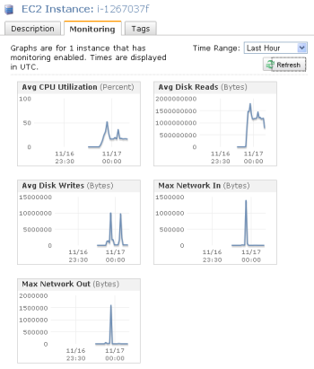
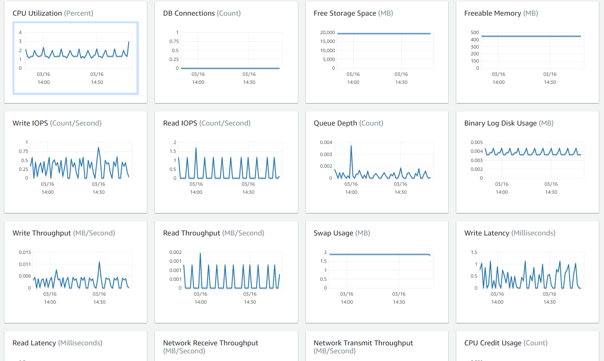
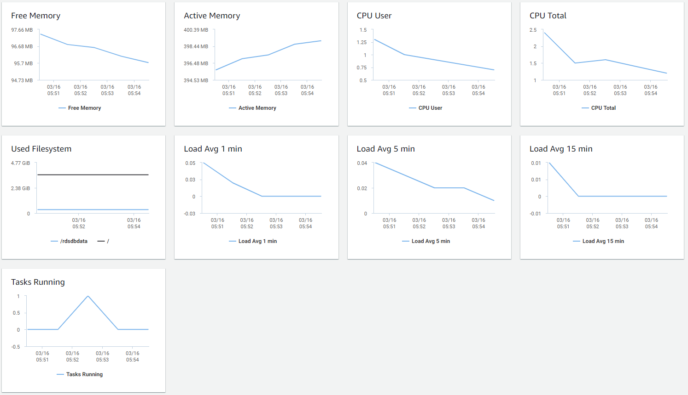

## Features 
- **CloudWatch** : performance 
- standard monitoring : every 5 min by default 
- detailed monitoring : interval 1min available 
- alarms trigger notifications 
- **CloudTrail** : auditing. **API** calls in the AWS platform. (define who)
- Features : Dashboard, Alarm, Event, Logs 

## Scenarios
- You are an AWS Solutions Architect designing an online analytics application that uses Redshift Cluster for its data warehouse. Which service will allow you to **monitor all API calls** to your Redshift instance and can also provide secured data for **auditing and compliance** purposes?
  - **A) CloudTrail for security logs**
  - CloudTrail enables povernance, compliance, operational auditing, and risk auditing of your AWS account. You can log, continuously monitor, and retain account activity including actions taken through the AWS Management Console, AWS SDKs, command line tools, API calls, and other AWS services.

- A Solutions Architect is working for a company which has multiple VPCs in **various AWS regions**. The Architect is assigned to set up a **logging system** which will track all of the changes made to their AWS resources in all regions, including the configurations made in IAM, CloudFront, AWS WAF, and Route 53. In order to pass the compliance requirements, the solution must ensure the security, integrity, and durability of the log data. **It should also provide an event history of all API calls** made in AWS Management Console and AWS CLI.    
Which of the following solutions is the best fit for this scenario?
  - **A) Set up a new CloudTrail trail in a new S3 bucket using the AWS CLI and also pass both the `--is-multi-region-trail` and `--include-global-service-events` parameters then encrypt log files using KMS encryption. Apply Multi Factor Authentication(MFA) Delete on the S3 bucket and ensure that only authorized users can access the logs by configuring the bucket policies**
  - CloudTrail can be used for this case with multi-region trail enabled, however, it will only cover the activities of the regional services (EC2, S3, RDS etc.) and not for global services such as IAM, CloudFront, AWS WAF, and Route 53. In order to satisfy the requirement, you have to add the `--include-global-service-events parameter` in your AWS CLI command.

- Your cloud architecture is composed of Linux and Windows EC2 instances which process high volumes of financial data 24 hours a day, 7 days a week. To ensure high availability of your systems, you are required to **monitor the memory and disk utilization** of all of your instances.       
Which of the following is the most suitable monitoring solution to implement?
  - **A) Install the CloudWatch agent to all of your EC2 instances which gathers the memory and disk utilization data. View the custom metrics in the Amazon CloudWatch console**
  - by default, CloudWatch does not automatically provide memory and disk utilization metrics of your instances. You have to set up custom CloudWatch metrics to monitor the memory, disk swap, disk space and page file utilization of your instances.
  - **Enhanced Monitoring** : is incorrect because Enhanced Monitoring is a feature of RDS and not of CloudWatch.
  - **Amazon Inspector** : is incorrect because Amazon Inspector is an automated security assessment service that helps you test the network accessibility of your Amazon EC2 instances and the security state of your applications running on the instances. It does not provide a custom metric to track the memory and disk utilization of each and every EC2 instance in your VPC.

- The company that you are working for has a highly available architecture consisting of an elastic load balancer and several EC2 instances configured with auto-scaling in three Availability Zones. You want to monitor your EC2 instances based on a particular metric, which is not readily available in CloudWatch.      
Which of the following is a **custom metric in CloudWatch which you have to manually set up**?
  - **A) Memory Utilization of an EC2 instance**
  - You need to prepare a custom metric using CloudWatch Monitoring Scripts which is written in Perl. You can also install CloudWatch Agent to collect more system-level metrics from Amazon EC2 instances. Here's the list of custom metrics that you can set up:
    - **Memory utilization**
    - **Disk swap utilization**
    - **Disk space utilization**
    - **Page file utilization**
    - **Log collection**
  - CloudWatch by default :    
    
 
- The operations team of your company asked you for a way to monitor the health of your production EC2 instances in AWS. You told them to use the CloudWatch service.    
Which of the following metrics is **not available by default in CloudWatch**? 
  - **A) Memory Usage**
  - by default : **Network In and Out, CPU Usage, Disk Read Operations**

- One of your EC2 instances is reporting an unhealthy system status check. The operations team is looking for an easier way to monitor and repair these instances instead of fixing them manually.
How will you **automate the monitoring and repair of the system status check failure** in an AWS environment?
  - **A) Create CloudWatch alarms that stop and start the instance based on status check alarms**
  - **Using Amazon CloudWatch alarm actions**, you can create alarms that automatically stop, terminate, reboot, or recover your EC2 instances.

- You are working for a startup company that has resources deployed on the AWS Cloud. Your company is now going through a set of scheduled audits by an external auditing firm for compliance.       
Which of the following services available in AWS can be utilized to help ensure the right information are present for **auditing purposes**?
  - **A) AWS CloudTrail**
  -  CloudTrail provides event history of your AWS account activity, including actions taken through the AWS Management Console, AWS SDKs, command line tools, and other AWS services. This event history simplifies security analysis, resource change tracking, and troubleshooting.
  - CloudTrail records important information about each action, including **who** made the request, the services used, the actions performed, parameters for the actions, and the response elements returned by the AWS service. CloudTrail makes it easier to ensure **compliance with internal policies and regulatory standards**.

- You are managing an online platform which allows people to easily buy, sell, spend, and manage their cryptocurrency. To meet the strict IT audit requirements, each of the API calls on all of your AWS resources should be properly captured and recorded. You used CloudTrail in your VPC to help you in the compliance, operational auditing, and risk auditing of your AWS account.       
In this scenario, **where does CloudTrail store all of the logs that it creates**? 
  - **A) S3**
  - AWS CloudTrail은 사용자 계정에서 이루어진 활동을 기록하고, 로그 파일을 사용자의 Amazon S3 버킷으로 전달하는 웹 서비스입니다.

- You have a web application hosted in AWS cloud where the application logs are sent to Amazon **CloudWatch**. Lately, the web application has recently been encountering some errors which can be resolved simply by restarting the instance.    
What will you do **to automatically restart the EC2 instances whenever the same application error occurs**?
  - **A) First, look at the existing CloudWatch logs for keywords related to the application error to create a custom metric. Then, create a CloudWatch alarm for that custom metric which invokes an action to restart the EC2 instance.**

- You are a Big Data Engineer who is assigned to handle the online enrollment system database of a prestigious university, which is hosted in RDS. You are **required to monitor the database metrics** in Amazon CloudWatch to ensure the availability of the enrollment system.    
What are the **enhanced monitoring metrics that Amazon CloudWatch gathers from Amazon RDS DB instances** which provide a more accurate information? (Select TWO.)
  - **A1) RDS child processes**
  - **A2) OS processes**
  - **RDS Enhanced Monitoring** : Amazon RDS는 DB 인스턴스가 실행되는 운영 체제(OS)에 대한 측정치를 실시간으로 제공합니다. 콘솔을 사용하여 DB 인스턴스에 대한 측정치를 보거나, 선택한 모니터링 시스템의 Amazon CloudWatch Logs에서 Enhanced Monitoring JSON 출력을 사용할 수 있습니다.
  - **CloudWatch Metrics vs. Enhanced Monitoring Metrics**
    - **CloudWatch Metrics** : DB instance의 hypervisor(가상서버)에서 CPU 사용률(CPU utilization) 수집. 하이퍼바이저 계층에서는 소량의 작업만 수행하므로 두 측정치 간의 차이점을 확인할 수 있습니다. DB 인스턴스에서 사용하는 인스턴스 클래스가 적을수록 단일 물리적 인스턴스에서 하이퍼바이저 계층에 의해 관리되는 가상 머신(VM)의 수가 더 많아지므로 차이가 더 커질 수 있습니다.
    
    - **Enhanced Monitoring Metrics** : DB 인스턴스의 여러 프로세스 또는 스레드에서 CPU를 사용하는 방법을 확인하려는 경우에 유용
    
  - RDS에서 프로세스 목록보기에 표시된 Enhanced Monitoring 메트릭은 다음과 같이 구성됩니다.
    - **RDS child processes** : DB 인스턴스를 지원하는 RDS 프로세스의 요약을 표시합니다 (예 : Amazon Aurora DB 클러스터의 경우 aurora, MySQL DB 인스턴스의 경우 mysqld). 프로세스 스레드는 상위 프로세스 아래에 중첩되어 나타납니다. 프로세스 스레드는 다른 메트릭이 프로세스의 모든 스레드에 대해 동일하므로 CPU 사용률 만 표시합니다. 콘솔은 최대 100 개의 프로세스와 스레드를 표시합니다. 결과는 최고 CPU 소비 및 메모리 소비 프로세스 및 스레드의 조합입니다. 50 개 이상의 프로세스와 50 개 이상의 스레드가있는 경우 콘솔에는 각 범주에서 상위 50 명의 소비자가 표시됩니다. 이 디스플레이는 성능에 가장 큰 영향을 미치는 프로세스를 식별하는 데 도움이됩니다.
    - **RDS processes** : RDS 관리 에이전트, 진단 모니터링 프로세스 및 RDS DB 인스턴스를 지원하는 데 필요한 기타 AWS 프로세스에서 사용하는 리소스에 대한 요약을 보여줍니다.
    - **OS processes** : 일반적으로 성능에 미치는 영향을 최소화하는 커널 및 시스템 프로세스의 요약을 보여줍니다.
  - [RDS Enhanced Monitoring](https://docs.aws.amazon.com/ko_kr/AmazonRDS/latest/UserGuide/USER_Monitoring.OS.html)

- There is a new compliance rule in your company that audits every Windows and Linux EC2 instances each month to view any performance issues. They have more than a hundred EC2 instances running in production, and each must have a logging function that collects various system details regarding that instance. The SysOps team will periodically review these logs and analyze their contents using AWS Analytics tools, and the result will need to be retained in an S3 bucket.
In this scenario, what is the most efficient way to **collect and analyze logs from the instances** with minimal effort?
  - **A) Install the unified CloudWatch Logs agent in each instance which will automatically collect and push data to CloudWatch Logs. Analyze the log data with CloudWatch Logs Insights.**
  - **new unified CloudWatch agent** : Amazon EC2 인스턴스 및 온 프레미스 서버에서 CloudWatch Logs로 로그를 수집하기 위해 AWS는 새로운 통합 CloudWatch 에이전트와 이전 CloudWatch Logs 에이전트를 모두 제공합니다. 다음과 같은 장점이있는 통합 CloudWatch 에이전트를 사용하는 것이 좋습니다.
    -하나의 에이전트 설치 및 구성으로 로그 및 고급 메트릭을 모두 수집 할 수 있습니다.
    -통합 에이전트를 사용하면 Windows Server를 실행하는 서버에서 로그를 수집 할 수 있습니다.
    -에이전트를 사용하여 CloudWatch 지표를 수집하는 경우 통합 에이전트는 게스트 내 가시성을 위해 추가 시스템 지표를 수집 할 수도 있습니다.
    -통합 에이전트가 더 나은 성능을 제공합니다.
  - **AWS CloudWatch Logs** : Amazon CloudWatch Logs를 사용하여 Amazon Elastic Compute Cloud(Amazon EC2) 인스턴스, AWS CloudTrail, Route 53 및 기타 소스에서 로그 파일을 모니터링, 저장 및 액세스할 수 있습니다.    
CloudWatch Logs는 확장성이 뛰어난 단일 서비스에서 사용하는 모든 시스템, 애플리케이션 및 AWS 서비스에서 로그를 중앙 집중화할 수 있습니다. 따라서 이들을 손쉽게 확인하여 특정 오류 코드나 패턴을 검색하거나 특정 필드를 기준으로 필터링하거나 향후 분석을 위해 안전하게 보관할 수 있습니다.    CloudWatch Logs을 사용하면 소스에 관계 없이 모든 로그를 시간에 따라 정렬된 일관된 단일 흐름의 형태로 확인할 수 있습니다. 또한 다른 차원을 기준으로 이들을 쿼리 및 정렬하고, 특정 필드에 따라 그룹화하며, 강력한 쿼리 언어를 이용해 사용자 지정 계산을 생성하고, 대시보드에 로그 데이터를 시각화할 수 있습니다. 
  - **CloudWatch Logs Insights**를 사용하면 Amazon CloudWatch Logs에서 로그 데이터를 대화식으로 검색하고 분석 할 수 있습니다. 운영 문제에 빠르고 효과적으로 대응할 수 있도록 쿼리를 수행 할 수 있습니다. 문제가 발생하면 CloudWatch Logs Insights를 사용하여 잠재적 원인을 식별하고 배포 된 수정 사항을 확인할 수 있습니다.    
  CloudWatch Logs Insights에는 단순하지만 강력한 명령이 포함 된 특수 목적의 쿼리 언어가 포함되어 있습니다. CloudWatch Logs Insights는 샘플 쿼리, 명령 설명, 쿼리 자동 완성 및 로그 필드 검색을 제공하여 신속하게 시작할 수 있습니다. 몇 가지 유형의 AWS 서비스 로그에 대한 샘플 쿼리가 포함됩니다.
  - **Install the AWS Systems Manager Agent (SSM Agent) in each instance which will automatically collect and push data to CloudWatch Logs. Analyze the log data with CloudWatch Logs Insights** : is incorrect as although this is also a valid solution, it is more efficient to use CloudWatch agent than an SSM agent. **인스턴스를 수동으로 연결**하여 로그 파일을보고 SSM Agent 관련 문제를 해결하는 데 시간이 오래 걸리므로보다 효율적인 인스턴스 모니터링을 위해 CloudWatch 에이전트를 사용하여 로그 데이터를 Amazon CloudWatch Logs로 보낼 수 있습니다.
  - **Install AWS Inspector Agent in each instance which will collect and push data to CloudWatch Logs periodically. Set up a CloudWatch dashboard to properly analyze the log data of all instances** : is incorrect. **AWS Inspector**는 EC2 인스턴스의 의도하지 않은 네트워크 액세스 가능성과 **EC2 인스턴스**의 취약성을 확인하는 데 도움이되는 **보안 평가 서비스**입니다. 또한 Amazon CloudWatch 대시 보드 설정은 단일 뷰에서 리소스를 모니터링해야하는 시나리오, 다른 AWS 리전에 분산 된 리소스까지 주로 사용되므로 적합하지 않습니다. 로그 데이터를 대화식으로 검색하고 분석 할 수 있는 CloudWatch Logs Insights를 대신 사용하는 것이 좋습니다.

- You are a Solutions Architect for a large London-based software company. You are assigned to improve the performance and current processes of supporting the AWS resources in your VPC. Upon checking, you noticed that the Operations team does not have an automated way to monitor and resolve issues with their on-demand EC2 instances.    
What can be used to **automatically monitor your EC2 instances and notify the Operations team for any incidents**?
  - **A) Amazon CloudWatch**
  - **AWS CloudTrail** is incorrect as this is **mainly used for logging** and not for monitoring.

- An auto-scaling group of Linux EC2 instances is created with basic monitoring enabled in **CloudWatch**. You noticed that your application is slow so you asked one of your engineers to check all of your EC2 instances. After checking your instances, you noticed that the auto scaling group is not launching more instances as it should be, even though the servers already have high memory usage.    
What is the best solution that will fix this issue?
  - **A) Install CloudWatch monitoring scripts in the instances. Send custom metrics to CloudWatch which will trigger your Auto Scaling group to scale up.**
  - Amazon EC2 (Amazon Elastic Compute Cloud) Linux 기반 인스턴스 용 **Amazon CloudWatch monitoring scripts**는 Amazon CloudWatch 사용자 지정 지표를 생성하고 소비하는 방법을 보여줍니다.
  - The scenario tells that the EC2 servers have **high memory usage**, but since this specific metric is not tracked by the Auto Scaling group by default, the scaling up activity is not being triggered. Remember that **by default, CloudWatch doesn't monitor memory usage** but **only the CPU utilization, Network utilization, Disk performance and Disk Reads/Writes**.
  - This is the reason why you have to install CloudWatch Monitoring Scripts in your EC2 instances to collect and monitor the custom metric (memory usage), which will be used by your Auto Scaling Group as a trigger for scaling activities.
