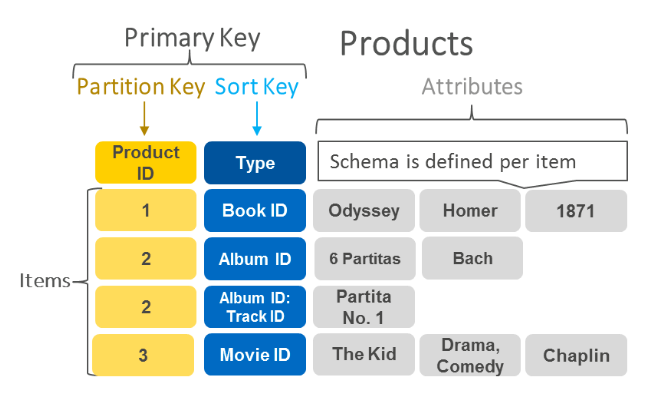

## DynamoDB
### Features 
- fully managed **NoSQL** database service 
- synchronously **replicates data across 3 facilities** in an AWS Region, with high availability and data durability 
- runs exclusively on **SSD** to provide high I/O performance
- provides **provisioned table reads and writes**
- **automatically partitions, reallocates and re-partitions the data** and provisions additional server capacity as data changes
- **Eventual Consistent(by default) / Strongly Consistent** option during an read option
- supports **cross region replication** using DynamoDB streams : leverages Kinesis and provides **time-ordered sequence of item-level changes** and can help for lower RPO, lower RTO disaster Recovery
- supports **triggers**

### Indexes
- creates and maintains **indexes for the primary key attributes** for efficient access of data in the table 
- **Secondary indexes**
  - allows querying attributes other then the primary key attributes without impacting performance 
  - automatically maintained as **sparse objects**
  
## Features 
- Stored on SSD storage (serverless)
- Spread Across 3 data centers
- Eventual Consistent Reads(default) : do NOT update data within 1 second
- Strongly Consistent Reads : DO update data within 1 second

## Scenarios 
- **A company is developing a highly available web application using stateless web servers. Which
services are suitable for storing session state data? (Select TWO.)**       
        
  A. CloudWatch       
  **B. DynamoDB**       
  C. Elastic Load Balancing       
  **D. ElastiCache**        
  E. Storage Gateway        
    - Both DynamoDB and ElastiCache provide high performance storage of key-value pairs.
    - CloudWatch and ELB are not storage services 
    - Storage Gateway is a hybrid storage service that enables on-premises applpications to use cloud storage
 
- **You are working as a Solutions Architect for a technology company which is in the process of migrating their applications to AWS. One of their systems requires a database that can scale globally and can handle frequent schema changes. The application should not have any downtime or performance issues whenever there is a schema change in the database. It should also provide low-latency response to high-traffic queries.    
Which is the most suitable database solution to use to achieve this requirement?**
  - **A) Amazon DynamoDB**
  - Scema flexibility : Since the scenario requires that the **schema** changes frequently, then you have to puck a database which provides a **non-rigid** and flexible way of adding or removing new types of data.(NoSQL database)
  
- A popular social network is hosted in AWS and is using a **DynamoDB** table as its database. There is a requirement to implement a 'follow' feature where users can subscribe to **certain updates** made by a particular user and be notified via email. Which of the following is the most suitable solution that you should implement to meet the requirement?
  - **A) Enable DynamoDB Stream and create an AWS Lambda trigger, as well as the IAM role which contains all of the permissions that the Lambda function will need at runtime. The data from the stream record will be processed by the Lambda function which will then publish a message to SNS Topic that will notify the subscribers via email.**
- **Dynamo Stream** : an ordered flow of information about changes to items in an Amazon DynamoDB table. When you enable a stream on a table, DynamoDB captures information about every modification to data items in the table.    
Amazon DynamoDB is integrated with AWS Lambda so that you can create **triggers**-pieces of code that automatically respond to events in DynamoDB Streams. With triggers, you can build applications that react to data modifications in DynamoDB tables.
- DynamoDB Accelerator (DAX) feature is primarily used to significantly improve the in-memory read performance of your database, and not to capture the time-ordered sequence of item-level modifications.

- A Docker application, which is running on an Amazon ECS cluster behind a load balancer, is heavily using DynamoDB. You are instructed to improve the database performance by **distributing the workload evenly** and using the provisioned throughput efficiently.   
Which of the following would you consider to implement for your DynamoDB table?
  - **A) Use partition keys with high-cardinality attributes, which have a large number of distinct values for each item**
  - The optimal usage of a table's provisioned throughput depends on the partition-key design. The more distinct partition key values that your workload accesses, the more those requests will be spread across the partitioned space.

- A popular mobile game uses CloudFront, Lambda, and DynamoDB for its backend services. The player data is persisted on a DynamoDB table and the static assets are distributed by CloudFront. However, there are a lot of **complaints** that saving and retrieving player information is **taking a lot of time**.       
To improve the game's performance, which AWS service can you use to **reduce DynamoDB response times from milliseconds to microseconds**?
  - **A) Amazon DynamoDB Accelerator(DAX)**
  - **DynamoDB Accelerator (DAX)** : a fully managed, highly available, **in-memory cache** that can reduce Amazon DynamoDB response times from milliseconds to microseconds    
  - ElastiCache : is incorrect because it cannot reduce time from milliseconds to microseconds
  
- As a Junior Software Engineer, you are developing a hotel reservations application and are given the task of improving the database aspect of the app. You found out that RDS does not satisfy the needs of your application because it does not scale as easily compared with DynamoDB. You need to demonstrate to your Senior Software Engineer **the advantages of using DynamoDB over RDS**.       
What are the **valid use cases for Amazon DynamoDB**? (Choose 2)
  - **A1) Storing metadata for Amazon S3 objects**
  - **A2) Managing web sessions**
  - **Storing metadata for Amazon S3 objects** : is correct because the Amazon DynamoDB stores structured data indexed by primary key and allow low latency read and write access to items ranging from 1 byte up to 400KB. Amazon S3 stores unstructured blobs and is suited for storing large objects up to 5 TB. In order to optimize your costs across AWS services, **large objects or infrequently accessed data sets should be stored in Amazon S3, while smaller data elements or file pointers (possibly to Amazon S3 objects) are best saved in Amazon DynamoDB.**    
To speed up access to relevant data, you can pair Amazon S3 with a search engine such as Amazon CloudSearch or a database such as Amazon DynamoDB or Amazon RDS. In these scenarios, Amazon S3 stores the actual information, and the search engine or database serves as the repository for associated **metadata such as the object name, size, keywords**, and so on. Metadata in the database can easily be indexed and queried, making it very efficient to locate an object’s reference by using a search engine or a database query. This result can be used to **pinpoint and retrieve the object itself from Amazon S3**.
  - **Managing web sessions** : is correct because the **DynamoDB Time-to-Live (TTL) mechanism** enables you to manage web sessions of your application easily. It lets you set a specific timestamp to delete expired items from your tables. **Once the timestamp expires, the corresponding item is marked as expired and is subsequently deleted** from the table. By using this functionality, you do not have to track expired data and delete it manually. TTL can help you reduce storage usage and reduce the cost of storing data that is no longer relevant.
  - **Storing BLOB data** : is incorrect because BLOB(Binary Large Object) data is too large to be put into a NoSQL database 

- As an AWS Cloud Consultant working for a record company, you are building an application that will **store both key-value store and document models like band ID, album ID, song ID and composer ID**.       
Which AWS service will suit your needs for your application?
  - **A) DynamoDB **
  - Amazon DynamoDB is a fast and flexible NoSQL database service. It supports both document and key-value store models. used for mobile, web, gaming, ad tech, IoT, and many other applications.
  - 

- You are working as a Solutions Architect for a tech company where you are instructed to build a web architecture using On-Demand EC2 instances and a database in AWS. However, due to **budget constraints**, the company instructed you to choose a database service in which they **no longer need to worry about** database management tasks such as hardware or software provisioning, setup, configuration, **scaling** and backups.   
Which database service in AWS is best to use in this scenario?
  - **A) DynamoDB**
  - you simply create a database table, set your target utilization for Auto Scaling, and let the service handle the rest. You no longer need to worry about database management tasks such as hardware or software provisioning, setup and configuration, software patching, operating a reliable, distributed database cluster, or partitioning data over multiple instances as you scale. DynamoDB also lets you backup and restore all your tables for data archival, helping you meet your corporate and governmental regulatory requirements.
  - **RDS** : In RDS, you still have to manually scale up your resources and create Read Replicas to improve scalability while in DynamoDB, this is automatically done. RDS is incorrect because this is just a "managed" service and not "fully managed". This means that you still have to handle the backups and other administrative tasks such as when the automated OS patching will take place.
  - **Amazon ElastiCache** : is incorrect because although ElastiCache is fully managed, it is not a database service but an In-Memory Data Store.
  - **Redshift** : is incorrect because although this is fully managed, it is not a database service but a Data Warehouse.

- You currently have an Augment Reality (AR) mobile game which has a serverless backend. It is using a **DynamoDB table** which was launched using the AWS CLI to store all the user data and information gathered from the players and a **Lambda function** to pull the data from DynamoDB. The game is being used by millions of users each day to read and store data.     
How would you design the application to **improve its overall performanc**e and make it **more scalable** while keeping the **costs low**? (Choose 2)
  - **A1) Enable DynamoDB Accelerator(DAX) and ensure that the Auto Scaling is enabled and increase the maximum provisioned read and write capacity.**
  - **A2) Use API Gateway in conjunction with Lambda and turn on the caching on frequently accessed data and enable DynamoDB global replication**
  - DAX does all the heavy lifting required to add in-memory acceleration to your DynamoDB tables
  - Amazon API Gateway lets you create an API that acts as a "front door" for applications to access data, business logic, or functionality from your back-end services, such as code running on AWS Lambda. 
  - **Configure CloudFront with DynamoDB as the origin; cache frequently accessed data on client device using ElastiCache** : is incorrect because **CloudFront and DynamoDB are imcompatible**

- Your manager has asked you to deploy a mobile application that can collect votes for a popular singing competition. Millions of users from around the world will submit votes using their mobile phones. These votes must be collected and stored in a highly scalable and highly available data store which will be queried for real-time ranking.    
Which of the following combination of services should you use to meet this requirement?
  - **A) Amazon DynamoDB and AWS AppSync**
  - **DynamoDB** is durable, scalable, and highly available data store which can be used for **real-time tabulation**. You can also use **AppSync** with DynamoDB to make it easy for you to build collaborative apps that keep **shared data updated in real time**.
