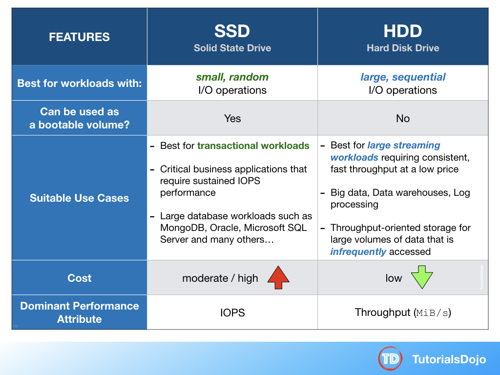
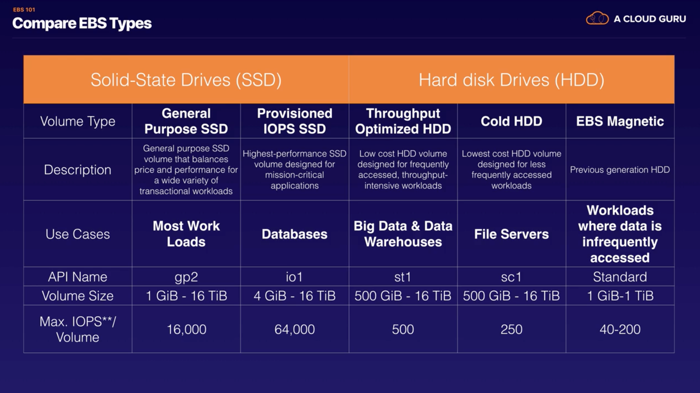
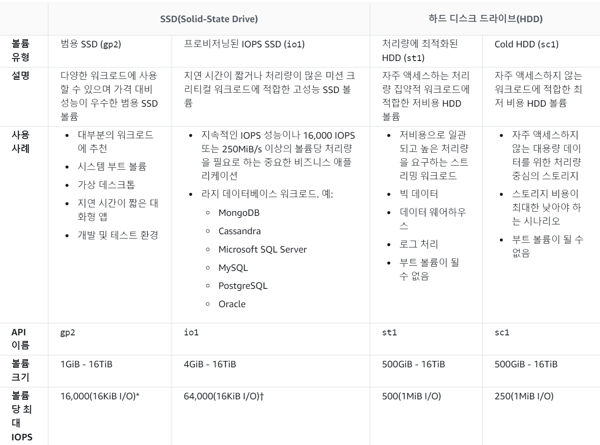

## Elastic Block Store CheatSheet 
### Point
- Amazon Elastic Compute Cloud(EC2)에서 사용하도록 설계된 사용하기 쉬운 고성능 블록 스토리지 서비스
- **어떤 워크로드에든 적합한 성능** : EBS 볼륨은 SAP, Oracle 및 Microsoft 제품과 같은 미션 크리티컬 애플리케이션을 포함하여, 가장 까다로운 워크로드에 적합합니다. SSD 지원 옵션으로는, 고성능 애플리케이션을 위해 설계된 볼륨(IOPS) 및 대부분의 워크로드에 적합한 뛰어난 요금/성능 옵션을 제공하는 범용 볼륨(General Purpose)이 포함됩니다. HDD 지원 옵션은 빅 데이터 분석 엔진, 로그 처리 및 데이터 웨어하우징과 같은 대용량 순차 워크로드를 위해 설계되었습니다(Throughput Optimized HDD). FSR(빠른 스냅샷 복원)을 사용하여 스냅샷에서 EBS 볼륨 생성 시 전체 성능을 즉시 수신합니다.
- **사용 편의성** : Amazon EBS 볼륨은 쉽게 생성하고 사용하고 암호화하고 보호할 수 있습니다. 탄력적인 볼륨(**Elastic Volumes**) 기능을 사용하면 **워크로드를 중단하지 않고도** 스토리지를 늘리고, 성능을 높이거나 낮추고, 볼륨 유형을 변경할 수 있습니다. **EBS 스냅샷**을 사용하면 데이터의 지리적 보호를 위해 볼륨의 백업을 쉽게 생성할 수 있습니다. **Data Lifecycle Manager(DLM)** 는 추가 오버헤드나 비용 없이 스냅샷 관리를 자동화하는 사용하기 쉬운 도구입니다.

- **HA & durability** : Amazon EBS 아키텍처는 미션 크리티컬 애플리케이션에 안정성을 제공합니다. 각 볼륨은 **AZ(가용 영역) 내에서 복제**를 통해 장애로부터 사용자 환경을 보호하도록 설계되었으며, 99.999%의 가용성과 0.1% - 0.2% 사이의 AFR(연간 장애 비율)을 제공합니다. 단순하고 강력한 백업을 위해 Amazon Data Lifecycle Manager(DLM) 정책과 함께 EBS 스냅샷을 사용하여 스냅샷 관리를 자동화합니다. 백업 공급자로서 스냅샷용 EBS direct API를 사용하여 EBS 볼륨의 빠른 백업과 보다 세분화된 RPO(복구 시점 목표)를 달성합니다.  이것은 새 EC2 인스턴스 또는 EBS 볼륨을 생성하지 않고도 EBS 스냅샷 데이터를 읽을 수 있는 기능을 통해 가능합니다.

- is virtual network attached block storage 
- Volumes **CANNOT be shared** with multiple EC2 instances (cf. EFS)
- **muiltiple Volumes can be attached** to a single EC2 instance
- **persist and independent of EC2 lifecycle**
- Snapshots **CANNOT** span **across region**
- for making Volume available to different AZ
  - create a Snapshot of the Volume and restore it to a new Volume in any AZ within the region
- for making Volume available to different Region
  - the Snapshot of the Volume can be copied to a different region and restored as a Volume
- provides **high durability** and are **redundant in an AZ**
  - as the data is automatically replicated within that AZ to prevent data loss
- PIOPS is designed to run transactions applications that require high and consistent IO such as RDB, NoSQL etc

## EBS Types 

- General Purpose SSD(gp2) : MAX IOPS 16,000, Most Work Loads 
- Provisioned IOPS SSD(io1) : 64,000, Databases 
- Throughput Optimized HDD(st1) : 500, Big Data & Data Warehouse 
- Cold HDD(sc1) : 250
- EBS Magnetic(standard) : 40-200 (not used)

## Volume & Snapshot
### Volume
- exist on EBS. always on same AZ
- CAN NOT attach an EBS Volume to more than 1 EC2 instance at the same time.
- You can change EBS volume sizes on the fly
- **when EC2 instance terminated..** : **root device volume EBS deleted**, additional volumes NOT deleted by default 
  - However, the DeleteOnTermination attribute may be changed at launch using Console or using CLI while running.
### Snapshot 
- exist on S3. **incremental**(only the blocks changed since the last) stop the instance before taking snapshots.
- **CAN NOT delete a snapshot** of an EBS Volume that is used as the **root device** of a registered AMI
- migrate to another AZ : snapshot -> create AMI from snapshot -> use the AMI to launch instance in new AZ
- migrate to another region : snapshot -> create AMI from snapshot -> copy AMI to another region -> use the copied AMI to launch instance in new region

## EBS vs. Instance Store 
- Instance Store Volume
  - Ephemeral Storage : Instance store volumes canNOT be stopped. If the underlying host fails, you will lose data.
- EBS
  - EBS backed instances can be stopped. you will not lose data on this instance if it's stopped.
- you can reboot both, you will not lose data.
- Both ROOT volumes will be deleted on termination by default. EBS) you can tell AWS to keep ROOT

## Encryption
- Snapshots of encrypted volumes are encrypted automatically.
- Volumes retored from encrypted snapshots are encrypted automatically.
- you can share snapshots ONLY IF they are UNENCRYPTED
- These snapshots can be shared with other AWS accounts or made public.
- you can NOW encrypt ROOT device volumes when you create the EC2 instance. 
- **HOW TO CHANGE UNENCRYPTED ROOT TO ENCRYPTED?**
  - Create a Snapshot of the unencrypted root device volume.
  - Copy the Snapshot and select the encrypt option
  - Create an AMI from the encrypted Snapshot
  - Use the AMI to launch new encrypted instances. 

## Scenarios 
- **A Solutions Architect is designing a critical business application with a relational database that runs on an EC2 instance. It requires a single EBS volume that can support up to 16,000 IOPS.    Which Amazon EBS volume type can meet the performance requirements of this application?**    
  - **A) EBS Provisioned IOPS SSD**
  - EBS Provisioned IOPS SSD : 미션 크리티컬 저 지연(low latency) 워크로드에 대한 지속적인 성능
  - EBS General Purpose SSD : 3,000-10,000 IOPS의 성능 버스트
  - HDD : 저렴한 비용, 높은 처리량
    
- **You are building a new data analytics application in AWS which will be deployed in an AutoScaling group of On-Demand EC2 instances and MongoDB database. It is expected that the database will have high-throughput workloads performing small, random I/O operations. As the Solutions Architect, you are required to properly setup and launch the required resources in AWS.    
Which of the following is the most suitable EBS type to use for your database?**
  - **A) Provisioned IOPS SSD(io1)**
  - SSD-backed volumes : I / O 작업이 임의적이든 순차적이든 일관된 성능.
    - General Purpose SSD(gp2) : 작고 임의적인 I / O 작업을 처리 할 수 있습니다
    - Provisioned IOPS SSD(io1) : MongoDB, Oracle, MySQL과 같은 I / O 집약적 데이터베이스 워크로드에 적합합니다.
  - HHD-backed voluems : I / O 작업이 크고 순차적인 경우에만 최적의 성능.

- You have triggered the creation of a snapshot of your EBS volume attached to an Instance Store-backed EC2 Instance and is currently on-going. At this point, what are the things that the EBS volume can or cannot do?
  - **A) The volume can be used as normal while the snapshot is in progress**
  - EBS 스냅 샷은 **비동기 적으로** 발생합니다. 즉, 특정 시점 스냅 샷이 즉시 생성되지만 스냅 샷이 완료 될 때까지 스냅 샷 상태는 '대기 중(pending)'입니다. 진행중인 스냅 샷은 **볼륨**에 대한 지속적인 읽기 및 쓰기로 인해 **영향을 받지 않습니다** 따라서 여전히 볼륨을 사용할 수 있습니다.

- As part of the Business Continuity Plan of your company, your IT Director instructed you to set up an automated backup of all of the EBS Volumes for your EC2 instances as soon as possible.     
What is the fastest and most cost-effective **solution to automatically back up all of your EBS Volumes**?
  - **A) Amazon Data Lifecycle Manager(Amazon DLM) to automate the creation of EBS snapshots.**
  - 스냅 샷 관리 자동화를 통해 다음을 수행 할 수 있습니다.
    - **정기적인 백업** 일정을 시행하여 중요한 데이터를 보호.
    - 감사 또는 내부 규정 준수에 필요한 **백업을 유지**합니다.
    - **오래된 백업을 삭제**하여 스토리지 비용을 줄입니다.
    - 사용자 정의 쉘 스크립트를 작성하거나 예약 된 작업을 작성할 필요가 없습니다.
  - Amazon DLM은 Amazon CloudWatch Events 및 AWS CloudTrail의 모니터링 기능과 결합하여 추가 비용없이 EBS 볼륨에 대한 완벽한 백업 솔루션을 제공합니다.
  - **create a scheduled job that calls the "create-snapshot" command via the AWS CLI to take a snapshot of production EBS volumes periodically** : is incorrect. 이것이 유효한 솔루션 임에도 불구하고 "create-snapshot"명령을 호출하는 예약 된 작업을 만들려면 여전히 시간이 더 필요합니다.

- A company is planning to launch an application which requires a data warehouse that will be used for their **infrequently accessed data**. You need to use an EBS Volume that can **handle large, sequential I/O operations**.    
Which of the following is the most cost-effective storage type that you should use to meet the requirement?
  - **A) Cold HDD(sc1)**
  - **Cold HDD vs. Throughput Optimized HDD**    
        
    - |Throughput Optimized HDD(st1)|Cold HDD(sc1)|
      |:----------|:----------|
      |**frequently** accessed, throughput intensive workload|**infrequently** accessed workloads|
      |Streaming workload / Data warehouse|throughput-oriented & **lowest storage cost**|

- You need to back up your mySQL database hosted on a Reserved EC2 instance. It is using **EBS volumes that are configured in a RAID array**.    
What steps will you take to minimize the time during which the database cannot be written to and to ensure a consistent backup?
  - **1. Stop all applications from writing to the RAID array.**    
    **2. Flush all caches to the disk.**    
    **3. Confirm that the associated EC2 instance is no longer writing to the RAID array by taking actions such as freezing the file system, unmounting the RAID array, or even shutting down the EC2 instance.**    
    **4. After taking steps to halt all disk-related activity to the RAID array, take a snapshot of each EBS volume in the array.**    
  - 사용중인 연결된 Amazon EBS 볼륨의 스냅 샷을 생성하면 스냅 샷은 애플리케이션 또는 운영 체제에서 캐시 한 데이터를 제외합니다. 단일 EBS 볼륨의 경우 종종 문제가되지 않습니다. 그러나 캐시 된 데이터가 RAID 어레이의 여러 EBS 볼륨 스냅 샷에서 제외되면 스냅 샷에서 볼륨을 복원하면 어레이의 무결성이 저하 될 수 있습니다.    
RAID 배열에 구성된 EBS 볼륨의 스냅 샷을 생성 할 때 스냅 샷을 생성 할 때 볼륨에 데이터를 입 / 출력하지 않는 것이 중요합니다.

- You have launched a new enterprise application with a web server and a database. You are using a large EC2 Instance with one 500 GB EBS volume to host a relational database. Upon checking the performance, it shows that **write throughput to the database needs to be improved**.    
Which of the following is the most suitable configuration to help you achieve this requirement? (Choose 2)
  - **Solution 1 : Increase the size of the EC2 Instance**
  - **Solution 2 : Set up a standard RAID 0 configuration with 2 EBS Volumes**
  - RAID
    - **Raid 0 : Striping** (하나의 데이터를 여러 드라이브에 **분산 저장**함으로써 **빠른 입출력**이 가능)
    - **Raid 1 : Mirroring** (똑같은 데이터를 **동일한 용량**과 스팩의 다른 디스크에도 저장함으로써 **높은 안정성** 확보)
  - Setting up the EC2 instance in a placement group : is incorrect because the placement groups기능은 주로 인스턴스 간 통신에 사용되기 때문

- A corporate and investment bank has recently decided to adopt a hybrid cloud architecture for their Trade Finance web application which uses an Oracle database with Oracle Real Application Clusters (RAC) configuration. Since Oracle RAC is not supported in RDS, they decided to launch their database in a large On-Demand EC2 instance instead, with multiple EBS Volumes attached. As a Solutions Architect, you are responsible to ensure the security, availability, scalability, and disaster recovery of the whole architecture.    
In this scenario, which of the following will enable you to take **backups of your EBS volumes that are being used by the Oracle** database?
  - **A) Creating snapshots of the EBS Volumes**
  - 특정 시점 스냅 샷을 생성하여 Amazon EBS 볼륨의 데이터를 Amazon S3에 백업 할 수 있습니다. 스냅 샷은 **증분 백업**이므로 가장 최근의 스냅 샷 이후에 변경된 장치의 블록 만 저장됩니다. 이는 스냅 샷 생성에 필요한 **시간을 최소화하고** 데이터를 복제하지 않음으로써 **스토리지 비용을 절약**합니다. 
  - **RAID 1이라고도하는 디스크 미러링은 두 개 이상의 디스크 / EBS 볼륨에 데이터를 복제합니다.** : is incorrect. 디스크 미러링은 효율적이고 비용 최적화 된 솔루션이 아닙니다.

- You are working as a Solutions Architect for an investment bank and your Chief Technical Officer intends to migrate all of your applications to AWS. You are looking for block storage to store all of your data and have decided to go with EBS volumes. Your boss is worried that EBS volumes are not appropriate for your workloads due to compliance requirements, downtime scenarios, and IOPS performance.    
Which of the following are valid points in proving that EBS is the best service to use for your migration? (Choose 2)
  - **A1) An EBS Volume is off-instance storage that can persist independently from the life of an instance.**
  - **A2) EBS volumes support live configuration changes while in production which means that you can modify the volume type, volume size, and IOPS capacity without service interruptions.**
  - 가용 영역에서 **EBS 볼륨**을 생성하면 단일 하드웨어 구성 요소의 장애로 인한 데이터 손실을 방지하기 위해 해당 영역 내에 **자동 복제**됩니다.
  - **EBS 볼륨**은 한 번에 하나의 EC2 인스턴스에만 연결할 수 있습니다.
  - 볼륨을 생성 한 후 동일한 가용 영역의 EC2 인스턴스에 연결할 수 있습니다
  - Amazon EBS 암호화는 256 비트 고급 암호화 표준 알고리즘 (AES-256)을 사용합니다.
  - EBS 볼륨은 99.999 % SLA를 제공합니다.

- You work for a brokerage firm as an AWS Infrastructure Engineer who handles the stocks trading application. You host your database in an EC2 server with two EBS volumes for OS and data storage in ap-southeast-1a. Due to the **fault tolerance** requirements, there is a need to **assess if the EBS volumes will be affected** in the event of ap-southeast-1a availability zone outage.    
Can **EBS tolerate an Availability Zone failure** each and every time?
  - **A) No, all EBS volumes are stored and replicated in a single AZ only**
  - 가용 영역에서 EBS 볼륨을 생성하면 단일 하드웨어 구성 요소의 장애로 인한 데이터 손실을 방지하기 위해 해당 영역 내에서만 자동으로 복제됩니다. 볼륨을 생성 한 후에는 동일한 가용 영역의 EC2 인스턴스에 연결할 수 있습니다.
  - 여러 가용 영역에 중복 저장되는 데이터 사본이있는 것은 EBS 볼륨이 아니라 EBS 스냅 샷입니다.
  - EBS 볼륨은 단일 가용 영역에만 존재하는 반면 EBS 스냅 샷은 하나의 AWS 리전에서 사용할 수 있습니다.

- You are working for an investment bank as their IT Consultant. You are working with their IT team to handle the launch of their digital wallet system. The applications will run on multiple EBS-backed EC2 instances which will store the logs, transactions, and billing statements of the user in an S3 bucket. Due to tight security and compliance requirements, you are exploring options on **how to safely store sensitive data on the EBS volumes and S3**.    
Which of the below options should be carried out when storing sensitive data on AWS? (Choose 2)
  - **A1) Enable Amazon S3 Server-Side or use Client-Side Encryption**
  - **A2) Enable EBS Encryption**
  - **Using AWS Shield and WAF** : is incorrect. 이들은 웹 응용 프로그램에 대한 일반적인 보안 위협으로부터 보호합니다. 그러나 달성하려는 것은 EBS 및 S3 내부의 데이터를 보호하고 암호화하는 것입니다.

- You are working for a tech company that uses a lot of EBS volumes in their EC2 instances. An incident occurred that requires you to delete the EBS volumes and then re-create them again.       
What step should you do **before you delete the EBS volumes**?
  - **A) Store a snapshot of the volume.**

- A global online sports betting company has its popular web application hosted in AWS. They are planning to develop a new online portal for their new business venture and they hired you to implement the cloud architecture for a new online portal that will accept bets globally for world sports. You started to design the system with a relational database that runs on a single EC2 instance, which requires a single EBS volume that can support up to **30,000 IOPS**.       
In this scenario, which Amazon EBS volume type can you use that will meet the performance requirements of this new online portal?
  - **A) EBS Provisioned IOPS SSD(io1)**
  - SSD의 주된 성능 특성은 **IOPS**이고 HDD는 **처리량**입니다.

- A company has a High Performance Computing (HPC) cluster that is composed of EC2 Instances with Provisioned IOPS volume to process transaction-intensive, low-latency workloads. The Solutions Architect must maintain high IOPS while keeping the latency down by setting the optimal queue length for the volume. The size of each volume is 10 GiB.    
Which of the following is the MOST suitable configuration that the Architect should set up?
  - **A) Set the IOPS to 500 then maintain a low queue length**
  - "프로비저닝된 IOPS : 요청 된 볼륨 크기 (GiB)"의 최대 비율은 "50 : 1"입니다.
    - ex. 최대 5,000 IOPS로 100GiB 볼륨을 프로비저닝 할 수 있습니다. 지원되는 인스턴스 유형에서 1,280 GiB 이상의 볼륨은 최대 64,000 IOPS (50 × 1,280 GiB = 64,000)까지 프로비저닝 할 수 있습니다.
    - **xIOPS : 10GiB = 50:1 -> 500IOPS**
  - 볼륨 큐 길이는 장치에 대한 보류중인 I / O 요청 수입니다.
    - **SSD-backed volumes** : 낮은 큐 길이(**low queue length**)와 볼륨에 사용 가능한 많은 IOPS를 유지하여 대기 시간(latency)을 줄이면서 높은 IOPS를 유지할 수 있습니다. 사용 가능한 것보다 많은 양의 IOPS를 지속적으로 구동하면 I / O 대기 시간이 증가 할 수 있습니다.
    - **HDD-backed volumes** : 처리량이 많은 응용 프로그램은 I / O 대기 시간 증가에 덜 민감합니다. 대량의 순차적 I / O를 수행 할 때 **높은 대기열 길이**를 유지하여 HDD 지원 볼륨에 대한 높은 처리량을 유지할 수 있습니다.

- You are working as a Solutions Architect for a financial firm which is building an internal application that processes loans, accruals, and interest rates for their clients. They require a storage service that is able to handle future increases in **storage capacity of up to 16 TB** and can provide the **lowest-latency** access to their data. Their web application will be hosted in a **single** m5ad.24xlarge Reserved **EC2 instance** which will process and store data to the storage service.    
Which of the following would be the most suitable storage service that you should use to meet this requirement?
  - **A) EBS**
  - **EBS**는 단일 EC2 인스턴스의 데이터에 대한 지연 시간이 가장 짧은 워크로드에 대한 성능을 제공 할 수 있습니다. 또한 최대 16TB의 EBS 스토리지를 늘리거나 추가 스토리지를위한 새 볼륨을 추가 할 수 있습니다.
  - **S3** : is incorrect. S3는 가용성과 확장 성이 뛰어나지 만 EBS와 달리 지연 시간이 가장 짧은 데이터 액세스는 제공하지 않습니다. S3는 기본적으로 VPC에 상주하지 않으므로 데이터가 퍼블릭 인터넷을 통과하여 대기 시간이 길어질 수 있습니다. S3에 대해 VPC 엔드 포인트를 설정할 수는 있지만 대기 시간이 EBS의 대기 시간보다 깁니다.
  - **EFS** : is incorrect. 

- You have an On-Demand EC2 instance with an **attached non-root EBS volume**. There is a scheduled job that creates a snapshot of this EBS volume every midnight at 12 AM when the instance is not used. On one night, there's been a production incident where you need to perform a change on both the instance and on the EBS volume at the same time, when the snapshot is currently taking place.    
Which of the following scenario is true when it comes to the usage of an EBS volume while the snapshot is in progress?
  - **A) The EBS volume can be used while the snapshot is in progress**
  - 스냅샷은 **비동기적**으로 발생합니다. 특정 시점 스냅샷이 즉시 생성되지만 **스냅샷이 완료 될 때까지 (모든 수정된 블록이 Amazon S3로 전송 될 때까지) 스냅샷 상태는 `pending`(대기 중)** 이며, 크기가 큰 최초의 스냅샷이나 변경된 블록이 많은 후속 스냅샷의 경우 몇 시간씩 시간이 걸릴 수 있습니다. 
  - 완료되는 동안 진행중인 스냅샷은 볼륨에 대한 지속적인 읽기 및 쓰기의 영향을 받지 않으므로 EBS 볼륨을 계속 정상적으로 사용할 수 있습니다.
  - **스냅 샷을 기반으로 EBS 볼륨을 생성하면** 새 볼륨은 스냅 샷 생성에 사용 된 원래 볼륨의 정확한 복제본으로 시작됩니다. 복제 된 볼륨은 백그라운드에서 데이터를 느리게로드하여 즉시 사용할 수 있습니다. **아직 로드되지 않은 데이터에 액세스하면 볼륨이 Amazon S3에서 요청 된 데이터를 즉시 다운로드** 한 다음 나머지 볼륨 데이터를 백그라운드에서 계속로드합니다.
  - **스냅 샷이 진행되는 동안 루트가 아닌 EBS 볼륨을 분리하거나 새 EC2 인스턴스에 연결할 수 있습니다.** 여기서 유일한 예외는 루트 볼륨의 스냅 샷을 만드는 경우입니다.

- A leading bank has an application that is hosted on an Auto Scaling group of EBS-backed EC2 instances. As the Solutions Architect, you need to provide the ability to fully **restore the data stored in their EBS volumes by using EBS snapshots.**       
Which of the following approaches provide **the lowest cost for Amazon Elastic Block Store snapshots**?
  - **A) Just maintain a single snapshot of the EBS volume since the latest snapshot is both incremental and complete**
  - 특정 시점 스냅 샷을 생성하여 Amazon EBS 볼륨의 데이터를 Amazon S3에 백업 할 수 있습니다. **스냅 샷은 증분 백업이므로 가장 최근의 스냅 샷 이후에 변경된 장치의 블록 만 저장**됩니다. 이를 통해 스냅 샷 생성에 필요한 시간을 최소화하고 데이터를 복제하지 않으므로 스토리지 비용을 절약 할 수 있습니다.
  - 스냅 샷을 삭제하면 해당 스냅 샷에 고유 한 데이터만 제거됩니다. 각 스냅 샷에는 스냅 샷이 생성 된 순간부터 새로운 EBS 볼륨으로 데이터를 복원하는 데 필요한 모든 정보가 포함되어 있습니다.

- A health organization is using a large Dedicated EC2 instance with multiple EBS volumes to host its health records web application. The EBS volumes must be encrypted due to the **confidentiality of the data that they are handling and also to comply with the HIPAA (Health Insurance Portability and Accountability Act) standard**.       
In EBS encryption, what service does AWS use to secure the volume's data at rest? (Select TWO.)
  - **A1) By using Amazon-managed keys in AWS Key Management Service(KMS)**
  - **A2) By using your own keys in AWS Key Management Service(KMS)**
  - **Amazon EBS 암호화**는 EBS 데이터 볼륨, 부팅 볼륨 및 스냅 샷을 완벽하게 암호화하므로 안전한 **키 관리 인프라를 구축하고 유지할 필요가 없습니다**. EBS 암호화는 **Amazon 관리 키 또는 AWS Key Management Service (KMS)를 사용**하여 생성 및 관리하는 키를 사용하여 데이터를 암호화함으로써 유휴 데이터를 안전하게 보호합니다. EC2 인스턴스를 호스팅하는 서버에서 암호화가 발생하여 EC2 인스턴스와 EBS 스토리지간에 데이터를 이동할 때 암호화됩니다.
  - **S3 Server-Side Encrypton & S3 Client-Side Encryption** : is incorrect. only S3.
  - **Cloud HSM** : is incorrect. 비밀번호는 저장하지 않고 키만 저장합니다.
  - **SSL certificates provided by the AWS Certificate Manager (ACM)** : is incorrect. ACM은 SSL 인증서만 제공하며 EBS 볼륨의 데이터 암호화는 제공하지 않습니다.

- You are setting up a cost-effective architecture for a log processing application which has **frequently accessed, throughput-intensive workloads with large, sequential I/O operations**. The application should be hosted in an already existing On-Demand EC2 instance in your VPC. You have to attach a new EBS volume that will be used by the application.    
Which of the following is the most suitable EBS volume type that you should use in this scenario?
  - **A) EBS Throughput Optimized HDD (st1)**
  - **처리량 최적화 HDD (st1) 볼륨**은 IOPS보다는 처리량 측면에서 성능을 정의하는 저비용 마그네틱 스토리지를 제공합니다. 이 볼륨 유형은 Amazon EMR, ETL, 데이터웨어 하우스 및 로그 처리와 같은 **대규모 순차적 워크로드**에 적합합니다. 부팅 가능한 st1 볼륨은 지원되지 않습니다.    
  **처리량 최적화 HDD (st1) 볼륨은 콜드 HDD (sc1) 볼륨과 유사하지만 자주 액세스하는 데이터를 지원**하도록 설계되었습니다.
  - **EBS 프로비저닝 IOPS SSD(io1)** : incorrect. 가장 비용 효율적인 EBS 유형이 아니며 주로 IOPS 성능을 유지해야하는 중요한 비즈니스 애플리케이션에 사용
  - **Amazon EBS 범용 SSD 볼륨(gp2)** : incorrect. Amazon EBS 범용 SSD 볼륨은 다양한 워크로드에 대한 가격과 성능의 균형을 유지하므로 자주 액세스하는 처리량이 많은 워크로드에는 적합하지 않습니다. 처리량 최적화 HDD는 범용 SSD보다 사용하기에 더 적합한 옵션입니다.
  - **EBS Cold HDD (sc1)** : incorrect. 이는 범용 SSD에 비해 저렴한 HDD 볼륨을 제공하지만 **액세스 빈도가 낮은 워크로드에 더 적합**합니다.

- You are planning to migrate a **MySQL database** from your on-premises data center to your AWS Cloud. This database will be used by a legacy batch application which has **steady-state workloads in the morning but has its peak load at night for the end-of-day processing**. You need to choose an EBS volume which can handle a maximum of 450 GB of data and can also be **used as the system boot volume** for your EC2 instance.     
Which of the following is the most cost-effective storage type to use in this scenario?
  - **A) Amazon EBS General Purpose SSD(gp2)**
  - 이 시나리오에서 정상 상태 워크로드가 있는 레거시 배치 애플리케이션에는 **관계형 MySQL 데이터베이스**가 필요합니다. 사용해야하는 EBS 볼륨은 최대 450GB의 데이터를 처리해야하며 EC2 인스턴스의 시스템 부팅 볼륨으로도 사용할 수 있습니다. **HDD 볼륨은 부팅 가능한 볼륨으로 사용할 수 없으므로 SSD 볼륨을 선택하여 옵션 범위를 좁힐 수 있습니다**. 또한 SSD 볼륨은 트랜잭션 데이터베이스 워크로드에 더 적합합니다.
  - 범용 SSD (gp2) 볼륨은 광범위한 워크로드에 이상적인 비용 효율적인 스토리지를 제공합니다. 이 볼륨은 한 자리 밀리 초의 지연 시간을 제공하며 장시간 3,000 IOPS로 버스트 할 수 있습니다. 최소 100 IOPS (33.33 GiB 이하)와 최대 10,000 IOPS (3,334 GiB 이상) 사이에서 기준 성능은 볼륨 크기의 GiB 당 3 IOPS로 선형으로 확장됩니다. AWS는 gp2 볼륨을 설계하여 99 %의 프로비저닝 된 성능을 제공합니다. gp2 볼륨의 크기는 1GiB ~ 16TiB입니다.    
  

- You have an existing On-demand EC2 instance and you are planning to create a new EBS volume that will be attached to this instance. The data that will be stored are **confidential medical records** so you have to make sure that the data is protected.    
How can you **secure the data at rest of the new EBS volume** that you will create?
  - **A) Create an encrypted EBS Volume by ticking the encryption tickbox and attach it to the instance.**
  - 암호화 확인란을 선택(ticking the encryption tickbox)하여 암호화 된 EBS 볼륨을 생성하고 EC2 인스턴스에 연결할 수 있습니다.
  - Amazon EBS 암호화는 자체 키 관리 인프라를 구축, 유지 관리 및 보호 할 필요없이 EBS 볼륨에 간단한 암호화 솔루션을 제공합니다. 암호화 된 EBS 볼륨을 만들어 지원되는 인스턴스 유형에 연결하면 다음 유형의 데이터가 암호화됩니다:
    - 볼륨 내부의 유휴 데이터
    - 볼륨과 인스턴스간에 이동하는 모든 데이터
    - 볼륨에서 생성 된 모든 스냅 샷
    - 해당 스냅 샷에서 생성 된 모든 볼륨
 
- An application is hosted on an EC2 instance with multiple EBS Volumes attached and uses Amazon Neptune as its database. To improve data security, you encrypted all of the EBS volumes attached to the instance to protect the confidential data stored in the volumes.     
Which of the following statements are true about **encrypted Amazon Elastic Block Store volumes**? (Select TWO.)
  - **A1) All data moving between the volume and the instances are encrypted.**
  - **A2) Snapshots are automatically encrypted.**
  - Amazon EBS 암호화는 자체 키 관리 인프라를 구축, 유지 관리 및 보호 할 필요없이 EBS 볼륨에 간단한 암호화 솔루션을 제공합니다. 암호화 된 EBS 볼륨을 만들어 지원되는 인스턴스 유형에 연결하면 다음 유형의 데이터가 암호화됩니다:
    - 볼륨 내부의 유휴 데이터
    - 볼륨과 인스턴스간에 이동하는 모든 데이터
    - 볼륨에서 생성 된 모든 스냅 샷
    - 해당 스냅 샷에서 생성 된 모든 볼륨
