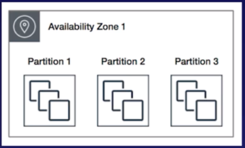
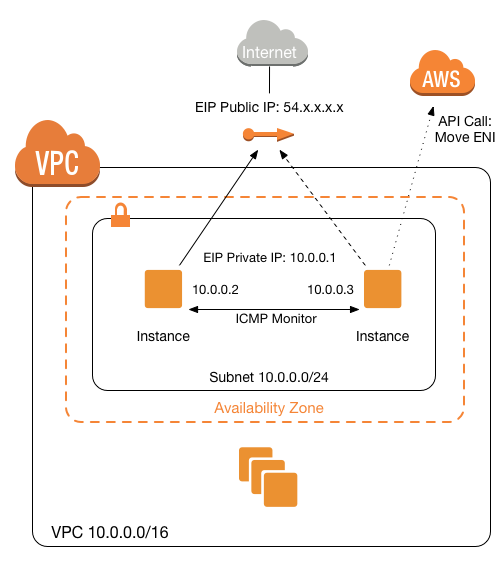
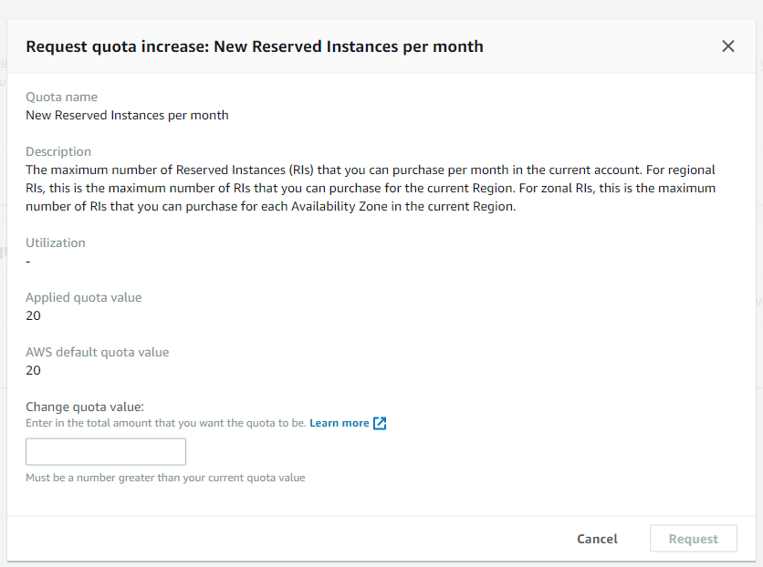

## EC2 CheatSheet
### Features
- provides **scalable computing capacity**
- **EC2 instances** : Virtual computing environments
- **Amazon Machine Images(AMI)** : Preconfigured templates for EC2 instances
  - package the bits needed for the server (including the os and additional sw)
- **Instance types** : Various configurations of CPU, memory, storage, and networking capacity for your instances 
- **Key pairs** : Secure login information for your instances (public-private keys where private is kept by user)
- **Instance store volumes** : Storage volumes for temporary data. Deleted when you stop/terminate your instance
- **Elastic Block Store(EBS)** : Persistent storage volumes for data using
- **Regions and Availability Zones** : Multiple physical locations for your resources such as instances and EBS volumes
- **Security Groups** : A Firewall to specify the protocols, ports, and source IP ranges that can reach your instances 
- **Elastic IP(EIP)** : Static IP addresses
- **Tags** : Metadata. Created and assigned to EC2 resources.
- **VPCs** : Virtual networks that are logically isolated from the rest of the AWS cloud, and can optionally connect to on premises network

### Amazon Machine Image(AMI)
- **Template** from which EC2 instances can be launched quickly 
- **does NOT span across regions**, and needs to be copied 
- **can be shared with other specific AWS accounts or made public**

### Purchasing Option 
- **On-Demand Instances**
  - pay for instances and compute capacity that you use by the hour
  - with no long-term commitments or up-front payments 
- **Reserved Instances**
  - provides **lower hourly running costs** by providing a billing discount 
  - **capacity reservation**
  - suited if **consistent, heavy, predictable** usage 
  - you can **modify AZs** or the **instance size within the same instance type**
  - **pay for entire term** regardless of the usage
- **Spot Instance**
  - cost-effective choice but doest **NOT guarantee availability**
- **Dedicated Instances**
  - tenancy option which enables instances to run in VPC on hardware that's isolated, dedicated to a single customer

## EC2 Pricing Models 
  - On Demand 
  - Reserved : Standard, Convertible, Scheduled 
    - You can modify the AZ, scope, network platform, or instance size (within the same instance type), but not Region.
  - Spot : Like stock market. (if you terminate, you will be charged, if its terminated by EC2, you will NOT be charged.) 
  - Dedicated Hosts : Instance Types F I G H T D R M A R K F X Z A U  
## Feature
- Termination Protection is turned off by default 
- on EBS-backed instance, root EBS volume to be deleted when the instance terminated 
- you CAN encrypt EBS Root Volumes
- Additional EBS Volume also can be encrypted  
- Individual instances are **provisioned in Availablity Zones** 
- You **can add multiple EBS volumes** to an EC2 instance and then create your own **RAID 5/RAID 10/RAID 0** configurations using those volumes.
## Security Groups
   - All Inbound traffic blocked by default
   - All Outbound traffic is allowed
   - security group change takes immediately
   - you can have multiple security groups 
   - STATEFUL : if you open up port, it's going to be open for both inbound and outbound traffic(cf. NACL is STATELESS)
    - if you create an inbound rule allowing traffic in, that traffic automatically allowed back out again
   - you can NOT specify deny rules / can NOT block specific IP using Security Groups (cf. NACL can) 
## Using Role with EC2
- Roles are more secure.
- instead of using credentials, Attach the role to the instance
- hackers cannot take access key & secret access key from .aws  
## Using Bootstrap Scripts
- Bootstrap scripts run when an EC2 instance first boots
- automating  infrastructures(software installs and updates)
## MetaData & User Data
- get information about an instance : When You need to know both the private IP address and public IP address of your EC2 instance.
- curl http://169.254.169.254/latest/meta-data/
- curl http://169.254.169.254/latest/user-data/  
## EC2 Placement Groups 
- 3 Placement Groups 
  - **Clustered Placement Group**
    - grouping of instances **within a single AZ**
    - Low **Network** Latency / High **Network** Throughput (put together real close)
    - canNOT span multiple AZ : Cluster Placement Groups can only exist in one Availabiity Zone since they are focused on keeping instances together, which you cannot do across Availability Zones
    - homogenous(same instance types) recommended 
  - **Spread Placement Group**
  - 
    - **Indivisual Critical** EC2 instances
    - you can only have max 7 running instances per AZ
    - Spread Placement Groups can be deployed **across availability zones** since they spread the instances further apart.
  - **Partitioned Placement Group**
  - 
    - **Multiple** EC2 instances HDFS, HBase, and Cassendra 
- placement group name must be unique
- can NOT merge placement groups 
- you can move after you stopped instances 

## Scenarios 
- **A web application allows customers to upload orders to an s3 bucket. The resulting Amazon S3 events trigger a Lambda function that insets a message to an SQS queues. A single EC2 instance reads messages from the queue, process them, and stores them in a DynamoDB table partitioned by unique order ID. Next month traffic is expected to increase by a factor of 10 and a Solutions Architect is reviewing the architecture for possible scaling problems.    
Which component is MOST likely to need re-architecting to be able to scale to accommodate the new traffic?**
  - **EC2 instance**
  - A single EC2 instance will not scale and is a single point of failure in the architecture.
  - A much better solution would be to have EC2 instances in an Auto Scaling group across 2 availability zones read messages from the queue. The other responses are all managed services that can be configured to scale or will scale automatically.
  
- You have developed a new web application in the US-West-2 Region that requires six Amazon Elastic Compute Cloud (EC2) instances to be running at all times. US-West-2 comprises three Availability Zones (us-west-2a, us-west-2b, and us-west-2c). You need **100 percent fault tolerance**: should any single Availability Zone in us-west-2 become unavailable, the application must continue to run. How would you **make sure 6 servers are ALWAYS available**? NOTE: each answer has 2 possible deployment configurations. Select the answer that gives TWO satisfactory solutions to this scenario.
  - **Solution 1 : 6 instances / 6 instances / 0 instance**
  - **Solution 2 : 3 instances / 3 instances / 3 intstances**
  - You need to work through each case to find which will provide you with the required number of running instances **even if one AZ is lost**. Hint: always assume that the AZ you lose is the one with the most instances. Remember that the client has stipulated that they MUST have 100% fault tolerance.

- Your company announced that there would be a surprise IT audit on all of the AWS resources being used in the production environment. During the audit activities, it was noted that you are using a combination of **Standard and Scheduled Reserved EC2 instances** in your applications. They argued that you should have used Spot EC2 instances instead as it is cheaper than the Reserved Instance.    
Which of the following are the characteristics and **benefits** of using these two types of **Reserved EC2 instances**, which you can use as justification? (Choose 2)
  - **Reserved Instances doesn't get interrupted unlike Spot instances in the event that there are not enough unused EC2 instances to meet the demand.**
  - **You can have capacity reservations that recur on a daily, weekly, or montly basis, with a specified time and duration, for a one-year term through Scheduled Reserved Instances**
  - Reserved Instances are not physical instances, but rather a billing discount applied to the use of On-Demand Instances in your account. When your computing needs change, you can modify your Standard or Convertible Reserved Instances and continue to take advantage of the billing benefit. You can modify the Availability Zone, scope, network platform, or instance size (within the same instance type) of your Reserved Instance. You can also sell your unused instance on the Reserved Instance Marketplace.

- You have launched a new enterprise application with a web server and a database. You are using a large EC2 Instance with one 500 GB EBS volume to host a relational database. Upon checking the performance, it shows that **write throughput to the database needs to be improved**.    
Which of the following is the most suitable configuration to help you achieve this requirement? (Choose 2)
  - **Solution 1 : Increase the size of the EC2 Instance**
  - **Solution 2 : Set up a standard RAID 0 configuration with 2 EBS Volumes**
  - RAID
    - Raid 0 : Striping (하나의 데이터를 여러 드라이브에 분산 저장함으로써 **빠른 입출력**이 가능)
    - Raid 1 : Mirroring (똑같은 데이터를 동일한 용량과 스팩의 다른 디스크에도 저장함으로써 높은 안정성 확보)
  - Setting up the EC2 instance in a placement group : is incorrect because the placement groups feature is primarily used for **inter-instance communication.**

- You are designing a multi-tier web application architecture that consists of a fleet of EC2 instances and an Oracle relational database server. It is required that the database is **highly available** and that you have **full control over its underlying operating system**.    
Which AWS service will you use for your database tier?
  - **A) Amazon EC2 instances with data replication between two different Availability Zones.**
  - The Quick Start deploys the Oracle primary database (using the preconfigured, general-purpose starter database from Oracle) on an Amazon EC2 instance in the first Availability Zone. It then sets up a second EC2 instance in a second Availability Zone, copies the primary database to the second instance by using the `DUPLICATE` command, and configures Oracle Data Guard.
  - **Amazon RDS and Amazon RDS with Multi-AZ deployments** : are both incorrect because the scenario requires you to have access to the underlying operating system of the database server. Remember that Amazon RDS is a managed database service, which means that **Amazon** is the one that **manages the underlying operating system** of the database instance and not you.

- You are managing a suite of applications in your on-premises network which are using trusted IP addresses that your partners and customers have whitelisted in their firewalls. There is a requirement to **migrate these applications** to AWS **without** requiring your partners and customers to **change their IP address whitelists.**      
Which of the following is the most suitable solution to properly migrate your applications?
  - **A) Create a Route Origin Authorization(ROA) then one done, provision and advertise your whitelisted IP address range to your AWS account.**
  - Setting up a list of Elastic IP addresses to map the whitelisted IP address range in your on-premises network :  is incorrect because you cannot map the IP address of your on-premises network, which you are migrating to AWS, to an EIP address of your VPC. To satisfy the requirement, you must authorize Amazon to advertise the address range that you own.

- You have a requirement to make sure that an On-Demand EC2 instance can only be accessed from this IP address (110.238.98.71) via an **SSH** connection. Which configuration below will satisfy this requirement?
  - **A) Security Group Inbound Rule : Protocol - TCP. Port Range-22, Source 110.238.98.71/32**
  - SSH protocol uses TCP and port 22. The requirement is to only allow the individual IP of the client and not the entire network. Therefore, the proper CIDR notation should be used. The /32 denotes one IP address and the /0 refers to the entire network.

- You are a Solutions Architect for a leading Enterprise Resource Planning (ERP) solutions provider and you are instructed to design and set up the architecture of your ERP application in AWS. Your manager instructed you to **avoid using fully-managed AWS services** and instead, only use specific services which allows you to access the underlying operating system for the resource. This is to allow the company to have a much better control of the underlying resources that their systems are using in the AWS cloud.       
Which of the following services should you choose to satisfy this requirement? (Choose 2)
  - **A) EMR, EC2
  - **Amazon EC2** : provides you access to the operating system of the instance that you created.
  - **Amazon EMR** : provides you a managed Hadoop framework that makes it easy, fast, and cost-effective to process vast amounts of data across dynamically scalable Amazon EC2 instances. You can access the operating system of these EC2 instances that were created by Amazon EMR.
  - **Amazon Athena, DynamoDB, Amazon Neptune** : are incorrect as these are managed services, which means that **AWS manages the underlying operating system** and other server configurations that these databases use.

- You are working for a software company that has moved a legacy application from an on-premises data center to the cloud. The legacy application **requires a static IP address hard-coded into the backend**, which blocks you from using an Application Load Balancer.    
Which steps would you take to apply **high availability and fault tolerance** to this application **without ELB**? (Choose 2)
  - **Solution 1: Assign an Elastic IP address to the instance**
  - **Solution 2: Write a script that checks the health of the EC2 instance. If the instance stops responding, the script will switch the elastic IP address to a standby EC2 instance.**
  -     
  - **Launching the instance using Auto Scaling which will deploy the instance again if it becomes unhealthy** : is incorrect as even though the Auto Scaling group provides high availability and scalability, it still depends on ELB which is not available in this scenario. Take note that you need to have a static IP address which can be in the form of an Elastic IP. Although an Auto Scaling group can scale out if one of the EC2 instances became unhealthy, you still cannot directly assign an EIP to an Auto Scaling group. In addition, you are only limited to use EC2 instance status checks for your Auto Scaling group if you do not have an ELB which can provide you the actual health check of your application (using its port), and not just the health of the EC2 instance.

- You work for a leading university as an AWS Infrastructure Engineer and also as a professor to aspiring AWS architects. As a way to familiarize your students with AWS, you gave them a project to host their applications to an EC2 instance. One of your students created an instance to host their online enrollment system project but is having a hard time **connecting to their newly created EC2 instance**. Your students have explored all of the troubleshooting guides by AWS and narrowed it down to login issues.       
Which of the following can you use to **log into an EC2 instance**?
  - **A) Key Pairs

- Using the EC2 API, you requested 40 m5.large On-Demand EC2 instances in a single Availability Zone. Twenty instances were successfully created but the other 20 requests failed.       
What is the solution for this issue and what is the root cause?
  - **A) For new accounts, there is a soft limit of 20 EC2 instances per region. Submit an Amazon EC2 instance Request Form in order to lift this limit.**
  - 

- As a Network Architect developing a food ordering application, you need to retrieve the instance ID, public keys, and public IP address of the EC2 server you made for tagging and grouping the attributes into your internal application running on-premises.    
Which EC2 feature will help you achieve your requirements?
  - **A) Instance metadata**
  - **metadata vs. userdata**
    - **metadata** : the data about your instance that you can use to **configure or manage the running instance**. You can get the **instance ID, public keys, public IP address**
    - **userdata** : perform common automated configuration tasks and **run scripts after the instance starts**.

- You are an AWS Network Engineer working for a utilities provider where you are managing a monolithic application with EC2 instance using a Windows AMI. You want to implement a cost-effective and highly available architecture for your application where you have an exact replica of the Windows server that is in a running state. If the primary instance terminates, you can attach the ENI to the standby secondary instance which allows the traffic flow to resume within a few seconds.    
When it comes to the **ENI attachment to an EC2 instance**, what does **'warm attach'** refer to?
  - **A) attaching an ENI to an instance when it is stopped**
  - **An elastic network interface (ENI)** : is a logical networking component in a VPC that represents a **virtual network card**. You can attach a network interface to an EC2 instance in the following ways:
    - When it's **running (hot attach)**
    - When it's **stopped (warm attach)**
    - When the instance is **being launched (cold attach)**.
