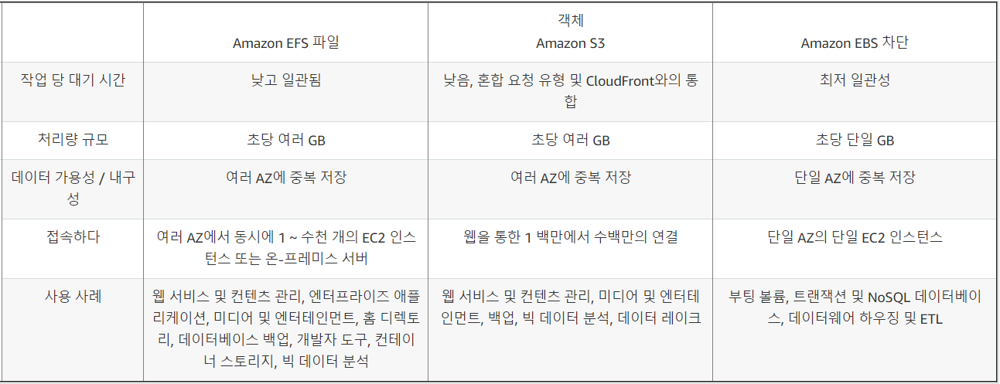

## Feature
- NFS(Network File System) protocol 
- only pay for the storage you use(no pre-provisioning required like EBS Volume)
- support : scale up to petabytes, concurrent NFS connections
- Data is stored across **multiple AZ**
- Read after Write Consistency

## Scenario
- A content management system (CMS) is hosted on a fleet of auto-scaled, On-Demand EC2 instances which use Amazon Aurora as its database. Currently, the system stores the file documents that the users uploaded in one of the **attached EBS Volumes**. Your manager noticed that the system performance is quite slow and he has instructed you to improve the architecture of the system.    
In this scenario, what will you do to implement a **scalable, high throughput POSIX-compliant file system**?
  - **A) Use EFS**
  - **EFS** : provides simple, scalable, elastic file storage
  - **S3** : object storageone EC2 instance at a time**
  - **EBS** : EBS 볼륨은 한 번에 하나의 EC2 인스턴스에 연결될 수 있으므로 다른 EC2 인스턴스는 해당 EBS 프로비저닝 된 IOPS 볼륨에 연결할 수 없습니다

- A data analytics company has been building its new generation big data and analytics platform on their AWS cloud infrastructure. They need a storage service that provides the scale and performance that their big data applications require such as high throughput to compute nodes coupled with read-after-write consistency and **low-latency** **file operations**. In addition, their data needs to be stored redundantly across multiple AZs and **allows concurrent connections from multiple EC2 instances** hosted on multiple AZs.     
Which of the following AWS storage services will you use to meet this requirement?
  - **A) EFS**
  - **EBS** : **Block** storage and can only have one connection to **one EC2 instance at a time**

- A leading e-commerce company is in need of a storage solution that can be accessed by **1000 Linux servers** in multiple availability zones. The service should be able to handle the **rapidly changing data** at scale while still maintaining high performance. It should also be highly durable and highly available whenever the servers will pull data from it, with little need for management.    
As the Solutions Architect, which of the following services is the most cost-effective choice that you should use to meet the above requirement?
  - **A) EFS**
  - Amazon EFS 파일 시스템은 스토리지를 프로비저닝할 필요 없이 자동으로 기가바이트에서 페타바이트 규모의 데이터로 확장될 수 있습니다. 수십 개, 수백 개 또는 수천 개의 Amazon EC2 인스턴스에서 동시에 Amazon EFS 파일 시스템에 액세스할 수 있으며, Amazon EFS는 각 Amazon EC2 인스턴스에 일관된 성능을 제공합니다.
  - **Use Case**
    - **EFS** : Amazon EC2에 사용할 수 있는 파일 스토리지 서비스입니다. Amazon EFS는 최대 수천 개의 Amazon EC2 인스턴스를 위한 파일 시스템 인터페이스, 파일 시스템 액세스 시맨틱(강력한 일관성 및 파일 잠금 등) 및 동시에 액세스 가능한 스토리지를 제공합니다.
    - **EBS** : Amazon EC2에 사용할 수 있는 블록 수준 스토리지 서비스입니다. Amazon EBS는 단일 EC2 인스턴스에서 가장 짧은 지연 시간으로 데이터에 액세스해야 하는 워크로드에 필요한 성능을 제공할 수 있습니다.
    - **S3** : 객체 스토리지 서비스입니다. Amazon S3를 사용하면 어디에서나 액세스할 수 있는 인터넷 API를 통해 데이터를 사용할 수 있습니다. this service is not suitable for storing data which are rapidly changing, just as mentioned in the above explanation. It is still more effective to use EFS as it offers strong consistency and file locking which the S3 service lacks.   
    
