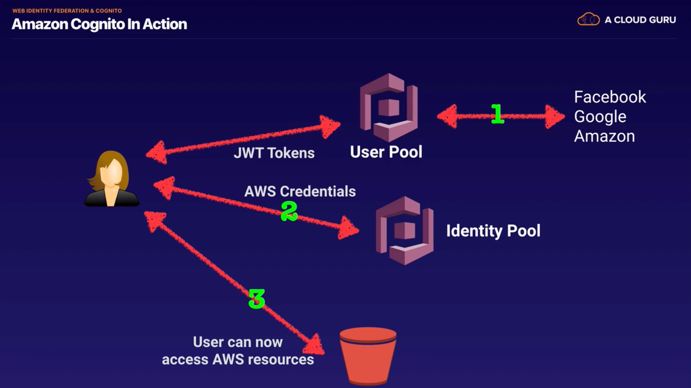

## IAM CheatSheet 
### Features
- securely control access to AWS services and resources
- helps create and manage user identities and grant permissions for those users
- helps create groups for multiple users with similar permissions
- NOT appropriate for application authentication
- is Global and does not need to be migrated to a different region
- helps define Policies 
  - in JSON Format
  - all permissions are implicitly denied by default
  - most restrictive policy wins 
### IAM Role 
- helps grants and delegate access to users and services without the need of creating permanet credentials
- IAM Users or AWS Services can assume a role to obtain temporary security credentials that can be used to make AWS API calls
- needs **Trust policy** to define who and **Permission policy** to define what the user or service can access
- used with **Security Token Service(STS)**, a lightweight web service that provides **temporary, limited privilege** credentials for IAM users or for authenticated federated users
- Using **SAML** (Security Assertion Markup Language 2.0), you can give your **federated users single sign-on (SSO) access** to the AWS Management Console.
### IAM Role Scenarios
- Service access for e.g. EC2 to access S3/DynamoDB
- Cross Account access for users 
  - with user within the same account 
  - with user within an AWS account owned the same owner 
  - with user from a Third Party AWS account with External ID for enhanced security
- Identity Providers & Federation
  - Web Identity Federation, where the user can be authenticated using external authentication ID providers(like Amazon, Facebook, Google) or any OpenIdP using AssumeRoleWithWebIdentity
### IAM Best Practices 
- Do NOT use Root account for anything other than billing 
- Create Individual IAM Users 
- Use groups to assign permissions to IAM users
- Grant least previlege
- Use IAM Roles for applications on EC2
- Delegate using roles instead of sharing credentials 
- Rotate credentials regularly
- Use Policy conditions for increased details 
- Use CloudTrail to keep a history of activity
- Enforce a strong IAM password policy for IAM Users 
- Remove all unused users and credentials

## Using Role with EC2
- instead of using credentials, Attach the role to the instance
- hackers cannot take access key & secret access key from .aws 

## Concept
- PCI DSS(Payment Card Industry Data Security Standard)
- root account
- MFA on root
- universal : global (region xx)
- **group** : job function, policy (NO permissions when first created)
- **access key** : pragrammic access, not the same as a password, view just once 
- **policy** : document that provides a formal statement of one or more permissions.
- **role** : policy + policy
- password : customize password rotation policy 
- **STS(Security Token Service)** - temporary security credentials

## Cognito - Web Identity Federation
- **Web Identity Federation**
  - Give your users access to AWS resources after they have authenticated with a Web ID Provider(Amazon, Facebook, Google..)
  - Following successful authentication, the user receives an **authentication code** from web id provider, which they can trade for **temporary AWS security credentials**.
- Use Cases

- Cognito User Pools vs. Identity Pools(actual granting)
  - **User Pool** : A **User Directory** used to sign-in directly to the User Pool. Cognito acts as an Identity Broker between the id provider and AWS. Successful authentication generates a JSON Web Token(JWTs)
  - **Identity Pool** : enable **provide temporary AWS credentials**
- Cognito Synchronisation : Various different devices

## Scenarios 
- **A company is storing an access key (access key ID and secret access key) in a text file on a custom
AMI. The company uses the access key to access DynamoDB tables from instances created from the AMI. The security team has mandated a more secure solution. Which solution will meet the security team’s mandate?**        
         
  A. Put the access key in an S3 bucket, and retrieve the access key on boot from the instance.       
  B. Pass the access key to the instances through instance user data.       
  C. Obtain the access key from a key server launched in a private subnet.        
  **D. Create an IAM role with permissions to access the table, and launch all instances with the new role.**       
  
  - IAM roles for EC2 instances allow applications running on the instance to access AWS resources without having to create and store any access keys.
  - Any solution involving the creation of an access key then instrodues the complexity of managing that secret

- **You are deploying an Interactive Voice Response (IVR) telephony system in your cloud architecture that interacts with callers, gathers information, and routes calls to the appropriate recipients in your company. The system will be composed of an Auto Scaling group of EC2 instances, an Application Load Balancer, and a MySQL RDS instance in a Multi-AZ Deployments configuration. To protect the confidential data of your customers, you have to ensure that your RDS database can only be accessed using the profile credentials specific to your EC2 instances via an authentication token.    
As the Solutions Architect of the company, which of the following should you do to meet the above requirement?**
  - **A) Enable the IAM DB Authentication**
  - IAM database authentication works with MySQL and PostgreSQL. With this authentication method, you don't need to use a password when you connect to a DB instance. Instead, you use an authentication token.    
  An **authentication token** is a unique string of characters that Amazon RDS generates on request. You don't need to store user credentials in the database, because authentication is managed externally using IAM.
  
  - Configuring SSL in your application to encrypt the database connection to RDS : is incorrect because an SSL connection is not using an authentication token from IAM.
  - assigning IAM Role to your EC2 instances which will grant exclusive access to your RDS instance : is incorrect because although you can create and assign an IAM Role to your EC2 instances, you still need to configure your RDS to use IAM DB Authentication.
  - a combination of IAM and STS : is incorrect. Although STS is used to send temporary tokens for authentication, this is not a compatible use case for RDS.

- A tech company that you are working for has undertaken a Total Cost Of Ownership (TCO) analysis evaluating the use of Amazon S3 versus acquiring more storage hardware. The result was that **all 1200 employees would be granted access to use Amazon S3** for storage of their personal documents.       
Which of the following will you need to consider so you can set up a solution that **incorporates single sign-on** feature from your corporate AD or LDAP directory and also **restricts access** for each individual user to a designated user folder in an S3 bucket? (Choose 2)
  - **Solution 1 : Set up a Federation proxy or an Identity provider, and use AWS Security Token Service to generate temporary tokens.**
  - **Solution 2 : Configuring an IAM role and an IAM Policy to access the bucket**

- You work for an Intelligence Agency as its Principal Consultant developing a missile tracking application, which is hosted on both development and production AWS accounts. Alice, the Intelligence agency’s Junior Developer, only has access to the development account. She has received security clearance to access the agency’s production account but **the access is only temporary and only write access** to EC2 and S3 is allowed.    
Which of the following allows you to **issue short-lived access tokens that acts as temporary security credentials to allow access** to your AWS resources?
  - **A) AWS STS**
  - **AWS STS vs. AWS Cognito JWT**
    - **STS** : provide trusted users with temporary **security credentials** that can control access to your AWS resources.
    - **JWT** : the Amazon Cognito service is primarily used for **user authentication** and not for providing access to your AWS resources. A JSON Web Token (JWT) is used for user authentication and **session management**.

- You are the Solutions Architect for your company's AWS account of approximately 300 IAM users. They have a new company policy that will change the access of 100 of the IAM users to have a particular sort of access to Amazon S3 buckets.    
What will you do to avoid the time-consuming task of applying the policy at the individual user?
  - **A) Create a new IAM group and then add the users that require access to the S3 bucket. Afterwards, apply the policy to IAM group.**
  - This will enable you to easily add, remove, and manage the users instead of manually adding a policy to each and every 100 IAM users.

- A tech startup has recently received a Series A round of funding to continue building their mobile forex trading application. You are hired to set up their cloud architecture in AWS and to implement a highly available, fault tolerant system. For their database, they are using DynamoDB and for authentication, they have chosen to use **Cognito**. Since the mobile application contains confidential financial transactions, there is a **requirement to add a second authentication method that doesn't rely solely on user name and password**.       
How can you implement this in AWS?
  - **A) Add multi-factor authentication (MFA) to a user pool in Cognito to protect the identity of your users.**
  
- A San Francisco-based tech startup is building a cross-platform mobile app that can notify the user with upcoming astronomical events such as eclipses, blue moon, novae or a meteor shower. Your mobile app authenticates with the Identity Provider (IdP) using the provider's SDK and Amazon Cognito. Once the end user is authenticated with the IdP, the OAuth or OpenID Connect token returned from the IdP is passed by your app to Amazon Cognito.    
Which of the following is returned for the user to **provide a set of temporary, limited-privilege AWS credentials**?
  - **A) Cognito ID**
  -  **Amazon Cognito identity pools** support both authenticated and unauthenticated identities. 인증되지 않은 사용자를 허용하는 경우 또는 사용자를 인증하는 경우 자격 증명 공급자(credentials provider)에서 로그인 토큰을 설정 한 후 최종 사용자의 고유 한 Amazon Cognito 식별자 (identity ID)를 즉시 검색 할 수 있습니다.
  - **Cognito SDK** : is incorrect because this is a software development kit that is available in various programming languages.
  - **Cognito Key Pair** : is incorrect because this is a cryptography key
  - **Cognito API** : is incorrect because this is primarily used as an Application Programming Interface.

- You have a requirement to integrate the Lightweight Directory Access Protocol (**LDAP**) **directory service** of your on-premises data center to your AWS VPC using IAM. **The identity store** which is currently being used is **not compatible with SAML**.       
Which of the following provides the most valid approach to implement the integration?
  - **A) Develop an on-premises custom identity broker application and use STS to issue short-lived AWS credentials.**
  - 

- You are a Solutions Architect working for a startup which is currently migrating their production environment to AWS. Your manager asked you to set up access to the AWS console using Identity Access Management (IAM). **Using the AWS CLI, you have created 5 users for your systems administrators.**    
What further steps do you need to take for your systems administrators **to get access to the AWS console**?
  - **A) Provide a password for each user created and give these passwords to your system administrators.**
  
- You are consulted by a multimedia company that needs to deploy web services to an AWS region which they have never used before. The company currently has an IAM role for their Amazon EC2 instance which permits the instance to access Amazon DynamoDB. They want their **EC2 instances in the new region to have the exact same privileges**.    
What should you do to accomplish this?
	- **A) Assign the existing IAM role to instances in the new region**
	- 이 시나리오에서는 회사에 기존 IAM 역할이 있으므로 새 역할을 만들 필요가 없습니다. IAM 역할은 모든 리전에서 사용할 수있는 글로벌 서비스이므로 기존 IAM 역할을 새 리전의 인스턴스에 할당하기 만하면됩니다.
	- **Creating an Amazon Machine Image (AMI) of the instance and copying it to the new region** : is incorrect. AMI 이미지 생성은 인스턴스의 IAM 역할에 영향을 미치지 않습니다.
