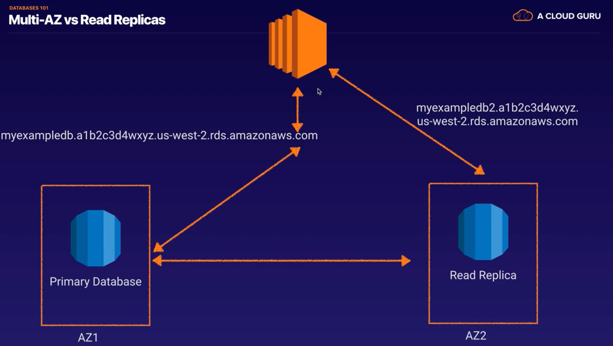
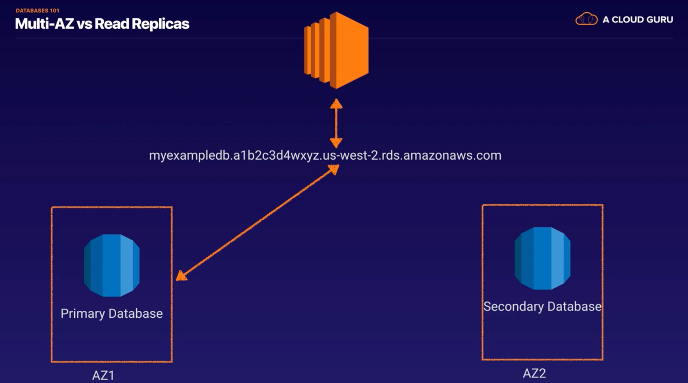

## RDS CheatSheet
### Features
- provides **Relational Database** service
- supports MySQL, MariaDB, PostgreSQL, Oracle, MSSQL Server, MySQL-compatible Amazon Aurora DB engine
- it is a managed service, shell(root SSH) access is NOT provided 
- manages backups, software patching, automatic failure detection, recovery 
- supports user initiated manual backups and snapshots
- **daily automated backups with database transaction logs** enables **Point in Time recovery** up to the last 5 minutes of database usage
- **Snapshots** : user-initiated storage volume snapshot of DB instance, backing up the **entire DB instance and not just individual databases** that can be restored as a independent RDS instance
- **Encryption** : support encryption at rest using KMS as well as encryption in transit using SSL endpoints
  - For encrypted database : logs, snapshots, backups, read replicas are all encrypted as well
- RDS does not support all features of underlying databases, and if required the database instance can be launched on an EC2 instance
- RMAN(Recovery Manaber) can be used for Oracles backup and recovery when running on an EC2 instance

### Multi-AZ deployment 
- provides **high availability and automatic failover support and is NOT a scaling solution**
- maintains a **synchronous standby replica in a different AZ**
- **transaction success** is returned only if **the commit is successful BOTH on the primary and the standby DB**
- Oracle, PostgreSQL, MySQL, MariaDB DB instances use **Amazon technology**, while SQL Server DB instance use **SQL Server Mirroring**
- **Snapshots and Backups are taken from standby & eliminate I/O freezes**
  - single AZ RDS : I/O may be briefly suspended while the backup process initializes (typically under a few seconds), and you may experience a brief period of elevated latency.
- During automatic failover, its seamless and RDS switches to the standby instance and **updates the DNS record to point to standby**
- failover can be **forced** with the **Reboot** with failover option

### Read Replicas 
- uses the PostgreSQL, MySQL, MariaDB DB engines' built-in replication functionally to create a separate Read Only instance
- updates are **asynchrously** copied to the Read Replica
- can help **scale applications** and **reduce read only load**
- requires automative **backups enabled**
- **replicates ALL databases** in the source DB instance 
- for Disaster Recovery, can be **promoted to a full fledged database**
- can be **created in a different region** for MySQL, Postgres, MariaDB for Disaster Recovery, Migration, Low Latency across regions.

## Features
- OLTP (cf. DynamoDB:NoSQL, Redshift:OLAP, Elasticache:Memcached/Redis)
- RDS runs on VM
- You cannot SSH log in to these operation systmes however.(Amazon's responsibility)
- RDS is NOT Serverless
- Aurora is Serverless
- Error node : the response from **RDS API** to check RDS for an error
- provisioned IOPS over standard storage when.. : if you use online transaction processing in your production environment
## Backups, Multi-AZ, Read Replicas
- **Backup**
  - Automated Backups (by default)
  - Database Snapshot
  - single AZ RDS : I/O may be briefly suspended while the backup process initializes (typically under a few seconds), and you may experience a brief period of elevated latency.
- **Read Replicas**
  
  - Can be Multi-AZ, different regions
  - Used to increase performance (ex.for heavy traffics)
  - Must have backups turned on 
  - Can be promoted to master, this will break the Read Replica 
- **Multi-AZ**
  
  - Used For Disaster Recovery(failover by rebooting RDS instance)
 
