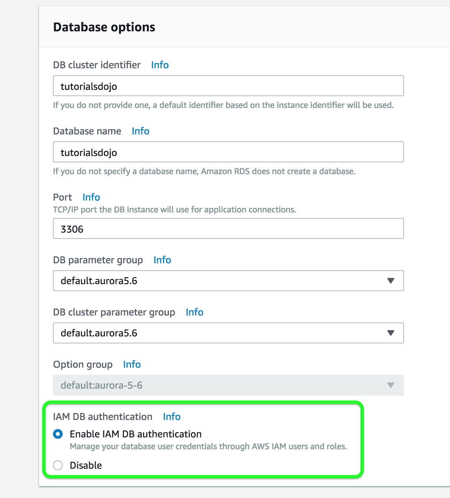

## RDS CheatSheet
### Features
- provides **Relational Database** service
- supports MySQL, MariaDB, PostgreSQL, Oracle, MSSQL Server, MySQL-compatible Amazon Aurora DB engine
- it is a managed service, shell(root SSH) access is NOT provided 
- manages backups, software patching, automatic failure detection, recovery 
- supports user initiated manual backups and snapshots
- **daily automated backups with database transaction logs** enables **Point in Time recovery** up to the last 5 minutes of database usage
- **Snapshots** : user-initiated storage volume snapshot of DB instance, backing up the **entire DB instance and not just individual databases** that can be restored as a independent RDS instance
  - max backup retention period : 35 days
- **Encryption** : support encryption at rest using KMS as well as encryption in transit using SSL endpoints
  - For encrypted database : logs, snapshots, backups, read replicas are all encrypted as well
- RDS does not support all features of underlying databases, and if required the database instance can be launched on an EC2 instance
- RMAN(Recovery Manaber) can be used for Oracles backup and recovery when running on an EC2 instance

### Multi-AZ deployment 
- provides **high availability and automatic failover support and is NOT a scaling solution**
- maintains a **synchronous standby replica in a different AZ**
- **transaction success** is returned only if **the commit is successful BOTH on the primary and the standby DB**
- Oracle, PostgreSQL, MySQL, MariaDB DB instances use **Amazon technology**, while SQL Server DB instance use **SQL Server Mirroring**
- **Snapshots and Backups are taken from standby & eliminate I/O freezes**
  - single AZ RDS : I/O may be briefly suspended while the backup process initializes (typically under a few seconds), and you may experience a brief period of elevated latency.
- During automatic failover, its seamless and RDS switches to the standby instance and **updates the DNS record to point to standby**
- failover can be **forced** with the **Reboot** with failover option

### Read Replicas 
- uses the PostgreSQL, MySQL, MariaDB DB engines' built-in replication functionally to create a separate Read Only instance
- updates are **asynchrously** copied to the Read Replica
- can help **scale applications** and **reduce read only load**
- requires automative **backups enabled**
- **replicates ALL databases** in the source DB instance 
- for Disaster Recovery, can be **promoted to a full fledged database**
- can be **created in a different region** for MySQL, Postgres, MariaDB for Disaster Recovery, Migration, Low Latency across regions.

## Features
- **OLTP** (cf. DynamoDB:NoSQL, Redshift:OLAP, Elasticache:Memcached/Redis)
- RDS runs on VM
- You cannot SSH log in to these operation systmes however.(Amazon's responsibility)
- RDS is NOT Serverless
- Aurora is Serverless
- Error node : the response from **RDS API** to check RDS for an error

## RDS DB Instance Storage
- DB instances use Amazon Elastic Block Store (Amazon EBS) volumes for database and log storage. 
  - [EBS Storage Types](https://github.com/dasoldasol/dasolseo.github.io/blob/master/_posts/EBS.md#ebs-types)
- **Provisioned IOPS (SSD) storage** : if you use **online transaction processing** in your production environment. for I/O-intensive, transactional (OLTP) database workloads
  - RDS Provisioned IOPS storage with MSSQL Server ) RDS volume 16TB
- **General Purpose (SSD) storage**

## Backups, Multi-AZ, Read Replicas
- **Backup**
  - Automated Backups (by default)
  - Database Snapshot
  - single AZ RDS : I/O may be briefly suspended while the backup process initializes (typically under a few seconds), and you may experience a brief period of elevated latency.
- **Read Replicas**
  
  - Can be Multi-AZ, different regions
  - Used to increase performance (ex.for heavy traffics)
  - Must have backups turned on 
  - Can be promoted to master, this will break the Read Replica 
  - **data transfer charge** when replicating data from primary RDS to secondary RDS **is free**
- **Multi-AZ**
  
  - Used For Disaster Recovery(failover by rebooting RDS instance)

## Scenario
- **You are deploying an Interactive Voice Response (IVR) telephony system in your cloud architecture that interacts with callers, gathers information, and routes calls to the appropriate recipients in your company. The system will be composed of an Auto Scaling group of EC2 instances, an Application Load Balancer, and a MySQL RDS instance in a Multi-AZ Deployments configuration. To protect the confidential data of your customers, you have to ensure that your RDS database can only be accessed using the profile credentials specific to your EC2 instances via an authentication token.    
As the Solutions Architect of the company, which of the following should you do to meet the above requirement?**
  - **A) Enable the IAM DB Authentication**
  - IAM database authentication works with MySQL and PostgreSQL. With this authentication method, you don't need to use a password when you connect to a DB instance. Instead, you use an authentication token.    
  An **authentication token** is a unique string of characters that Amazon RDS generates on request. You don't need to store user credentials in the database, because authentication is managed externally using IAM.
  
  - Configuring SSL in your application to encrypt the database connection to RDS : is incorrect because an SSL connection is not using an authentication token from IAM.
  - assigning IAM Role to your EC2 instances which will grant exclusive access to your RDS instance : is incorrect because although you can create and assign an IAM Role to your EC2 instances, you still need to configure your RDS to use IAM DB Authentication.
  - a combination of IAM and STS : is incorrect. Although STS is used to send temporary tokens for authentication, this is not a compatible use case for RDS.
