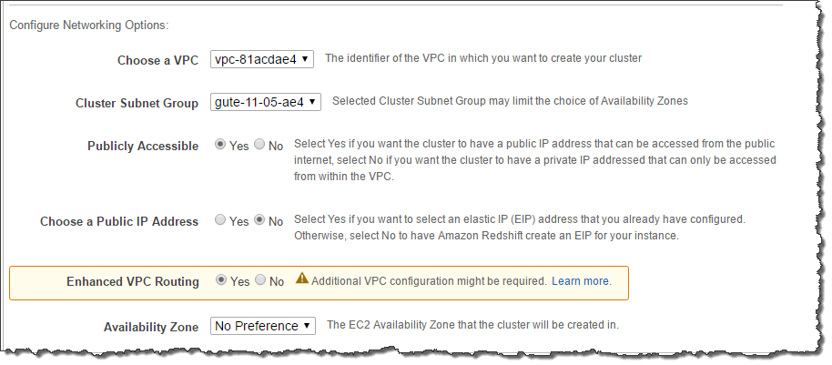

## Redshift CheatSheet
- fully managed, fast and powerful, petabyte scale **data warehouse** service
- uses **replication and continuous backups** to enhance availability and improve data durability and can automatically recover from node and component failures.
- Massive Parallel Processing(MPP) : distributing & parallelizing queries across multiple physical resources
- comlumnar data storage : improving query performance and allowing advance compression techniques
- **only supports Single-AZ deployments** and the nodes are available within the same AZ, if the AZ supports Redshift clusters.
- spot instances are **NOT** and option

## Features
- used for business intelligence(OLAP)
- Available in ONLY 1 AZ

## Backups
- Enabled by default with a 1 day retention period (Max 35days)
- maintain at least 3 copies of your data(original/replica on compute nodes/backup in s3)
- Disaster Recovery : replicate Snapshots to s3 in another region

## Scenarios
- A company is using Redshift for its online analytical processing (OLAP) application which processes complex queries against large datasets. There is a requirement in which you have to **define the number of query queues** that are available and **how queries are routed** to those queues for processing.    
Which of the following will you use to meet this requirement?
  - **A) Use the workload management(WLM) in the parameter group configuration 
  - Amazon Redshift WLM (Workload Management)은 사용자가 작업 부하 내에서 우선 순위를 유연하게 관리 할 수 있도록하여 실행 시간이 짧고 질의가 오래 걸리는 쿼리의 큐에서 멈추지 않도록합니다.

- You are working as a Solutions Architect for a major telecommunications company where you are assigned to improve the security of your database tier by **tightly managing the data flow** of your Amazon Redshift cluster. One of the requirements is to **use VPC flow logs to monitor all the COPY and UNLOAD traffic** of your Redshift cluster that moves in and out of your VPC.    
Which of the following is the most suitable solution to implement in this scenario?
  - **A) Enable Enhanced VPC routing on your Amazon Redshift cluster**
  - When you use Amazon Redshift Enhanced VPC Routing, Amazon Redshift forces all COPY and UNLOAD traffic between your cluster and your data repositories through your Amazon VPC. When you use Enhanced VPC Routing to route traffic through your VPC, you can also use VPC flow logs to monitor COPY and UNLOAD traffic. 
  - Audit Logging : is incorrect because the Audit Logging feature is primarily used to get the information about the connection, queries, and user activities in your Redshift cluster.
  - Amazon Redshift Spectrum : is incorrect because this is primarily used to run queries against exabytes of unstructured data in Amazon S3
  

- You are working for an online hotel booking firm with terabytes of customer data coming from your websites and applications. There is an annual corporate meeting where you need to present the booking behavior and acquire new insights from your customers’ data. You are looking for a service to perform **super-fast analytics on massive data sets in near real-time**.   
Which of the following services gives you the ability to **store huge amounts of data and perform quick and flexible queries** on it? 
  - **A) Redshift**
  - **Redshift** : delivers ten times faster performance than other data warehouses by using machine learning, massively parallel query execution, and **columnar storage on high-performance disk**.
  - **DynamoDB** : is incorrect. DynamoDB is a NoSQL database which is based on **key-value pairs used for fast processing of small data** that dynamically grows and changes. But if you need to scan large amounts of data (ie a lot of keys all in one query), the performance will not be optimal.
  - **ElastiCache** : is incorrect because this is used to increase the performance, speed and redundancy with which applications can retrieve data by providing an **in-memory database caching system**, and not for database analytical processes.
  - **RDS** : is incorrect because this is mainly used for On-Line Transaction Processing (OLTP) applications and not for Online Analytics Processing (OLAP)
