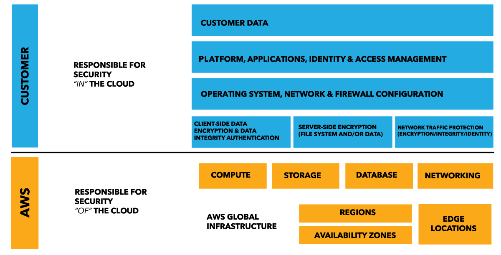

## Feature

## Scenario
- You are a Solutions Architect of a media company and you are instructed to migrate an on-premises web application architecture to AWS. During your design process, you have to give consideration to current on-premises security and determine which security attributes you are responsible for on AWS.    
Which of the following does **AWS provide for you as part of the shared responsibility model**?
  - **A) Physical network infrastructure**
  - **Instance security** : is incorrect because it is your responsibility to set up the security tools AWS has provided you to secure your instances in your cloud environment.

- You are working as a Solutions Architect for a leading commercial bank which has recently adopted a hybrid cloud architecture. You have to ensure that the required data security is in place on all of their AWS resources to meet the strict financial regulatory requirements.       
In the AWS Shared Responsibility Model, which security aspects are **the responsibilities of the customer**? (Choose 2)
  - **A1) OS Patching of an EC2 instance**
  - **A2) IAM Policies and Credentials Management**
  - **The shared responsibility model for infrastructure services**, such as Amazon Elastic Compute Cloud (Amazon EC2) for example, specifies that **AWS manages** the security of the following assets:    
    - Facilities 
    - Physical security of hardware
    - Network infrastructure
    - Virtualization infrastructure 
  - You as **the customer are responsible** for the security of the following assets:
    - Amazon Machine Images(AMIs)
    - Operating systems 
    - Applications
    - Data in transit 
    - Data at rest
    - Data stores 
    - Credentials 
    - Policies and configuration
