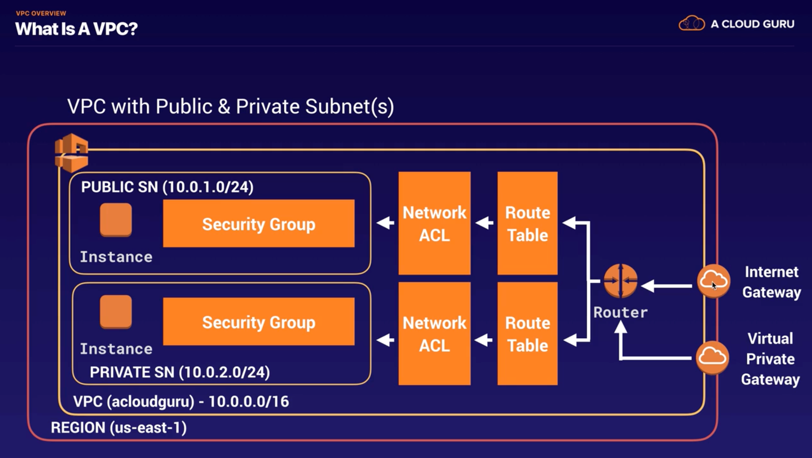
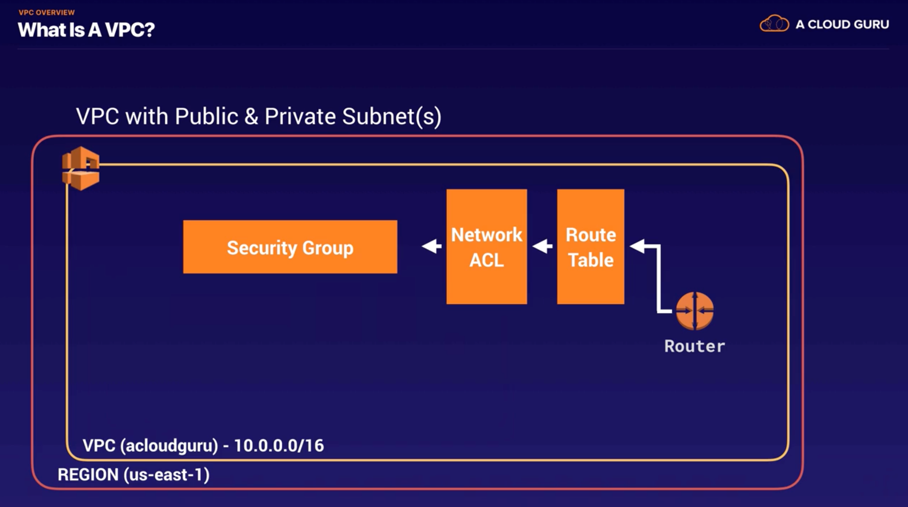
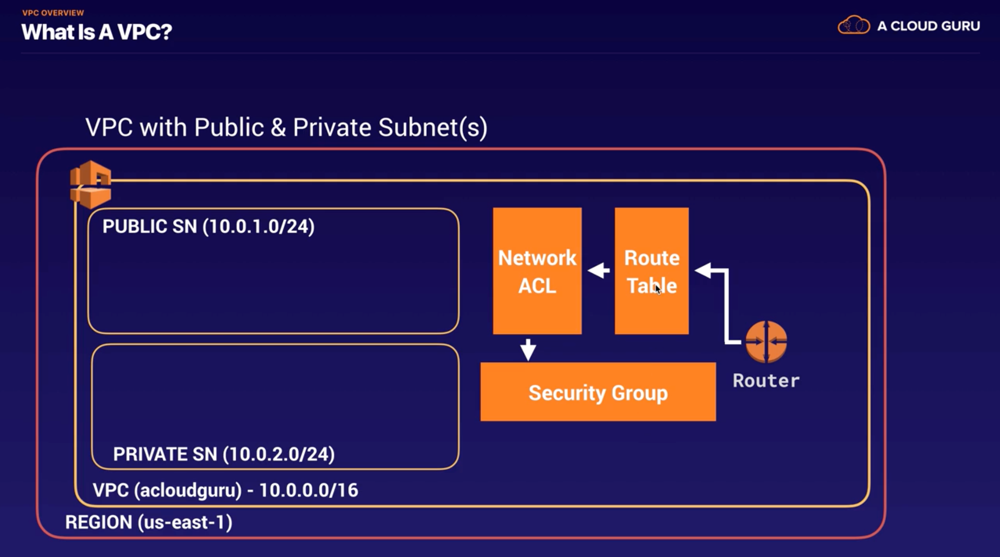
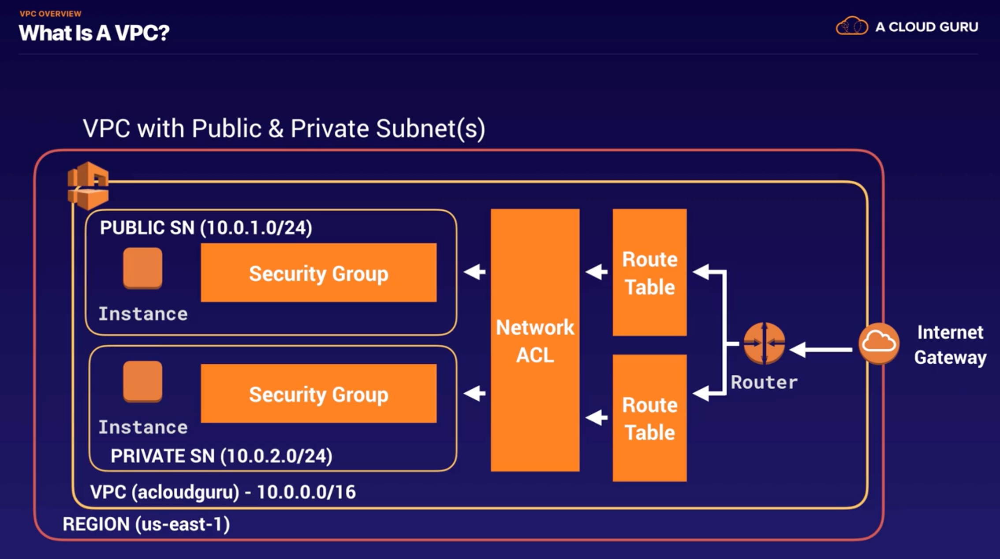
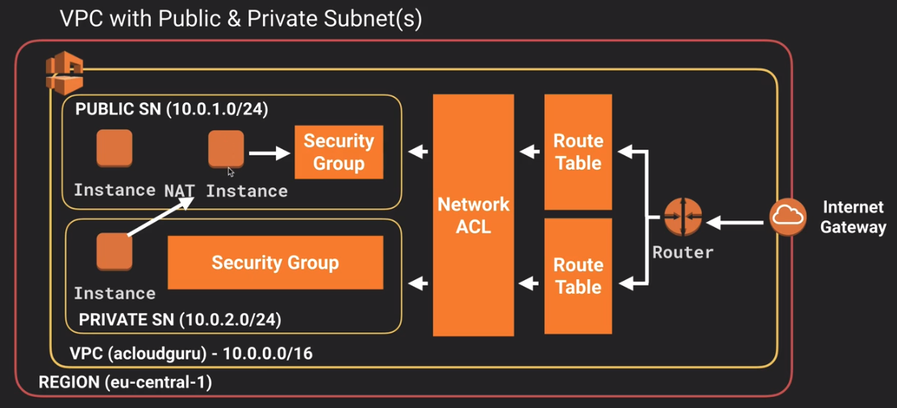
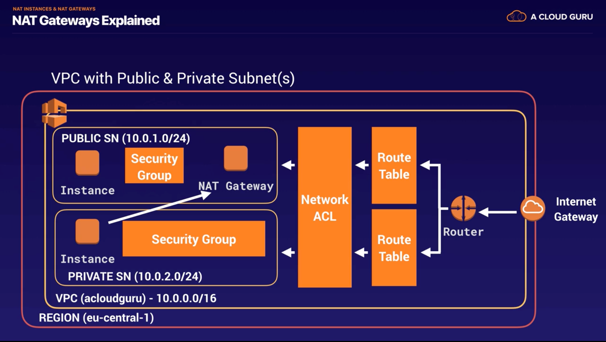
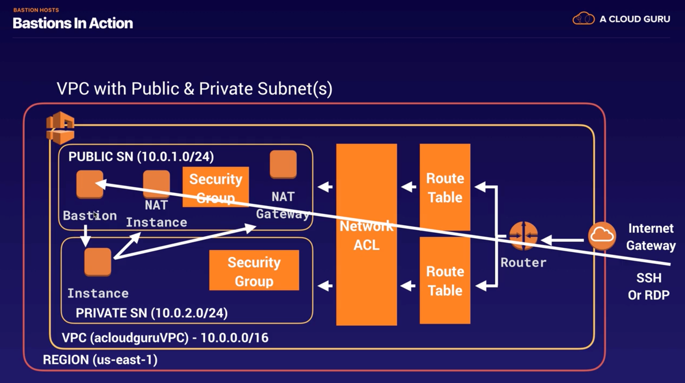

## VPC CheatSheet
### Features 
- helps define a logically isoloated dedicated virtual network within the AWS
- provides control of IP addressing using CIDR block from a minimum of /28 to maximum of /16 block size
- supports IPv4 and IPv6 addressing
- can be extended by associating secondary IPv4 CIDR blocks to VPC

### Components 
- **Internet Gateway** : access to the Internet
- **Virtual Gateway** : access to on-premises data center through **VPN** and **Direct Connect** connections
- VPC can have only 1 IGW and VGW
- **Route Tables** : determine where network traffic from subnet is directed 
- Ability to create **subnet** with VPC CIDR blocks 
- **NAT**(Network Address Translation) Server : provides outbound Internet access for EC2 instances in private subnets
- **EIP(Elastic IP)** : static, persistent public IP addresses
- Instances launched in the VPC will have a **Public IP** and can have a **Public or a Elastic UP** associated with it 
- **Security Groups / NACLs** : define security 
- **Flow logs** : capture information about the IP traffic going to and from network interfaces in VPC

### Tenancy option for instances 
- **shared** : by default. allows instances to be launched on shared tenancy
- **dedicated** : allows instances to be launched on a dedicated hardware 

### Route Tables 
- define rules, termed as routes, which determine **where network traffic** from subnet would be **routed**
- Each VPC has a Main ROute table, and can habe multiple custom route tables created 
- Every route table contains a local route that enables communication within a VPC which cannot be modified or deleted 
- Route priority is decided by matching the most specific route in the route table that matched the traffic 

### Subnets 
- **map to AZs** and do not span across AZs
- have CIDR range that is a portion of the whole VPC
- **CIDR ranged cannot overlap** between subnets within the VPC
- AWS **reserves 5 IP addresses in each subnet - first 4 and last one**
- Each subnet is **associated with a route table** which define its dehavior 
  - **Public Subnets** : inboud/outbound Internet connectivity via IGW
  - **Pricate Subnets** : outbound Internet connectivity via NAT or VGW
  - **Protected Subnets** : no outboud connectivity and used for regulated workloads

### Elastic Network Interface(ENI)
- a default ENI, eth0, is attached to an instance which cannot be detached with one or more secondary detachable ENIs(eth1-ethn)
- has primary private, one or more secondary private, public, Elastic IP address, security groups, MAC address and source/destination check flag attributes associated 
- AN ENI in one subnet can be attached to an instance in the same or another subnet, in the **same VPC** and the **same AZ**
- Security group membership of an ENI can be changed 
- with pre-allocated MAC address can be used for applications with special licensing requirements 

### Security Groups vs. Network Access Control Lists
|Security Group|NACL|
|:--------:|:--------:|
|Stateful|Stateless|
|at Instance level|at Subnet level|
|ONLY allows Allow rule|allows BOTH Allow and Deny rules|
|Evaluated as a Whole|Evaluated in defined Order|

### Elasitc IP
- is a **static IP address** designed for dynamic cloud computing 
- is **associated with AWS account**, and not a particular instance 
- can be **remapped** from one instance to another instance 
- is **charged for non usage**, if not linked for any instance or instance associated is in stopped state 

### NAT
- allows **internet access** to instance in **private** subnet
- performs the function of both address translation and port address translation(PAT)
- needs **source/destination** check flag to be **disabled** as it is not actual destination of the traffic
- not supported for IPv6 traffic

### Egress-Only Internet Gateways 
- outbound communication over IPv6 from instances in the VPC to the Internet, and prevents the Internet from initiating an IPv6 connection with your instances 
- supports ONLY IPv6 traffic 

### Shared VPCs
- allows multiple AWS accounts to create their application resources, such as EC2 instances, RDS databases, Redshift clusters, and AWS Lambda functions, into shared, centrally-managed VPCs

### VPC Peering 
- allows routing of traffic between the peer VPCs **using private IP addresses** and no IGW or VGW required 
- No single point of failure and bandwidth bottlenecks 
- supports inter-region VPC peering 
- IP space or **CIDR blocks cannot overlap**
- **cannot be TRANSITIVE**, one-to-one relationship between 2 VPC
- Only 1 between any 2 VPCs and have to be explicitly peered 
- **Private DNS values cannot be resolved**
- Security groups from peered VPC can now be refered, however the VPC should be in the same region

### VPC Endpoints
- enables you to privately connect VPC to supported AWS services and VPC endpoint services powered by PrivateLink
- **does NOT require a public IP address, access over the Internet, NAT device, a VPN connection or Direct Connect**
- traffic between VPC & AWS service does not leave the Amazon network 
- are virtual devices 
- are horizontally scaled, redundant, and highly available VPC components that allow communication between instances in your VPC and services without imposing availability risks or bandwidth constraints on your network traffic 
- **Gateway Endpoints**
  - is a gateway that is a target for a specified route in the route table, used for traffic destined to a supported AWS service 
  - only **S3 and DynamoDB** are supported 
- **Interface Endpoints**
  - is an elastic network interface with a private IP address that serves as an entry point for traffic destined to a supported service 
  - services supported API Gateway, CloudFormation, CloudWatch, CloudWatch Events, CloudWatch Logs, CodeBuild, CodeCommit, Config, EC2 API, Elastic Load Balancing API, Elastic Container Registry, Elastic Container Service, Key Management Service, Kinesis Data Streams, SageMager, Secrets Manager, Security Token Service(STS), Service Catalog, SNS, SQS
  
### VPN
- provides secure IPSec connections from on-premise computers or services to AWS over the internet
- is quick to setup, is cheap however it depends on the Internet speed 

### Direct Connect 
- is a network service that provides an alternative to using Internet to utilize AWS services by using **private dedicated network connection**
- provides Virtual Interfaces 
  - **Private VIF** : access instances within an VPC via VGW
  - **Public VIF** : access non VPC services 
- **requires time to setup** probably months, and should not be considered as an option if turnaround time is less 
- **does NOT provide redundancy**, use either second direct connection or IPSec VPN connection
- Virtual Private Gateway is on the AWS side and Customer Gateway is on the Customer side
- **route propagation is enabled on VGW** and not on CGW

### Direct Connect vs. VPN IPSec
|Direct Connect|VPN IPSec|
|:--------:|:--------:|
|Expensive to setup & Takes time|Immediate|
|Dedicated private connections|Internet|
|Reduced data transfer rate|Internet data transfer cost|
|Consistent performance|Internet inherent variability|
|Do NOT provide Redundancy|Provide Redundancy|

## VPC(Virtual Private Network) Overview
- *** build your own VPC from memory!!!! ***
- What VPC can do 
  - Launch instances into a subnet of your choosing 
  - Assign custom IP in each subnet 
  - Configure route tables between subnets
  - Create internet gateway and attach it to VPC
  - Instance security groups
  - Subnet network access control lists(NACLs)
- Default VPC vs. Custom VPC
- VPC Peering
  - transitive peering X

## Features 
- Think of a VPC as a logical datacenter in AWS
- Consists of Internet Gateways, Route Tables, Network Access Control Lists(NACL), Subnets, Security Groups
- 1 Subnet = 1 Availability Zone 
- Security Groups are Stateful; Network Access Control Lists are Stateless
- NO TRANSITIVE PEERING

### VPC with Public & Private Subnets

## Build a VPC
### VPC default

- Process : **Create VPC** (10.0.0.0/16)
- When you create VPC by default.. : Route Table, Network Access Control List(NACL), Security Group
- NOT by default.. : subnets, internet gateway

### Add Subnets

- Process
  - **Create Subnet1**(10.0.1.0/24 - us-east-1a) -> **Create Subnet2**(10.0.2.0/24 - us-east-1b) -> **Make Subnet1 public**(enable auto-assign public IP)  
- US-EAST-1A in your account can be a completely different availability zone to US-EAST-1A in another account. The AZ's are randomized between AWS accounts.
- Amazon always reserves 5 IP addresses within you subnets.(the reason why you have 251 not 256) 

### Attach Internet Gateway & Make Instances in Subnets & Security Groups

- Process 
  - **Attach Internet Gateway**
    - **Create Internet gateway & Attach to VPC** -> Check there's no subnet assocation to default-made Router Table -> **Create Public Route Table** -> **Edit Routes**(Internet gateway as target) -> **Edit Subnet Associations**(add Public Subnet) 
  - **Make Instances in Subnets** 
    - **Create WebServer Instance**(using Public Subnet, create security group SSH,HTTP) ->**Create DBServer Instance**(using Private Subnet, select default security group) 
  - **Connect Public & Private Subnets**
    - **Create DB Security Group**(to enable the connection **from public to private** ICMP 0-65535 MySQL SSH HTTP) -> **Change Security Group on DBServer Instance**  
- 1 Internet Gateway = 1 VPC
- Security Groups can't span VPCs. Security groups act at the instance level, not the subnet level.

## NAT Instances & NAT Gateways
- NAT : Network Address Translation
- idea : on private sn, i want to update & install software. public connection to internet.

### NAT Instances

- Process
  - **Create NAT instance**(using Public subnet, Public security group) -> Change Source/Dest. Check disabled -> **Edit Private Route Table**(select NAT instance as target)
- when creating, Disable Source/Dest. Check on the Instance 
  - Each EC2 instance performs source/destination checks by default. This means that the instance must be the source or destination of any traffic it sends or receives. However, a NAT instance must be able to send and receive traffic when the source or destination is not itself. Therefore, you must disable source/destination checks on the NAT instance.
- must be in a PUBLIC subnet
- must be a route out of the private subnet to the NAT instance
- bottleneck? increase instance size.
- high availability using Autoscaling Groups, multiple subnets in different AZs, script to automate failover
- Behind a Security Group

### NAT Gateways

- Process
  - **Create NAT Gateway**(using Public subnet, ElasticIP) -> **Edit Private Route Table**(select NAT gateway as target)
- Redundant inside the AZ -> 1 NAT Gateway = 1 AZ
- scale automatically
- no need to patch
- not associated with security groups
- Automatically assigned a public ip
- Remember to update route tables
- No need to disable Source/Dest. Check 

## NACL(Network Access Control Lists) vs. Security Groups 
- VPC automatically comes with a default NACL, by default, it allows all outbound & inbound
- Custom NACL : by default, it denies all outbound & inbound until you add rules.
- Each Subnet must be associated with NACL. Subnet is automatically associated with the default NACL.
- Block IP : using NACL not Security Groups 
- you CAN associate a NACL with multiple subnets;
  - However, 1 subnet = 1 NACL
- numbered list of rules : starts with the lowest numbered rule 
- separate inbound & outbound rules can ALLOW or DENY traffic 
- NACLs are STATELESS; responses to allowed inbound traffic are following the rules for outbound traffic.

## Bastion vs. NAT

- NAT is used to provide internet traffic to EC2 instances in a private subnets.(not used to SSH)
- Bastion is used to securely administer EC2 instances using SSH. 
- you canNOT use a NAT Gateway as a Bastion host

## Direct Connect
- direct connects your data center to AWS
- Use Case
  - high throughput workloads(ie lots of network traffic)
  - if you need a stable and reliable secure connection

## VPC EndPoint
- privately connect VPC to supported AWS services(the private subnet can connect to outside world)
- PrivateLink without requiring Internet Gateway, NAT, VPC connection, Direct Connect connection.
- Instances in your VPC do NOT require public IP to communicate with resources in the service.
- 2 types of EndPoint
  - Interface Endpoints
  - Gateway Endpoints : s3, dynamoDB
- traffic between your VPC and the other service does not leave the Amazon network when using VPC endpoints

## Scenarios 
- **An application running on EC2 instances processes sensitive information stored on Amazon S3. The information is accessed over the Internet. The security team is concerned that the Internet connectivity to Amazon S3 is a security risk.    
Which solution will resolve the security concern?**
  - **Access the data through a VPC endpoint for Amazon S3.**
  - VPC endpoints for Amazon S3 : provide secure connection to S3 bucket that do not require a gateway or NAT instances.
  - NAT Gateways & Internet Gateways : still route traffic over the Internet to the public endpoint for Amazon S3
  - VPN : There is NO WAY to connect to Amazon S3 via VPN

- **An organization is building an Amazon Redshift cluster in their shared services VPC. The cluster will host sensitive data.    
How can the organization control which networks can access the cluster?**
  - **Define a cluster security group for the cluster that allows access from the allowed networks**
  - A security group can grant access to traffic from the allowed networks via the **CIDR range** for each network.
  - VPC peering & VPN : are connectivity services and cannot control traffic for security.
  - Amazon Redshift user accounts address authentication and authorization at the user level : have NO control over network traffic.
  
- **A Solutions Architect is designing an online shopping application running in a VPC on EC2 instances behind an ELB Application Load Balancer. The instances run in an Auto Scaling group across multiple Availability Zones. The application tier must read and write data to a customer managed database cluster. There should be no access to the database from the Internet, but the cluster must be able to obtain software patches from the Internet.     
Which VPC design meets these requirements?**
  - **Public subnets for the application tier and NAT Gateway, and private subnets for the database cluster**
  - NAT Gateways must be deployed in public subnets.
