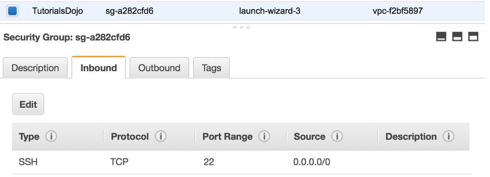
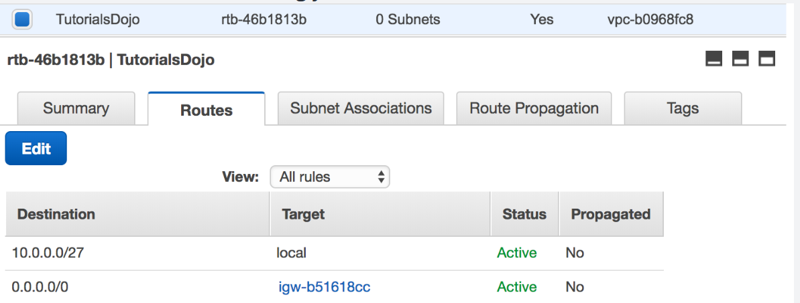
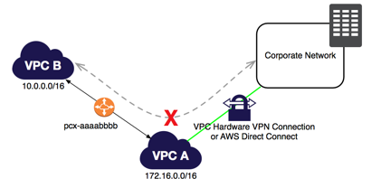
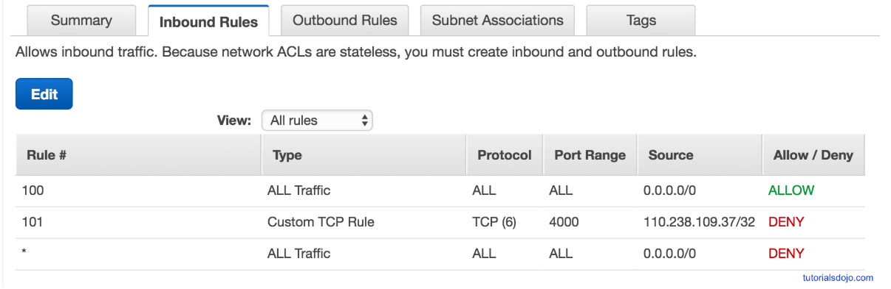
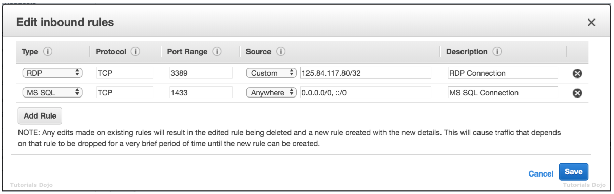

## VPC CheatSheet
### Feature 
- helps define a logically isoloated dedicated virtual network within the AWS
- provides control of IP addressing using CIDR block from a minimum of /28 to maximum of /16 block size
- supports IPv4 and IPv6 addressing
- can be extended by associating secondary IPv4 CIDR blocks to VPC

### Components 
- **Internet Gateway** : access to the Internet
- **Virtual Gateway** : access to on-premises data center through **VPN** and **Direct Connect** connections
- VPC can have only 1 IGW and VGW
- **Route Tables** : determine where network traffic from subnet is directed 
- Ability to create **subnet** with VPC CIDR blocks 
- **NAT**(Network Address Translation) Server : provides outbound Internet access for EC2 instances in private subnets
- **EIP(Elastic IP)** : static, persistent public IP addresses
- Instances launched in the VPC will have a **Public IP** and can have a **Public or a Elastic UP** associated with it 
- **Security Groups / NACLs** : define security 
- **Flow logs** : capture information about the IP traffic going to and from network interfaces in VPC

### Tenancy option for instances 
- **shared** : by default. allows instances to be launched on shared tenancy
- **dedicated** : allows instances to be launched on a dedicated hardware 

### Route Tables 
- define rules, termed as routes, which determine **where network traffic** from subnet would be **routed**
- Each VPC has a Main ROute table, and can habe multiple custom route tables created 
- Every route table contains a local route that enables communication within a VPC which cannot be modified or deleted 
- Route priority is decided by matching the most specific route in the route table that matched the traffic 

### Subnets 
- **map to AZs** and do not span across AZs
- have CIDR range that is a portion of the whole VPC
- **CIDR ranged cannot overlap** between subnets within the VPC
- AWS **reserves 5 IP addresses in each subnet - first 4 and last one**
- Each subnet is **associated with a route table** which define its dehavior 
  - **Public Subnets** : inboud/outbound Internet connectivity via IGW
  - **Pricate Subnets** : outbound Internet connectivity via NAT or VGW
  - **Protected Subnets** : no outboud connectivity and used for regulated workloads

### Elastic Network Interface(ENI)
- a default ENI, eth0, is attached to an instance which cannot be detached with one or more secondary detachable ENIs(eth1-ethn)
- has primary private, one or more secondary private, public, Elastic IP address, security groups, MAC address and source/destination check flag attributes associated 
- AN ENI in one subnet can be attached to an instance in the same or another subnet, in the **same VPC** and the **same AZ**
- Security group membership of an ENI can be changed 
- with pre-allocated MAC address can be used for applications with special licensing requirements 

### Security Groups vs. Network Access Control Lists
|Security Group|NACL|
|:--------:|:--------:|
|Stateful|Stateless|
|at Instance level|at Subnet level|
|ONLY allows Allow rule|allows BOTH Allow and Deny rules|
|Evaluated as a Whole|Evaluated in defined Order|
- Security Groups at Instance level : Security groups act at the instance level, not the subnet level. each instance in a subnet in your VPC could be assigned to a different set of security groups

### Elasitc IP
- is a **static IP address** designed for dynamic cloud computing 
- is **associated with AWS account**, and not a particular instance 
- can be **remapped** from one instance to another instance 
- is **charged for non usage**, if not linked for any instance or instance associated is in stopped state 

### NAT
- allows **internet access** to instance in **private** subnet
- performs the function of both address translation and port address translation(PAT)
- needs **source/destination** check flag to be **disabled** as it is not actual destination of the traffic
- not supported for IPv6 traffic

### Egress-Only Internet Gateways 
- outbound communication over IPv6 from instances in the VPC to the Internet, and prevents the Internet from initiating an IPv6 connection with your instances 
- supports ONLY IPv6 traffic 

### Shared VPCs
- allows multiple AWS accounts to create their application resources, such as EC2 instances, RDS databases, Redshift clusters, and AWS Lambda functions, into shared, centrally-managed VPCs

### VPC Peering 
- allows routing of traffic between the peer VPCs **using private IP addresses** and no IGW or VGW required 
- No single point of failure and bandwidth bottlenecks 
- supports inter-region VPC peering 
- IP space or **CIDR blocks cannot overlap**
- **cannot be TRANSITIVE**, one-to-one relationship between 2 VPC
- Only 1 between any 2 VPCs and have to be explicitly peered 
- **Private DNS values cannot be resolved**
- Security groups from peered VPC can now be refered, however the VPC should be in the same region

### VPC Endpoints
- enables you to privately connect VPC to supported AWS services and VPC endpoint services powered by PrivateLink
- **does NOT require a public IP address, access over the Internet, NAT device, a VPN connection or Direct Connect**
- traffic between VPC & AWS service does not leave the Amazon network 
- are virtual devices 
- are horizontally scaled, redundant, and highly available VPC components that allow communication between instances in your VPC and services without imposing availability risks or bandwidth constraints on your network traffic 
- **Gateway Endpoints**
  - is a gateway that is a target for a specified route in the route table, used for traffic destined to a supported AWS service 
  - only **S3 and DynamoDB** are supported 
- **Interface Endpoints**
  - is an elastic network interface with a private IP address that serves as an entry point for traffic destined to a supported service 
  - services supported API Gateway, CloudFormation, CloudWatch, CloudWatch Events, CloudWatch Logs, CodeBuild, CodeCommit, Config, EC2 API, Elastic Load Balancing API, Elastic Container Registry, Elastic Container Service, Key Management Service, Kinesis Data Streams, SageMager, Secrets Manager, Security Token Service(STS), Service Catalog, SNS, SQS
  
### VPN
- provides secure IPSec connections from on-premise computers or services to AWS over the internet
- is quick to setup, is cheap however it depends on the Internet speed 

### Direct Connect 
- is a network service that provides an alternative to using Internet to utilize AWS services by using **private dedicated network connection**
- provides Virtual Interfaces 
  - **Private VIF** : access instances within an VPC via VGW
  - **Public VIF** : access non VPC services 
- **requires time to setup** probably months, and should not be considered as an option if turnaround time is less 
- **does NOT provide redundancy**, use either second direct connection or IPSec VPN connection
- Virtual Private Gateway is on the AWS side and Customer Gateway is on the Customer side
- **route propagation is enabled on VGW** and not on CGW

### Direct Connect vs. VPN IPSec
|Direct Connect|VPN IPSec|
|:--------:|:--------:|
|Expensive to setup & Takes time|Immediate|
|Dedicated private connections|Internet|
|Reduced data transfer rate|Internet data transfer cost|
|Consistent performance|Internet inherent variability|
|Do NOT provide Redundancy|Provide Redundancy|

## VPC(Virtual Private Network) Overview
- *** build your own VPC from memory!!!! ***
- What VPC can do 
  - Launch instances into a subnet of your choosing 
  - Assign custom IP in each subnet 
  - Configure route tables between subnets
  - Create internet gateway and attach it to VPC
  - Instance security groups
  - Subnet network access control lists(NACLs)
- Default VPC vs. Custom VPC
- VPC Peering
  - transitive peering X

## Features 
- Think of a VPC as a logical datacenter in AWS
- Consists of Internet Gateways, Route Tables, Network Access Control Lists(NACL), Subnets, Security Groups
- 1 Subnet = 1 Availability Zone 
- Security Groups are Stateful; Network Access Control Lists are Stateless
- NO TRANSITIVE PEERING

### VPC with Public & Private Subnets

## Build a VPC
### VPC default

- Process : **Create VPC** (10.0.0.0/16)
- When you create VPC by default.. : Route Table, Network Access Control List(NACL), Security Group
- NOT by default.. : subnets, internet gateway

### Add Subnets

- Process
  - **Create Subnet1**(10.0.1.0/24 - us-east-1a) -> **Create Subnet2**(10.0.2.0/24 - us-east-1b) -> **Make Subnet1 public**(enable auto-assign public IP)  
- US-EAST-1A in your account can be a completely different availability zone to US-EAST-1A in another account. The AZ's are randomized between AWS accounts.
- Amazon always reserves 5 IP addresses within you subnets.(the reason why you have 251 not 256) 

### Attach Internet Gateway & Make Instances in Subnets & Security Groups

- Process 
  - **Attach Internet Gateway**
    - **Create Internet gateway & Attach to VPC** -> Check there's no subnet assocation to default-made Router Table -> **Create Public Route Table** -> **Edit Routes**(Internet gateway as target) -> **Edit Subnet Associations**(add Public Subnet) 
  - **Make Instances in Subnets** 
    - **Create WebServer Instance**(using Public Subnet, create security group SSH,HTTP) ->**Create DBServer Instance**(using Private Subnet, select default security group) 
  - **Connect Public & Private Subnets**
    - **Create DB Security Group**(to enable the connection **from public to private** ICMP 0-65535 MySQL SSH HTTP) -> **Change Security Group on DBServer Instance**  
- 1 Internet Gateway = 1 VPC
- Security Groups can't span VPCs. Security groups act at the instance level, not the subnet level.

## NAT Instances & NAT Gateways
- NAT : Network Address Translation
- idea : on private sn, i want to update & install software. public connection to internet.

### NAT Instances

- Process
  - **Create NAT instance**(using Public subnet, Public security group) -> Change Source/Dest. Check disabled -> **Edit Private Route Table**(select NAT instance as target)
- when creating, Disable Source/Dest. Check on the Instance 
  - Each EC2 instance performs source/destination checks by default. This means that the instance must be the source or destination of any traffic it sends or receives. However, a NAT instance must be able to send and receive traffic when the source or destination is not itself. Therefore, you must disable source/destination checks on the NAT instance.
- must be in a PUBLIC subnet
- must be a route out of the private subnet to the NAT instance
- bottleneck? increase instance size.
- high availability using Autoscaling Groups, multiple subnets in different AZs, script to automate failover
- Behind a Security Group

### NAT Gateways

- Process
  - **Create NAT Gateway**(using Public subnet, ElasticIP) -> **Edit Private Route Table**(select NAT gateway as target)
- Redundant inside the AZ -> 1 NAT Gateway = 1 AZ
- scale automatically
- no need to patch
- not associated with security groups
- Automatically assigned a public ip
- Remember to update route tables
- No need to disable Source/Dest. Check 

## NACL(Network Access Control Lists) vs. Security Groups 
- VPC automatically comes with a default NACL, by default, it allows all outbound & inbound
- Custom NACL : by default, it denies all outbound & inbound until you add rules.
- Each Subnet must be associated with NACL. Subnet is automatically associated with the default NACL.
- Block IP : using NACL not Security Groups 
- you CAN associate a NACL with multiple subnets;
  - However, 1 subnet = 1 NACL
- numbered list of rules : starts with the lowest numbered rule 
- separate inbound & outbound rules can ALLOW or DENY traffic 
- NACLs are STATELESS; responses to allowed inbound traffic are following the rules for outbound traffic.

## Bastion vs. NAT

- NAT is used to provide internet traffic to EC2 instances in a private subnets.(not used to SSH)
- Bastion is used to securely administer EC2 instances using SSH. 
- you canNOT use a NAT Gateway as a Bastion host

## Direct Connect
- direct connects your data center to AWS
- Use Case
  - high throughput workloads(ie lots of network traffic)
  - if you need a stable and reliable secure connection

## VPC EndPoint
- privately connect VPC to supported AWS services(the private subnet can connect to outside world)
- PrivateLink without requiring Internet Gateway, NAT, VPC connection, Direct Connect connection.
- Instances in your VPC do NOT require public IP to communicate with resources in the service.
- 2 types of EndPoint
  - Interface Endpoints
  - Gateway Endpoints : s3, dynamoDB
- traffic between your VPC and the other service does not leave the Amazon network when using VPC endpoints

## Scenarios 
- **An application running on EC2 instances processes sensitive information stored on Amazon S3. The information is accessed over the Internet. The security team is concerned that the Internet connectivity to Amazon S3 is a security risk.    
Which solution will resolve the security concern?**
  - **A) Access the data through a VPC endpoint for Amazon S3.**
  - VPC endpoints for Amazon S3 : provide secure connection to S3 bucket that do not require a gateway or NAT instances.
  - NAT Gateways & Internet Gateways : still route traffic over the Internet to the public endpoint for Amazon S3
  - VPN : There is NO WAY to connect to Amazon S3 via VPN

- **An organization is building an Amazon Redshift cluster in their shared services VPC. The cluster will host sensitive data.    
How can the organization control which networks can access the cluster?**
  - **A) Define a cluster security group for the cluster that allows access from the allowed networks**
  - A security group can grant access to traffic from the allowed networks via the **CIDR range** for each network.
  - VPC peering & VPN : are connectivity services and cannot control traffic for security.
  - Amazon Redshift user accounts address authentication and authorization at the user level : have NO control over network traffic.
  
- **A Solutions Architect is designing an online shopping application running in a VPC on EC2 instances behind an ELB Application Load Balancer. The instances run in an Auto Scaling group across multiple Availability Zones. The application tier must read and write data to a customer managed database cluster. There should be no access to the database from the Internet, but the cluster must be able to obtain software patches from the Internet.     
Which VPC design meets these requirements?**
  - **A) Public subnets for the application tier and NAT Gateway, and private subnets for the database cluster**
  - NAT Gateways must be deployed in public subnets.

- **You are tasked to host a web application in a new VPC with private and public subnets. In order to do this, you will need to deploy a new MySQL database server and a fleet of EC2 instances to host the application. In which subnet should you launch the new database server into?**
  - **A) The private subnet**

- **You have 1 security group associated with 10 On-Demand EC2 instances.  You then modified the security group to allow all inbound SSH traffic and then right after that, you created two new EC2 instances in the same security group.    
When will the changes be applied to the EC2 instances?**
  - **A) Immediately to all 12 instances in the security group.**
  - When you add or remove rules, those changes are automatically applied to all instances to which you've assigned the security group. Since the first 10 instances are already assigned to the security group, you can SSH into them immediately after the change. After adding the two new instances to the security group, you should be able to SSH into them as well.
  
- You are working as a Solutions Architect in a top software development company in Silicon Valley. The company has multiple applications hosted in their VPC. While you are monitoring the system, you noticed that multiple **port scans are coming in from a specific IP** address block which are **trying to connect to several AWS resources** inside your VPC. The internal security team has requested that all offending IP addresses be denied for the next 24 hours for security purposes.    
Which of the following is the best method to **quickly and temporarily deny access** from the specified IP addresses?
  - **A) Modify the Network Access Control List associated with all public subnets in the VPC to deny access from the IP Address block.**
  - network access control list (ACL) : To control the traffic coming in and out of your VPC network. It is an optional layer of security for your VPC that acts as a firewall for **controlling traffic in and out of one or more subnets.**
  - Security Group : although a Security Group acts as a firewall, it will only control both inbound and outbound traffic **at the instance level** and not on the whole VPC.

- In your AWS VPC, you need to add a new subnet that will allow you to host a total of 20 EC2 instances.    
Which of the following IPv4 CIDR block can you use for this scenario?
  - **A) 172.0.0.0/27**
  - **CIDR Block으로 총 IP 주소 갯수 구하는 법**
    - 1. **32 - CIDR Block mask number** : ex) 32 - 27 = **5**
    - 2. **2^(1번답)** : ex) 2^**5** = **32**
    
- You are instructed by your manager to set up a **bastion host** in your Amazon VPC and it should only be accessed from the corporate data center via SSH. What is the best way for you to achieve this?
  - **A) Create a small EC2 instance with a security group which only allows access on port 22 via the IP address of the corporate data center. Use a private key(.pem) file to connect to the bastion host.**
  - The best way to implement a bastion host is to create a small EC2 instance which should only have a security group from a particular IP address for maximum security. This will block any SSH Brute Force attacks on your bastion host. 
  -  It is also recommended to use a small instance rather than a large one because this host will only act as a jump server to connect to other instances in your VPC and nothing else.

- One member of your DevOps team consulted you about a connectivity problem in one of your Amazon EC2 instances. The application architecture is initially set up with **four EC2 instances, each with an EIP address that all belong to a public non-default subnet**. You launched another instance to handle the increasing workload of your application. The EC2 instances also belong to the same security group. Everything works well as expected except for one of the EC2 instances which is not able to send nor receive traffic over the Internet.    
Which of the following is the MOST likely reason for this issue?
  - **A) The EC2 instance does not have a public IP address associated with it.**
  - By default, nondefault subnets have the IPv4 public addressing attribute set to `false`, and default subnets have this attribute set to `true`.
  - Take note as well that the four EC2 instances all belong to a public **non-default subnet**. Which means that a new EC2 instance will not have a public IP address by default since the since IPv4 public addressing attribute is initially set to `false`.
  - **The route table is not properly configured to allow traffic to and from the Internet through the Internet gateway** : is incorrect because the other three instances, which are associated with the same route table and security group, do not have any issues.

- You have set up a VPC with public subnet and an Internet gateway. You set up an EC2 instance with a public IP as well. However, you are still **not able to connect to the instance via the Internet**. You checked its associated security group and it seems okay.    
What should you do to ensure you can connect to the EC2 instance from the Internet?
  - **A) Check the main route table and ensure that the right route entry to the Internet Gateway(IGW) is configured.**

- You have two On-Demand EC2 instances inside your Virtual Private Cloud in the same Availability Zone but are deployed to different subnets. One EC2 instance is running a database and the other EC2 instance a web application that connects with the database. You want to ensure that these two instances can communicate with each other for your system to work properly.    
What are the things you have to check **so that these EC2 instances can communicate inside the VPC**? (Choose 2)
  - **A1) Check the Network ACL if it allows communication between the two subnets.**
  - **A2) Check if all security groups are set to allow the application host to communicate to the database on the right port and protocol.**
  - **Check if the default route is set to a NAT instance or Internet Gateway (IGW) for them to communicate** : is incorrect because an Internet gateway is primarily used to communicate to the Internet.

- You are a Solutions Architect working for a large insurance company that deployed their production environment on a custom Virtual Private Cloud in AWS with a default configuration. The VPC consists of two private subnets and one public subnet. Inside the public subnet is a group of EC2 instances which are created by an Auto Scaling group and all of the instances are in the same Security Group. Your development team has created a new application which will be accessed by mobile devices via a custom port. This application has been deployed to the production environment and you need to open this port globally to the Internet.    
Which of the following is the correct procedure to meet this requirement?
  - **A) Open the custom port on the Security Group. Your EC2 instances will be able to use this port immediately.**
  - To allow the custom port, you have to change the Inbound Rules in your Security Group to allow traffic coming from the mobile devices. **Security Groups** usually **control the list of ports** that are allowed to be used by your **EC2 instances** and the **NACLs** **control** which network or **list of IP addresses** can connect to your **whole VPC**.
  - By default, **Network ACL allows all** inbound and outbound IPv4 traffic, then there is no point of explicitly allowing the port in the Network ACL. **Security Groups does not allow incoming traffic by default**, unlike Network ACL.

- A media company has two VPCs: VPC-1 and VPC-2 with **peering** connection between each other. **VPC-1 only contains private subnets** while VPC-2 only contains public subnets. The company uses a single AWS **Direct Connect** connection and a virtual interface to connect their on-premises network with VPC-1.    
Which of the following options **increase the fault tolerance of the connection to VPC-1**? (Choose 2)
  - **A1) Establish a hardware VPN over the Internet between VPC-1(private) and the on-premises network.**
  - **A2) Establish another AWS Direct Connect connection and private virtual interface in the same AWS region as VPC-1(private).**
  - Note that a **VPC peering** connection does not support edge to edge routing (**NOT TRANSITIVE**) for : 
    - A VPN connection or an AWS Direct Connect connection to a corporate network
    - An Internet connection through an Internet gateway
    - An Internet connection in a private subnet through a NAT device
    - A VPC endpoint to an AWS service; for example, an endpoint to Amazon S3.
    - (IPv6) A ClassicLink connection. You can enable IPv4 communication between a linked EC2-Classic instance and instances in a VPC on the other side of a VPC peering connection. However, IPv6 is not supported in EC2-Classic, so you cannot extend this connection for IPv6 communication.
    
- Your client is an insurance company that utilizes SAP HANA for their day-to-day ERP operations. Since you can’t migrate this database due to customer preferences, you need to integrate it with your current AWS workload in your VPC in which you are required to establish a **site-to-site VPN connection**.       
What needs to be configured outside of the VPC for you to have a successful site-to-site VPN connection?
  - **A) An Internet-routable IP address (static) of the customer gateway's external interface for the on-premises network**
  - 하드웨어 VPN 연결 또는 Direct Connect 연결이 지원되는 VPC의 경우, 인스턴스는 가상 프라이빗 게이트웨이의 인터넷 트래픽을 사용자의 기존 데이터 센터로 라우팅할 수 있습니다. 여기서 기존 송신 지점 및 네트워크 보안/모니터링 디바이스를 통해 인터넷에 액세스할 수 있습니다.
  - AWS Site-to-Site VPN 연결은 사용자의 VPC를 데이터센터에 연결합니다. Amazon은 인터넷 프로토콜 보안(IPsec) VPN 연결을 지원합니다. VPC와 데이터센터 간에 전송되는 데이터는 암호화된 VPN 연결을 통해 라우팅되어 전송 데이터의 기밀성과 무결성이 유지됩니다. Site-to-Site VPN 연결을 형성하는데 인터넷 게이트웨이는 필요하지 않습니다.
  - A customer gateway is a physical device or software application on your side of the VPN connection.    
To create a VPN connection, you must create a **customer gateway resource** in AWS, which provides information to AWS about your customer gateway device. Next, you have to set up an **Internet-routable IP address (static) of the customer gateway's external interface**.    
    
  

- Your company is running a multi-tier web application farm in a virtual private cloud (VPC) that is not connected to their corporate network. They are connecting to the VPC over the Internet to manage the fleet of Amazon EC2 instances running in both the public and private subnets. You have added **a bastion host with Microsoft Remote Desktop Protocol (RDP) access** to the application instance security groups, but the company wants to further limit **administrative access** to all of the instances in the VPC.    
Which of the following bastion host deployment options will meet this requirement?
  - **A) Deploy a Windows Bastion host with an Elastic IP address in the "public" subnet and allow RDP access to bastion only from the corporate IP addresses.**
  - 

- A VPC has a **non-default public subnet** which has four On-Demand EC2 instances that can be accessed over the Internet. Using the AWS CLI, you launched a fifth instance that uses the same subnet, Amazon Machine Image (AMI), and security group which are being used by the other instances. Upon testing, you are **not able to access the new instance**.       
Which of the following is the most suitable solution to solve this problem?
  - **A) Associate an Elastic IP address to the fifth EC2 instance.**
  - By default, non-default subnets have the IPv4 public addressing attribute set to `false`, and default subnets have this attribute set to `true`. 
  - fifth instance does not have a public IP address since it was deployed on a nondefault subnet. The other 4 instances are accessible over the Internet because they each have an Elastic IP address attached, unlike the last instance which only has a private IP address. An Elastic IP address is a public IPv4 address, which is reachable from the Internet. If your instance does not have a public IPv4 address, you can associate an Elastic IP address with your instance to enable communication with the Internet.

- You have an On-Demand EC2 instance located in a subnet in AWS which hosts a web application. The security group attached to this EC2 instance has the following Inbound Rules:    
    
The Route table attached to the VPC is shown below. **You can establish an SSH connection into the EC2 instance from the internet**. However, you are **not able to connect to the web server using your Chrome browser**.    
    
Which of the below steps would resolve the issue?    
  - **A) In the Security Group, add an Inbound HTTP rule.**
  - The scenario is that you can already connect to the EC2 instance via SSH. This means that there is no problem in the Route Table of your VPC. To fix this issue, you simply need to update your Security Group and add an Inbound rule to allow HTTP traffic.

- You are a Solutions Architect for a global news company. You are configuring a fleet of EC2 instances in a subnet which currently is in a VPC with an Internet gateway attached. **All of these EC2 instances can be accessed from the Internet**. You then **launch another subnet and launch an EC2 instance** in it, however you are **not able to access the EC2 instance from the Internet**.       
What could be the possible reasons for this issue? (Choose 2)
  - **A1) The route table is not configured properly to send traffic from the EC2 instance to the Internet through the Internet gateway.**
  - **A2) The Amazon EC2 instance does not have a public IP address associated with it.**
  - In cases where your EC2 instance cannot be accessed from the Internet (or vice versa), you usually have to check two things:
    - **Does it have an EIP or public IP address?**
    - **Is the route table properly configured?**
  - **The Amazon EC2 instance doesn't have an attached Elastic Fabric Adapter (EFA)** : is incorrect because the Elastic Fabric Adapter is just a network device that you can attach to your Amazon EC2 instance to accelerate High Performance Computing (HPC) and machine learning applications. EFA enables you to achieve the application performance of an on-premises HPC cluster, with the scalability, flexibility, and elasticity provided by AWS. However, this component is not required in order for your EC2 instance to access the public Internet.
  - **The route table is not configured properly to send traffic from the EC2 instance to the Internet through the customer gateway (CGW)** : is incorrect since CGW is used when you are setting up a VPN. 
  
- You are a Solutions Architect working for an aerospace engineering company which recently adopted a hybrid cloud infrastructure with AWS. One of your tasks is to launch a VPC with both public and private subnets for their EC2 instances as well as their database instances respectively.       
Which of the following statements are true regarding Amazon VPC subnets? (Choose 2)
  - **A1) Every subnet that you create is automatically associated with the main route table for the VPC**
  - **A2) Each subnet maps to a single Availability Zone**
  - **If a subnet's traffic is routed to an Internet gateway, the subnet is known as a public subnet.**
  - EC2 instances in a private subnet can communicate with the Internet not just by having an Elastic IP, but also with a public IP address.
  - **allowed block size in VPC** is between a /16 netmask (65,536 IP addresses) and /28 netmask (16 IP addresses) ]

- An online job site is using NGINX for its application servers hosted in EC2 instances and MongoDB Atlas for its database-tier. MongoDB Atlas is a fully automated third-party cloud service which is not provided by AWS, but supports VPC peering to connect to your VPC.     
Which of the following items are **invalid VPC peering configurations**? (Choose 2)
  - **A) Transitive Peering**
  - **A) Edge to Edge routing via a gateway**
  - The following VPC peering connection configurations are not supported.
    - **Overlapping CIDR Blocks**
    
    - **Transitive Peering**
    - **Edge to Edge Routing Through a Gateway or Private Connection**
    
 
 - You were recently promoted to a technical lead role in your DevOps team. Your company has an existing VPC which is quite unutilized for the past few months. The business manager instructed you to integrate your on-premises data center and your VPC. You explained the list of tasks that you'll be doing and mentioned about a Virtual Private Network (VPN) connection. The business manager is not tech-savvy but he is interested to know what a VPN is and its benefits.    
What is one of the major **advantages of having a VPN in AWS**?
  - **A) It allows you to connect your AWS cloud resources to your on-premises data center using secure and private sessions with IP Security(IPSec) or Transport Layer Security(TLS) tunnels.**
  - **VPC Peering** : It provides a networking connection between two VPCs which enables you to route traffic between them using private IPv4 addresses or IPv6 addresses is incorrect because this actually describes VPC Peering and not a VPN connection.

- You are a new Solutions Architect in your company. Upon checking the existing Inbound Rules of your Network ACL, you saw this configuration:    
    
If a computer with an IP address of 110.238.109.37 sends a request to your VPC, what will happen?
  - **A) It will be allowed**
  - Rules are evaluated starting with the lowest numbered rule. As soon as a rule matches traffic, it's applied immediately regardless of any higher-numbered rule that may contradict it.

- A large insurance company has an AWS account that contains three VPCs (DEV, UAT and PROD) in the same region. UAT is peered to both PROD and DEV using a VPC peering connection. All VPCs have non-overlapping CIDR blocks. The company wants to push minor code releases from Dev to Prod to speed up time to market.    
Which of the following options helps the company accomplish this?
  - **A) Create a new VPC Peering connection between PROD and DEV with the appropriate routes.**
  - A VPC peering connection is a networking connection between two VPCs that enables you to route traffic between them privately. 

- You recently launched a new **FTP** server using an On-Demand EC2 instance in a newly created VPC with default settings. The server should not be **accessible** publicly but **only through your IP** address `175.45.116.100` and nowhere else.    
Which of the following is the most suitable way to implement this requirement?
  - **A) Create a new inbound rule in the security group of the EC2 instance with the following details:**    
          **Protocol : TCP**    
          **Port Range : 20-21**    
          **Source : `175.45.116.100/32`**   
  - The FTP protocol uses TCP via ports 20 and 21. This should be configured in your security groups or in your Network ACL inbound rules. As required by the scenario, you should only allow the individual IP of the client and not the entire network. Therefore, in the Source, the proper CIDR notation should be used. The /32 denotes one IP address and the /0 refers to the entire network.    
이 시나리오에서는 기본 설정으로 새로 생성 된 VPC에서 EC2 인스턴스를 시작했습니다. VPC에는 자동으로 수정 가능한 기본 네트워크 ACL이 제공됩니다. 기본적으로 모든 인바운드 및 아웃 바운드 IPv4 트래픽과 해당되는 경우 IPv6 트래픽을 허용합니다. 따라서 VPC에 기본 설정이있는 경우 실제로 인바운드 트래픽을 허용하기 위해 네트워크 ACL에 인바운드 규칙을 명시 적으로 추가 할 필요가 없습니다.

- You launched an EC2 instance in your newly created VPC. You have noticed that the generated **instance does not have an associated DNS hostname**.        
Which of the following options could be a valid reason for this issue?
  - **A) The DNS resolution and DNS hostname of the VPC configuration should be enabled.**
  - EC2 인스턴스를 default VPC로 시작하면 AWS는 인스턴스의 public IPv4 및 private  IPv4 주소에 해당하는 public 및 private  DNS hostname을 제공합니다.     
그러나 non-default VPC로 인스턴스를 시작하면 AWS는 인스턴스에 private DNS hostname 만 제공합니다. 새 인스턴스에는이 두 가지 DNS 속성, 즉 DNS 확인 및 DNS 호스트 이름(DNS resolution and DNS hostname), VPC에 지정한 DNS 인스턴스 및 public IPv4 주소가있는 경우에만 public DNS hostname이 제공됩니다.    
이 경우 새로 생성 된 VPC에서 DNS 확인 및 DNS 호스트 이름(DNS resolution and DNS hostname) 속성이 비활성화되므로 새 EC2 인스턴스는 자동으로 DNS hostname을 가져오지 않습니다.
  - **Route 53** : is incorrect since Route 53 is the DNS service of AWS, but the VPC is the one that enables assigning of instance hostnames.

- Your company has a two-tier environment in its on-premises data center which is composed of an application tier and database tier. You are instructed to migrate their environment to the AWS cloud, and to design the subnets in their VPC with the following requirements:    
a) There is an **application load balancer** that would distribute the incoming traffic among the servers in the application tier.    
b) The application tier and the database tier must **not be accessible from the public Internet**. The application tier should only accept traffic coming from the load balancer.    
c) The database tier contains very sensitive data. It must **not share the same subnet** with other AWS resources and its custom route table with other instances in the environment.    
d) The environment must be **highly available** and scalable to handle a surge of incoming traffic over the Internet.    
How many subnets should you create to meet the above requirements?
  - **A) 6 subnets**
  - **a) you have to use an application load balancer (ALB) to distribute the incoming traffic to your application servers.**
  - **b) you could create a single private subnet for both of your application and database tier.**
  - **c) you should provision one private subnet for your application tier and another private subnet for your database tier.**
  - **d) using at least 2 Availability Zones to achieve high availability. (2 app server/2 data server)**
  - 요약하자면, 애플리케이션 티어 용 하나의 프라이빗 서브넷과 데이터베이스 티어 용 하나의 프라이빗 서브넷이 필요합니다. 그런 다음 퍼블릭 인터넷 연결로드 밸런서를 인스턴스에 올바르게 연결하려면 프라이빗 EC2 인스턴스가 호스팅되는 동일한 가용 영역에 다른 퍼블릭 서브넷을 만들어야합니다. 이는 2 개의 프라이빗 서브넷과 1 개의 퍼블릭 서브넷으로 구성된 총 3 개의 서브넷을 사용해야 함을 의미합니다.
  - 

- A Solutions Architect is designing the cloud architecture for the enterprise application suite of the company. **Both the web and application tiers need to access the Internet to fetch data from public APIs. However, these servers should be inaccessible from the Internet.**    
Which of the following steps should the Architect implement to meet the above requirements?
  - **A) Deploy a NAT gateway in the public subnet and add a route to it from the private subnet where the web and application tiers are hosted.**
  - **Elastic IP** : is incorrect because an Elastic IP address is just a static, public IPv4 address. Moreover, **you should deploy the web and application tier in the private subnet** instead of a public subnet to make it inaccessible from the Internet and then just add a NAT Gateway to allow outbound Internet connection.

- A newly hired Solutions Architect is checking all of the security groups and network access control list rules of the company's AWS resources. For security purposes, the MS SQL connection via port 1433 of the database tier should be secured. Below is the security group configuration of their Microsoft SQL Server database:    
    
  The application tier hosted in an Auto Scaling group of EC2 instances is the only identified resource that needs to connect to the database. The Architect should ensure that the architecture complies with the best practice of granting least privilege.    
  Which of the following changes should be made to the security group configuration?
  - **A) For the MS SQL rule, change the `Source` to the security group ID attached to the application tier.**
  - 시나리오에서 보안 그룹 구성을 사용하면 모든 서버 (0.0.0.0/0)가 1433 포트를 통해 데이터베이스에 MS SQL 연결을 설정할 수 있습니다. 여기서 가장 적합한 솔루션은 소스 필드를 애플리케이션 티어에 연결된 보안 그룹 ID로 변경하는 것입니다.
  - **For the MS SQL rule, change the Source to the static AnyCast IP address attached to the application tier** : is incorrect because a static AnyCast IP address is primarily used for AWS Global Accelerator and not for security group configurations.
  - **For the MS SQL rule, change the Source to the Network ACL ID attached to the application tier** : is incorrect because you have to use the security group ID instead of the Network ACL ID of the application tier. Take note that the **Network ACL covers the entire subnet** which means that other applications that use the same subnet will also be affected.
