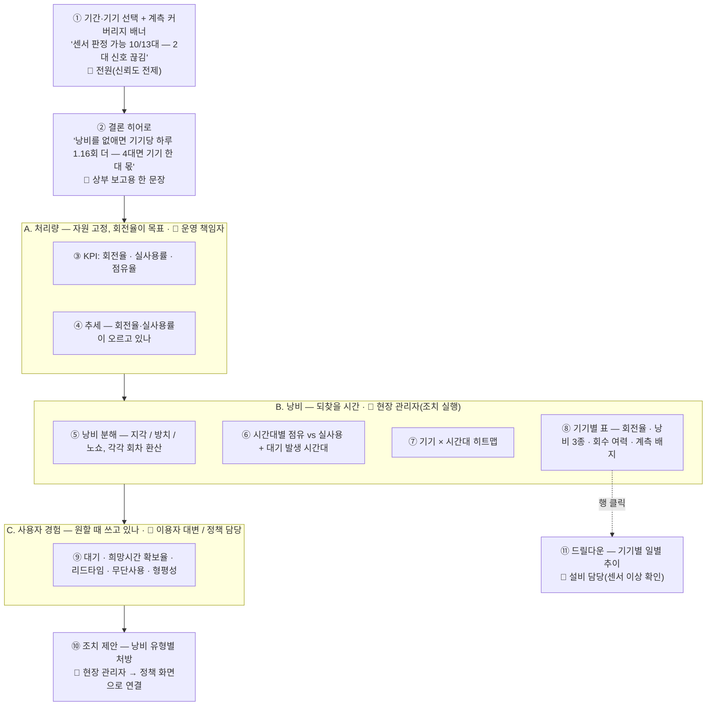
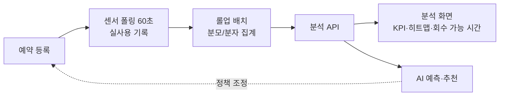
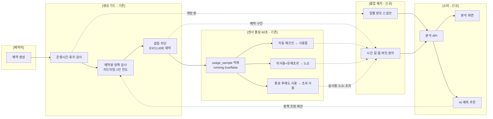
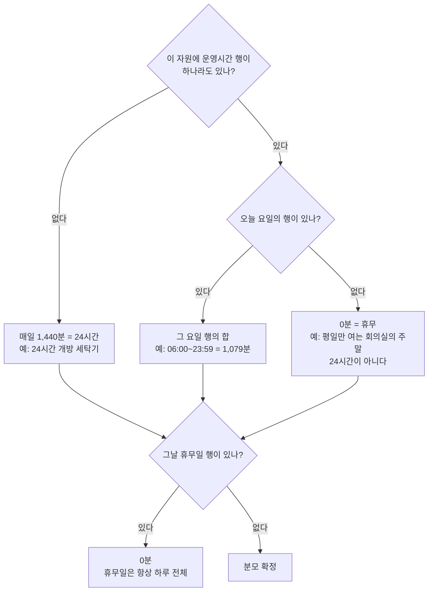
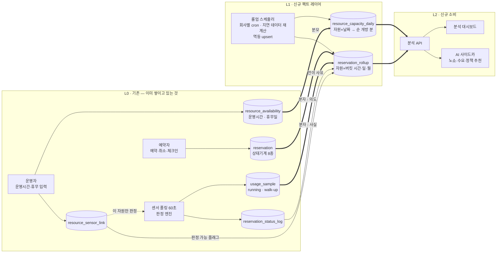

 ---
title: "[데이터파이프라인] 공용자원 예약 효율화 분석 - 증설 없이 회전율 올리기"
excerpt: ""
toc: true
toc_sticky: true
classes: wide
author_profile: false
categories:
- DataPipeline
- Analytics
- IoT
date: 2026-09-10 10:20:00 +0900
---

<style>
.mermaid svg { width: 100% !important; max-width: 100% !important; height: auto !important; }
</style>

## 목적

건물관리에는 바뀌지 않는 상수가 하나 있다.

> **공용 자원은 유한하고, 수요는 늘고, 증설은 불가능하거나 비싸다.**

회의실이 모자라도 층을 늘릴 수 없고, 세탁기가 모자라도 세탁실을 넓힐 수 없다. 주차면도 마찬가지다.
그러면 남는 레버는 하나뿐이다 — **있는 자원을 얼마나 잘 굴리느냐(배분 효율)**.

그런데 예약 시스템은 배분을 **기록**하고 충돌을 막을 뿐, 그 배분이 **잘 됐는지는 측정하지 않는다.**

| | 지금 예약 시스템 | 이 프로젝트가 더하는 것 |
|---|---|---|
| 역할 | 누가 언제 잡았는지 기록·충돌 방지 | **그 배분이 잘 됐는지 측정** |
| 산출 | 상태별 **건수** | **회전율 · 낭비 · 대기**(비율·시간) |
| 답할 수 있는 것 | "몇 건 예약됐나" | "증설 없이 몇 번 더 돌릴 수 있나" |

### 실제 촉발점 — 기숙사 세탁실

추상적인 문제의식이 아니라 민원 한 줄에서 시작했다.

> **"기숙사에 사람이 늘어서 세탁기가 언제 비는지 모르겠다."**

여기서 위의 일반 문제가 그대로 드러난다.

| 이해관계자 | 원하는 것 | 제약 / 수단 |
|-----------|----------|------------|
| **회사(운영)** | 민원을 줄이고 싶다 | 🚫 **기기를 더 놓아줄 수 없다** → 있는 대수로 **회전율을 올리는 수밖에 없다** |
| **이용자(입주민)** | 원하는 때에 쓰고 싶다 | 언제 비는지 모른다 → 그래서 **스마트플러그(전력 센서)** 를 달았다 |

그래서 이 대시보드가 답할 질문은 "몇 대 더 놓을까"가 **아니다.**

1. **증설 없이 하루 몇 번을 더 돌릴 수 있나** — 회전율과 그것을 갉아먹는 낭비
2. **이용자는 원하는 시간에 쓰고 있나** — 대기, 희망 시간대 확보, 무단 사용
3. **무엇을 바꾸면 되나** — 낭비 유형별 처방(리마인더 / 종료 알림 / 자동 취소 / 슬롯 재설계)

### 되찾을 수 있는 양은 얼마나 되나

숫자로 감을 잡아 보자. 하루 4~5회 도는 세탁기 한 대에서 **지각 22분 + 방치 34분 + 노쇼 48분**이
새고 있다고 하면 하루 **104분**이다. 90분 슬롯 기준으로 **1.16회분** —
그 기기에서 **하루 한 번을 더 돌릴 수 있다는 뜻(+26%)** 이다.

4대 규모 세탁실이면 회수분이 **기기 한 대 몫**에 해당한다(1.16 × 4 = 4.6회 ≈ 한 대의 하루 처리량 4.5회).
**예산 없이 얻어내는 증설분**이고, 이게 "증설 불가"라는 제약 아래에서 유일하게 남은 레버다.

### 왜 세탁기가 첫 번째인가 — "사실 신호"가 있는 자원부터

배분 성과를 재려면 **의도(예약)** 만으로 부족하고 **사실(실제로 썼는가)** 이 필요하다.
그 사실 신호는 자원마다 다른 장치에서 나온다.

| 자원 | 예약 방식 | 사실 신호(실사용 판정) | 단계 |
|------|----------|---------------------|------|
| **세탁기·건조기** | 시간 슬롯 | **전력 센서(스마트플러그)** — **이미 붙어 있다** | **1차** |
| 회의실 | 시간 슬롯 | 재실 센서 · 도어락 · QR 체크인 · AP 접속 수 | 2차 |
| 라운지·다목적실 | 동시 수용 | 인원 카운터 · 재실 센서 | 2차 |
| 게스트룸 | 1박 | 도어락 · 체크인 기록 | 3차 |
| 주차·EV 충전 | 시간/일 | 차단기·LPR · 충전기 전력 | 3차 |
| 대여 물품 | 대여 | 반납 스캔 | 3차 |

**분석 레이어는 신호 종류를 몰라도 된다.** 무엇이든 `usage_sample.running` 으로 정규화되면 같은 지표가 나온다.
세탁기는 그 파이프가 **유일하게 완성돼 있는** 자원이라 1차 대상으로 골랐다.
여기서 프레임(회전율·낭비·대기)이 검증되면, 다른 자원은 **분모 규칙 + 신호 어댑터**만 추가하면 된다.

## 배경 — 지금은 어떤 질문에도 답하지 못한다

예약 통계가 전부 **상태별 건수**다. 운영자가 실제로 던지는 질문 중 하나도 답할 수 없다.

| 실제로 나오는 질문 | 지금 답할 수 있나 | 답하려면 필요한 것 |
|---|---|---|
| "증설 없이 얼마나 더 돌릴 수 있나?" | ❌ | **회전율 + 낭비를 회차로 환산** |
| "다 쓰고도 자리를 안 비우는 게 문제 아닌가?" | ❌ | **후행 낭비(방치 시간)** — 유령예약을 앞뒤로 분해 |
| "노쇼가 진짜 문제인가?" | ⚠️ 건수만, 게다가 **사실 신호 없는 자원은 노쇼가 아예 안 찍힘** | **노쇼율 + 판정 커버리지** |
| "예약 안 하고 그냥 쓰는 사람 때문 아닌가?" | ❌ | **무단 사용 비중** |
| "원하는 시간에 못 잡는 사람이 얼마나 되나?" | ❌ | **대기 · 희망 시간대 확보율** |
| "몇 시가 붐비나 / 낮 시간은 왜 비나?" | ❌ | 시간대 히트맵 |

**원인은 데이터가 없어서가 아니다.** 답에 필요한 것은 이미 다 쌓이고 있는데, **집계 경로가 그것을 읽지 않는다.**

| 이미 쌓이는 것 | 역할 | 지금 쓰이는 곳 |
|---|---|---|
| 운영시간·휴무 설정 | **분모** — 얼마나 열려 있었나 | 예약 생성 가드만 |
| 예약 상태기계 | **분자(의도)** — 얼마나 잡혔나 | 건수 세기만 |
| 센서 사용 스냅샷(60초) | **분자(사실)** — 실제로 얼마나 쓰였나 | **아무 데도 안 씀** |

스마트플러그는 "언제 비는지 알려주려고" 이미 달아뒀는데, 그 데이터가
**실시간 표시에만 쓰이고 분석에는 한 번도 안 쓰인다.**

## 만들 화면 — 이걸로 무엇을 할 수 있나

앞의 질문들에 답하는 화면은 이렇게 생겼다. **결론을 맨 위에 놓고, 아래로 갈수록 실행 단위가 잘게 쪼개진다.**
(각 지표의 정의와 계산 방법은 뒤에서 다룬다 — 여기서는 "무엇을 보고 무엇을 하는가"만 본다.)



### 누가 어디를 보나

한 화면이지만 읽는 사람마다 관심 구간이 다르다. **위에서 아래로 갈수록 실행 단위가 잘게 쪼개진다.**

| 👀 누가 | 어디를 보나 | 무엇을 얻나 |
|---|---|---|
| 👑 **상부·의사결정자** | ② 히어로만 | "증설 없이 기기 한 대 몫" — 예산 없이 얻는 성과 |
| 📊 **운영 책임자** | ②③④ (A 처리량) | 회전율이 오르고 있나 = 정책이 먹히고 있나 |
| 🔧 **현장 관리자** | ⑤~⑧ (B 낭비) + ⑩ 조치 | 무엇 때문에 못 돌리나 → 이번 주에 뭘 바꿀까 |
| 👤 **이용자 대변·정책 담당** | ⑨ (C 경험) | 대기·확보율·무단사용 — 이용자가 실제로 겪는 것 |
| ⚙️ **설비 담당** | ① 배너 + ⑧ 계측 배지 + ⑪ | 센서 죽은 기기 색출(노쇼 오판정 방지) |

### 각 패널이 답하는 질문

| 패널 | 👀 누가 | 답하는 질문 | 보이는 것 |
|---|---|---|---|
| ① 커버리지 배너 | 전원 | "이 숫자를 믿어도 되나?" | 판정 가능 기기 수. 불가 기기는 `0%`가 아니라 `—` |
| ② 결론 히어로 | 👑 상부 | "그래서 얼마나 더 돌릴 수 있나?" | 회수 가능 회차 + "기기 몇 대 몫" 환산 |
| ③ 처리량 KPI | 📊 운영 책임자 | "지금 얼마나 돌고 있나" | 회전율 · 실사용률 · 점유율 (비율 옆에 원시 건수) |
| ④ 추세 | 📊 운영 책임자 | "나아지고 있나" | 회전율·실사용률·낭비 추이 |
| ⑤ 낭비 분해 | 🔧 현장 관리자 | "무엇 때문에 못 돌리나" | 지각 / 방치 / 노쇼 3종 스택, 각각 회차 환산 |
| ⑥ 점유 vs 실사용 | 🔧 현장 관리자 | "언제 벌어지나" | 24시간 축, 막대=예약·선=실사용 + 대기 발생 마커 |
| ⑦ 히트맵 | 🔧 현장 관리자 | "언제 어느 기기가 몰리나" | 기기 × 24시간, 낮 유휴가 눈에 보이게 |
| ⑧ 기기별 표 | 🔧 현장 + ⚙️ 설비 | "어느 기기가 문제인가" | 회전율 · 낭비 3종 · **회수 여력(%)** · 계측 배지 |
| ⑨ 사용자 경험 | 👤 이용자 대변 | "이용자는 원할 때 쓰나" | 대기 · 희망시간 확보율 · 리드타임 · 무단사용 · 형평성 |
| ⑩ 조치 제안 | 🔧 현장 관리자 | "뭘 바꿔야 하나" | 낭비 유형별 처방 |
| ⑪ 드릴다운 | ⚙️ 설비 담당 | "이 기기에 무슨 일이" | 일별 추이 + 최근 노쇼·초과 사용(집계만) |

### 월요일 아침, 운영자가 이 화면을 열면

숫자를 나열하는 게 목적이 아니다. **5분 안에 조치까지 가는 것**이 목적이다.

**1. 히어로에서 결론부터 본다.**
> "낭비를 없애면 기기당 하루 1.16회 더 — 4대면 기기 한 대 몫"

증설 예산을 못 받는 운영자가 상부에 들고 갈 수 있는 유일한 문장이다.
"점유율 37%"로는 아무도 설득되지 않지만, "세탁기 한 대를 더 놓은 것과 같다"는 결재가 된다.

**2. 낭비 분해에서 원인을 고른다.**
지각 22분 · **방치 34분** · 노쇼 48분. 제일 큰 덩어리가 노쇼지만, **방치가 두 번째이면서 가장 손대기 쉽다** —
센서가 종료를 이미 감지하고 있으니 알림만 붙이면 된다.

**3. 기기별 표에서 이상한 놈을 찾는다.**
`세탁기 07`의 노쇼율이 **100%** 다. 여기서 노쇼 정책을 조이면 오진이다 — 계측 배지가
`SENSOR_STALE(30일 무신호)` 라고 말하고 있다. **조치는 센서 점검**이지 정책이 아니다.
(이 함정을 잡으려고 커버리지에 "센서 생존" 축을 넣었다.)

**4. 사용자 경험 블록에서 반대편을 확인한다.**
21시에 대기 5건이 몰려 있고, 무단 사용이 4.7%다. 낮 시간은 비어 있다.
→ 피크 슬롯을 조정하고 비피크를 안내한다.

**5. 조치를 실행하고, 다음 주 추세에서 확인한다.**

### 낭비 유형별 처방 — 같은 12분이라도 대응이 다르다

| 낭비 유형 | 예시값(하루) | 원인 | 처방 |
|---|---:|---|---|
| **지각**(선행) | 22분/일 | 예약해놓고 늦게 옴 | 시작 전 리마인더 · 체크인 유예 단축 후 자동 취소 |
| **방치**(후행) | 34분/일 | **다 돌았는데 안 빼감** | 센서 종료 감지 → **종료 알림** · 다음 예약자 호출 · 자동 전원 차단 |
| **노쇼** | 48분/일 | 아예 안 옴 | 유예 단축 → 자동 취소 → **대기자 승격** |
| 파편화 | 1,320분/28일 | 슬롯 90분인데 30분 틈이 남음 | 슬롯 길이·정렬 재설계(90 → 60분 검토) |
| 무단 사용 | running의 4.7% | 예약 없이 그냥 씀 | 예약 없는 가동 감지 시 안내 · 즉시 예약 유도 |
| 피크 집중 | 21시 최다, 낮 유휴 | 저녁에만 몰림 | 비피크 인센티브 · 피크 슬롯 상한 |

**후행 낭비(방치)가 이 도메인의 진짜 병목**이다. 기기는 이미 멈췄는데 슬롯은 잡혀 있어 아무도 못 쓴다.
센서가 있어야만 보이는 값이고, 스마트플러그를 단 이유이기도 하다.

### 조치는 이용자 경험으로 되돌아온다

분석 화면은 운영자용이지만, 여기서 나온 조치는 **이용자 앱 경험으로 순환**한다.
이 순환이 닫혀야 "민원이 줄었다"까지 간다.

| 분석에서 발견 | 운영 조치 | 이용자가 체감하는 변화 |
|---|---|---|
| 방치 34분/일 | 센서 종료 감지 → 종료 알림 | 다음 사람이 더 빨리 씀 |
| 노쇼 48분/일 | 유예 단축 → 자동 취소 → 대기자 승격 | "기다리면 차례가 온다" |
| 21시 피크 / 낮 유휴 | 비피크 안내 · 피크 슬롯 상한 | 원하는 시간 확보 확률 상승 |
| 무단 사용 4.7% | 예약 없는 가동 감지 시 안내 | "예약했는데 누가 쓰고 있다" 감소 |
| 특정 기기 판정 불가 | 센서 연동 | 그 기기도 알림·자동화 대상이 됨 |

### 화면이 지키는 원칙

- **비율 옆에는 항상 건수**를, **낭비 옆에는 항상 회차 환산**을 붙인다.
  "13.3% 낭비"보다 "하루 1.16회 더 돌릴 수 있다"가 결정에 쓰인다.
- **판정 불가와 0%를 다른 모양으로** 그린다. 이 구분이 없으면 센서 고장이 노쇼 폭증으로 읽힌다.
- 개인 식별 정보는 없다. 형평성도 **분포 지표로만** 낸다(상위 1인 점유율 등).

참고로 지금도 예약 화면은 둘 있다 — **실시간 운영 현황판**(오늘/내일 예약, 승인 대기 목록)과
**월별 통계 리포트**(건수·상태 분포). 현황판은 목적이 달라 그대로 두고, 통계 리포트의 회고 위젯은
이 화면으로 흡수한 뒤 폐지한다. 같은 질문에 두 화면이 다른 숫자를 말하는 상태가 제일 나쁘기 때문이다.

## 기존 예약 시스템은 어떻게 생겼나

처음 보는 사람을 위해 도메인을 먼저 짚는다. 구조는 단순하다.

| 개념 | 테이블 | 설명 |
|------|--------|------|
| **예약 대상** | `reservable_resource` | 세탁기·회의실·게스트룸 등. `booking_mode`(시간슬롯 / 동시수용 / 1박 / 대여)로 예약 방식이 갈린다 |
| **운영시간·휴무** | `resource_availability` | 요일별 운영시간(`OPEN_HOURS`)과 휴무일(`BLACKOUT`) |
| **예약** | `reservation` | 상태기계 8종(신청→확정→체크인→사용중→완료 / 노쇼 / 취소). DB EXCLUDE 제약으로 겹침을 원천 차단 |
| **센서 연결** | `resource_sensor_link` | 자원 ↔ 전력 센서 매핑. **이 행이 있는 자원만** 센서 판정 대상이 된다 |
| **사용 스냅샷** | `usage_sample` | 60초마다 `running=true/false` 기록. 예약에 귀속되지 않은 사용(walk-up)도 남는다 |
| **전이 이력** | `reservation_status_log` | 상태 전이와 사유(자동 체크인 / 노쇼 / 초과 사용) |

센서가 붙은 자원에서는 60초 폴링 스케줄러가 이미 다음을 자동으로 한다.

- 전력이 임계 이상으로 지속 → **자동 체크인 → 사용중**
- 시작 후 유예까지 한 번도 안 돌면 → **노쇼**
- 전력이 꺼진 채 지속 → **완료**
- 종료 시각이 지났는데 계속 돌면 → **초과 사용** 로그

즉 **"실제로 썼는가"라는 사실 데이터가 이미 있다.** 그런데 통계 화면은 그걸 한 번도 읽지 않는다.

| 이미 쌓이는 것 | 역할 | 지금 쓰이는 곳 |
|---|---|---|
| `resource_availability` | **분모** — 얼마나 열려 있었나 | 예약 생성 가드만 |
| `reservation` | **분자(의도)** — 얼마나 잡혔나 | 건수 세기만 |
| `usage_sample` | **분자(사실)** — 실제로 얼마나 돌았나 | **아무 데도 안 씀** |

## 이 시스템이 하는 일

**1. 회전율과 낭비 계측** — 운영시간을 분모로, 예약과 센서 실사용을 분자로 삼아 회전율·점유율·실사용률을 집계하고,
낭비를 **지각(선행) / 방치(후행) / 노쇼** 로 분해한다. 매 요청마다 원본을 훑지 않고 롤업 테이블에 미리 굳혀 둔다.

**2. 회수 가능 회차 환산** — 낭비 분을 슬롯 길이로 나눠 **"하루 N회 더 돌릴 수 있다"** 로 바꾼다.
증설 예산을 못 받는 운영자가 상부에 들고 갈 수 있는 유일한 숫자다.

**3. 낭비 유형별 처방 + 사용자 경험 지표** — 앞에서 새면 리마인더, 뒤에서 새면 종료 알림처럼 처방이 다르다.
동시에 대기·희망 시간대 확보율·무단 사용·형평성으로 입주민 쪽 체감을 함께 본다.

## 개요



예약이 등록되면 센서가 실사용을 기록하고, 배치가 분모·분자를 집계하고, 화면과 AI가 같은 집계를 읽는 구조다.
아래에서 각 단계를 상세히 설명한다.

## 세탁실에서 실제로 일어나는 일들

지표를 설계하려면 **어떤 상황이 벌어지는지**를 먼저 알아야 한다. 세탁실 운영을 뜯어보면
예약 한 건이 끝나는 방식만 해도 여러 갈래고, 그 갈래마다 낭비의 성격이 다르다.

### 예약이 끝나는 방식

| 상황 | 자원 관점에서 무슨 일이 벌어지나 |
|---|---|
| 정상 완료 | 예약 시간 안에 돌고 끝난다 |
| **지각 사용** | 예약 시작 후 한참 뒤에 시작 — **슬롯 앞부분이 죽는다** |
| **방치** | 다 돌았는데 안 빼감 — **기기는 멈췄는데 슬롯은 잡혀 있다** |
| **노쇼** | 아무도 안 온다 — 슬롯 전체가 사라진다 |
| 초과 사용 | 종료 시각이 지나도 계속 돈다 — **다음 사람이 밀린다** |
| 체크인만 하고 미사용 | 눌러만 놓고 기기는 안 돌린다 |
| 사전 취소 | 미리 비운다 — 대기자가 쓸 수 있다 |
| 대기(WAITLISTED) | 잡고 싶었는데 자리가 없었다 |

### 예약 밖에서 벌어지는 일

| 상황 | 왜 문제인가 |
|---|---|
| **무단 사용** | 예약 없이 그냥 쓴다 → 예약자가 와도 기기가 차 있다. 예약제 자체가 무력해진다 |
| **독점 사용자** | 소수가 슬롯을 과점한다 → 1인 한도 정책이 필요한지 판단해야 한다 |
| 피크 집중 | 저녁에만 몰리고 낮은 논다 → 분산 유도의 여지 |

### 계측 쪽에서 벌어지는 일 — 여기가 함정이다

| 상황 | 화면에 어떻게 보이나 |
|---|---|
| 센서 미연동 기기 | 노쇼·방치·무단사용이 **영원히 0** — "문제 없음"으로 오독 |
| **센서 고장** | 샘플이 안 들어와 판정 엔진이 전부 노쇼로 찍는다 → **노쇼율 100%** |
| **폴링 누락** | 스케줄러가 잠깐 멈춘 구간이 **"안 썼다"** 로 계산된다 |

### 자원 설정에서 갈리는 것

| 상황 | 분모가 어떻게 달라지나 |
|---|---|
| 운영시간 06:00–24:00 | 하루 1,079분 |
| 운영시간 미설정 | 하루 **1,440분**(24시간 개방) |
| 특정 요일 휴무 | 그 요일 **0분** — 24시간이 아니다 |
| 정기점검 휴무일 | 그날 **0분**(하루 전체 차단) |
| 기간 중 폐기 | 폐기 이후로는 분모를 만들지 않는다 |

**이 상황들이 전부 지표에 서로 다른 서명(signature)을 남긴다.** 예를 들어 같은 "유령예약 30%"라도
지각이 원인이면 체크인 지연이 함께 길고, 방치가 원인이면 실사용률만 유독 낮다.
그래서 지표를 설계할 때 **유령예약을 앞(지각)과 뒤(방치)로 쪼개는 것**이 핵심이었다.

## 예약 한 건이 지표가 되기까지



| 단계 | 남는 데이터 | 여기서 나오는 지표 |
|------|------------|------------------|
| 예약 생성 | `reservation(created_at, start_at)` | 예약 리드타임 |
| 겹침 거절 | **없음** | 미충족 수요가 과소평가된다 → 충돌 시도 로깅 추가 예정 |
| 센서 폴링 | `usage_sample(running)` | 실사용률 · 유령예약률 |
| 자동 전이 | `reservation_status_log(reason)` | 체크인 지연 · 노쇼 · 초과 사용 |
| 롤업(신규) | 분모/분자 테이블 | 위 전부를 시간축으로 |

## 무엇을 보려고 하는가 — 세 묶음

지표를 코드보다 먼저 확정했다. 정의가 흔들리면 집계 테이블·API·화면·모델 라벨이 서로 다른 숫자를 말한다.
기기를 늘릴 수 없는 환경이라 **처리량(A) → 낭비(B) → 사용자 경험(C)** 순으로 읽히게 묶었다.

### A. 처리량 — 자원이 고정이면 이것이 성적표

| 지표 | 쉬운 말 | 예시값(90분 슬롯 기기, 28일) |
|------|--------|--------:|
| **회전율** | 하루에 몇 번 돌았나(완료 기준) | **4.5회/일** ← 최상위 KPI |
| 실사용률 | 센서가 실제로 돌았다고 본 비율 | 34.0% |
| 예약 점유율 | 열린 시간 중 예약이 찬 비율 | 37.2% |

점유율이 높아도 회전율이 그대로면 **낭비만 늘어난 것**이다. 그래서 회전율이 최상위에 온다.

### B. 낭비 — 되찾을 수 있는 시간

| 지표 | 쉬운 말 | 세탁기 #1 |
|------|--------|--------:|
| **선행 낭비(지각)** | 예약 시작 후 실제 가동까지 | 22분/일 (건당 5.0분) |
| **후행 낭비(방치)** | 다 돌았는데 슬롯을 붙잡고 있는 시간 | **34분/일 (건당 7.6분)** |
| 노쇼 | 아예 안 온 예약이 잡고 있던 시간 | 48분/일 (노쇼율 10.7%) |
| **회수 가능 회차** | 위 셋을 회차로 환산 | **104분/일 = 1.16회 (+26%)** |
| 슬롯 파편화 | 너무 짧아 못 쓰는 틈 | 1,320분/28일 (별도 표기) |

90분 예약 한 건을 펼치면 이렇게 생겼다.

```mermaid
gantt
    title 세탁기 #1 — 08:00 예약 한 건(90분)의 실제 사용 (평균)
    dateFormat HH:mm
    axisFormat %H:%M
    section 예약 슬롯
    예약 90분 · 다른 사람은 못 쓴다 :done, slot, 08:00, 90m
    section 실제 가동
    지각 5분 :crit, late, 08:00, 5m
    실사용 78분 :active, run, 08:05, 78m
    방치 7분 · 다 돌았는데 슬롯은 잡혀 있음 :crit, idle, 09:23, 7m
```



**유령예약을 앞뒤로 쪼갠 것이 이 도메인의 핵심 설계다.** 같은 12분이라도 처방이 다르다.

| 낭비 유형 | 원인 | 처방 |
|---|---|---|
| 지각(앞) | 예약해놓고 늦게 옴 | 시작 전 리마인더 · 체크인 유예 단축 후 자동 취소 |
| **방치(뒤)** | **세탁 끝났는데 안 빼감** | 센서 종료 감지 → **종료 알림** · 다음 예약자 호출 · 자동 전원 차단 |
| 노쇼 | 아예 안 옴 | 유예 단축 → 자동 취소 → 대기자 승격 |
| 파편화 | 슬롯이 90분인데 30분 틈이 남음 | 슬롯 길이·정렬 재설계 |

**방치가 기숙사 세탁실의 진짜 병목**이다. 기기는 이미 멈췄는데 슬롯은 잡혀 있어 아무도 못 쓴다.
이건 센서가 있어야만 보이는 값이고, 애초에 스마트플러그를 단 이유이기도 하다.

### C. 사용자 경험 — 원할 때 쓰고 있나

| 지표 | 쉬운 말 | 예시값 |
|------|--------|--------:|
| 미충족 수요(대기) | 쓰려 했는데 못 쓴 사람 | 5~8건/28일, **21시 집중** |
| **희망 시간대 확보율** | 원한 시각에 잡았나 | **측정 불가** — 충돌 시도가 기록되지 않는다 |
| 예약 리드타임 | 몇 시간 전에 잡아야 하나 | 20시간 |
| **무단 사용 비중** | 예약 없이 쓰는 비율 | **4.7%** |
| 이용 형평성 | 소수 독점 여부 | **상위 1인 28.8%** (이용자 6명) |

**희망 시간대 확보율이 측정 불가**인 건 설계 결함에 가깝다. 겹침으로 거절된 예약 시도가
DB 제약 예외로 끝나고 아무 흔적도 남지 않기 때문이다. "원하는 때 쓰고 싶다"가 핵심 니즈인데
정작 **원했지만 못 잡은 사람이 몇 명인지 모른다.** 충돌 시도 로깅을 Phase 1 필수 항목으로 올린 이유다.

### 세 묶음을 잇는 한 문장

> **기기를 늘릴 수 없다면 늘릴 수 있는 건 회전율뿐이고(A), 회전율을 갉아먹는 건 지각·방치·노쇼·파편화(B)이며,
> 그 결과를 겪는 건 입주민의 대기(C)다.**

### 판정 커버리지 — 숫자 옆에 반드시 붙어야 하는 것

노쇼 자동 판정은 **센서가 연결된 자원에서만** 동작한다. 폴링 스케줄러의 대상 자체가
`상태 ∈ (확정, 체크인, 사용중) ∧ 센서 링크 보유` 이기 때문이다.

> **센서 없는 자원의 노쇼율 0%는 "노쇼가 없다"가 아니라 "판정할 수단이 없다"** 이다.

화면은 이 둘을 절대 같은 모양으로 그리지 않는다.

- 판정 불가 자원의 노쇼·실사용·유령은 `0%` 가 아니라 `—` 로 표시
- 모든 화면 상단에 커버리지 배너(`센서 연동 3/4대 — 실사용·노쇼는 이 3대 기준`) 상시 노출
- AI 학습 라벨도 판정 가능 자원만 사용 — 센서 없는 자원의 "노쇼 아님"은 관측이 아니라 무지다

## 가장 헷갈렸던 것 — 분모 규칙

점유율의 분모는 "그 자원이 그날 얼마나 열려 있었나"다. 운영시간 설정 방식 때문에 갈림길이 생긴다.



핵심은 **"미설정 = 24시간"이 자원 단위 규칙이지 요일 단위가 아니라는 것**이다. 예약 생성 가드가 두 단계로 갈라져 있다.

- 자원에 운영시간 행이 **하나도 없으면** → 24시간 예약 허용
- 행은 있는데 **그 요일 행만 없으면** → "해당 요일은 운영하지 않습니다" 로 예약 **거부**

이걸 요일 단위로 뭉개면 평일만 여는 회의실의 주말이 1,440분씩 분모로 들어간다.
실제로 검증 중에 **점유율 42.2%가 20.4%로 반토막** 나는 것을 확인했다.

## 전체 아키텍처



**핵심 설계 결정 4가지**

1. **분모를 스냅샷으로 굳힌다.** 운영시간 테이블은 현재 값만 보관한다(전량 치환 방식). 운영자가 오늘 운영시간을 바꾸면
   과거 분모를 다시 계산할 근거가 사라지므로, 그날의 분모를 일별 테이블에 적재하고 **과거는 재계산하지 않는다.**
   이 규칙이 없으면 "정책을 바꿨더니 지난달 점유율도 바뀌는" 리포트가 된다.
2. **판정 메타를 같은 행에 넣는다.** 롤업 행에 `sensor_linked`(판정 가능 여부)와 `capacity_minutes`(그때의 분모)를
   함께 적재한다. 나중에 커버리지를 되계산하려고 원본을 다시 뒤지지 않기 위해서다.
3. **분석 API는 롤업만 읽는다.** 원본 재집계를 금지한다. 화면과 AI가 같은 API를 보므로 세 곳이 같은 숫자를 말한다.
4. **롤업 구조는 새로 설계하지 않는다.** 같은 제품의 에너지 도메인에 "회사별 cron + 재계산 윈도우 + 멱등 upsert"
   롤업이 이미 돌고 있어 그 구조를 이식한다.

## DB 스키마

신규 테이블은 둘뿐이다. 나머지는 전부 기존 테이블을 읽기만 한다.

```sql
-- 분모: 자원이 그날 얼마나 열려 있었나 (스냅샷, 과거 재계산 없음)
CREATE TABLE resource_capacity_daily (
    id                BIGSERIAL PRIMARY KEY,
    resource_id       BIGINT      NOT NULL,
    capacity_date     DATE        NOT NULL,
    open_minutes      INT         NOT NULL,   -- 운영시간 합 (미설정 자원은 1440)
    blackout_minutes  INT         NOT NULL,   -- 휴무일이면 open_minutes 전체
    net_minutes       INT         NOT NULL,   -- open - blackout = 실제 분모
    created_at        TIMESTAMPTZ NOT NULL DEFAULT now(),
    UNIQUE (resource_id, capacity_date)       -- 멱등 upsert 키
);

-- 분자: 시간/일/월 버킷별 집계
CREATE TABLE reservation_rollup (
    id                 BIGSERIAL PRIMARY KEY,
    company_id         BIGINT      NOT NULL,
    site_id            BIGINT      NOT NULL,
    resource_id        BIGINT      NOT NULL,
    bucket             VARCHAR(10) NOT NULL,  -- HOUR | DAY | MONTH
    bucket_ts          TIMESTAMPTZ NOT NULL,
    booked_minutes     INT         NOT NULL,  -- 예약 점유 분 (의도)
    used_minutes       INT         NOT NULL,  -- 센서 running 분 (사실)
    completed_cnt      INT         NOT NULL,  -- 회전율의 분자
    late_minutes       INT         NOT NULL,  -- 선행 낭비: 시작 → 첫 running
    idle_minutes       INT         NOT NULL,  -- 후행 낭비: 마지막 running → 종료 (방치)
    noshow_minutes     INT         NOT NULL,  -- 노쇼가 잡고 있던 시간
    walkup_minutes     INT         NOT NULL,  -- 예약 없는 사용
    reservation_cnt    INT         NOT NULL,
    noshow_cnt         INT         NOT NULL,
    cancel_cnt         INT         NOT NULL,
    waitlist_cnt       INT         NOT NULL,
    overuse_cnt        INT         NOT NULL,
    checkin_delay_p50  INT,                   -- 분
    fragment_minutes   INT         NOT NULL,  -- 슬롯 파편화
    -- 판정 메타 (커버리지 되계산 방지)
    sensor_linked      BOOLEAN     NOT NULL,
    capacity_minutes   INT         NOT NULL,  -- 그 버킷의 분모 스냅샷
    unknown_minutes    INT         NOT NULL,  -- 폴링 누락 구간
    UNIQUE (resource_id, bucket, bucket_ts)
);
```

경계 규칙 몇 가지는 정의에 포함시켰다.

- **종료 시각이 없는 예약**(개방형 대여)은 완료면 완료 시각까지, 진행 중이면 조회 시점으로 clamp 한다. 무한 점유로 세지 않는다.
- **폴링 누락**: 인접 샘플 간격이 기대치(60초)의 3배를 넘으면 그 구간은 `running` 으로 세지 않고 `unknown_minutes` 로 따로 집계한다.
  스케줄러 정지 구간을 "실사용 0"으로 오독하지 않기 위해서다.
- **시간/일/월 버킷은 각각 원본에서 계산**한다. 시간 버킷의 합으로 일 버킷을 만들면 반올림 오차가 누적된다.

## 지표가 거짓말하는 5가지 경로

지표를 정의하면서 가장 많이 걸린 부분은 계산식이 아니라 **"이 숫자가 사실을 말하는가"** 였다.
아래 다섯 가지는 계산도 맞고 쿼리도 도는데 결론만 틀리는 경우다.

### 1. 센서 고장이 "노쇼 폭증"으로 보인다

센서가 죽으면 사용 스냅샷이 안 들어온다. 판정 엔진은 그걸 "한 번도 안 돌았다"로 해석해
**그 기기의 모든 예약을 노쇼로 찍는다.** 화면에는 **노쇼율 100%** 로 나타난다.

문제는 커버리지 표시가 **센서 링크 존재만** 확인한다는 점이다. 링크는 살아 있으니 "판정 가능"으로 보이고,
운영자는 노쇼 정책부터 조이게 된다 — 완전히 엉뚱한 처방이다.

⇒ 커버리지에 **"센서 생존"** 축을 넣었다. `NO_SENSOR / SENSOR_DEAD / SENSOR_STALE(2일 이상 무신호) / OK`
4상태로 내고, **노쇼율이 급등하면 화면이 먼저 "센서 상태 확인"을 제안**한다.

### 2. 폴링 누락이 "저사용"으로 보인다

스케줄러가 20분 멈춘 구간은 실사용률을 끌어내리고 유령예약률을 부풀린다.
데이터 공백을 "안 썼다"로 읽은 것이다.

⇒ 인접 샘플 간격이 기대치(60초)의 3배를 넘으면 그 구간은 사용으로 세지 않고 **"미상 시간"** 으로 분리한다.
그 비율이 큰 구간은 화면에서 흐리게 표시한다.

### 3. 요일 휴무를 24시간으로 계산하면 점유율이 반토막

"운영시간 미설정 = 24시간"은 **자원 단위 규칙**이지 요일 단위가 아니다.
평일만 여는 자원의 주말을 1,440분 분모로 넣으면 점유율이 **42.2% → 20.4%** 로 반토막 난다.

### 4. 실사용을 예약 구간으로 자르지 않으면 낭비가 서로 상쇄된다

종료 시각 이후의 가동(초과 사용)을 그대로 실사용에 합치면 **유령예약과 초과 사용이 서로를 지운다.**
둘 다 과소평가된다. 실사용은 반드시 `[시작, 종료)` 로 클립한다.

### 5. 정원을 좌석 분모로 쓰면 점유율이 붕괴한다

시간 슬롯 자원의 `capacity`(정원 10명)는 **동시 예약 수가 아니라 수용 인원**이다.
이걸 분모에 곱하면 회의실 점유율이 1/10로 내려간다. 좌석-분 보정은 동시수용 방식 자원에만 적용한다.

---

다섯 건 모두 집계 테이블을 만들기 전에 잡았다. 나중에 발견했다면 이미 적재된 값을 전부 다시 계산해야 했을 것이다.
**"지표 정의를 코드보다 먼저 확정한다"** 는 원칙이 여기서 값을 했다.

## Phase 계획

| Phase | 목표 | 상태 |
| ----- | ---- | ---- |
| Phase 0 | 지표 정의(전 자원 공통) + 상황 카탈로그 + 기준 계산 쿼리 | **완료** |
| Phase 1 | 세탁실로 프레임 검증 — 팩트 레이어 + 롤업 배치 + 분석 API + 화면 | 착수 대기 |
| Phase 2 | 자원 유형 확대 — 회의실·라운지. 새 분모 규칙 + **사실 신호 연결**(재실 센서·도어락·QR) | 계획 |
| Phase 3 | AI 3종(노쇼 예측 · 수요 예측 · 정책 추천) + 정책 변경 이력 | 계획 |
| Phase 4 | 주간 자동 리포트 · 정책 전후 비교 · 타 도메인 상관 | 계획 |

Phase 3 의 AI 는 이미 운영 중인 사이드카(FastAPI)에 엔드포인트를 추가하는 형태라 새 인프라가 필요 없다.

| 엔드포인트 | 출력 | 화면에서 쓰이는 곳 |
|-----------|------|------------------|
| `/reservation/noshow` | 예약별 노쇼 확률 + 근거 피처(리드타임·이력·시간대) | 확률 높은 예약에 리마인더 / 유예 단축 |
| `/reservation/demand` | 기기×시간대 수요 예측 | 피크 슬롯 조정 제안 |
| `/reservation/recommend` | 정책 추천 문장(근거 동반) | 조치 제안 패널 |

다만 **정책 효과를 사후 증명하려면 정책 변경 이력이 필요하다.** 현재 설정 테이블은 현재 값만 보관하므로
"유예를 줄인 뒤 노쇼가 줄었나"를 나중에 증명할 수 없다. 이력 적재를 Phase 3 에 포함시켰다.

## 정리

- 푸는 문제는 **제한된 공용 자원의 배분 효율화**다. 건물관리에서 자원은 유한하고 수요는 늘고 증설은 어렵다 —
  남는 레버는 회전율뿐이다. 예약 시스템은 배분을 **기록**만 하고 **성과**는 재지 않고 있었다.
- 출발점은 "기숙사 세탁기가 언제 비는지 모르겠다"는 민원이었고, 제약은 **더 놓을 수 없다**는 것이었다.
  그래서 목표가 "증설 판단"이 아니라 **"고정 자원에서 회전율 최대화"** 로 정해졌다.
- **세탁기를 1차로 고른 이유는 사실 신호(스마트플러그)가 이미 연결된 유일한 자원이기 때문**이다.
  회의실·주차는 재실 센서·도어락·LPR을 붙이면 **같은 지표 체계가 그대로 적용**된다 — 분석 레이어는
  신호 종류를 모르고 `running` 만 본다.
- 그 목표를 숫자로 옮기면 **회수 가능 회차**다. 표준 기기 한 대가 하루 4.5회 도는데 104분이 새고 있고,
  이걸 없애면 **하루 1.16회(+26%)** 를 더 돌릴 수 있다. 4대 규모면 회수분이 **기기 한 대 몫**이다.
- 낭비를 **지각(앞) / 방치(뒤)** 로 쪼갠 것이 이 도메인의 핵심 설계다. 처방이 다르기 때문이다.
  특히 **방치**(다 돌았는데 안 빼감)는 스마트플러그가 있어야만 보이는 값이고, 체감 병목이기도 하다.
- **상황을 먼저 전수로 정의하고 지표를 설계했다.** 세탁실에서 일어나는 일(지각·방치·노쇼·무단사용·
  센서 고장·폴링 누락·요일 휴무·포화·저사용…)을 나열해 두니, 각 상황이 지표에 어떤 서명을 남기는지가 보였다.
- 그 덕분에 집계 테이블을 만들기 전에 **지표가 거짓말하는 경로 5가지**를 잡았다
  (센서 고장 → 노쇼 100% · 폴링 누락 → 저사용 · 정의 오류 3건).
- 센서 기반 지표에는 **판정 커버리지를 항상 병기**한다. 판정 불가와 0%는 다르고, 그 구분이 없으면
  "노쇼는 문제가 아니다" 같은 잘못된 결론으로 정책을 바꾸게 된다.
- 한편 **"원했지만 못 잡은 사람"은 아직 측정조차 못 한다.** 겹침으로 거절된 시도가 흔적 없이 사라지기 때문이다.
  핵심 니즈가 "원할 때 쓰고 싶다"인데 그 반대편을 못 세고 있었다는 것이, 이번에 지표를 먼저 정의하면서 드러난
  가장 큰 구멍이었다.
